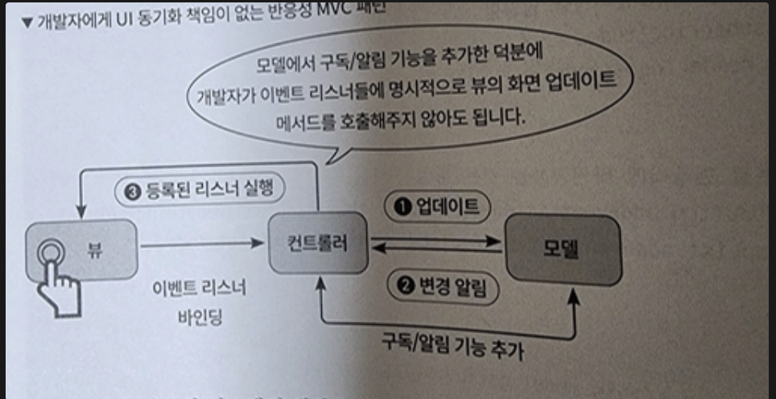

리액트와 같은 모던 자바스크립트 라이브러리의 핵심에는 상태와 반응성이 있습니다.

**상태 : UI를 표현할 때 사용되는 데이터**

**반응성 : 상태가 변경될 때 자동으로 업데이트 되는 원리**

이 두 개념을 깊게 파고 들어가보죠

## 상태와 반응성

버그가 발생한 뒤에 해결하는 수동적인 개발이 아닌, 수준있는 개발을 하려면 상태와 반응성을 깊게 탐구해야하고, 데이터를 어떤 상태로 만들고 공유하고 전달할 것인지는 저희가 실무를 하면서 매일매일 겪고 있는 문제입니다. 이 문제들을 해결하기 위해서, 성장하기 위해서는 깊이 공부를 해야합니다.

웹 UI는 개발자가 정의한 상태값을 기반으로 현재 페이지의 모습이 결정됩니다.

**서버상태 : 데이터베이스의 원시 데이터를 기반으로 비즈니스 로직에 따라 가공된 상태**

**클라이언트상태 : API 요청으로 받은 유저 목록 등 서버로부터 받은 데이터를 화면에 표시하기 위해 사용되거나, UI의 상호작용**

만약 상태라는 개념없이 유저의 모든 인터렉션에 대응해 DOM을 직접 선택하고 수정하는 명령형 방식으로 개발하면 코드의 복잡도는 증가할 것입니다.

이런 문제점을 해결하고 복잡한 UI로직과 데이터를 효과적으로 관리하기 위해서 등장한 것이 바로 디자인 패턴입니다. 디자인 패턴은 단순 코드 작성 스타일뿐만 아니라 애플리케이션을 어떤 단위로 설계할 것인지, 컴포넌트가 어떤 책임을 질 것인지에 대한 구조적 지침입니다.

## 디자인패턴

**UI (VIEW)**

MVC, MVP, FLUX 등과 같은 디자인 패턴은 코드의 가독성과 확장성을 높이는 것을 목표로 하고 있고, 그 필수적인 공통요소는 VIEW입니다.

뷰는 유저가 직접 상호작용하는 것을 책임지고, 리액트나 뷰는 상태가 변경되면 자동으로 업데이트 되는 반응성이 있다는 특징을 보여줍니다.

**Model**

어플리케이션의 데이터와 그 데이터를 처리하는 비즈니스 로직을 모두 포함하는 부분입니다.

무엇을 어떤 규칙으로 처리할 것인가에 집중합니다.

**프론트엔드 :** 클라이언트 상태를 관리하는 로직이 해당됨.

**백엔드 :** DB, 스키마 등이 해당된다. 단순 DB 뿐만 아니라 도메인 규칙도 해당되기도 한다.

그래서 핵심기능은?

1. 데이터 관리 : 핵심 데이터를 보유, 관리, 어떤 자료구조로 어떻게 저장하고 유지할지 결졍.
2. 비즈니스로직 : 고유한 규칙과 정책을 코드로써 실행합니다.

**중재자 (Controller, Presenter, ViewModel, …등등)**

앞서 살펴본 뷰와 모델은 각자의 역활인 UI 렌더링과 데이터 관리에만 집중해야하는데, 이상적인 아키텍처에서는 뷰는 모델의 존재는, 모델은 뷰의 존재를 직접 알아서는 안됩니다. 이런 관심사의 분리 원칙을 지킬 때 시스템의 유연성과 확장성이 극대화됩니다.

중재자의 역할은 이렇습니다.

1. 입력처리 : 뷰로 부터 클릭, 폼 제출 등의 유저의 입력 전달 받기
2. 로직 실행 및 상태 변경 : 전달받은 입력을 해석하여 모델의 데이터를 변경하거나 특정 비즈니스 로직을 수행하도록 모델에 요청
3. 데이터 가공 : 모델의 데이터를 뷰가 표시하기 좋은 형태로 가공하여 전달.
4. 로직 캡슐화 : 뷰가 순수하게 UI 렌더링에만 집중할 수 있도록, 데이터 유효성 검사와 같은 복잡한 프레젠테이션 로직을 캡슐화한다.

전통적인 웹 개발에서는 모델, 뷰 컨트롤러를 별개의 파일이나 클래스로 명확하게 분리했지만, 모던 프레임워크에서는 유연해졌습니다. (Spring, JQuery, JSP 이런 것들 생각나네요..)

코드들은 저희가 항해에서 학습했을 때 계산과 액션을 분리했던 것 생각나서 확 분리해버리고 싶네요

## 주요 디자인 패턴을 사용한 반응성 구현

리액트가 우리한테 주는 개발적인 생산성을 감사하면서 어떤 내부적인 문제를 해결해주고 있는지 알아봅시다.

**비 반응성 MVC 패턴 중재자**

실습에서 뷰를 담당하고 있는 레포지토리

https://github.com/dante01yoon/react-master-book/blob/main/ch4/example-2/TodoView.js

TODOS를 초기화하고, 삭제하는 메서드들을 캡슐화한 레포지토리

뷰와 모델은 전혀 모르는 구조가 되었습니다.

https://github.com/dante01yoon/react-master-book/blob/main/ch4/example-2/TodoModel.js

뷰에서 발생하는 이벤트를 감지하고, 바인딩하는 컨트롤러 입니다.

https://github.com/dante01yoon/react-master-book/blob/main/ch4/example-2/TodoController.js

전통적인 MVC 패턴에서는 모델의 상태가 변경될 때 마다 컨트롤러가 뷰의 상태를 업데이트하는 로직을 호출해야만 UI가 업데이트 됩니다. 여기에 어플리케이션의 복잡도가 올라간다면 .. 쉽지 않았겠네요

**MVC에 반응성 주입하기**

앞의 가장 큰 문제점은 반응성을 바뀔 때 마다 직접 호출해야하는 것이었습니다.

아래 레포는 상태가 변경 되었을 때 변경 사실을 외부에 알림으로써 컨트롤러는 뷰를 수동으로

업데이트하는 책임에서 벗어나게됩니다.

https://github.com/dante01yoon/react-master-book/blob/main/ch4/example-3/TodoModel.js

아래 그림은 반응형 시스템의 핵심을 보여줍니다.

모델에 변경이 발생하면, 모델로 구독자인 컨트롤러의 콜백 함수에게 이를 알리고, 구독자는 약속한

동작인 뷰의 렌더링을 수행합니다. 개발자는 뷰의 동기화를 수동으로 관리할 필요가 없어져

잠재적인 가능성을 차단합니다

**관찰자 패턴**

앞서 MVC 패턴에 반응성을 추가하기 위해 사용했던 구조가 관찰자 패턴입니다.

**발행자(Publisher) : 관찰의 대상이 되는 객체로 자신의 상태 변화를 외부에 알릴 책임이 있습니다.**

**구독자(Subscriber) : 발행자의 상태 변화에 관심이 있어 그 변화를 통지받고 싶어하는 객체입니다.**

**1. 관찰자 패턴의 정의와 장점**
관찰자 패턴은 발행자(Publisher)의 상태가 변경되었을 때, 이를 구독하고 있는 모든 구독자(Subscriber)에게 자동으로 변경 사실을 알리는 패턴입니다.

**일대다(One-to-many) 관계:** 한 번의 상태 변경으로 여러 구독자에게 동시에 통지할 수 있어 관리가 효율적입니다.
**유연한 확장성:** 새로운 뷰(구독자)가 추가되더라도 발행자의 코드 수정 없이 구독자 목록에 등록만 하면 되므로 시스템 확장이 용이합니다.
**상태 관리의 기반:** 리액트 생태계의 대표적인 라이브러리인 **리덕스(Redux)**를 포함하여, 많은 전역 상태 관리 도구들의 핵심 기반 기술로 사용됩니다.\

**2. 동작 방식 (3단계)**

1. **구독:** 구독자가 발행자의 상태 변화를 관찰하기 위해 등록합니다.
2. **이벤트 발생:** 발행자의 데이터나 상태가 변경됩니다.
3. **통지 및 수행:** 발행자가 모든 구독자에게 변경을 알리면, 각 구독자는 약속된 작업(예: UI 업데이트)을 수행합니다.

**3. 핵심 인터페이스 (메서드)**
발행자가 관찰자 패턴을 구현하기 위해 제공해야 하는 세 가지 필수 메서드입니다.**메서드설명`Subscribe(listener)`**구독 신청 메서드. 콜백 함수(listener)를 발행자의 구독 리스트에 등록합니다.**`Notify()`**등록된 모든 구독자에게 최신 데이터와 함께 상태 변경을 알립니다.**`Unsubscribe(listener)`**구독 취소 메서드. 메모리 누수 방지를 위해 더 이상 알림이 필요 없는 구독자를 제거합니다.

**MVVM 패턴과 반응성**

1. MVVM 유저 입력부터 상태 변경의 흐름

사용자의 액션이 어떻게 데이터 변화로 이어지고, 다시 화면에 반영되는지의 순환 과정입니다.

1. **View (유저 입력)**: 사용자가 버튼을 클릭하거나 입력창에 텍스트를 입력합니다.
2. **ViewModel (명령 전달)**: View는 연결된 **Binder**를 통해 사용자의 입력을 ViewModel에 전달합니다. (Command 패턴 등 활용)
3. **Model (데이터 처리)**: ViewModel은 Model에게 데이터를 업데이트하도록 요청합니다.
4. **ViewModel (상태 변화)**: Model로부터 변경된 데이터를 받은 ViewModel은 자신의 '상태(State)'를 갱신합니다.
5. **View (화면 갱신)**: ViewModel의 상태 변화를 관찰(Observe)하고 있던 View가 **반응성**에 의해 자동으로 UI를 다시 그립니다.

---

2. 양방향 바인딩 vs 단방향 바인딩

데이터가 어느 방향으로 흐르느냐에 따라 개발 방식과 복잡도가 달라집니다.

### 🔄 양방향 데이터 바인딩 (Two-way Data Binding)

- **개념**: View(UI)와 ViewModel(데이터)이 서로를 직접 참조하여 어느 한쪽이 변하면 다른 쪽도 **즉시** 변하는 방식입니다.
- **특징**:
  - 사용자가 입력창에 글을 쓰면 ViewModel의 변수가 바로 바뀝니다.
  - 코드량이 줄어들어 생산성이 높지만, 프로젝트가 커지면 데이터 흐름을 추적하기 어려울 수 있습니다.
- **대표 프레임워크**: Angular, Vue.js (v-model) 등

### ➡️ 단방향 데이터 바인딩 (One-way Data Binding)

- **개념**: 데이터는 오직 **부모에서 자식으로(Model → View)** 한 방향으로만 흐릅니다.
- **특징**:
  - UI를 바꾸려면 반드시 '이벤트'를 발생시켜 상태를 먼저 변경해야 합니다.
  - 데이터 흐름이 명확하여 디버깅이 쉽고 예측 가능합니다.
- **대표 프레임워크**: React (State/Props 흐름)
