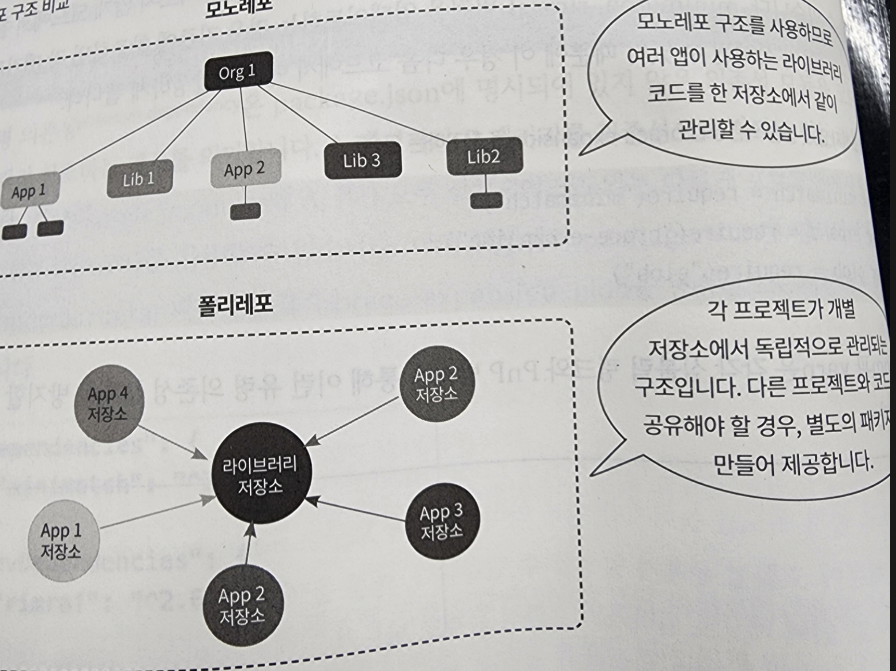

# 개발환경 돌아보기

개발환경(빌드환경, 테스트 환경 등..)은 프로젝트의 생산성과 확장성, 그리고 팀의 협업 효율을 결정짓는 핵심 요소입니다.

## Node.js 구조와 원리

Node.js 도식화

[https://www.mwanmobile.com/node-js-animated-event-loop/]


취업준비할 때 눈 닳도록 봤던 이것은 Node.js 도식화 입니다.

Node.js는 C/C++ 언어로 작성된 V8 자바스크립트 엔진을 기반으로 빌드된, 서버와 같은 부러우저 밖 환경에서 자바스크립트 코드를 실행하는 런타임 환경입니다.

런타임이란 특정 언어로 만든 프로그램을 실행할 수 있는 환경을 말합니다.

Node.js는 논블로킹I/O 싱글스레드 기반인데요, 이 싱글스레드(하나에 한 작업만 수행할 수 있는 방법)인

자바스크립트가 어떻게 비동기 함수를 실행할 수 있는지 이벤트루프, 콜스택, 마이크로 태스크큐, 태스크 큐, 웹API 를 짚어가면서 설명해보겠습니다.

### 콜스택

콜 스택은 현재 실행 중인 함수를 관리하는 자료구조입니다. 함수가 호출되면 스택에 쌓이고(push), 실행이 끝나면 제거됩니다(pop). 중요한 점은 콜 스택은 한 번에 하나의 작업만 처리할 수 있다는 것입니다.

```javascript
function first() {
  console.log("첫 번째 함수");
  second();
  console.log("첫 번째 함수 종료");
}

function second() {
  console.log("두 번째 함수");
}

first();
// 출력:
// 첫 번째 함수
// 두 번째 함수
// 첫 번째 함수 종료
```

### 웹 API

비동기 함수(setTimeout, fetch, DOM 이벤트 등)를 만나면 JavaScript는 이를 웹 API에 위임합니다. 이 공간은 JavaScript 엔진 외부에 있으며, 여기서 타이머가 작동하거나 HTTP 요청이 처리됩니다. 중요한 점은 이 작업들이 콜 스택을 차단하지 않는다는 것입니다.

### 태스크 큐와 마이크로태스크 큐

비동기 작업이 완료되면 콜백은 큐에 들어갑니다. 여기서 중요한 것은 두 종류의 큐가 있고, 우선순위가 다르다는 점입니다.
마이크로태스크 큐는 Promise의 .then(), .catch(), async/await, queueMicrotask() 같은 작업의 콜백이 들어가는 곳입니다. 태스크 큐(또는 매크로태스크 큐)에는 setTimeout, setInterval, I/O 작업, UI 렌더링 같은 콜백이 들어갑니다.

### 이벤트 루프 순서

1. 콜 스택이 비어있는지 확인합니다.
2. 콜 스택이 비어있다면, 먼저 마이크로태스크 큐를 모두 비웁니다. 마이크로태스크 실행 중 새로운 마이크로태스크가 추가되면 그것도 함께 실행합니다.
3. 마이크로태스크 큐가 완전히 비워지면, 태스크 큐에서 하나의 태스크만 가져와 실행합니다.
4. 이 과정을 반복합니다.

## 노드 버전 매니저

각 노드 버전에 따라서 호환되는 패키지 매니저나 라이브러리 버전도 달라질 수 있습니다.
npm, pnpm nvm 등이 있는데 어떤걸 사용하시나요? 저는 pnpm을 주로 사용하고 있습니다.

### pnpm 의존성 알아보기

기존에 배우기를 npm으로 배워서 그것만 사용하고 있었는데, 설치 속도도 빠르고, 심볼릭 링크 구조로 좀 더 안전한
의존성 관리를 할 수 있다고해서 그렇게 사용하고 있습니다. (의존성을 저장하는 방식의 차이가 있습니다.)
대신에 의존성 경로를 매핑하는 cjs, .pnp 파일은 지원하지 않는다고 합니다.

npm을 쓰면 이런식으로 저장됩니다.

```
// package.json - 내가 설치한 패키지
{
  "dependencies": {
    "express": "^4.18.0"
  }
}
```

```bash
# npm install 하면 이렇게 됨
node_modules/
├── express/
├── body-parser/      # express가 내부적으로 쓰는 패키지
├── cookie-parser/    # express가 내부적으로 쓰는 패키지
├── debug/           # express가 내부적으로 쓰는 패키지
└── ... (수십개 더)
```

```javascript
// 내 코드
import express from "express"; // ✅ 정상 - package.json에 있음
import bodyParser from "body-parser"; // ✅ 작동함! 근데... 위험함!
```

만약 express가 업데이트 했을 때 body-parser 없어지면,,, 충돌납니다.
이게 유령의존성 문제입니다.
그래서 pnpm은 이런 방법으로 저장해서 문제를 해결합니다.

````
# 하드링크: 실제 파일 데이터 공유
~/.pnpm-store/react@18.0.0 (실제 파일)
~/project/node_modules/.pnpm/react@18.0.0 (하드링크 - 같은 파일)

# 심볼릭 링크: 경로만 가리킴
~/project/node_modules/react -> .pnpm/react@18.0.0/node_modules/react

```json// package.json

실제 node_modules 구조 파헤치기
간단한 프로젝트로 pnpm의 구조를 살펴보겠습니다.

{
  "dependencies": {
    "express": "^4.18.0",
    "lodash": "^4.17.21"
  }
}
````

pnpm install을 실행하면 이런 구조가 만들어집니다.

```
node_modules/
├── .pnpm/
│   ├── express@4.18.0/
│   │   └── node_modules/
│   │       ├── express/           (실제 패키지 파일들)
│   │       ├── body-parser/       (express의 의존성)
│   │       ├── cookie/            (express의 의존성)
│   │       └── ...
│   ├── lodash@4.17.21/
│   │   └── node_modules/
│   │       └── lodash/            (실제 패키지 파일들)
│   ├── body-parser@1.20.0/
│   │   └── node_modules/
│   │       ├── body-parser/
│   │       └── bytes/             (body-parser의 의존성)
│   └── ...
├── express -> .pnpm/express@4.18.0/node_modules/express
└── lodash -> .pnpm/lodash@4.17.21/node_modules/lodash
```

이 구조의 핵심 포인트는 다음과 같습니다.

1. 최상위 node_modules에는 package.json에 명시한 패키지의 심볼릭 링크만 존재합니다. express와 lodash만 있고, body-parser 같은 간접 의존성은 없습니다.
2. 실제 패키지 파일들은 모두 .pnpm 디렉토리 안에 있습니다. 각 패키지는 패키지명 @버전/node_modules/패키지명 형태로 저장됩니다.
3. 각 패키지의 의존성도 같은 레벨의 node_modules 안에 함께 배치됩니다. 이게 Node.js의 모듈 해석 알고리즘과 완벽하게 호환되는 비결입니다.

### 모노레포

모노레포는 제가 꼭 한 번 구현해본다고 하다가 미룬지 벌써 20억년째입니다..
모노레포는 여러 프로젝트 혹은 패키지들을 하나의 저장소에서 관리할 수 있는 전략인데요 관심사가 다른
모든 코드를 엄격한 모듈의 분리 없이 하나의 저장소에 포함하는 모놀리식 구조를 피하기 위해 만들어졌습니다.
관심사는 분리하면서 사용되는 공통 모듈이나 라이브러리를 공유할 수 있도록 하는거죠.
</br>
아.. 웹북으로 살걸..

폴리레포 구조에서 공용 코드를 공유하려면 공용 코드를 위한 저장소를 별도로 관리해야하지만
모노레포에서는 공유할 코드, 공유하지 않아야할 코드를 명확하게 구분할 수 있습니다.

모노레포는 원래 실습해보고 싶은게 있었어서, 제가 실습하면서 만들었던 문서를 다음주에 다시 발표해보겠습니다

### 리액트 빌드 도구

최근 프로젝트에 리액트 빌드도구를 어떤것을 사용하시나요?
CRA 가 deprecated 된 이후로부터는 Tanstack-router를 사용하고 있습니다. 그 중에서도 폴더기반 라우팅을 사용하고 있는데요, 아무래도 폴더를 만들면 라우팅 파일을 자동으로 생성해주고, 생성된 링크에 따라서 자동으로 타입체크까지 해줘서 이상한 링크로 보낼일은 없어서 아주 만족하면서 사용하고 있습니다
또한 vite 기반이여서 아주 빠른 속도로 빌드되니까 더욱 만족합니다.
