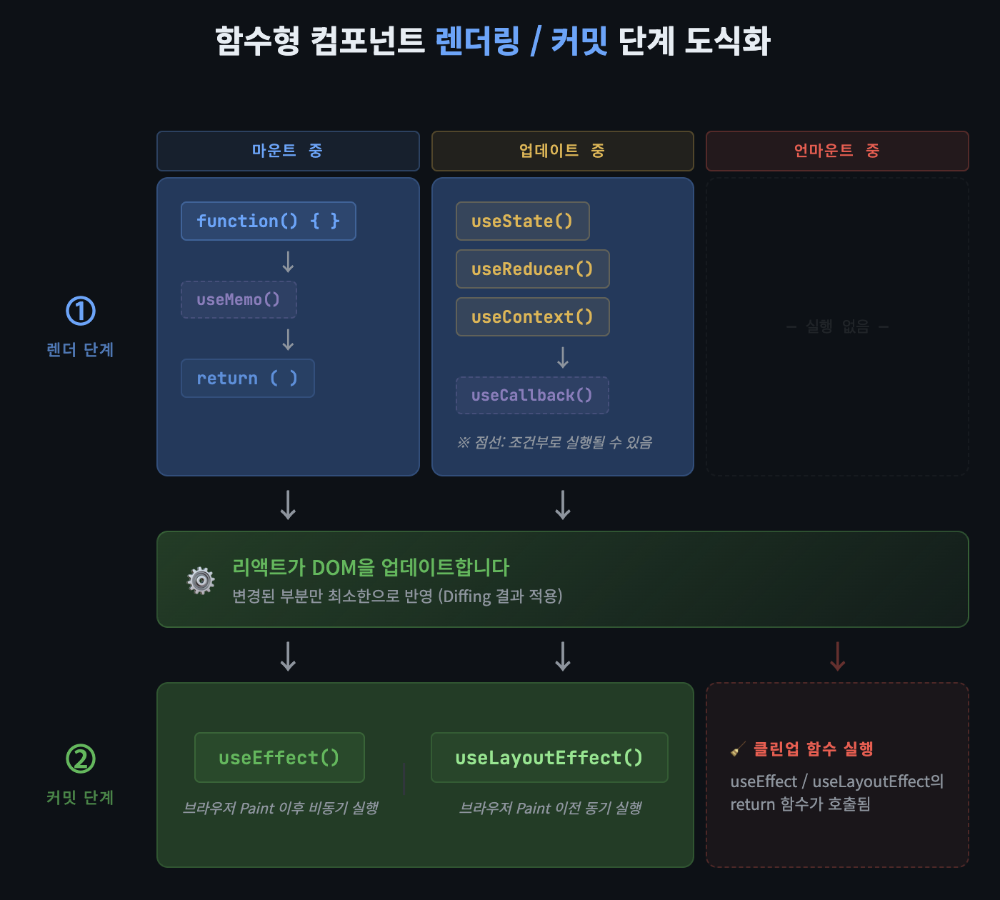

## 8.1 렌더링과 가상 DOM을 돌봐야 하는 이유

1. 예측 불가능한 버그를 원칙적으로 차단합니다. 리액트의 렌더링 로직은 함수의 실행이 외부에 영향을 끼치지 않는 순수 함수처럼 동작해야합니다. 이 원칙이 깨졌을 때 동일한 프롭스에 대해서 다른 결과를 렌더링 할 수 있습니다.
2. 불필요한 리렌더링은 리액트 애플리케이션의반응성을 저해하는 가장 큰 요인입니다.
3. 가상 DOM과 키 프롭스가 어떤 역할을 하는지 잘 알 수 있게 됩니다.

## 8.2 리액트 컴포넌트와 인스턴스

리액트 엘리먼트가 트리 구조로 서로 연결되어 있기에 리액트 앱은 결국 하나의 거대한 트리 구조를 띄고 있습니다.

```javascript
import React from "react";

// 클래스 컴포넌트 선언
class ClassComponentExample extends React.Component {
  // 생성자: 컴포넌트 인스턴스가 생성될 때 호출됩니다.
  constructor(props) {
    super(props); // React.Component의 생성자를 호출합니다.

    //1. state 초기화: 각 인스턴스는 자신만의 독립적인 state를 가집니다.
    this.state = {
      count: 0,
    };

    // 메서드 바인딩: 클래스 메서드 내부에서 'this'가
    // 현재 인스턴스를 정확히 가리키도록 보장합니다.
    // 화살표 함수를 사용하면 이 과정이 필요 없을 수도 있습니다.
    this.incrementCount = this.incrementCount.bind(this);

    console.log("ClassComponentExample 인스턴스 생성됨:", this);
  }

  //2. 생명주기 메서드: 인스턴스가 DOM에 마운트된 후 호출됩니다.
  componentDidMount() {
    console.log("ClassComponentExample 인스턴스 마운트됨:", this);
    // 여기서 this는 현재 컴포넌트 인스턴스를 가리킵니다.
    // 예를 들어, this.state.count에 접근할 수 있습니다.
  }

  //3. 생명주기 메서드: 인스턴스가 DOM에서 언마운트되기 직전에 호출됩니다.
  componentWillUnmount() {
    console.log("ClassComponentExample 인스턴스 언마운트됨:", this);
  }

  // 클래스 메서드: 인스턴스 메서드로서 호출됩니다.
  incrementCount() {
    // this.setState를 사용하여 인스턴스의 state를 업데이트합니다.
    // this는 이 메서드가 호출된 인스턴스를 가리킵니다.
    this.setState({ count: this.state.count + 1 });
    console.log("incrementCount 호출됨. 현재 this:", this);
  }

  //4. 렌더 메서드: 각 인스턴스는 자신의 state와 props를 기반으로
  // UI를 렌더링합니다.
  render() {
    console.log("ClassComponentExample 렌더링 중. 현재 this:", this);
    return (
      <div>
        <h2>클래스 컴포넌트 예제</h2>
        {/* this.state를 통해 인스턴스의 현재 count 값을 표시합니다. */}
        <p>현재 카운트: {this.state.count}</p>
        {/* onClick 핸들러는 인스턴스의 incrementCount 메서드를 호출합니다. */}
        <button onClick={this.incrementCount}>카운트 증가</button>
        {/* props는 생성 시 전달된 값을 인스턴스별로 가집니다. */}
        <p>전달된 메시지: {this.props.message || "기본 메시지"}</p>
      </div>
    );
  }
}

export default ClassComponentExample;
```

JSX에서 컴포넌트를 렌더링할 때 리액트는 함수형 컴포넌트인 경우 인수값으로 전달된 props를 사용해 직접 React.createElement() 혹은 jsx() , jsxs() 함수를 호출하고, 클래스 컴포넌트이면 리액트가 클래스의 새 인스턴스를 생성하고 내부에 선언했던 렌더 메서드를 호출합니다.

리액트 엘리먼트는 인스턴스가 아니라 어떤 것을 화면에 보여주고 싶은지를 전달하는 단순한 객체입니다.

## 8.3 렌더링과 리렌더링

리액트의 렌더링은 UI가 화면에 그려지는 순간이 아닌, UI가 앞으로 어떻게 보일지 계산하는 과정입니다.
렌더링하는 동안 리액트는 함수형 컴포넌트라면 FunctionalComponent()를, 클래스 컴포넌트라면 ClassComponent.render()를 호출합니다. 이 함수들은 리액트가 렌더링 과정에서 호출하는 것이므로 개발자가 직접 호출할 필요는 없죠!

함수형 컴포넌트에서 렌더링이란 컴포넌트 함수를 호출해 리액트 엘리먼트를 생성하는 과정이며 렌더링과정은 3가지로 나뉩니다.

1. 트리거
2. 렌더
3. 커밋



### 1. 트리거 (Trigger)

렌더링이 시작되는 시점입니다. 트리거가 발생하는 경우는 두 가지입니다.

- **최초 렌더링**: 앱이 처음 실행될 때 리액트는 루트 컴포넌트를 렌더링합니다.
- **리렌더링**: `useState`의 `setState` 호출, 부모 컴포넌트의 리렌더링, `Context` 값 변경 등 상태나 props가 변경되면 해당 컴포넌트의 리렌더링이 예약됩니다.

### 2. 렌더 (Render)

트리거가 발생하면 리액트는 컴포넌트 함수를 호출해 "다음 화면이 어떻게 보여야 하는지"를 계산합니다.

- **최초 렌더링**에서는 루트 컴포넌트부터 시작해 자식 컴포넌트를 재귀적으로 호출하며 전체 컴포넌트 트리를 구성합니다.
- **리렌더링**에서는 상태가 변경된 컴포넌트 함수를 다시 호출하고, 이전 렌더 결과와 새로운 렌더 결과를 **비교(Diffing)** 합니다.

이 과정은 순수하게 계산만 수행하며, 실제 DOM에는 아직 아무런 변화도 일어나지 않습니다.

**실행 시점**: 트리거가 발생한 직후, 커밋 단계 이전

**주요 작업**

- 컴포넌트 함수 호출 및 JSX를 리액트 엘리먼트 트리로 변환
- 최초 렌더링 시 전체 컴포넌트 트리를 재귀적으로 구성
- 리렌더링 시 이전 트리와 새로운 트리를 비교(Diffing)해 변경된 부분을 파악
- 실제 DOM 조작 없이 순수한 계산만 수행 (사이드 이펙트 없음)

---

### 3. 커밋 (Commit)

렌더 단계에서 계산한 결과를 실제 DOM에 반영하는 단계입니다.

- **최초 렌더링**에서는 `appendChild()`를 사용해 생성된 모든 DOM 노드를 화면에 추가합니다.
- **리렌더링**에서는 Diffing을 통해 변경이 필요한 DOM 노드만 최소한으로 업데이트합니다. 변경된 부분이 없다면 DOM을 건드리지 않습니다.

커밋이 끝나야 비로소 브라우저가 화면을 다시 그리며(Paint), 이 시점이 사용자 눈에 변화가 보이는 순간입니다.

**실행 시점**: 렌더 단계가 완료된 직후, 브라우저 Paint 이전

**주요 작업**

- 최초 렌더링 시 `appendChild()`로 모든 DOM 노드를 화면에 삽입
- 리렌더링 시 렌더 단계에서 파악한 변경 사항만 최소한으로 DOM에 반영
- 변경된 부분이 없다면 DOM을 전혀 수정하지 않음
- 커밋 완료 후 `useLayoutEffect` 실행, 이후 브라우저 Paint, Paint 후 `useEffect` 실행

## 8.4 재조정 과정

리액트가 화면을 효율적으로 업데이트하는 핵심 원리는 가상 DOM의 재조정 과정에 있습니다. 이 과정에서 리액트는 이전 가상 DOM과 새로운 가상 DOM을 비교하여 실제로 변경이 필요한 부분만 선별해 최소한으로 업데이트합니다.
재조정 알고리즘은 이렇습니다.

1. 서로 다른 타입의 엘리먼트는 다른 트리를 구축한다 : 만약 h1 이 h2로 바뀌거나 다른 컴포넌트로 바뀌면 완전히 다르다고 가정하고 하위 컴포넌트까지 제거하고 재생성합니다.
2. 개발자가 키 프롭스를 통해 렌더링 사이에서 어떤 자식 엘리먼트가 그대로 유지되어야 하는지 폇; 해줄 수 있다. : 자식 엘리먼트 배열을 비교할 때 순서대로 비교하는데, 리스트 맨 앞에 새로운 엘리먼트가 추가되면 모든 자식이 변경되었다고 오해하여 효율적인 업데이트를 할 수 있습니다. 이 때 키 프롭스를 사용해서 최소한의 변경을 합니다.

### 파이버

이 과정을 실제로 가능하게하는 파이버라는 개념이 있는데 이 파이버는 리액트가 렌더링 작업을 처리하는 기본 단위를 말합니다.
화면을 구성하는 각 엘리먼트느 내부적으로 자신만의 파이버 객체를 갖습니다. 이 객체는 단순히 엘리먼트의 타입 프롭스 등의 단순한 정보만 담는 것이 아니라 해당 엘리먼트에 어떤 변경이 필요한지, 작업의 우선순위는 뭔지에 대한 정보가 전부 담겨있습니다.
렌더 단계의 목표는 변경점을 계산하는 것으로 현재 파이버 트리와 새로운 리액트 컴포넌트(리액트 컴포넌트 함수의 반환값)를 비교하여
어떤 DOM 변경이 필요한지 계산하고 표시합니다.

```javascript
function updateElement(returnFiber, current, element, lanes) {
  // 타입 비교 (및 키 비교)
  if (current !== null && current.elementType === element.type) {
    // 타입 일치 -> 기존 Fiber 재사용 결정
    const workInProgress = useFiber(current, element.props); // stateNode, ref 등 상속
    workInProgress.return = returnFiber;
    // ... 기타 설정 ...
    return workInProgress; // 재사용할 Fiber 반환
  } else {
    // 타입 불일치 -> 기존 Fiber 삭제하고 새로 생성 (createFiberFromElement 호출)
    // ...
  }
}

function useFiber(fiber, pendingProps) {
  const clone = createWorkInProgress(fiber, pendingProps);
  // clone은 fiber의 stateNode, ref, type 등을 물려받음
  clone.index = 0;
  clone.sibling = null;
  return clone;
}

function updateFunctionComponent(
  current,
  workInProgress,
  Component,
  nextProps,
  renderLanes,
) {
  // 1. Context 준비 (Context API 값 읽기 준비)
  prepareToReadContext(workInProgress, renderLanes);

  let nextChildren;
  let hasScheduledUpdateOrContext = false; // 컴포넌트 자체 업데이트나 context 변경 여부

  // (DEV 환경) 개발 관련 유효성 검사 등 수행...
  validateFunctionComponentInDev(workInProgress, Component);

  // (최적화) 만약 이전 파이버가 있고, 업데이트가 없다면 Bailout 시도
  // (주의: React.memo 비교는 updateMemoComponent에서 이미 처리됨.
  //  여기서는 주로 context 변경이나 부모로부터의 강제 업데이트 등을 확인)
  if (current !== null) {
    hasScheduledUpdateOrContext = checkScheduledUpdateOrContext(
      current,
      renderLanes,
    );
    if (
      !hasScheduledUpdateOrContext &&
      (workInProgress.flags & DidCapture) === NoFlags
    ) {
      // 특별한 업데이트가 없고, 이전에 에러/Suspense도 없었다면 Bailout 가능성 있음
      // (실제로는 Hooks 상태 변경 등 내부 요인도 고려되어 renderWithHooks에서 최종 결정됨)
      // 만약 여기서 Bailout 조건이 확실하다면 bailoutOnAlreadyFinishedWork 호출 가능
      // (실제 코드에서는 renderWithHooks 호출 후 결과 보고 Bailout 결정하는 경우가 많음)
    }
  }

  // 2. 컴포넌트 함수 실행 (Hooks 처리 포함)
  //    - renderWithHooks가 핵심! 이 안에서 useState, useEffect, useMemo 등 모든 Hook 실행
  //    - Component(nextProps, secondArg) 형태로 함수 호출
  nextChildren = renderWithHooks(
    current, // 이전 파이버 (Hook 상태 복원 등에 사용)
    workInProgress, // 현재 작업 중인 파이버
    Component, // 실행할 함수 컴포넌트
    nextProps, // 새로운 props
    null, // context (레거시)
    renderLanes, // 현재 렌더링 레인
  );

  // (renderWithHooks 내부에서didReceiveUpdate 플래그가 설정될 수 있음 - Hooks 상태 변경 등)
  if (current !== null && !didReceiveUpdate && !hasScheduledUpdateOrContext) {
    // Hooks 상태 변경도 없고, 외부 업데이트 요인도 없다면 최종 Bailout
    return bailoutOnAlreadyFinishedWork(current, workInProgress, renderLanes);
  }

  // 3. 컴포넌트 실행 결과(자식들) 재조정
  //    - renderWithHooks가 반환한 nextChildren과 이전 자식 파이버(current.child) 비교
  reconcileChildren(current, workInProgress, nextChildren, renderLanes);

  // 4. 첫 번째 자식 파이버 반환 (다음 작업 대상)
  return workInProgress.child;
}

function updateHostComponent(current, workInProgress, renderLanes) {
  const oldProps = current.memoizedProps;
  const newProps = workInProgress.pendingProps;

  // Props 비교하여 차이점 계산
  const updatePayload = diffProperties(
    domElement, // workInProgress.stateNode
    workInProgress.type,
    oldProps,
    newProps,
    // ...
  );

  // 변경 사항이 있으면 updatePayload 저장 및 Update 플래그 설정
  if (updatePayload) {
    workInProgress.updateQueue = updatePayload;
    workInProgress.flags |= Update; // Update 플래그 추가!
  }

  // ... 자식 재조정 (reconcileChildren 호출) ...
  return workInProgress.child;
}

function commitUpdate(
  domElement, // fiber.stateNode
  updatePayload, // fiber.updateQueue
  type,
  oldProps,
  newProps,
  internalInstanceHandle,
) {
  // 1. updatePayload를 순회하며 실제 DOM 속성 업데이트
  for (let i = 0; i < updatePayload.length; i += 2) {
    const propKey = updatePayload[i];
    const propValue = updatePayload[i + 1];
    if (propKey === "style") {
      // style 업데이트 로직
    } else if (propKey === "className") {
      domElement.className = propValue;
    } else {
      // 기타 속성 업데이트 (setAttribute 등)
    }
  }
}

// 단일 자식 비교 의사코드 (reconcileSingleElement 로직 기반)
function reconcileSingleElement(returnFiber, currentFirstChild, newElement) {
  let oldFiber = currentFirstChild;

  // 이전 자식 파이버들을 순회하며 비교 시도
  while (oldFiber !== null) {
    // 1. Key 비교 (엘리먼트 key와 파이버 key)
    if (oldFiber.key === newElement.key) {
      // 2. Key 일치 시 Type 비교 (엘리먼트 type과 파이버 elementType)
      if (oldFiber.elementType === newElement.type) {
        // 3. Key와 Type 모두 일치 -> 재사용!
        //    남은 형제들은 불필요하므로 삭제 대상으로 표시
        deleteRemainingChildren(returnFiber, oldFiber.sibling);
        //    기존 파이버를 기반으로 workInProgress 파이버 생성 (stateNode 등 상속)
        const existing = useFiber(oldFiber, newElement.props);
        existing.return = returnFiber;
        //    재사용한 파이버 반환
        return existing;
      } else {
        // Key는 같지만 Type이 다름 -> 재사용 불가!
        // 현재 oldFiber 및 이후 모든 형제 삭제 대상으로 표시
        deleteRemainingChildren(returnFiber, oldFiber);
        // 비교 중단 (더 이상 일치 가능성 없음)
        break;
      }
    } else {
      // Key 불일치 -> 현재 oldFiber는 삭제 대상으로 표시
      deleteChild(returnFiber, oldFiber);
    }
    // 다음 형제 파이버로 이동하여 비교 계속
    oldFiber = oldFiber.sibling;
  }

  // 루프 종료 후: 일치하는 파이버를 찾지 못했거나, Type 불일치로 중단된 경우
  // 새로운 엘리먼트를 위한 새 파이버 생성
  const created = createFiberFromElement(newElement, returnFiber.mode, lanes);
  created.return = returnFiber;
  // 생성된 새 파이버 반환
  return created;
}

// 여러 자식 비교 의사코드 (reconcileChildrenArray 로직 기반)
function reconcileChildrenArray(
  returnFiber,
  currentFirstChild,
  newChildrenArray,
) {
  let resultingFirstChild = null; // 새로 만들어질 자식 파이버 리스트의 첫 번째
  let previousNewFiber = null; // 리스트 연결을 위한 이전 파이버 포인터
  let oldFiber = currentFirstChild; // 비교 대상인 이전 자식 파이버
  let newIdx = 0; // 새 자식 배열의 현재 인덱스
  let lastPlacedIndex = 0; // 이동(Move) 감지를 위한 이전 인덱스 추적

  // (간략화) 1단계: 앞에서부터 순서대로 비교하며 최대한 재사용
  // Key와 Type이 일치하는 동안 oldFiber와 newChildrenArray[newIdx]를 비교하며 재사용
  // ... (실제 코드는 더 복잡하지만, 기본 아이디어는 동일) ...

  // (간략화) 2단계: 남은 요소들 처리 (Key 기반 매칭)

  // 2a. 남은 기존 자식들을 Key를 키로 하는 Map으로 변환
  const existingChildrenMap = mapRemainingChildren(oldFiber);

  // 2b. 남은 새 자식 배열을 순회
  for (; newIdx < newChildrenArray.length; newIdx++) {
    const newChildElement = newChildrenArray[newIdx];
    const key = newChildElement.key !== null ? newChildElement.key : newIdx;
    let newFiber = null;

    // 2c. Map에서 Key로 기존 파이버 검색
    const matchedOldFiber = existingChildrenMap.get(key);

    if (matchedOldFiber !== undefined) {
      // Key 일치! -> Type 비교
      if (matchedOldFiber.elementType === newChildElement.type) {
        // Type까지 일치 -> 재사용!
        newFiber = useFiber(matchedOldFiber, newChildElement.props);
        // Map에서 제거 (처리 완료)
        existingChildrenMap.delete(key);

        // ** 이동(Move) 감지 **
        // 기존 위치(matchedOldFiber.index)가 마지막 배치 위치보다 작으면 이동 필요
        if (matchedOldFiber.index < lastPlacedIndex) {
          newFiber.flags |= Placement; // Placement 플래그 설정
        }
        lastPlacedIndex = Math.max(lastPlacedIndex, matchedOldFiber.index);
      } else {
        // Key는 같지만 Type이 다름 -> 재사용 불가!
        // 기존 파이버는 삭제, 새 파이버 생성
        deleteChild(returnFiber, matchedOldFiber);
        existingChildrenMap.delete(key); // Map에서도 제거
        newFiber = createFiber(newChildElement);
        newFiber.flags |= Placement; // 새로 생성 시 항상 Placement
      }
    } else {
      // Key 불일치 -> 새 파이버 생성
      newFiber = createFiber(newChildElement);
      newFiber.flags |= Placement; // 새로 생성 시 항상 Placement
    }

    // 새로 생성/재사용된 파이버를 리스트에 연결
    newFiber.return = returnFiber;
    if (previousNewFiber === null) {
      resultingFirstChild = newFiber;
    } else {
      previousNewFiber.sibling = newFiber;
    }
    previousNewFiber = newFiber;
  }

  // 2d. Map에 아직 남아있는 기존 자식들은 더 이상 불필요 -> 모두 삭제
  existingChildrenMap.forEach((child) => deleteChild(returnFiber, child));

  // 완성된 자식 파이버 리스트의 첫 번째 반환
  return resultingFirstChild;
}

// --- 보조 함수 의사코드 ---
function useFiber(fiber, pendingProps) {
  // 기존 파이버(fiber)를 기반으로 workInProgress 파이버를 복제/생성
  const clone = createWorkInProgress(fiber, pendingProps);
  // stateNode, ref, type 등 주요 속성 상속
  clone.index = 0; // 형제 리스트 내 인덱스 초기화
  clone.sibling = null; // 형제 포인터 초기화
  return clone;
}

function createFiber(element) {
  // 주어진 React 엘리먼트로 새로운 파이버 객체 생성
  // ...
}

function deleteChild(returnFiber, childToDelete) {
  // 주어진 파이버(childToDelete)를 삭제 대상으로 표시
  // returnFiber.deletions 배열에 추가하고 ChildDeletion 플래그 설정
  // ...
}

function mapRemainingChildren(firstChild) {
  // 주어진 첫 번째 자식 파이버부터 형제들을 순회하며
  // Key(없으면 index)를 키로, 파이버를 값으로 하는 Map 생성하여 반환
  // ...
}

function reconcileChildrenArray(
  returnFiber,
  currentFirstChild,
  newChildrenArray,
) {
  // 1. 이전 자식들을 식별 정보(Key 또는 Index) 기반 Map으로 생성
  const oldFiberMap = mapOldFibersByIdentifier(currentFirstChild);

  let resultingFirstChild = null;
  let previousNewFiber = null;
  let lastPlacedIndex = -1; // 이동 감지용

  // 2. 새로운 자식 배열 순회
  for (let newIdx = 0; newIdx < newChildrenArray.length; newIdx++) {
    const newElement = newChildrenArray[newIdx];
    if (newElement === null) continue; // null은 건너뜀

    // 3. 새 엘리먼트의 식별 정보 결정 (Key 우선, 없으면 Index)
    const identifier = newElement.key !== null ? newElement.key : newIdx;

    // 4. 식별 정보(identifier)를 사용해 Map에서 이전 파이버 검색
    const matchedOldFiber = oldFiberMap.get(identifier);

    let newFiber;

    if (matchedOldFiber) {
      // 5a. 식별 정보 일치! -> Map에서 제거하고 Type 비교
      oldFiberMap.delete(identifier);
      if (matchedOldFiber.elementType === newElement.type) {
        // Type까지 일치 -> 재사용
        newFiber = useFiber(matchedOldFiber, newElement.props);
        // 이동 여부 판단 (기존 인덱스와 현재 배치 순서 비교)
        if (matchedOldFiber.index < lastPlacedIndex) {
          newFiber.flags |= Placement; // 이동 필요
        }
        lastPlacedIndex = Math.max(lastPlacedIndex, matchedOldFiber.index);
      } else {
        // Type 불일치 -> 기존 것 삭제, 새 것 생성
        deleteChild(returnFiber, matchedOldFiber);
        newFiber = createFiber(newElement);
        newFiber.flags |= Placement; // 생성은 항상 배치
      }
    } else {
      // 5b. 식별 정보 불일치 -> 새 파이버 생성
      newFiber = createFiber(newElement);
      newFiber.flags |= Placement; // 생성은 항상 배치
    }

    // 생성/재사용된 파이버 연결
    newFiber.return = returnFiber;
    if (previousNewFiber === null) {
      resultingFirstChild = newFiber;
    } else {
      previousNewFiber.sibling = newFiber;
    }
    previousNewFiber = newFiber;
  }

  // 6. Map에 남은 이전 파이버들은 모두 삭제
  oldFiberMap.forEach((fiber) => deleteChild(returnFiber, fiber));

  return resultingFirstChild;
}
```

요약하자면 리액트는 key를 사용해 엘리먼트의 고유한 정체성을 식별하고, 재사용을 시도하는데 없거나 변경되면, 리액트는 완전히 새로운 엘리먼트로 간주하여 DOM을 새로 만들기 떄문에 리스트 렌더링시에 key를 인덱스로 사용하면 (순서 바뀔 수도 있으니) 안되는 이유입니다.

마지막으로 재조정(필요한 부분만 업데이트하는 원리)의 핵심원리를 살펴봅시다.

재조정 핵심 원리 3가지

1. 타입이 다르면 → 버리고 새로 만든다
jsx// 이전
<div><Counter /></div>

// 이후
<span><Counter /></span> // div→span 타입 변경

// 결과: div 통째로 언마운트 → span 새로 마운트
// Counter 내부 state도 전부 초기화됨

2. 타입이 같으면 → 재사용하고 props만 바꾼다
jsx// 이전
<div className="a" />

// 이후

<div className="b" />

// 결과: 같은 DOM 노드 유지, className만 업데이트
// 훨씬 빠름 (DOM 생성 비용 없음)

3. 리스트는 key로 추적한다
jsx// ❌ key 없음 → 순서로 비교 → 전부 리렌더링
<li>A</li>
<li>B</li>

// ✅ key 있음 → key로 동일 항목 추적 → 변경된 것만 업데이트

<li key="a">A</li>
<li key="b">B</li>
```

---

### 결론

```
타입 다름  →  언마운트 + 새로 마운트  (비쌈)
타입 같음  →  props 업데이트          (쌈)
리스트     →  key 없으면 순서 비교    (위험)
```

## 8.5 얕은 비교와 렌더링 최적화

얕은 비교 (Shallow Compare) — React가 기본으로 하는 것
참조값만 비교, 내부까지 안 들여다봄

```javascript 얕은 비교 동작 방식
Object.is(prev, next);
Object.is(1, 1); // true  → 같음
Object.is("a", "a"); // true  → 같음
Object.is({}, {}); // false → 다름 (참조가 다른 객체)
Object.is(arr, arr); // true  → 같은 참조
```

### React가 얕은 비교를 하는 곳

```javascript
1. useState → setState로 넘긴 값
2. useEffect → deps 배열 각 항목
3. useMemo, useCallback → deps 배열 각 항목
4. React.memo → 이전 props vs 새 props 각 항목
jsx// useEffect 예시
const [user, setUser] = useState({ name: "kim" });

useEffect(() => {
  console.log("실행");
}, [user]); // user 참조가 바뀌었나? 만 확인

// ❌ 이렇게 하면 매번 실행됨
setUser({ name: "kim" }); // 내용 같아도 새 객체 = 참조 다름

// ✅ 이렇게 해야 실행 안됨
setUser(prev => prev);    // 같은 참조 반환
```

### 깊은 비교 (Deep Compare) — React가 직접 하지 않음

React 내부엔 깊은 비교 없음, 개발자가 직접 구현하는 것

```jsx
import isEqual from "lodash/isEqual";

const prev = { a: { b: 1 } };
const next = { a: { b: 1 } };

isEqual(prev, next); // true ← 내부까지 비교

// React.memo에 커스텀 비교 함수로 주입
const MyComponent = React.memo(
  ({ user }) => <div>{user.name}</div>,
  (prevProps, nextProps) => isEqual(prevProps, nextProps), // 깊은 비교
);
```
