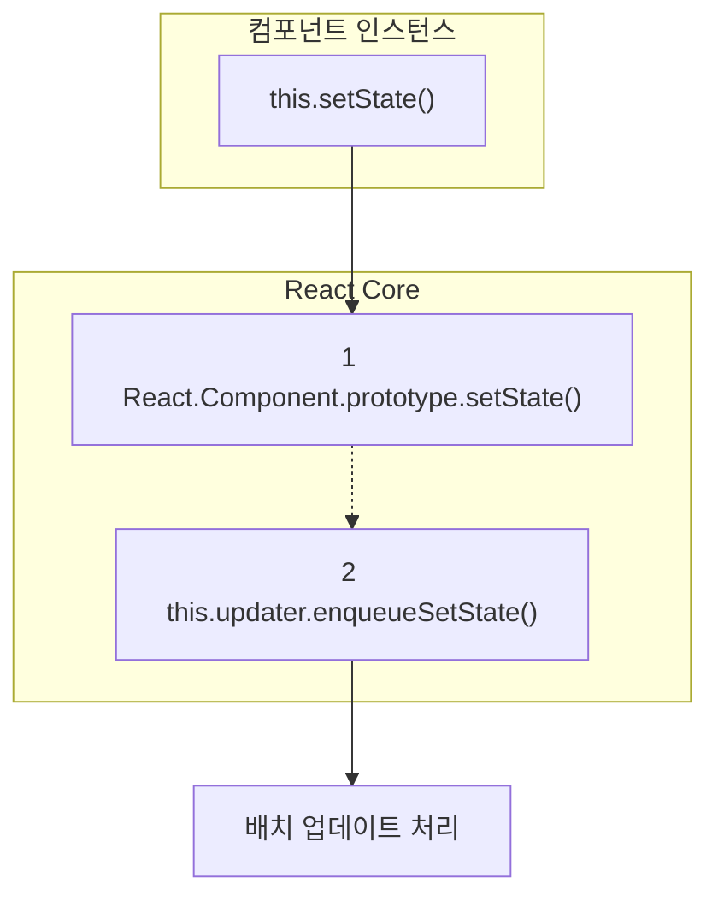
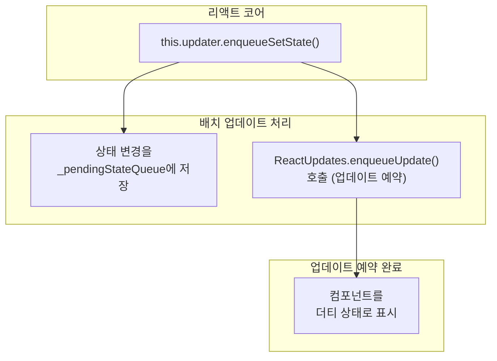
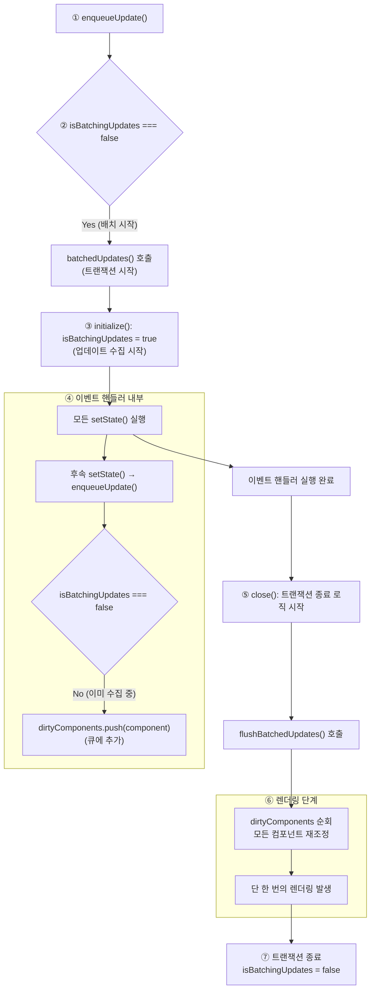
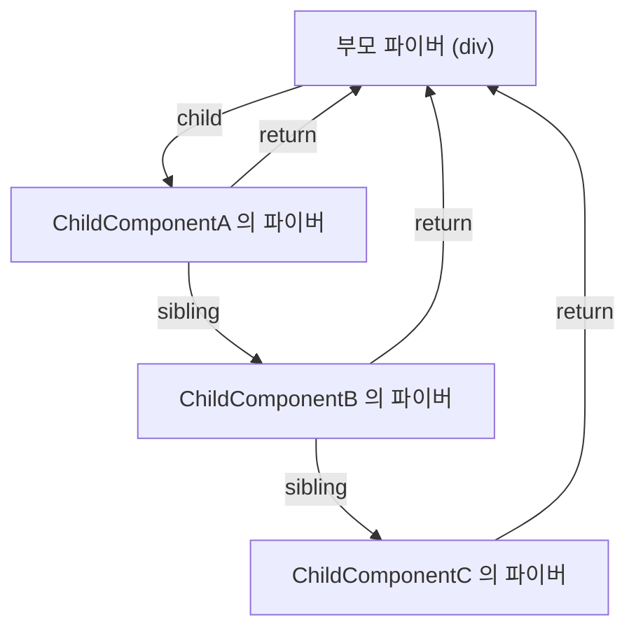
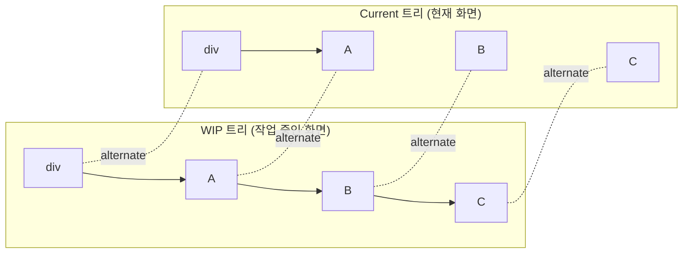
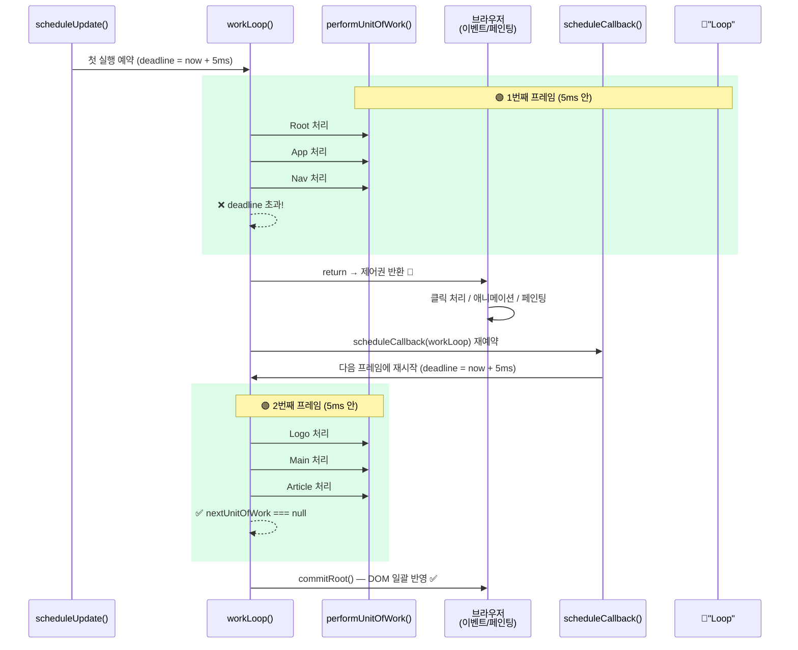
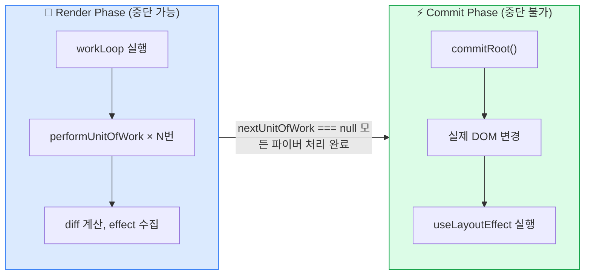
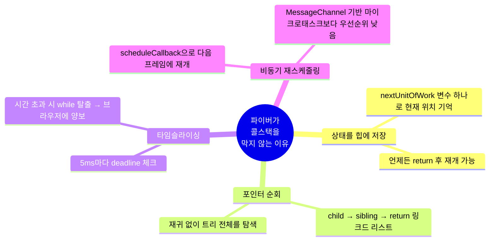

## 학습 목표
- 스택 재조정자 vs 파이버 재조정자를 구분할 수 있다.
- 모던 리액트 아키텍처의 동작 원리 이해할 수 있다.
- setState()가 왜 비동기 함수가 아닌지 말할 수 있다.

## 핵심 키워드
- 스택 아키텍처
- 파이버 아키텍처
- 동시성 기능

**파이버 아키텍처는 렌더링 우선순위를 부여하여 유저에게 더 유려한 인터랙션을 제공할 수 있게 함**.
리액트는 렌더링 같은 무거운 작업들을 작은 단위로 분할, 각 단위를 처리한 후 메인 스레드에 제어권을 넘겨줄지 결정함.
만약 할당된 시간(5ms)을 초과하면, 리액트는 진행 중이던 렌더링을 잠시 멈추고 브라우저에게 제어권을 양보했다가, 이후에 다시 작업을 이어감.
파이버 아키텍처가 어떻게 긴 렌더링 작업이 사용자 인터랙션을 막는 현상을 방지하는지, 그리고 각 작업 단위에 어떤 과정을 거쳐 우선순위를 부여하는지 리액트의 실제 구현 코드를 간소화하여 살펴보자.

## 12.1 리액트 파이버를 돌아봐야 하는 이유

레거시 리액트에서 동시성 기능을 사용할 수 없는 이유(당시의 한계점)를 이해하고 스택`Stack`과 파이버`Fiber`에 대해 알아보자.
`useTransition()`과 같은 **동시성 기능**을 제대로 이해하고 활용하려면, '렌더링은 중단될 수 있다'는 파이버의 기본 동작 방식을 이해해야 함.

## 12.2 리액트 스택 재조정자 알아보기
(8.4절) 파이버 재조정자가 가상 DOM에서 만든 리액트 엘리먼트 트리를 순회하며 변경 사항을 탐색하고 최소한의 업데이트 수행.
상태 및 프롭스 변경에 따라 UI를 업데이트할 최소한의 변경 사항을 계산하는 재조정의 핵심 원리는 스택 재조정자에서도 동일 적용.

스택 재조정자: 리액트의 선언적 UI, 컴포넌트 기반 아키텍처, 효율적인 업데이트, 단방향 데이터 흐름의 설계 목표를 달성하기 위한 핵심적인 구현체.

### 12.2.1 스택 재조정자 동작 원리
**리액트 15 이하 버전은 스택 구조의 재조정자 사용함**. 자바스크립트 호출 스택`call stack`과 관련이 있음.
스택 재조정자는 컴포넌트 트리를 재귀적으로 순회하며, 모든 과정을 하나의 동기적은 작업으로 처리함. 즉, 렌더링 작업이 한 번 시작되면 호출 스택이 비워질 때까지, 즉 **렌더링이 끝날 때까지 멈출 수 없었음. -> 메인 스레드 장시간 점유하는 문제 -> 유저 인터렉션 반응성이 낮아짐**. 
지금은 파이버 아키텍처로 대체되었지만, **스택 재조정자는 리액트의 기본 철학과 핵심 개념을 정립하는 데 중요한 역할을 함.**
클래스 컴포넌트 상태 업데이트를 시작으로, 스택 재조정자가 구체적으로 어떠한 일을 했는지 알아보자.

```js
// ch12/ReactUpdates.js -> ch12/ReactBaseClass.js
React.Component.prototype.setState = function(partialState, callback) { // 1.
	// this.updater는 컴포넌트와 업데이트 큐를 잇는 중간 관리자 역할을 함
	// 2. 첫 번째 인자로 'this'를 넘겨 어떤 컴포넌트의 상태를 업데이트할지 알려줌
	// 두 번째 인자인 partialState는 새로운 상탯값
	this.updater.enqueueSetState(this, partialState)
	if(callback) {
		this.updater.enqueueCallback(this, callback, 'setState')
	}
}
```

위는 클래스 컴포넌트에서 사용한 this.setState()를 정의한 React.Component의 프로토타입

1. setState()는 상속받는 메서드: React.Component의 프로토타입에 이미 정의된 메서드.
2. updater를 통한 업데이트 요청: `setState()`가 호출되면, 컴포넌트는 `this.updater`라는 객체를 통해 `ReactUpdateQueue` 모듈에 접근. **updater 객체**는 리액트가 내부적으로 컴포넌트 인스턴스를 생성하고 마운트하는 시점에 주입해주는 중간 관리자임. 이 구조 덕분에 컴포넌트 로직과 리액트의 업데이트 메커니즘이 분리될 수 있음. `this.updater.enqueueSetState()` 내부에서 두 가지 핵심 작업이 일어남.
		- 새로운 상태(partialState)는 컴포넌트 내부의 `pendingStateQueue`에 저장됨.
		- 동시에 리액트의 중앙 관리자인 `ReactUpdates` 모듈의 `enqueueUpdate()`가 호출되어 업데이트가 필요함을 알림.


`enqueueUpdate()`는 `this.setState()`를 호출한 컴포넌트를 업데이트가 필요한 더티 상태로 표시하고 다음 렌더링 주기에 처리되도록 예약함. `enqueueUpdate()`의사코드 **(책에서는 ch12/ReactBaseClass.js  -> ch12/ReactUpdates.js )**
```js
// enqueueUpdate() 의사코드
// 책에서는 ch12/ReactBaseClass.js 아님 -> ch12/ReactUpdates.js

// 경로: src/renderers/shared/stack/reconciler/ReactUpdates.js (일부, 간략화)

// 스택 재조정자 시절의 코드 간소화
var dirtyComponents = []; // 1. 업데이트가 필요한 '더티' 컴포넌트 목록

function enqueueUpdate(component) {
  // 2. 현재 배치 업데이트가 진행 중인지 확인
  if (!batchingStrategy.isBatchingUpdates) {
    // 진행 중이 아니라면, 배치 업데이트를 시작함
    batchingStrategy.batchedUpdates(enqueueUpdate, component);
    return;
  }

  // 3. 배치 업데이트가 이미 진행 중이라면, 컴포넌트를 큐에 추가
  dirtyComponents.push(component);
}
```

1. 배치 상태 확인: `batchingStrategy.isBatchingUpdates` 플래그를 통해 리액트가 업데이트를 모으는 중인지 확인
2. 플래그가 true라면 `dirtyComponents` 배열에 추가
3. 더티 컴포넌트 목록: `dirtyComponents` 는 재조정 필요한 컴포넌트가 저장되는 대기열. 배치 작업이  끝날 때 이 배열을 순회하며 모든 '더티' 컴포넌트를 업데이트


#### 배치 업데이트 처리와 업데이트 예약 완료 도식화
setState()가 상태를 즉시 변경하는 것이 아니라 변경 사항을 큐에 저장하고 업데이트를 예약하는 배치 프로세스로 동작



`enqueueUpdate()`는 상태 업데이트 요청에 대해 대기열 접수를 받는 접수 창구.
실제 업데이트를 처리하는 시점과 방법을 결정하는 것은 `ReactDefaultBatchingStrategy`

```js
// ch12/ReactDefaultBatchingStrategy.js

// 스택 재조정자 시절의 코드 간소화
var ReactDefaultBatchingStrategy = {
  isBatchingUpdates: false,

  // ➊ batchedUpdates는 모든 업데이트를 감싸는 역할을 함
  batchedUpdates: function(callback, a) {
    var alreadyBatching = ReactDefaultBatchingStrategy.isBatchingUpdates;
    
    // 이미 다른 배치 작업이 진행 중이라면, 현재 콜백을 바로 실행
    if (alreadyBatching) {
      return callback(a);
    }

    // ➋ 트랜잭션을 시작하여 배치 작업을 수행
    transaction.perform(callback, null, a);
  },
};

// ➌ 트랜잭션: 작업의 시작과 끝에 특정 로직을 보장하는 래퍼
const batchingStrategyTransaction = {
  initialize: function() {
    ReactDefaultBatchingStrategy.isBatchingUpdates = true;
  },
  close: function() {
    ReactDefaultBatchingStrategy.isBatchingUpdates = false;
    // ➍ 트랜잭션이 닫힐 때, 쌓여있던 모든 업데이트를 실제로 처리
    ReactUpdates.flushBatchedUpdates(); 
  }
};

// 가상의 transaction.perform 구현
const transaction = {
  perform: function(method, scope, a) {
    try {
      batchingStrategyTransaction.initialize();
      method.call(scope, a);
    } finally {
      // 무슨 일이 있어도 close는 반드시 호출됨
      batchingStrategyTransaction.close();
    }
  }
};
```
1. `batchedUpdates()` 호출 
2. `transaction.perform()`을 통해 본격적인 배치 작업이 시작
3. 트랜잭션이라는 디자인 패턴을 광범위하게 사용. 특정 작업(callback(), 즉 enqueueUpdate())를 감싸서, 작업 시작전과 종료 후에 특정 로직이 반드시 실행되도록 보장하는 장치.(initialize(), close())



### 12.2.2 스택 재조정자의 한계
스택 재조정자의 한계는 동작 방식이 **동기적이며 중단이 불가능**하다는 데 있음. **JS 콜스택**을 깊게 파고드는 **단일 재귀 함수**로 구현되어 있기 때문.

콜 스택이 비워질 때까지 멈출 수 없어, 메인 스레드가 다른 일을 할 수 없는 상태가 될 수 있음. 클릭이나 키보드 입력을 받을 수 없는 상태.

**파이버 아키텍처가 16버전에 도입**되어 중단 불가능한 작업을 잘게 쪼개어 필요에 따라 멈추고, 재개하고, 우선순위를 부여할 수 있도록 만들었음.

## 12.3 파이버 아키텍처 알아보기

리액트 16버전 부터 기본 재조정자로 채택, 모던 리액트의 모든 동시성 기능의 기반이 됨.

### 12.3.1 파이버 노드 해부하기
파이버: 컴퓨터 과학에서 '실행 가능한 가장 작은 작업 단위'를 의미하는 일반적인 용어
리액트에서는 '컴포넌트에 대한 정보를 담고 있는 자바스크립트 객체이자, 처리해야 할 하나의 작업 단위'

#### 스택 재조정자와 파이버의 가장 근본적인 차이
- 스택 재조정자: **JS 콜 스택 자**체를 작업 단위로 사용함. 함수가 호출되면 스택에 쌓이고, 끝날 때까지 멈출 수 없었음.
- 파이버 재조정자: 콜 스택에 의존하는 대신, **작업에 필요한 정보를 파이버 객체에 담아 메모리에 유지**.

#### 파이버 노드의 구조와 역할
```jsx
// ch12/FiberNode.jsx
// 리액트 파이버 노드의 핵심 속성을 간소화한 예시
class FiberNode {
  constructor(tag, pendingProps, key) {
    // --- 1. 기본 식별 정보 ---
    this.tag = tag;              // 파이버의 종류 (예: FunctionComponent, HostComponent)
    this.key = key;              // 엘리먼트의 고유 key
    this.elementType = null;     // React.createElement에 전달된 초기 타입 (예: App 함수)
    this.type = null;            // 실제 해석된 타입 (예: forwardRef의 render 함수)
    this.stateNode = null;       // 실제 DOM 노드 또는 클래스 컴포넌트 인스턴스

    // --- 2. 트리 탐색을 위한 포인터 ---
    this.return = null;          // 부모 파이버 (작업 완료 후 돌아갈 위치)
    this.child = null;           // 첫 번째 자식 파이버
    this.sibling = null;         // 다음 형제 파이버

    // --- 3. 작업 처리에 필요한 데이터 ---
    this.pendingProps = pendingProps; // 새로 들어온, 아직 처리 안 된 props
    this.memoizedProps = null;      // 이전 렌더링에서 사용했던 props
    this.updateQueue = null;      // 상태 업데이트, 콜백 등을 담는 큐
    this.memoizedState = null;    // 이전 렌더링에서 사용했던 상태

    // --- 4. 부수 효과 (Effects) 관련 정보 ---
    this.flags = 0;               // 이 파이버에 수행할 DOM 변경 작업 (Placement, Update 등)
    this.subtreeFlags = 0;        // 자식 트리에 수행할 작업이 있는지 나타내는 플래그
    this.deletions = null;        // 삭제될 자식 파이버 목록

    // --- 5. 더블 버퍼링을 위한 포인터 ---
    this.alternate = null;       // 다른 버퍼의 파이버 (current ↔ work-in-progress)
  }
}

```

1. 기본 식별 정보(컴포넌트 종류)
	1. `tag`: 함수형 컴포넌트 | 클래스 컴포넌트 | `<div>` 같은 일반 HTML 태그(HostComponent) 구분
	2. `type`: React.createElement(), jsx()에 전달된 함수나 클래스 자체를 가리킴
2. 트리 탐색을 위한 포인터(트리 구조): 링크드 리스트 형태의 트리 구조. 재귀 함수 호출 없이, 단순한 반복문만으로도 전체 컴포넌트 트리를 순회할 수 있음
	1. `return`: 부모 파이버를 가리킴. 렌더링 작업이 끝나면 이 포인터를 따라 부모로 돌아감
	2. `child`: 첫 번째 자식 파이버만을 가리킴
	3. `sibling`: 여러 자식이 있을 경우, 첫 번째 자식의 sibling 포인터가 두번째 자식을, 두번째 자식의 sibling이 세 번째 자식을 가리키는 식으로 연결됨
3. 작업 처리에 필요한 데이터(데이터와 상태)
	1. `pendingProps` `memoizedProps` 이 둘을 비교하여 프롭스 변경 판단
	2. `memoizedState`: 이전 렌더링의 최종 상태. 함수형 컴포넌트에서는 훅들의 연결 리스트가 이곳에 저장됨
	3. `updateQueue`: `useState()`의 상태 변경 함수가 실행되면, 그 업데이트 정보가 이 큐에 저장되어 다음 렌더링에서 처리됨
4. 부수 효과 플래그: 렌더 단계의 재조정 과정에서 어떤 변경이 필요한지 계산한 후, flags에 정보를 남겨두고 렌더링이 모두 끝난 후 커밋 단계에서 이 flags를 보고 실제 DOM 변경을 한꺼번에 처리.
5. 더블 버퍼링: 화면에 보이는 UI에 해당하는 파이버 트리(**current 트리**)와 상태 변경에 의해 current 트리를 복제 및 수정한 **WIP 트리**를 이용해 화면을 바꿔치기해서 보여줌. 불완전한 UI가 보여지지 않음. **얼터네이트 포인터**는 이 두 트리의 파이버 노드들을 서로 연결해주는 역할을 함.

### 12.3.2 파이버 우선순위와 레인(Lanes) 모델
스택 아키텍처 -> 하나의 항로
파이버 아키텍처 -> **다차선 항로** (레인 모델)

모든 업데이트에 '긴급도'에 따라 각기 다른 우선순위인 레인을 할당함
- 우선순위 높은 작업: 사용자 입력, UI 변화 등 그리고 진행 중인 애니메이션의 부드러운 프레임 업데이트 등
- 우선순위 낮은 작업: 당장 눈에 보이지 않거나, 시간이 좀 걸려도 괜찮은 작업. 화면 밖에 있는 콘텐츠의 렌더링이나 백그라운드 데이터 동기화 혹은 프리패칭(pre-fatching)

개발자는 동시성 기능을 통해 우선순위 낮은 업데이트 지정할 수 있음.
파이버 객체의 'lanes' 속성에 저장되는 숫자(비트마스크)가 레인을 의미함.
각 우선순위 수준을 2의 거듭제곱으로 표현하며, 비트 단위 연산을 통해 여러 레인을 병합하거나 우선 순위를 비교하는 작업을 매우 효과적으로 수행함.

적절한 차선 배정을 위한 기준이 있는 로직(교통 경찰 역할)
```js
// ch12/FiberLane.js
function requestUpdateLane(fiber) {
  const currentExecutionContext = getExecutionContext();
 
  // ➊ 개발자가 의도적으로 우선순위를 낮춘 경우 (트랜지션)
  if (isTransitionLane(fiber.mode)) {
    return TransitionLane; // 하위 우선순위로 배정
  }
 
 
  // ➋ 사용자 입력에 의한 업데이트인 경우
  if (currentExecutionContext & DiscreteEventContext) {
    return InputDiscreteLane; // '클릭' 같은 긴급 이벤트는 상위 우선순위
  }
  if (currentExecutionContext & ConcurrentEventContext) {
    return InputContinuousLane; // '스크롤' 같은 연속 이벤트는 다음 우선순위로
  }
 
 
  // ➌ 렌더링 도중 발생한 동기적 업데이트인 경우
  if ((currentExecutionContext & (RenderContext | CommitContext)) !== NoContext) {
    return SyncLane; // 데이터 불일치를 막기 위해 '긴급' 우선순위로
  }
 
 
  // ➍ 그 외의 모든 경우
  return DefaultLane; // 일반 우선순위로 배정
 }
 
```

1. 트랜지션 업데이트 확인(개발자 의도적으로 **낮은 우선순위** 배정) 
2. 유저 입력 확인 - 클릭, 키 입력 / 스크롤, 드래그(연속적 이벤트) -> 각각 다른 우선순위의 레인을 할당
3. 내부 동기화 확인(렌더링 도중 발생한 **동기적 업데이트** - 높은 우선순위)
4. 기본값

### 12.3.3 파이버 트리 구조: 재귀 없는 순회
재귀 없이도 전체 컴포넌트를 순회하는 링크드 리스트 유사 포인터 구조.
```jsx
// ch12/FiberNode.jsx
function ParentComponent() {
	return (
		<div>
			<ChildComponentA /> // 1
			<ChildComponentB /> // 2
			<ChildComponentC /> // 3
		</div>
	)
}
```

child, sibling, return 포인터를 가진 파이버 노드들로 변환
- child: 부모 -> 첫 번째 자식으로 이동
- sibling: 현재 노드 -> 다음 형제 노드로 이동
- return: 모든 자식과 형제 순회가 끝났을 때, 부모로 돌아가기 위해 사용

포인터들을 따라가는 작업 순서
1. **div** 파이버에서 시작해 child 포인터를 따라 **ChildComponentA** 로 이동
2. **ChildComponentA** 자식이 없으므로, sibling 포인터를 따라 **ChildComponentB** 로 이동
3. **ChildComponentB** 자식이 없으므로, sibling 포인터를 따라 **ChildComponentC** 로 이동
4. **ChildComponentC는** 더 이상 형제가 없으므로, return 포인터를 따라 부모인 **div**로 돌아가며 한 단위의 작업이 마무리됨

각 파이버는 서로의 부모, 자식 파이버로의 **연결 포인터**를 갖고 있음



### 12.3.4 더블 버퍼링과 얼터네이트 포인터
파이버의 또 다른 핵심 - 더블 버퍼링 기법
리액트가 직접 화면을 변경하며 렌더링 작업을 한다면, 유저는 작업이 채 끝나지 않은, 깨진 형태의 UI를 잠시 보게될 수 있음.
두 개의 파이버 트리 **current**, **work-in-progress** 를 유지함
- current 트리: 현재 화면에 보이는 UI를 구성하는트리, 프론트 버퍼라고 부르기도 함
- WIP 트리: 상태 변경 후, 보이지 않는 곳에서 새로 렌더링 작업을 수행하는 트리, 백 버퍼라고 부르기도 함.

모든 렌더링 작업을 WIP트리에서 완료한 뒤, **준비가 끝나면** 이 WIP트리를 current트리로 **바꿔치기**하여 화면에 한 번에 보여줌.
이 때 두 트리의 노드를 연결하고, 파이버 노드를 효율적으로 재사용하게 해주는 포인터가 **얼터네이트 포인트**임.


(alternate 포인터는 **양방향 연결**)

매번 새로운 트리를 생성하는 대신 current 트리의 노드들을 복제하여 WIP 트리를 만듬
이 때 alternate 포인터는 각 current 노드와 복제된 WIP 노드를 서로 가리키게 하여, 정보에 접근하고 노드를 재활용하는 다리 역할을 함.

### 12.3.5 파이버 아키텍처와 동시성 기능 원리
스택 재조정자의 가장 큰 한계는 재귀. 콜 스택은 한 번 시작하면 중간에 멈추거나 다른 작업을 끼워 넣을 수 있는 '일시 정지' 버튼이 없음.

파이버 아키텍처는 하나의 while 반복문을 사용하여 렌더링을 처리함. 이 반복문은 '일시 정지'가 가능하도록 설계됨.
작업 내용을 파이버 노드 객체에 담아 관리하고, 지금 처리해야 할 작업 단위를 가리키는 북마크 역할을 하는 포인터인 **nextUnitOfWork** 변수를 사용함.

상태 업데이트 발생시 멈출 수 있는 작업 루프가 어떻게 시작되는지 의사코드로 살펴보자.
```js
// ch12/ReactFiberScheduler.js

// --- 전역 변수: 현재 렌더링 상태를 관리 ---
let nextUnitOfWork = null;      // ➊ 다음으로 처리할 파이버 '작업 단위'
let workInProgressRoot = null;  // 현재 작업 중인 전체 파이버 트리의 루트
let deadline = 0;               // ➋ 현재 작업 루프가 멈춰야 하는 시간 (마감 시한)
const frameYieldMs = 5;         // 브라우저에 제어권을 양보하기 위한 시간 (약 5ms)

// --- 업데이트 요청 진입점 ---
function scheduleUpdate(rootFiber) {
  // 이미 진행 중인 작업이 없다면, 새로운 작업 루프를 시작
  if (workInProgressRoot === null) {
    workInProgressRoot = rootFiber;
    nextUnitOfWork = rootFiber; // ➌ 첫 작업은 트리의 루트부터 시작
    
    // ➍ 작업 루프의 '마감 시간'을 설정하고, 루프 실행을 스케줄링함
    deadline = getCurrentTime() + frameYieldMs;
    scheduleCallback(workLoop); 
  }
  // (이미 작업이 진행 중이라면, 우선순위에 따라 병합 또는 중단 처리)
}

```

업데이트 발생하면 다음과 같이 준비합니다.
1. `nextUnitOfWork`: 다음에 무엇을 할지를 가리키는 핵심 포인터. 작업 루프는 이 변수가 `null`이 될 때까지 계속됨.
2. `deadline`: 작업이 허용된 시간을 추적하는 타이머
3. 첫 작업 단위 설정: `nextUnitOfWork`에 트리의 최상단인 `rootFiber`를 할당하여 작업의 시작점을 알려줌.
4. 작업 루프 예약: `scheduleUpdate()`을 통해 브라우저가 여유가 있을 때 `workLoop()` 함수를 실행하도록 예약함


`workLoop()` 와 그 안에서 실제 작업을 처리하는 `performUnitOfWork()`가 바로 파이버 아키텍처의 핵심입니다.

```js
// --- 메인 작업 루프 ---
function workLoop() {
  // ➎ 다음 작업이 있고, 아직 시간이 남아있다면 계속 실행
  while (nextUnitOfWork !== null && deadline > getCurrentTime()) {
    nextUnitOfWork = performUnitOfWork(nextUnitOfWork);
  }

  // ➐ 루프가 끝난 후
  if (nextUnitOfWork === null) {
    // 모든 작업 완료! 실제 DOM에 변경 사항을 커밋함
    commitRoot(workInProgressRoot);
  } else {
    // 시간이 다 되어서 멈췄다면, 다음 프레임에 이어서 하도록 다시 스케줄링
    scheduleCallback(workLoop);
  }
}

// --- 단위 작업(Unit of Work) 처리 ---
function performUnitOfWork(fiber) {
  // 현재 파이버에 대한 작업을 수행 (예: 컴포넌트 함수 실행, diff 비교 등)
  beginWork(fiber);
  
  // ➏ 다음 작업 단위를 결정하고 반환
  // 1. 자식이 있으면, 자식이 다음 작업
  if (fiber.child) {
    return fiber.child;
  }
  // 2. 자식이 없으면, 형제를 다음 작업으로
  if (fiber.sibling) {
    return fiber.sibling;
  }
  // 3. 자식과 형제 모두 없으면, 부모로 돌아가서 부모의 형제를 찾음
  let parent = fiber.return;
  while (parent) {
    if (parent.sibling) {
      return parent.sibling;
    }
    parent = parent.return;
  }

  // 최상단까지 돌아왔으면 모든 작업 완료
  return null;
}
```

5. while 루프: 재귀를 대체하는 역할. 작업할 것이 남았고 작업을 진행할 수 있는 시간도 아직 남았다면, 계속해서 **`performUnitOfWork()`** 함수를 호출
6. `performUnitOfWork()`: 이 함수는 딱 한 개의 파이버에 대한 작업을 처리하고, `child, sibling, return` 포인터를 이용해 다음에 처리할 파이버를 찾아 반환합니다. 중요한 것은, 이 함수는 자기 자신을 재귀적으로 호출하지 않는다는 점입니다. 파이버 아키텍처의 작업 루프는 컴포넌트 트리를 순회하는 하나의 거대한 여정과 같습니다. 이 여정은 두 단계로 나뉩니다.
	1. 시작 단계 (Begin phase): 부모에서 자식으로, '**내려가면서**' 각 파이버가 무슨 일을 해야 할지 결정합니다.
	2. 완료 단계 (Complete phase): 더 이상 내려갈 곳이 없으면, 자식에서 부모로 '**올라오면서**' 작업을 마무리하고 결과물을 모읍니다.
7. 루프 종료 조건.
	- 시간 초과: `deadline`을 넘기면 while 루프는 자연스럽게 멈춥니다. 하지만 `nextUnitOfWork` 변수에는 다음에 처리해야 할 파이버가 여전히 저장되어 있습니다. 리액트는 브라우저에 제어권을 넘겨주고, 나중에 `workLoop()`가 다시 시작되면 이 북마크 지점부터 작업을 완벽하게 이어갑니다.
	- 작업 완료: `performUnitOfWork()`가 `null`을 반환하면, 모든 파이버 순회가 끝났다는 의미입니다. `nextUnitOfWork`가 `null`이 되고, 리액트는 이제 커밋 단계로 넘어갑니다.


각 파이버 단위 작업인 `performUnitOfWork()`는 그 자체로 매우 빠르며, 자바스크립트 콜 스택을 깊게 만들지 않습니다. 리액트는 이 작은 작업 하나가 끝날 때마다 숨 쉴 틈을 가집니다. 이때 마감시한인 `deadline`을 확인하여, 시간이 남았다면 다음 작업인 `nextUnitOfWork`로 넘어가고, 시간이 없다면 진행 상황을 그대로 저장한 채 브라우저에 제어권을 양보합니다. 스케줄러에 의해 작업이 재개되면, 리액트는 `nextUnitOfWork`에 저장된 지점부터 완벽히 작업을 이어갑니다. 이것이 바로 스택 재조정자는 불가능했던 렌더링의 중단과 재개이며, 모던 리액트의 모든 동시성 기능이 작동하는 메커니즘입니다.


### 두 Phase의 역할 분리

Render Phase는 **언제든 중단 가능** — 브라우저가 급한 일이 있으면 양보합니다. 
Commit Phase는 **반드시 완주** — DOM이 반쯤 바뀐 상태로 사용자에게 보이면 안 되기 때문입니다.


