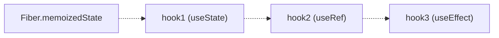

## 학습 목표
- 리액트 훅의 핵심 개념과 훅이라고 불리는 이유 설명할 수 있습니다.
- 리액트 훅의 주요 사용 규칙을 이해하고, 실제 코드 작성 시 이를 준수하여 잠재적인 버그를 예방할 수 있습니다.

16.8버전에 훅을 도입하여 패러다임의 전환을 맞이함. 리액트 개발의 주축이 클래스 컴포넌트에서 함수형 컴포넌트로 이동하는 거대한 흐름의 시작. 파이버 아키텍처가 리액트의 성능과 렌더링을 최적화하는 리액트 동작 방식의 원리를 바꾸었다면, 훅은 개발자가 리액트의 **상태와 생명주기 같은 기능에 직접 연결**하여 코드를 작성하는 방식 자체를 바꿨습니다.

## 13.1 리액트 훅을 돌아봐야 하는 이유
훅이 **동작하는 원리**를 공부하고 클래스 컴포넌트와 훅의 코드를 비교하며 이해도를 높일 수 있다.

## 13.2 왜 훅이라고 부를까?
상태나 생명주기같은 기능에 갈고리를 걸어 사용한다는 비유에서 유래.
소프트웨어 공학 전반에서 기존 코드의 흐름 중간에 끼어들어 개발자가 원하는 동작을 실행하는 개념.
특정 이벤트에 스크립트를 실행하는 깃 훅`Git hook`이나, 특정 이벤트 발생 시 다른 서비스로 HTTP 요청을 보내는 웹 훅`Webhook`이 좋은 예시.

훅이 등장하기 전, 함수형 컴포넌트는 프롭스를 받아 UI를 렌더링하는 상태 없는 컴포넌트.
훅으로 인해 상태를 직접 소유, 컴포넌트의 마운트, 업데이트, 언마운트와 같은 생명주기 시점에 맞추어 특정 로직을 실행할 수 있도록 연결하는 역할을 수행.

클래스 컴포넌트의 한계와 함수형 컴포넌트와 훅이 그것을 어떻게 극복했을까

## 13.3 클래스 컴포넌트에서 함수형 컴포넌트로

### 13.3.1 this 키워드 혼한과 수동 바인딩의 번거러움
this는 호출되는 컨텍스트에 따라 동적으로 결정됨. 특히 이벤트 핸들러와 같이 컴포넌트 메서드가 다른 컨텍스트에서 호출될 때, this는 클래스 인스턴스를 가리키지 않고 undefined가 되어 this.setState()와 같은 메서드를 호출할 때 에러의 원인이 되기도 함. 이를 해결하기위해 다음과 같은 여러 방법을 사용해야 했음.

```jsx
// ch13/ThisContext.jsx
class ThisContextExample extends React.Component {
	constructor(props) {
		super(props)
		this.state = {
			count: 0,
			message: 'this 컨텍스트 예제'
		}
		// 1. 방법1: 생성자에서 this를 바인딩(가장 일반적인 해결책)
		this.handleIncrementBound = this.handleIncrementBound.bind(this)
	}
	// 1. 생성자에서 바인딩된 메서드,
	handleIncrementBound() {}
	// 2. this가 바인딩되지 않아 버튼 클릭시 'this'는 undefined가 됨(에러 발생)
	handleIncrementUnbound() {
		// 'this'가 undefined 이므로 this.setState를 호출할 수 없음
		console.log('Unbound this', this)
		// TypeError 발생: Cannot read properties of undefined(reading 'setState')
		this.setState({ count: this.state.count + 1 })
	}
	// 3. 방법2: 클래스 필드 + 화살표 함수를 사용해 this를 자동으로 바인딩
	handleIncrementArrow = () => {
		console.log('Arrow function this:', this)
		this.setState((prevState) => ({ count: prevState.count + 1 }))
	}
	
	render() {
		return (
			<div>
				<h1>{this.state.message}</h1>
				<p>Count: {this.state.count}</p>
				{/* 아래 버튼 클릭시 에러 발생 */}
				<button onClick={this.handleIncrementUnbound}>
					증가(Unbound --> 에러 발생)
				</button>
				<button onClick={this.handleIncrementBound}>
					증가(생성자에서 바인딩)
				</button>
				<button onClick={this.handleIncrementArrow}>
					증가(화살표 함수)
				</button>
		)
	}
}
```
1. 바인딩 없는 메서드: 바인딩되지 않아 `this.setState()` 호출시 런타임에러
2. 생성자에서 bind 사용: 일반적인 사용. 번거러움.
3. 클래스 필드와 화살표 함수 사용: ES2022에 도입된 클래스 필드 문법과 화살표 함수를 함께 사용. 화살표 함수는 자신만의 this를 갖지 않고, 상위 스코프(여기서는 클래스 인스턴스)의 this를 참조하기 때문입니다.

### 13.3.2 고차 컴포넌트 래퍼 지옥
클래스 컴포넌트에서 상태 관련 로직이나 생명주기 로직을 여러 컴포넌트에 재사용하는 방법으로 고차 컴포넌트나 렌더 프롭스와 같은 디자인 패턴이 많이 사용됨. 이 패턴들은 강력한 재사용성을 제공했지만, 컴포넌트를 여러 개의 다른 컴포넌트로 감싸는 구조를 만들었음. 이는 소위 래퍼 지옥으라 불리는 현상 초래.
예제: 브라우저 창의 크기를 추적하여 프롭스로 주입해주는 withWIndowSize() HOC 패턴을 살펴보자.
```jsx
// ch13/src/class-component/WindowSizeTracker.jsx

```
HOC 패턴은 기존 컴포넌트를 새로운 컴포넌트로 감싸는 구조이기 때문에 하나의 컴포넌트에 여러 HOC를 적용해야 한다면 코드는 `withRouter(withAuth(withWondowSize(SizeViewer)))`와 같이 깊게 중펍된 구조가 됩니다. 이를 래퍼 지옥이라고 이야기합니다.
HOC는 래핑된 컴포넌트에 프롭스를 통해 데이터를 전달합니다. SizeViwer 컴포넌트는 withWindowSize() HOC으로 부터 windowSize라는 이름의 프롭스를 받을 것이라고 암묵적으로 기대하고 있습니다. 이는 두가지 문제를 야기합니다.
1. **모호한 프롭스 출처**: SizeViwer 컴포넌트 코드만 봐서는 windowSize 프롭스가 어디서 오는지 명확히 알 수 없습니다. 여러 HOC로 감싸있다면, 특정 프롭스가 어느 HOC에서 왔는지 추적하는 것이 더욱 어려워집니다.
2. **프롭스 이름 충돌**: 다른 HOC에 있는 같은 이름의 props가 있다면 둘 중 하나의 값이 덮어쓰여 예기치 않은 버그를 발생시킬 수 있습니다.

마지막으로, HOC는 함수가 클래스를 반환하는 다소 생소한 패턴을 사용하기 때문에 자바스크립트와 리액트에 익숙하지 않은 개발자에게는 이러한 코드 구조가 직관적으로 이해하기 어려울 수 있습니다.

### 13.3.3 커스텀 훅을 사용한 로직 재사용
HOC 패턴의 한계를 극복하기 위해, 커스텀 훅이라는 강력한 대안이 나타남.
컴포넌트의 상태 관련 로직을 캡슐화하고 재사용할 수 있게 해줌.

```jsx
//ch13/src/functional-component/WindowSizeTracker.jsx

// 1. 'use'로 시작하여 커스텀 훅임을 명시
function useWindowSize() {
	// 2. window의 크기를 저장하기 위한 state. 초깃값으로 현재 window 크기를 설정함
	const [size, setSize] = useState({
		width: window.innerWidth,
		height: window.innerHeight,
	})
	
	// 3. 컴포넌트의 생명주기와 동기화하기 위한 Effect Hook
	useEffect(() => {
		//window 크기가 변경될 때 state를 업데이트하는 핸들러 함수
		const handleResize = () => {
			setSize({
				width: window.innerWidth,
				height: window.innerHeight,
			})
		}
		
		// 'resize' 이벤트에 대한 리스너를 등록함
		window.addEventListener('resize', handleResize)
		
		// 클린업(cleanUp)함수
		return () => window.removeEventListener('resize', handleResize)
		
	}, [])
	
	// 4. 캡슐화된 상태를 반환. UI(JSX)는 반환하지 않음
	return size
}

function WindowSizeViewer() {
	// 5. 커스텀 훅을 호출하여 로직을 재사용하고 상태를 가져옴
	const { width, height } = useWindowSize();
	const router = useRouter(); // 6. 의존성 추가 및 제거가 쉬움: 클래스 컴포넌트 래퍼 지옥 대신, 함수형 컴포넌트에서 필요한 만큼 훅을 호출하면 됨.
	const auth = useAuthStore();
	return <div>Window size: {width}x{height}</div>;
}
```

## 13.4 리액트 훅 사용 규칙
리액트가 훅을 특별하게 취급하는 방식을 지키지 않으면 예측할 수 없는 버그가 발생하기 때문에 모든 훅에 공통적으로 적용되는 가장 중요한 규칙을 숙지해야 합니다.

### 13.4.1. 훅은 최상위에서만 호출해야 한다
컴포넌트 내부에서 호출 시 매번 렌더링될 때마다 각 훅들이 같은 순서로 호출되는 게 보장되어야 한다.
반복문, 조건문, 중첩된 함수 내에서 호출될 수 없다.

이 규칙이 존재하는 이유를 이해하려면, 리액트가 내부적으로 각 훅의 상태를 어떻게 추적하는지 알아야 하는데, 리액트는 컴포넌트별로 **훅의 상태를 저장**하는 데 **단일 연결 링크드 리스트**를 사용합니다. 그리고 훅이 호출되는 순서, 링크드 리스트를 순서대로 순회하며 각 훅의 상태를 가져오고 각 훅의 상태를 구분합니다. 다음과 같이 훅이 순서대로 선언된 컴포넌트가 있다고 가정해봅시다.

```jsx
// ch13/src/rules/MyComponent.jsx
function MyComponent() {
	const [state, setState] = useState(initialState)
	const refContainer = useRef(initialValue)
	useEffect(() => {
		// ... effect 로직 ...
	})
	// ... 컴포넌트 로직 ...
}

```

리액트가 내부적으로 훅을 관리하는 방식을 아주 단순화된 의사코드로 살펴보겠습니다.
마운트 시 리액트의 목표는 **각 훅에 대한 링크드 리스트를 구성하는 '훅 노드'를 생성**하고, 이들을 **next 포인터로 연결하여 링크드 리스트를 구축**하는 겁니다.

```js
// ch13/src/rules/ReactHookLinkedListSimulation.js
// 마운트: 훅 노드를 생성하고 연결 리스트에 추가하는 것이 핵심
function mountState(initialState) {
	const hook = mountWorkInProgressHook() // 1. 새 훅 노드(hook1) 생성 및 연결
	hook.memoizedState = initialState
	const dispatch = (action) => { console.log('State updated:', action) }
	return [hook.memoizedState, dispatch]
}

function mountRef(initialValue) {
	const hook = mountWorkInProgessHook() // 2. 새 훅 노드(hook2) 생성 및 연결
	hook.memoizedState = { current: initialValue }
	return hook.memoizedState
}

function mountEffect(create, deps) {
	mountWorkInProgressHook() // 3. 새 훅 노드(hook3) 생성 및 연결(상태 저장은 생략)
}

// 4. 마운트 시, 새로운 훅 노드를 생성하고 리스트에 추가하는 핵심 함수
function mountWorkInProgressHook() {
	const hook = { memoizedState: null, text: null } // 새 훅 노드
	if (workInProgress === null) {
		// 5. 훅 리스트가 비어 있으면(첫 번째 훅), 파이버의 memoizedState가 리스트의 시작점(head)이 됨
		currentlyRenderingFiber.memoizedState = workInProgressHook = hook
	} else {
		// 리스트의 마지막 훅의 next가 새 훅을 가리키도록 연결함
		workInProgressHook = workInProgressHook.next = hook
	}
	return workInProgressHook
}
```

호출 순서와 작동
1. useState(0) 호출:
	1. 1. isMount가 true이므로 mountState()가 호출됨
	2. 4. mountWorkInProgressHook()은 첫 번째 훅 노드(hook1)를 생성
	3. workInProgressHook 변수가 null 이므로, 이 노드는 리스트의 시작점이 되어 5. currentlyRenderingFiber.memoizedState에 저장됨
	4. workInProgressHook 포인터는 이제 hook1을 가리킴
2. useRef(null) 호출
	1. mountRef()가 호출됨
	2. mountWorkInProgressHook은 두 번째 훅 노드(hook2)를 생성
	3. workInProgressHook이 hook1을 가리키고 있으므로 hook1.next가 hook2를 가리키도록 연결됨
	4. workInProgressHook 포인터는 이제 hook2를 가리킴
3. useEffect(..) 호출
	1. mountEffect()가 호출됨
	2. 세 번째 노드(hook3)가 생성되고, hook2.next에 연결됨
	3. workInProgressHook 포인터는 이제 hook3을 가리킴

렌더링이 끝나면 MyComponent의 파이버에는 아래와 같은 훅의 연결리스트가 구축됨


- MyComponent의 파이버에서 가지고 있는 훅의 링크드 리스트


버튼이 클릭되고 상태가 업데이트 되면 MyComponent가 리렌더링 되는데, 업데이트 시 리액트의 목표는 이전에 만들어둔 연결 리스트를 순서대로 순회하여 각 훅의 상태를 가져오는 겁니다. 이때는 이미 연결 리스트가 존재하므로, useState()의 경우 mountState()가 아닌 updateState()를 호출합니다. 나머지 훅들도 마찬가지로 mountRef(), mountEffect()가 아닌, updateRef(), updateEffect()를 사용해 각 훅 노드를 참조합니다.

```js
// ch13/src/rules/ReactHookLinkedListSimulation.js
// 업데이트: 기존 훅 리스트를 순서대로 순회하는 것이 핵심
function updateState(initialState) {
  const hook = updateWorkInProgressHook(); // 기존 훅 노드로 이동
  const dispatch = (action) => { /* ... */ };
  return [hook.memoizedState, dispatch];
}
function updateRef(initialValue) {
  const hook = updateWorkInProgressHook(); // 기존 훅 노드로 이동
  return hook.memoizedState;
}
function updateEffect(create, deps) {
  updateWorkInProgressHook(); // 기존 훅 노드로 이동
}
```

리렌더링 시 다시 렌더링 시뮬레이터 함수인 renderWithHook()가 호출되고 이제 isMount는 false가 됩니다. workInProgressHook 포인터는 다시 null에서부터 시작합니다. 그리고 MyComponent 함수가 다시 실행됩니다.
1. useState(0) 호출
	- isMount가 false이므로 updateState()가 호출됨
	- updateWorkInProgressHook()은 workInProgressHook이 null이므로, 파이버에 저장됨 리스트의 시작점인 hook1을 가져옴
	- workInProgressHook 포인터는 이제 hook1을 가리킴. hook1에 저장된 상태를 반환함.
2. useRef(null) 호출
	- updateRef()가 호출됨
	- updateWorkInProgressHook()은 workInProgressHook(hook1)의 next 포인터를 따라 hook2로 이동함
	- workInProgressHook 포인터는 이제 hook2를 가리킴. hook2에 저장됨 ref 객체를 반환함.
3. useEffect(...) 호출
	- updateEffect()가 호출됨
	- updateWorkInProgressHook 은 workInProgressHook(hook2)의 next 포인터를 따라 hook3으로 이동함.
	- workInProgressHook 포인터는 이제 hook3을 가리킴.

즉, 컴포넌트가 리렌더링할 때마다 링크드 리스트를 순서대로 순회하며 기존에 저장해둔 노드에서 각 상태와 상태 업데이트 함수를 참조하기 때문에, 만약 조건문 안에 훅을 넣으면 이 순서가 깨지면서 문제가 발생함.


### 13.4.2 오직 리액트 함수 내에서만 훅을 호출해야 한다
리액트 훅이 호출 될 수 있는 위치는 엄격하게 정해져 있습니다.
1. 리액트 함수 컴포넌트의 최상위 스코프
2. 커스텀 훅의 최상위 스코프
이 두 곳을 제외한 일반 자바스크립트 함수나 클래스 컴포넌트 메서드 내부에서는 훅을 절대로 호출할 수 없습니다.
훅이 동작하려면 '현재 어떤 컴포넌트를 렌더링하고 있는지'에 대한 정보인 **렌더링 컨텍스트**가 필요하기 때문입니다.

리액트는 이 컨텍스트를 통해 훅의 상태를 올바른 컴포넌트와 연결합니다. 오직 함수 컴포넌트와 커스텀 훅만이 렌더링 중에 호출되어 이 컨텍스트에 접근할 수 있습니다.

예시: useRouter() 커스텀 훅
```jsx
// ch13/src/functional-component/WindowSizeTracker.jsx

// useRouter 커스텀 훅 정의 시작
function useRouter() {
	// 현재 URL의 pathname을 상태로 관리
	const [pathname, setPathname] = useState(window.location.pathname)
	// 현재 URL의 쿼리 파라미터를 상태로 관리
	const [query, setQuery] = useState(
		Object.fromEntries(new URLSearchParams(window.location.search))
	)
	
	useEffect(() => {
		// URL 변경을 감지하는 이벤트 핸들러
		const handleRouteChange = () => {
			setPathname(window.location.pathname)
			setQuery(Object.fromEntries(new URLSearchParams(window.location.search)))
		}
		
		// popsstate 이벤트는 브라우저의 뒤로/앞으로 가기 버튼 클릭 시 발생함
		window.addEventListener('popstate', handleRouteChange)
		// pushState, replaceState 호출 시 URL 변경을 감지하기 위해 커스텀 이벤트를 사용할 수도 있으나, 여기서는 간단하게 popstate만 처리함
		
		// 컴포넌트 언마운트 시 이벤트 리스너 제거
		return () => {
			window.removeEventListener('popstate', handleRouteChange)
		}
	}, [])
	
	// 라우터 객체 반환
	return { pathname, query, push }
}
```

잘못 호출된 예시: 커스텀 훅 use 접두사 사용하지 않거나 class 컴포넌트에서 훅 호출
```jsx
// ch13/src/rules/WrongCaller.jsx

```

### 13.4.3 훅의 인수는 불변성을 가지고 있어야 한다
리액트의 성능 최적화는 대부분 얕은 비교에 의존합니다. 커스텀 훅에 전달되는 객체나 배열 인수를 훅 내부에서 직접 수정하면, 객체의 내용은 바뀌지만 참조는 유지되어 변경 감지가 되지 않습니다. 변경이 필요하면 복사본을 만들어 변경 사항을 감지하도록 유도해야 합니다.

```jsx
// ch13/src/rules/ImmutabilityExample.jsx
```

훅의 규칙을 지킬 수 있도록 검사해주는 ESLint 플러그인인 eslint-plugin-react-hooks와 같은 도구를 사용할 수 있습니다.

## 학습 마무리
규칙을 잘 지켜야 상태랄 안정적으로 관리하고 예측 가능한 방식으로 동작하도록 보장합니다.