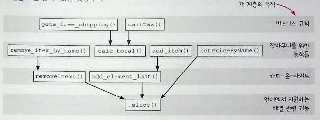

# 8장 정리

## 계층형 설계에 대해 알아보자

계층형 설계는 소프트웨어를 계층으로 구성하는 기술입니다. 각 계층에 있는 함수는 바로 아래 계층에 있는 함수를 이용해 정의합니다.



## 계층형 설계의 방법들

### 1. 직접 구현

직접구현된 함수를 읽을 때 함수 시그니처가 나타내고 있는 문제를 함수 본문에서 적절한 구체화 수준에서 해결해야합니다. 만약 너무 구체적이라면 냄새가 나는 코드입니다..

```javascript
function freeTieClip(cart) {
  var hasTie = false;
  var hasTieClip = false;
  for (var i = 0; i < cart.length; i++) {
    var item = cart[i];
    if (item.name === "tie") {
      hasTie = true;
    } //넥타이나 넥타이 클립이 있는지 확인
    if (item.name === "tie clip") {
      hasTieClip = true;
    }
  }
  if (hasTie && !hasTieClip) {
    var tieClip = make_item("tie clip", 0);
    return add_item(cart, tieClip);
  }
  return cart;
}
```

이 코드는 장바구니를 돌면서 항목을 체크하고, 무엇인가를 결정하지만 freeTieClip 함수가 알아야할 필요가 없는 구체적인 내용을 담고 있습니다. 장바구니가 배열이란 사실을 꼭 알아야할까요?

### 쇼핑카트 기능 구현 체크리스트

장바구니 설계를 하기 위해서 아래처럼 동작을 정리하고 코드를 구현했습니다.

✅ 제품 추가하기

```javascript
function add_item(cart, item) {
  return add_element_last(cart, item);
}
```

✅ 제품 삭제하기

```javascript
function remove_item_by_name(cart, name) {
  var idx = null;
  for (var i = 0; i < cart.length; i++) {
    if (cart[i].name === name) {
      idx = i;
    }
  }
  if (idx !== null) {
    return removeItems(cart, idx, 1);
  }
  return cart;
}
```

### • 장바구니에 제품이 있는지 확인하기

✅ 합계 계산하기

```javascript
function calc_total(cart) {
  var total = 0;
  for (var i = 0; i < cart.length; i++) {
    var item = cart[i];
    total += item.price;
  }
  return total;
}
```

### • 장바구니 비우기

✅ 제품 이름으로 가격 설정하기

```javascript
function setPriceByName(cart, name, price) {
  var cartCopy = cart.slice();
  for (var i = 0; i < cartCopy.length; i++) {
    if (cartCopy[i].name === name) {
      cartCopy[i] = setPrice(cartCopy[i], price);
    }
  }
  return cartCopy;
}
```

✅ 세금 계산하기

```javascript
function cartTax(cart) {
  return calc_tax(calc_total(cart));
}
```

✅ 무료 배송이 되는지 확인하기

```javascript
function gets_free_shipping(cart) {
  return calc_total(cart) >= 20;
}
```

# 9장 요약

## 2. 추상화 벽

호출 그래프에 어떤 계층은 세부 구현을 감추고 인터페이스를 제공하는데, 인터페이스를 사용하면 높은 차원으로 생각할 수 있고 고수준의 추상화 단계만 사용하면 된다!

❗️여기서 잠깐?! 프로그래밍에서 추상화란?
추상화는 복잡한 시스템에서 핵심적인 개념이나 기능만을 추출하고, 불필요한 세부사항은 숨기는 것입니다.
</br>

**본질적 특성만 노출** : 사용자가 알아야 할 중요한 부분만 보여주고, 내부 구현 세부사항은 감춥니다.</br>
**복잡성 관리**: 큰 시스템을 더 작고 이해하기 쉬운 부분들로 나누어 관리할 수 있게 합니다.</br>
**재사용성 향상**: 추상화된 컴포넌트나 함수는 다양한 상황에서 재사용할 수 있습니다.
</br>
</br>
실제 예시를 들어보면:

```typescript
interface PaymentProcessor {
  processPayment(amount: number): Promise<boolean>;
}

class CreditCardProcessor implements PaymentProcessor {
  processPayment(amount: number): Promise<boolean> {
    return this.chargeCreditCard(amount);
  }

  private chargeCreditCard(amount: number): Promise<boolean> {
    // 복잡한 신용카드 처리 로직
  }
}

class PayPalProcessor implements PaymentProcessor {
  processPayment(amount: number): Promise<boolean> {
    return this.chargePayPal(amount);
  }

  private chargePayPal(amount: number): Promise<boolean> {
    // 복잡한 PayPal 처리 로직
  }
}
```

### 추상화 벽은 언제 사용하면 좋을까요?

1. 쉽게 구현을 바꿔야할 때
2. 코드를 읽고 쓰기 쉽게 만들기 위해
3. 팀간에 조율 할 것을 줄이기 위해
4. 주어진 문제에 집중하기 위해

뭐야 .. 이거 완전.. 장점만 있잖아?

추상화 벽은 추상화 벽 아래에 있는 코드와 위에 있는 코드의 의존성을 없앰으로써 구체적인 것 기준으로 벽을 나눠 의존하지 않게 합니다. 일반적으로 추상화 벽 위에 있는 코드는 구체적인 내용을 신경쓰지 않아도 됩니다.</br>
즉, 모든 추상화는 추상화 단계의 상위에 있는 코드와 하위에 있는 코드는 서로 의존하지 않게 명시적으로 정의합니다.

### 추상화하다가 실패했던 경험 공유

문서들을 보여주는 리스트에서, 문서들의 포맷 일부분은 같고 일부분은 다릅니다. (ex 개인경비청구, 휴가신청서) 그래서 같은 훅을 써서 내려주자니, 엄청나게 조건문이 복잡해지고, 추상화를해서 props 로 내려주자니 엄청나게 props drilling 과 동시에 컴포넌트 하나가 가지고 있는 것들이 커졌습니다
(잘못된 추상화의 방법으로 적용해서 그런 것 같기도합니다.)

## 3. 작은 인터페이스
