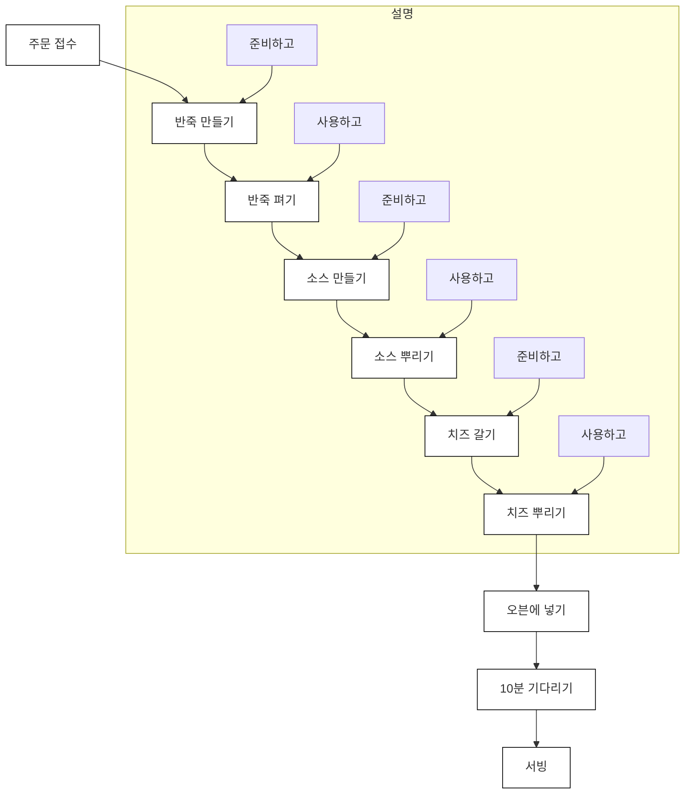
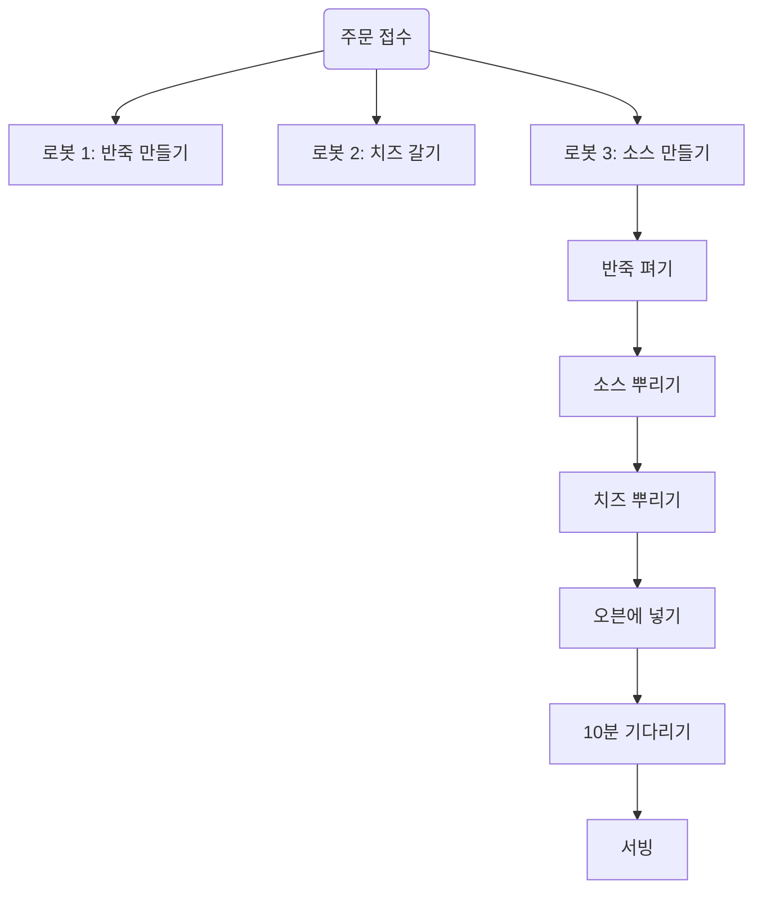
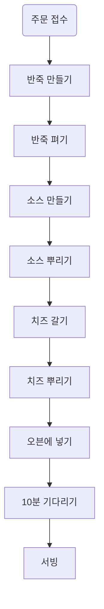
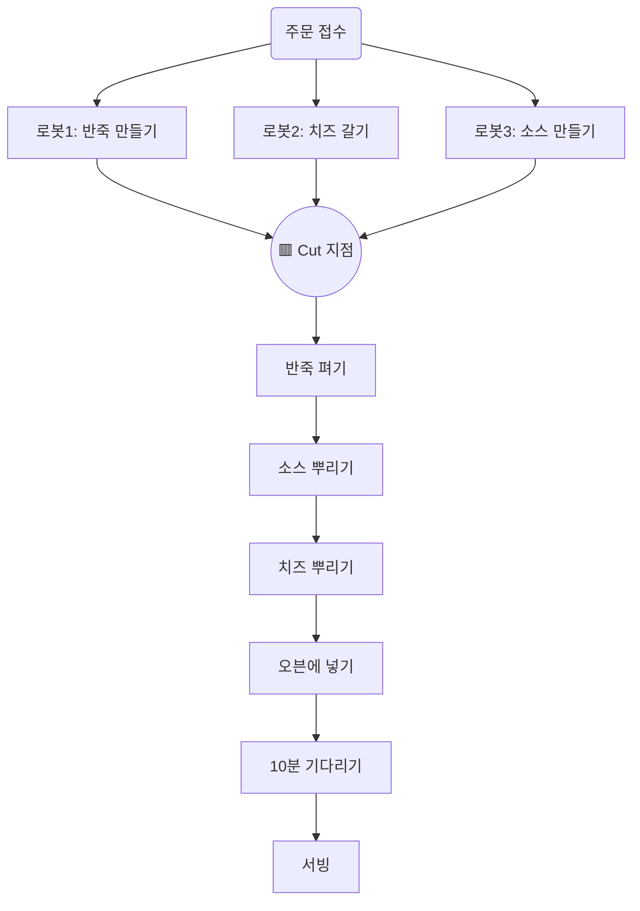

## CHAPTER 2 현실에서의 함수형 사고
이 챕터에서는 아래와 같은 것들을 배웁니다.
- 현실적인 문제에 함수형 사고 적용
- 소프트웨어 구조를 잡는 데 계층형 설계`stratified design`가 좋은 이유
- 액션을 타임라인으로 시각화
- 타임라인을 사용하면 시간에 관한 문제를 잘 풀 수 있다는 것

#### 토니 피자에 오신 것을 환영합니다
피자가게에 피자를 만드는 로봇은 자바스크립트로 프로그래밍이 되어있습니다. 
피자를 만드는데 어떻게 함수형 프로그래밍을 사용하는지 살펴봅시다.
##### 파트 1: 액션과 계산, 데이터
요리 재료와 기타 필요 자원을 사용하는 코드: 액션
나머지는 계산으로 구분
`계층형 설계 원칙`
##### 파트 2: 일급 추상
가게 주방에 많은 로봇이 함께 피자를 만드는 것: `분산 시스템`
가끔 실패하는 분산 시스템을 이해 -> `타임라인 다이어그램` 사용
여러 로봇이 협력할 수 있도록 함수를 인자로 받는 `일급 함수`를 사용: 더 빨리 피자를 만듦

#### 파트 1: 액션과 계산, 데이터
1. 액션 - 호출 횟수와 시점에 의존한느 것. 오븐이나 배달차 같은 자원과 요리 재료를 사용하는 것. 사용할 때 조심해야 함
	- 액션 예: 반죽 펴기, 피자 배달, 재료 주문
2. 계산 - 어떤 것을 결정하거나 계획하는 것. 계산은 다른 곳에 무영향. 아무 때나 사용해도 주방이 엉망진창 될 걱정 없음
	- 계산 예: 조리법에 나온 것을 두 배로 만들기, 쇼핑 목록 결정
3. 데이터 - 변경 불가능한`immutable` 데이터를 가능한 한 많이 써야함. 결제, 재고, 피자 조리법 같은 것. 데이터는 유연하기 때문에 저장하거나 네트워크로 전송하는 등 다양하게 쓸 수 있음
	- 데이터 예: 고객 주문, 영수증, 조리법

#### 변경 가능성에 따라 코드 나누기
##### `계층화 설계` 맛보기
1. 변경 가능성. 자주 바뀌는 것과 자주 바뀌지 않는 것
2. 주방 - 창고 - 메인 레이어

| 계층\레이어          | 피자 주방 레이어                       | 창고 레이어                           | 메인 레이어                                            |
| --------------- | ------------------------------- | -------------------------------- | ------------------------------------------------- |
| **자주 바뀌는 것**    | 이번 주 메뉴 • 이번 주 특별 메뉴를 위한 조리법 | 이번 주 사야 할 것 • 재료를 어디서 구입할지 결정 | **비즈니스 규칙**                                       |
| 가끔 바뀌는 것        | 피자 만들기 • 조리법 순서              | 재료 목록 • 재료 목록에 대한 동작          | **도메인 규칙**                                        |
| **자주 바뀌지 않는 것** | 자바스크립트 • 객체 • 배열          | 자바스크립트 • 객체 • 숫자           | **기술 스택**: 계층화 설계가 비즈니스, 도메인 및 기술 문제를 명확하게 분리합니다. |
각 계층은 그 아래에 있는 계층을 기반으로 만들어져서 더 안정적인 기반 위에 작성 가능합니다.
가장 위에 있는 코드는 의존성이 거의 없기 때문에 쉽게 바꿀 수 있고, 가장 아래에 있는 코드는 비교적 의존성이 많아 바꾸기 어렵지만 자주 바뀌지 않습니다.
계층형 설계는 일반적으로 비즈니스 규칙, 도메인 규칙, 기술 스택 계층으로 나눕니다.
계층형 설계로 만든 코드는 테스트, 재사용, 유지보수가 쉽습니다.

#### 파트 2: 일급 추상
##### 주방을 자동화하기
로봇 한 대가 피자를 만들기 위한 액션을 `타임라인 다이어그램`으로 나타내면 다음과 같습니다.
타임라인에 있는 모든 단계는 액션입니다. 더 효율적으로 운영하기 위해 다이어그램을 고치려고 합니다. 

#### 분산 시스템을 타임라인으로 시각화하기
피자 만드는 작업을 반죽 만들기, 소스 만들기, 치즈 갈기 작업으로 나누고 로봇 세 대가 동시에 일을 하면 더 빨리 만들 수 있다고 생각이 됩니다. 하지만 분산 시스템에서 독립된 액션의 실행 순서는 어떻게 될지 모릅니다. 
<치즈 피자 만들기 분산 시스템>

한 번에 하나씩 처리하는 원래 방법

#### 각각의 타임라인은 다른 순서로 실행됩니다.
순서를 보장할 수 없기 때문에 반죽 만들기, 치즈 갈기, 소스 만들기 중 어떤 작업이 먼저 끝날지 모릅니다.
이 세 가지 작업에 대해 순서는 6가지 경우의 수가 있고 이 중에서 소스 만들기가 가장 마지막 순서에 와야 제대로 된 피자가 완성됩니다.
이 작업들이 끝나면 피자를 만들도록 해야 합니다.

#### 어려운 경험을 통해 분산 시스템에 대해 배운 것
올바른 순서대로 동작하는 프로그램을 만들려면 액션(시간에 의존적인)에 집중할 필요가 있다는 것을 알았습니다.

1. 기본적으로 타임라인은 서로 순서를 맞추지 않습니다.
	- 반죽이 준비되지 않았은데도 다른 타임라인은 그냥 진행되었습니다. 타임라인은 서로 실행 순서를 맞춰야 합니다.
2. 액션이 실행되는 시간은 중요하지 않습니다.
	- 항상 작업 시간이 일정하지 않으므로 각각의 타임라인은 다른 타임라인의 순서와 관계없이 만들어야 합니다.
3. 드물지만 타이밍이 어긋나는 경우는 실제 일어납니다.
	- 타임라인은 항상 옳바른 결과를 보장해야 합니다.
4. 타임라인 다이어그램으로 시스템의 문제를 알 수 있습니다.
	- 다이어그램을 보고 치즈가 제시간에 준비되지 않을 수 있다는 것을 알았습니다. 시스템을 잘 이해하기 위해 타임라인 다이어그램을 계속 쓰기로 했습니다.

#### 타임라인 커팅: 로봇이 서로를 기다릴 수 있게 하기 [[CHAPTER 17]]
타임라인 커팅은 여러 타임라인이 동시에 진행될 때 서로 순서를 맞추는 방법입니다.
타임라인 커팅은 고차 동작`high-order operation`으로 구현합니다.
<타임라인 커팅을 적용한 다이어그램>

Gantt chart
병렬작업은 각각 다른 시간에 끝남. 가장 오래 걸리는 작업이 끝난 시점이 동기화(cut) 지점

```mermaid
gantt
    title 치즈 피자 만들기 - Gantt 차트
    dateFormat  HH:mm
    axisFormat  %H:%M

    section 준비 작업 (병렬)
    반죽 만들기        :a1, 09:00, 10min
    치즈 갈기          :a2, 09:00, 8min
    소스 만들기        :a3, 09:00, 6min

    section Cut 지점 (동기화)
    대기 (모든 준비 완료까지) :cut, after a1, 0min

    section 조립 및 마무리 (순차)
    반죽 펴기          :b1, after cut, 3min
    소스 뿌리기        :b2, after b1, 2min
    치즈 뿌리기        :b3, after b2, 2min
    오븐에 넣기        :b4, after b3, 1min
    10분 기다리기      :b5, after b4, 10min
    서빙               :b6, after b5, 2min

```

#### 좋은 경험을 통해 타임라인에 대해 배운 것
##### 협력하는 로봇에 대한 회고
타임라인 커팅 기술을 이용해 피자가 이전보다 더 빨리 나오고 준비도 완벽해졌습니다.
1. 타임라인 커팅으로 서로 다른 작업들을 쉽게 이해할 수 있습니다.
2. 타임라인 다이어그램을 사용하면 시간에 따라 진행하는 작업과 분산 시스템을 쉽게 이해할 수 있습니다.
3. 타임라인 다이어그램은 유연합니다.

#### 결론
함수형 개념을 대략적으로 살펴봤습니다. 
액션과 계산에 계층화 설계를 사용했습니다. (자주 바뀌는 것, 자주 바뀌지 않는 것 / 주방 레이어, 창고 레이어, 메인 레이어)
계층화 설계에 대해서는 3~9장에서 다룰 예정입니다.
15~17장에서 타임라인 다이어그램을 다루면서 병렬작업을 다룹니다.

#### 요점 정리
- 액션과 계산, 데이터를 구분하는 일은 함수형 프로그래머에게 가장 중요하고 첫 번째로 해야 하는 일입니다.
- 함수형 프로그래머는 유지보수를 잘 하기 위해 계층형 설계를 사용합니다.
- 타임라인 다이어그램은 시간에 따라 변하는 액션을 시각화하는 방법입니다.
- 액션 간 협력을 위해 타임라인 커팅이라는 기술을 살펴봤습니다.