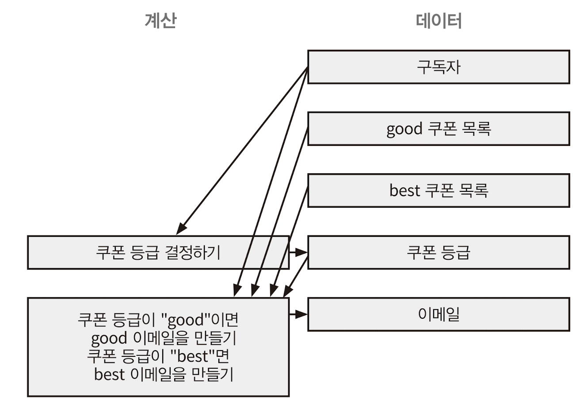

## CHAPTER 3 액션과 계산, 데이터의 차이를 알기

- 이번 장에서 살펴볼 내용
	- 액션과 계산, 데이터가 어떻게 다른지 배웁니다.
	- 문제에 대해 생각하거나 코드를 작성할  때 또는 코드를 읽을 때 액션과 계산, 데이터를 구분해서 적용해봅니다.
	- 액션이 코드 전체로 퍼질 수 있다는 것을 이해합니다.
	- 이미 있는 코드에서 어떤 부분이 액션인지 찾아봅니다.

#### 액션과 계산, 데이터

| 분류      | 설명                                                                         | 예시                                  |
| ------- | -------------------------------------------------------------------------- | ----------------------------------- |
| **액션**  | 실행 시점과 횟수에 의존함. 부수 효과(side-effects)가 있음.                                   | 이메일 보내기, 데이터베이스 읽기                  |
|         | → 부수 효과가 있는 함수(side-effecting function), 순수하지 않은 함수(impure function)라고도 함. |                                     |
| **계산**  | 입력으로 출력을 계산함. 순수 함수(pure function), 수학 함수(mathematical function)라고도 함.     | 최댓값 찾기, 이메일 주소가 올바른지 확인하기           |
| **데이터** | 이벤트에 대한 사실                                                                 | 사용자가 입력한 이메일 주소, 은행 API로 읽은 달러 수량 등 |
모든 개발 과정에서 액션과 계산, 데이터를 구분하는 기술을 적용할 수 있습니다. 각 단계별로 아래와 같이 적용해 볼 수 있습니다.
1. 문제 대해 생각할 때
2. 코딩할 때
3. 코드를 읽을 때

#### 액션과 계산, 데이터는 어디에나 적용할 수 있습니다
장보기 과정


이렇게 반복하면 액션과 계산, 데이터를 더 많이 찾을 수 있고 풍부한 모델을 만들 수 있습니다.
'냉장고 확인하기' 단계는 '냉장실 확인하기' 단계와 '냉동실 확인하기' 단계로 나눠 액션으로 만들 수 있습니다.
'목록에 있는 것 구입하기' 단계로 '장바구니 담기'와 '계산하기' 단계로 나눌 수 있습니다.
액션에 숨어 있는 다른 액션이나 계산 또는 데이터를 발견하기 위해 나눌 수 있는 만큼 나누는 것이 좋습니다.

#### 장보기 과정에서 배운 것
1. 액션과 계산, 데이터를 적용하는 연습을 할수록 더 잘할 수 있습니다.
2. 액션 안에 계산, 데이터 또는 다른 액션이 숨어 있을지도 모릅니다.
3. 계산은 더 작은 계산과 데이터로 나누고 연결할 수 있습니다.
4. 데이터는 데이터만 조합할 수 있습니다.
5. 계산은 때로 '우리 머릿속에서' 일어납니다.

앞에서 장보기 예제에 액션과 계산, 데이터를 적용해 봤습니다. 실제 코드에 적용해봅시다.
##### 데이터에 대해 자세히 알아보기
- 데이터는 이벤트에 대한 사실. 일어난 일의 결과를 기록한 것
- 자바스크립트에서 기본 데이터 타입으로 구현
- 데이터 구조로 의미를 담을 수 있음. 데이터 구조로 도메인을 표현할 수 있음
- 불변 데이터 구조를 만들기 위해 두 가지 원칙을 사용
	- 카피-온-라이트`copy-on-write`. 변경할 때 복사본을 만듭니다. [[CHAPTER 6]]
	- 방어적 복사`defensive copy`. 보관하려고 하는 데이터의 복사본을 만듭니다. [[CHAPTER 7]]
- 데이터의 예: 구입하려는 음식 목록, 이름, 전화 번호, 음식 조리법
- 장점: 직렬화, 동일성 비교, 자유로운 해석
- 단점: 해석이 반드시 필요함. 해석하지 않은 데이터는 쓸모없는 바이트.
#### 쉬는 시간
데이터, 질량 명사
- 모든 데이터가 이벤트에 대한 사실
- 사실 정보는 추론과 토론, 계산을 위한 기초 정보로 사용
- 의미 있게 처리한 입력 장치로부터 얻은 정보
---
#### 새로 만드는 코드에 함수형 사고 적용하기
##### 쿠폰독의 새로운 마케팅 전략
쿠폰독: 쿠폰에 관심이 있는 구독자에게 이메일로 쿠폰을 매주 보내주는 서비스
친구 10명을 추천하면 더 좋은 쿠폰을 보내주는 마케팅을 하려고 함
쿠폰은 'bad', 'good', 'best'와 같은 rank 정보가 있고, 10명 추천한 사용자에게 'best' 쿠폰을 전달.
'good' 쿠폰은 모든 사용자, 'bad' 쿠폰은 전달하지 않음

##### 📧 이메일 데이터베이스 테이블
rec_count > = 10 인 사용자는 'best' 쿠폰을 받을 수 있음

| email                                         | rec_count |
| --------------------------------------------- | --------- |
| [john@coldmail.com](mailto:john@coldmail.com) | 2         |
| **[sam@pmail.co](mailto:sam@pmail.co)**       | **16**    |
| [linda1989@oal.com](mailto:linda1989@oal.com) | 1         |
| [jan1940@ahoy.com](mailto:jan1940@ahoy.com)   | 0         |
| **[mrbig@pmail.co](mailto:mrbig@pmail.co)**   | **25**    |
| [lol@lol.lol](mailto:lol@lol.lol)             | 0         |

##### 🎟️ 쿠폰 데이터베이스 테이블

|coupon|rank|
|---|---|
|MAYDISCOUNT|good|
|10PERCENT|bad|
|PROMOTION45|best|
|IHEARTYOU|bad|
|GETADEAL|best|
|ILIKEDISCOUNTS|good|
#### 연습 문제 - 할 일
- 데이터베이스에서 구독자 가져오기
- 10명 이상 추천한 구독자 필터링

- 데이터베이스에서 쿠폰 데이터 가져오기
- 쿠폰 best rank만 필터링

- 필터링 된 구독자에게 필터링 된 best 쿠폰 이메일로 보내기

#### 연습 문제 - 분류
- 이메일 보내기 A
- 데이터베이스에서 구독자 가져오기 A
- 각 쿠폰의 등급 D
- 데이터베이스에서 쿠폰 읽기 A
- 이메일 제목 C -> D   
- 이메일 주소 D 
- 추천 수 D   
- 어떤 이메일이 쿠폰을 받을지 결정하기 C   
- 구독자 DB 레코드 D   
- 쿠폰 DB 레코드 D   
- 쿠폰 목록 DB 레코드 D    
- 구독자 목록 DB 레코드 D    
- 이메일 본문 C -> D

#### 쿠폰 보내는 과정을 그려보기

1. 데이터베이스에서 구독자를 가져오는 것부터 시작해 봅시다.
	- 데이터베이스에서 구독자를 가져오는 것은 실행 시점에 의존하는 액션입니다. 가져온 사용자 목록은 데이터입니다.
2. 데이터베이스에서 쿠폰 목록 가져오기
	- 쿠폰 목록을 가져오는 것도 액션입니다.
3. 보내야 할 이메일 목록 만들기
	- 구독자 목록과 쿠폰 목록을 토대로 이메일 목록 계획합니다.
4. 이메일 전송하기
	- 목록을 순회하면서 보내면 됩니다.


이제 이메일 목록을 만드는 부분을 자세히 살펴봅시다.

##### 이메일 만드는 부분을 자세히 살펴보기
이메일을 보낼 때 계산을 만드는 이유는 테스트하기 쉽기 때문입니다.
구독자 목록과 쿠폰 목록을 입력으로 받아 이메일 목록을 출력하는 것이 "이메일 목록 계획하기" 계산이 하는 일입니다.
더 작은 계산으로 나누면 쿠폰 목록을 good, bad 목록으로 나눌 수 있고
구독자 중 good, bad 쿠폰을 받을지 결정하는 것을 계산으로 만들 수 있습니다.

각 단계를 모아 어떤 구독자가 어떤 이메일을 받을지 결정하는 계산을 그려봅시다.


충분히 구현하기 쉽다고 생각되는 시점에서 더 나누는 것을 멈추고 넘어가 보겠습니다.

#### 쿠폰 보내는 과정 구현하기
쿠폰 등급을 결정하는 계산과 구독자 데이터, 쿠폰 등급 데이터가 있습니다.

##### 데이터베이스에서 가져온 구독자 데이터
데이터베이스 행을 표한할 때 객체를 사용합니다.
```js
var subscriber = {
	email: "sam@pmail.com",
	rec_count: 16
}
```
##### 쿠폰 등급은 문자열입니다
```js
var rank1 = "best";
var rank2 = "good";
```
##### 쿠폰 등급을 결정하는 것은 함수입니다.
```js
function subCouponRank(subscriber) {
	if(subscriber.rec_count >= 10)
		return "best";
	else
		return "good";
}
```
이 함수는 명확하고 테스트하기 쉬우며 재사용할 수 있습니다.

이제 전체 쿠폰 목록에서 주어진 등급의 쿠폰 목록만 선택하는 부분을 구현해 봅시다.
##### 데이터베이스에서 가져온 쿠폰 데이터
```js
var coupon = {
	code: "10PERCENT",
	rank: "bad"
};
```
테이블은 같은 모양의 자바스크립트 객체를 담고 있는 배열로 볼 수 있습니다.

##### 특정 등급의 쿠폰 목록을 선택하는 계산은 함수입니다
```js
function selectCouponsByRank(coupons, rank) {
	var ret = [];
	for(var c = 0; c < coupons.length; c++) {
		var coupon = coupons[c];
		if(coupon.rank === rank)
			ret.push(coupon.code);
	}
	return ret;
}
```
이 함수는 입력값이 같을 때 출력 값도 같습니다. 호출 횟수가 외부에 영향을 주지않습니다.

이제 구독자로 이메일을 만드는 부분을 구현해 봅시다.

##### 이메일은 그냥 데이터입니다
```js
var message = {
	from: "newsletter@coupondog.co",
	to: "sam@pmail.com",
	subject: "Your weekly coupons inside",
	body: "Here are your coupons ..."
}
```
##### 구독자가 받을 이메일을 계획하는 계산
구독자, 쿠폰 목록(good, bad)을 입력으로 받습니다. 
```js
function emailForSubscriber(subscriber, goods, bests) {
	var rank = subCouponRank(subscriber);
	if(rank === "best") {
		return {
			from: "newsletter@coupondog.co",
			to: subscriber.email,
			subject: "Your weekly coupons inside",
			body: "Here are your coupons: " + bests.join(", ")
		}
	}else{
		return {
			from: "newsletter@coupondog.co",
			to: subscriber.email,
			subject: "Your weekly coupons inside",
			body: "Here are your coupons: " + goods.join(", ")
		}
	}
}
```

이제 필요한 코드가 모두 준비되었기 때문에 모든 코드를 합쳐 이메일을 보내는 코드를 구현해 봅시다.

##### 보낼 이메일 목록을 준비하기
이제 필요한 것은 구독자 목록으로 전체 이메일 목록을 만드는 것입니다.
```js
function emailsForSubscribers(subscribers, goods, bests) {
	var emails = [];
	for(var s = 0; s < subscribers.length; s++) {
		var subscriber = subscribers[s];
		var email = emailForSubscriber(subscriber, goods, bests);
		email.push(email);
	}
	return emails;
}
```

##### 이메일 보내기는 액션입니다.
일반적으로 액션도 계산처럼 함수로 구현합니다.
```js
function sendIssue() {
	var coupons = fetchCouponsFromDB();
	var goodCoupons = selectCouponsByRank(coupons, "good")
	var bestCoupons = selectCouponseByRank(couponse, "best")
	var subscribers = fetchSubscribers(subscribers, goodCoupons, bestCoupons)
	for(var e = 0; e < emails.length;; e++) {
		var email = emails[e];
		emailSystem.send(email);
	}
}
```

데이터는 사용하는 데 제약이 많고 액션은 가장 제약이 없습니다. 
이와 같이 데이터를 먼저 구현하고 계산을 구현한 후 마지막으로 액션을 구현하는 것이 함수형 프로그래밍의 일반적인 구현 순서입니다.

사용자 증가 확장성에 대해 미리 고려한다면 페이지네이션을 사용할 수 있습니다.
```js
function sendIssue() {
	var coupons = fetchCouponsFromDB();
	var goodCoupons = selectCouponsByRank(coupons, "good")
	var bestCoupons = selectCouponseByRank(couponse, "best")
	var page = 0; // <-- 추가
	// var subscribers = fetchSubscribers(subscribers, goodCoupons, bestCoupons)
	var subscribers = fetchSubscribersFromDB(page); // <-- 변경
	// for(var e = 0; e < emails.length;; e++) {
	// 	 var email = emails[e];
	// 	 emailSystem.send(email);
	// }
	while(subscribers.length > 0) { // <-- 변경
		var emails = emailsForSubscribers(subscribers, goodCoupons, bestCoupons)
		for(var e = 0; e < emails.length;; e++) {
		 	var email = emails[e];
		 	emailSystem.send(email);
		}
		page++;
		subscribers = fetchSubscribersFromDB(page);
	}
}
```

#### 계산에 대해 자세히 알아보기
계산은 입력값으로 출력값을 만드는 것
시점과 횟수에 관계없이 일정한 동작
계산에는 연산을 담을 수 있음
액션보다 좋은 점은 테스트하기 쉽고, 분석이 쉽고, 조합하기 쉽다
계산을 쓰면 동시에 실행되는 것과 시점과 횟수에 대해 걱정하지 않아도 됨
단점은 실행하기 전에 어떤 일이 발생할지 알 수 없다는 점
계산은 순수함수 또는 수학함수라 부를 수 있음

##### 이미 있는 코드에 함수형 사고 적용하기
함수 내에서 함수를 호출하는 것을 반복하다가 마지막에 액션을 호출하면 모든 함수가 액션이 되어 버립니다.
##### 액션은 코드 전체로 퍼집니다
액션을 쓰는 순간 코드 전체로 퍼져나가기 때문에 사용할 때 조심해야 합니다

#### 액션은 다양한 형태로 나타납니다
함수 호출, 메서드 호출, 생성자, 표현식, 상태

##### 액션에 대해 자세히 알아보기
액션은 외부 세계에 영향을 주거나 받는 것
액션은 함수로 구현
액션으로 외부 세상에 어떤 일을 하려는지 아는 것이 중요
순수하지 않은 함수, 부수 효과 함수, 부수 효과가 있는 함수라고 부릅니다.
액션은 다루기 힘들지만 소프트웨어를 실행하려는 가장 중요한 이유입니다.
액션을 잘 쓰기 위해서 가능한 적게 사용하고 작게 만들고 외부 세계와 상호작용하는 것을 제한하고 호출 시점에 의존하는 것으로 제한할 수 있습니다

### 결론
액션과 계산, 데이터를 여러 가지 상황에 적용해 봤습니다.

### 요점 정리
- 액션과 계산, 데이터를 구분하는 기술을 배웠습니다.
- 액션은 실행 시점이나 횟수에 의존하고 외부 세상에 영향을 주거나 받습니다.
- 계산은 입력값으로 출력값을 만드는 것입니다. 외부 세상에 영향을 주지 않고 실행 시점이나 횟수에 의존하지 않습니다.
- 데이터는 이벤트에 대한 사실입니다. 영구적으로 기록할 수 있습니다.
- 함수형 프로그래머는 액션보다 계산을 좋아하고 계산보다 데이터를 좋아합니다.
- 계산은 같은 입력값을 주면 항상 같은 출력값이 나오기 때문에 액션보다 테스트하기 쉽습니다.

### 다음 장에서 배울 내용
다음 장에서 계산의 장점을 최대한 활용하기 위해 가능한 액션을 계산으로 바꾸는 것에 대해 살펴봅시다.