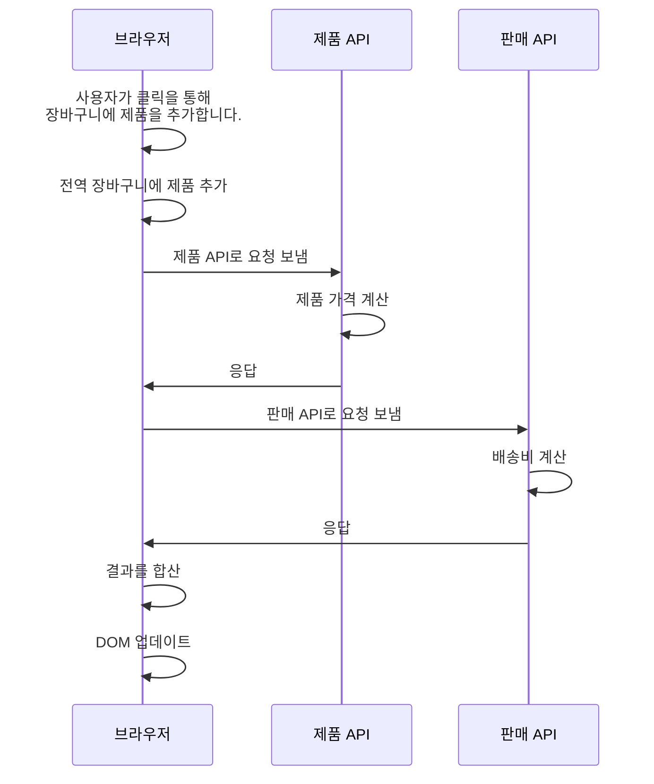
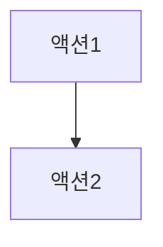
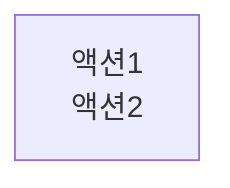

## CHAPTER 15 타임라인 격리하기

- 코드를 타임라인 다이어그램을 그리는 방법
- 버그를 찾기 위해 타임라인 다이어그램 보는 법
- 타임라인끼리 공유하는 자원을 줄여 코드 설계를 개선하는 방법

액션의 순서를 나타내기 위해 타임라인 다이어그램에 대해 알아보겠습니다.

### 버그가 있습니다!
천천히 클릭하면 문제가 없지만 빠르게 클릭하면 문제가 생깁니다.
6달러 2개 + 배송비2달러 = 14달러
### 두 번 빠르게 클릭해 봅시다
6달러 2개 + 배송비2달러 = 16달러 또는 22달러?

#### 코드를 보면서 버그를 이해해 봅시다.
장바구니에 제품을 추가하는 버튼에 대한 코드입니다. `add_item_to_cart()`는 버튼을 클릭할 때 실행되는 핸들러 함수입니다.
```js
function add_item_to_cart(name, price, quantity) {
	cart = add_item(cart, name, price, quantity) // 장바구니 전역변수를 읽고 씁니다.
	calc_cart_total()
}

function calc_cart_total() {
	total = 0
	cost_ajax(cart, function(cost) { // 제품 API로 AJAX 요청을 보냅니다.
		total += cost
		shipping_ajax(cart, function(shipping) { // 판매 API로 AJAX 요청을 보냅니다.
			total += shipping
			update_total_dom(total) // 합계를 DOM에 보여줍니다.
		}) 
	})
}
```
서로 다른 API 두개와 차례로 통신하는 것을 볼 수 있습니다.


고객에 기다리지 않고 다음 제품을 추가할 때 어떻게 되는지 볼 수 있는 방법이 필요합니다.

### 타임라인 다이어그램은 시간에 따라 어떤 일이 일어나는지 보여줍니다


### 두 가지 타임라인 다이어그램 기본 규칙
순서대로 실행되는 액션과 동시에 나란히 실행되는 액션
이것과 관련된 기본 규칙 두 가지를 살펴봅시다.
#### 1. 두 액션이 순서대로 나타나면 같은 타임라인에 넣습니다.

#### 2. 두 액션이 동시에 실행되거나 순서를 예상할 수 없다면 분리된 타임라인에 넣습니다.

##### 요약
1. 액션은 순서대로 실행되거나 동시에 실행됩니다.
2. 순서대로 실행되는 액션은 같은 타임라인에서 하나가 끝나면 다른 하나가 실행됩니다.
3. 동시에 실행되는 액션은 여러 타임라인에서 나란히 실행됩니다.

### 자세히 보면 놓칠 수 있는 액션 순서에 관한 두 가지 사실
#### 1. ++와 +=는 사실 세 단계입니다.

```js
total++;
 
var temp = total // 읽기(액션)
temp = temp + 1 // 더하기(계산)
total = temp // 쓰기(액션)
```

모두 세 단계이지만 계산 단계를 빼고 다이어그램에 표시합니다. (total 읽기 -> total 쓰기)

#### 2. 인자는 함수를 부르기 전에 실행합니다.
```js
console.log(total)

var temp = total
console.log(temp)
```
total 읽기 -> console.log()

### add-to-cart 타임라인 그리기: 단계 1
타임라인 다이어그램 그릴 때 순서대로 실행되는 것과 동시에 실행되는 액션이 있다는 사실을 알았습니다.
add-to-cart 타임라인 다이어그램은 모두 세 단계로 그릴 수 있습니다.
1. 액션을 확인합니다.
2. 순서대로 실행되거나 동시에 실행되는 액션을 그립니다.
3. 플랫폼에 특화된 지식을 사용해 다이어그램을 단순하게 만듭니다.

#### 1. 액션을 확인합니다.
계산은 다이어그램을 그릴 때 신경 쓰지 않아도 됩니다.
비동기 콜백 두 개가 있다는 것도 주의해야 합니다.

### 비동기 호출은 새로운 타임라인으로 그립니다

### 서로 다른 언어, 서로 다른 스레드 모델
#### 단일 스레드, 동기
PHP
#### 단일 스레드, 비동기
자바스크립트
#### 멀티스레드
자바, 파이썬, 루비, C, C#
#### 메시지 패싱 프로세스
엘릭서, 얼랭

### 한 단계씩 타임라인 만들기

### add-to-cart 타임라인 그리기: 단계 2
#### 2. 순서대로 실행되거나 동시에 실행되는 액션을 그립니다.
모든 액션을 확인 했기 때문에 이제 차례로 다이어그램을 그려봅시다.
ajax 콜백 두 개는 새로운 타임라인으로 그려야 합니다.


### 타임라인 다이어그램으로 순서대로 실행되는 코드에도 두 가지 종류가 있다는 것을 알 수 있습니다

##### 순서가 섞일 수 있는 코드

##### 순서가 섞이지 않는 코드


여기에는 없지만 만약 다른 타임라인에 액셔3이 있다면 액션1과 액션2 사이에 끼어들 수 있습니다. 오른쪽 타임라인에는 그런 일이 일어나지 않습니다.

### 타임라인 다이어그램으로 동시에 실행되는 코드는 순서를 예측할 수 없다는 것을 알 수 있습니다
동시에 실행되는 코드는 순서를 확신할 수 없습니다.
여러 개의 타임라인은 시간에 따라 다양한 방식으로 실행될 수 있습니다.

### 좋은 타임라인의 원칙

#### 1. 타임라인은 적을수록 이해하기 쉽습니다.

#### 2. 타임라인은 짧을스록 이해하기 쉽습니다.
#### 3. 공유하는 자원이 적을수록 이해하기 쉽습니다.

#### 4. 자원을 공유한다면 서로 조율해야 합니다.
#### 5. 시간을 일급으로 다룹니다.

### 지바스크립트의 단일 스레드
자바스크립트의 스레드 모델은 타임라인이 자원을 공유하면서 생기는 문제를 줄여줍니다.
하지만 비동기 콜백을 함께 사용한다면 문제가 생길 수 있습니다.
### 자바스크립트의 비동기 큐

### AJAX와 이벤트 큐
### 완전한 비동기 예제

### 타임라인 단순화하기


자바스크립트에서 단순화하는 단계는 두 단계로 정리할 수 있습니다.
1. 하나의 타임라인에 있는 모든 액션을 하나로 통합합니다.
2. 타임라인이 끝나는 곳에서 새로운 타임라인이 하나 생긴다면 통합합니다.


타임라인이 끝나는 곳에서 새로운 타임라인이 두 개가 생기기 때문에 통합하지 않습니다.

### 완성된 타임라인 읽기
두 종류의 순서가 있습니다. 확실하거나 불확실한 순서입니다. 
왼쪽에 있는 타임라인의 모든 액션은 같은 타임라인에서 실행되므로 액션이 순서대로 실행된다는 것을 알고 있습니다.
그리고 점선이 있기 때문에 다른 타임라인이 실행되기 전에 끝난다는 것도 알 수 있습니다.

서로 다른 타임라인에 있는 두 개의 콜백은 여러 가지 순서로 실행될 수 있습니다.
자바스크립트 스레드는 하나에서 실행되기 때문에 동시에 실행되는 일은 없습니다.

### add-to-cart 타임라인 단순화하기: 단계 3


### 리뷰: 타임라인 그리그(단계 1~3)
#### 다이어그램을 그리기 위한 세 단계
1. 액션 확인
2. 각 액션 그리기
3. 단순화
#### 타임라인을 쉽게 만드는 네가지 원칙
1. 적은 타임라인
2. 짧은 타임라인
3. 적은 공유 자원
4. 자원을 공유한다면 조율하기
#### 자바스크립트에서 단순화하기 위한 두 단계
1. 액션을 통합합니다.
2. 타임라인을 통합합니다.

### 요약: 타임라인 다이어그램 그리기
1. 액션 확인
2. 각 액션 그리기
3. 단순화
4. 타임라인 읽기

### 타임라인을 나란히 보면 문제가 보입니다


문제가 없어 보이지만 사실 이 다이어그램은 많은 문제를 보여주고 있습니다.

### 두 번 천천히 클릭하면 문제가 없습니다

### 빠르게 두 번 클리갛면 잘못된 결과가 나옵니다

각 단계가 섞이는 것을 막을 수 없습니다.

### 자원을 공유하는 타임라인은 문제가 생길 수 있습니다
#### 공유하는 자원을 없애 문제를 해결할 수 있습니다
실행 순서가 섞인 상태에서도 각 타임라인이 전역변수에 접근합니다.

### 전역변수를 지역변수로 바꾸기
#### 전역변수 total은 공유할 필요가 없습니다.

#### 1. 지역변수로 바꿀 수 있는 전역변수를 찾습니다.
```js
function calc_cart_total() {
	total = 0 // 전역변수
	cost_ajax(cart, function(cost) { 
		total += cost // total 값이 0이 아닐 수도 있습니다. 콜백이 호출되기 전에 다른 타임라인에서 값을 바꿀 수 있습니다.
		shipping_ajax(cart, function(shipping) { 
			total += shipping
			update_total_dom(total) 
		}) 
	})
}
```
#### 2. 전역변수를 지역변수로 바꿉니다.
```js
function calc_cart_total() {
	var total = 0 // <-- 지역변수로 변경
	cost_ajax(cart, function(cost) { 
		total += cost // total 값이 0이 아닐 수도 있습니다. 콜백이 호출되기 전에 다른 타임라인에서 값을 바꿀 수 있습니다.
		shipping_ajax(cart, function(shipping) { 
			total += shipping
			update_total_dom(total) 
		}) 
	})
}
```
더 이상 액션이 아닌 것은 타임라인에 표시하지 않습니다. 다이어그램에서 total 읽기와 total 쓰기를 삭제합니다.
이제 cart 전역변수를 없애 봅시다.

### 전역변수를 인자로 바꾸기
#### 1. 암묵적 인자 확인하기
```js
function add_item_to_cart(name, price, quantity) {
	cart = add_item(cart, name, price, quantity) // cart 암묵적 인자
	calc_cart_total()
}

function calc_cart_total() {
	var total = 0 
	cost_ajax(cart, function(cost) { // cart 
		total += cost 
		shipping_ajax(cart, function(shipping) { // cart 이 둘 사이에 cart 값이 바뀌면 다른 cart 값이 됩니다.
			total += shipping
			update_total_dom(total) 
		}) 
	})
}
```
#### 2. 암묵적 입력을 인자로 바꾸기
```js
function add_item_to_cart(name, price, quantity) {
	cart = add_item(cart, name, price, quantity) 
	calc_cart_total(cart)
}

function calc_cart_total(cart) { // 인자로 추가
	var total = 0 
	cost_ajax(cart, function(cost) { // cart 지역변수
		total += cost 
		shipping_ajax(cart, function(shipping) { // cart 지역변수
			total += shipping
			update_total_dom(total) 
		}) 
	})
}
```
다이어그램에 cart 읽기를 제거합니다.

아직 DOM자원을 공유하고 있습니다.


### 재사용하기 더 좋은 코드로 만들기
`calc_cart_total()`에서 total 값을 다른 계산에도 사용할 수 있도록 숫자로 리턴받아야 합니다.
값을 리턴할 수 없기 때문에 콜백 함수로 전달해야 합니다.

```js
function calc_cart_total(cart, callback) { 
	var total = 0 
	cost_ajax(cart, function(cost) { 
		total += cost 
		shipping_ajax(cart, function(shipping) { 
			total += shipping
			callback(total) 
		}) 
	})
}

function add_item_to_cart(name, price, quantity) {
	cart = add_item(cart, name, price, quantity) 
	calc_cart_total(cart, update_total_dom)
}
```

### 💡원칙: 비동기 호출에서 명시적인 출력을 위해 리턴값 대신 콜백을 사용할 수 있습니다
동기화된 함수와 같이 일반적인 방법으로 결과를 받을 수 없습니다.
> async await 을 이용하면 되지 않을까?

비동기 호출에서 결과를 받을 수 있는 방법은 콜백을 사용하는 것입니다.

함수형 프로그래밍에서 이 기술은 비동기 함수에서 액션을 빼낼 때 사용할 수 있습니다. 동기화된 함수에서 액션을 빼낼 때 액션을 호출하는 대신 액션에 넘기는 인잣값을 리턴했습니다. 그리고 호출하는 곳에서 리턴값을 받아 액션을 호출했습니다. 비동기 함수에서는 리턴값 대신 콜백을 사용합니다.

### 결론
타임라인 다이어그램을 그리고 다이어그램으로 버그를 찾는 방법을 배웠습니다. 
자바스크립트 스레드 모델 지식을 사용해 타임라인을 단순화 했습니다.
버그를 없애기 위해 공유하는 자원을 줄이는 원칙을 적용해 봤습니다.

### 요점 정리
- 타임라인은 동시에 실행될 수 있는 순차적 액션을 말합니다.
- 현태 소프트웨어는 어러 타임라인에서 실행됩니다.
- 서로 다른 타임라인에 있는 액션을 끼어들 수 있어서 순서가 섞일 수 있습니다.
- 타임라인 다이어그램은 코드가 순서대로 실행되는지 동시에 실행되는지를 알려줍니다.
- 언어에서 지원하는 스레드 모델을 이해하는 것은 중요합니다.
- 자원을 공유하는 부분을 버그가 발생하기 쉽습니다.
- 자원을 공유하지 않는 타임라인은 독립적으로 이해하고 실행할 수 있습니다.
