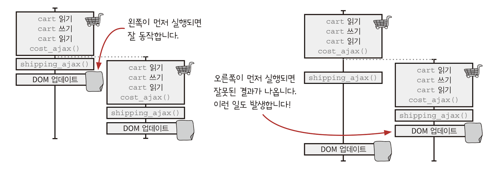
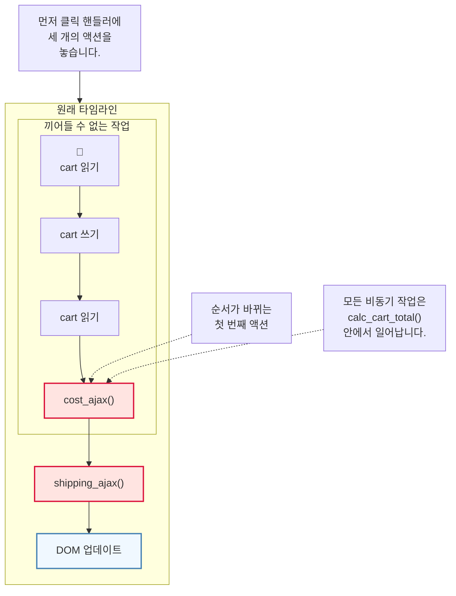
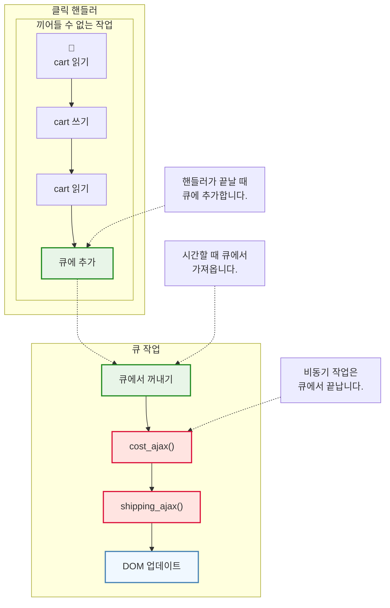
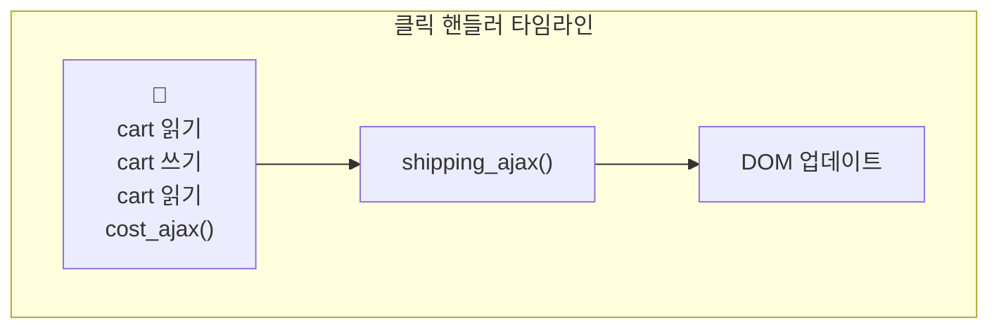
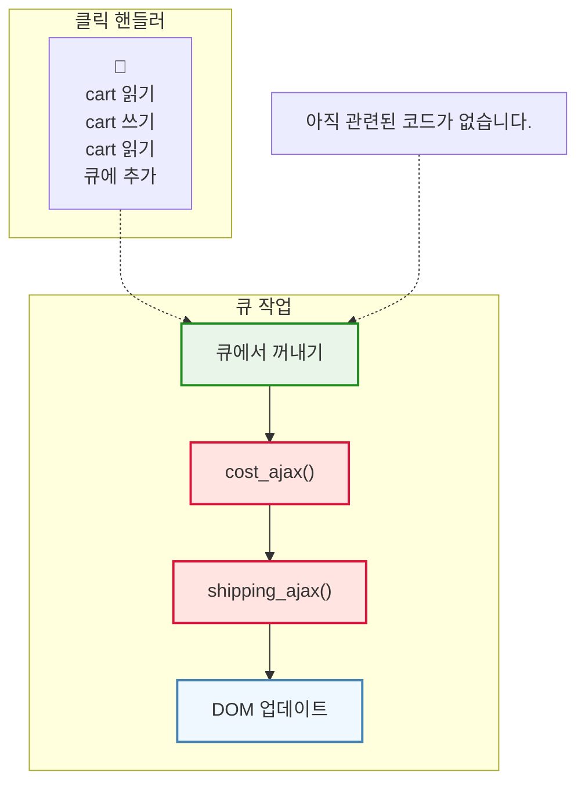
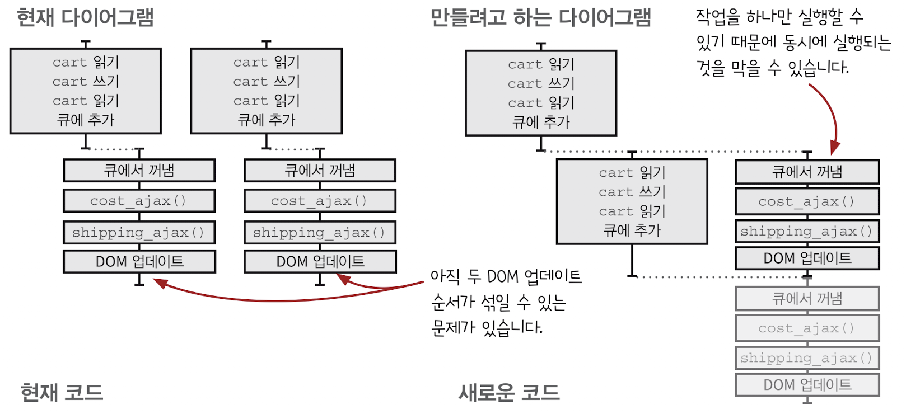
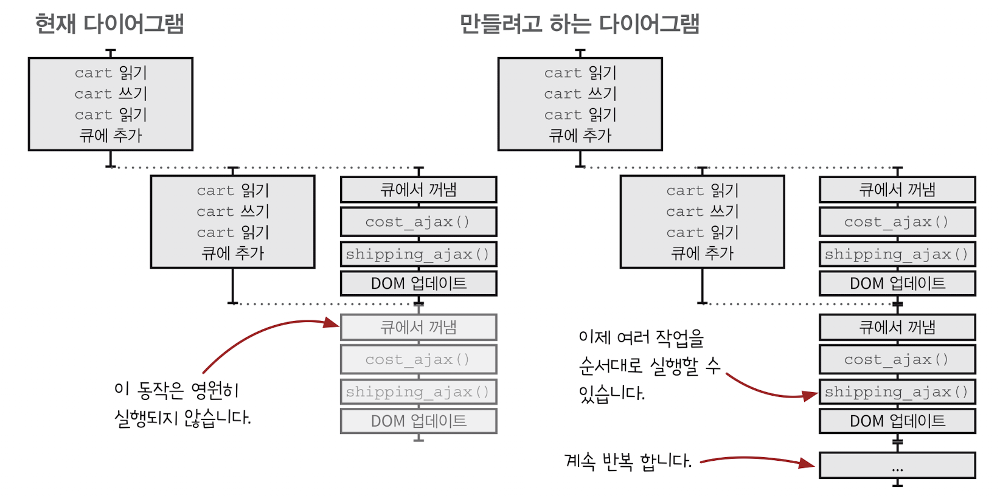
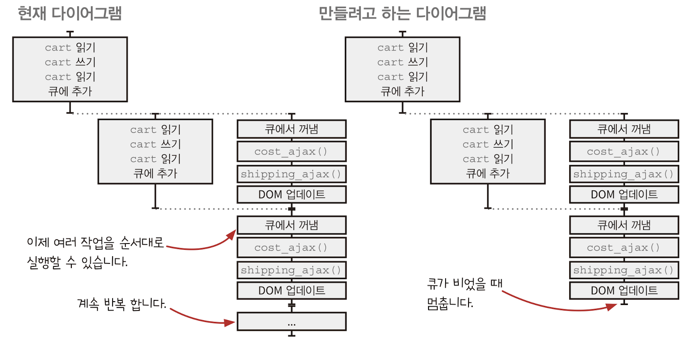
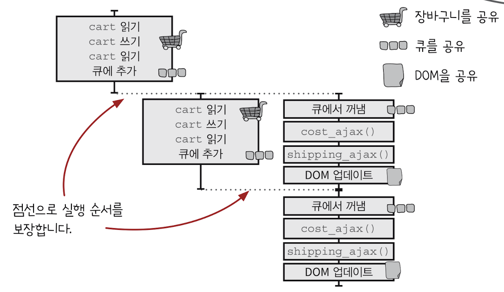
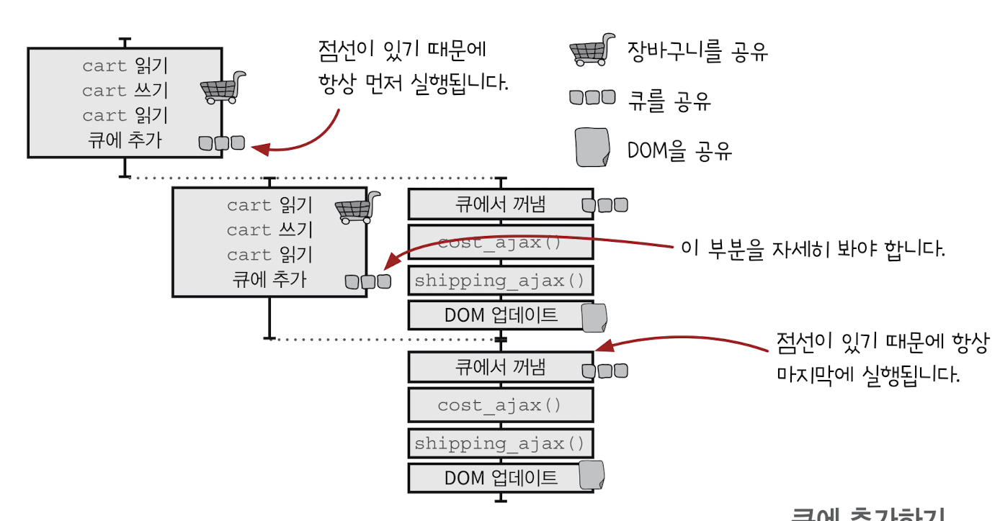

## CHAPTER 16 타임라인 사이에 자원 공유하기
- 자원을 공유해서 생기는 버그를 찾는 방법을 공유합니다.
- 안전하게 자원을 공유할 수 있는 자원 공유 기본형을 만드는 방법을 이해합니다.
>동시성 기본형 concurrency primitive
>==여러 스레드가 동시에 실행될 때 공유 자원에 안전하게 접근하고 조작할 수 있도록 하는 기본적인 도구==들을 의미합니다. 이러한 기본형들은 데이터 경쟁 (data race)을 방지하고, 동기화 문제를 해결하여 병렬 프로그래밍을 가능하게 합니다.

### 좋은 타임라인의 원칙

#### 1. 타임라인은 적을수록 이해하기 쉽습니다.
타임라인 수를 줄이면 시스템을 이해하기 더 쉽습니다.
#### 2. 타임라인은 짧을스록 이해하기 쉽습니다.
타임라인 단계를 줄이면 실행 가능한 순서를 많이 줄일 수 있습니다.
#### 3. 공유하는 자원이 적을수록 이해하기 쉽습니다.
자원을 공유하는 단계를 줄이면 가능한 순서를 줄일 수 있습니다.
#### 4. 자원을 공유한다면 서로 조율해야 합니다.
공유 자원을 안전하게 공유할 수 있어야 합니다. 올바른 순서대로 자원을 쓰고 돌려준다는 말입니다. 그리고 타임 라인을 조율한다는 것은 실행 가능한 순서를 줄인다는 것을 의미합니다. 현실에서 사용하는 방법에서 착안해 재사용 가능한 조율 방법을 만들 수 있습니다.
#### 5. 시간을 일급으로 다룹니다.
타임라인을 관리하는 재사용 가능한 객체를 만들면 타이밍 문제를 쉽게 처리할 수 있습니다.

그럼 버그가 있는 장바구니 코드에 네 번째 원칙을 적용해 봅시다.

### 장바구니에 아직 버그가 있습니다.
버그는 DOM 자원을 공유하기 때문에 생깁니다. 두 액션이 자원을 공유하지 않는다면 실행 순서를 신경 쓰지 않아도 됩니다.

1. "DOM 업데이트 1"(왼쪽 타임라인)과 "DOM업데이트 2"(오른쪽 타임라인)가 동시에 실행되는 것은 불가능합니다. 자바스크립트는 싱글 스레드 모델입니다.
2. "DOM 업데이트 1"이 먼저 실행되는 것은 기대한 결과입니다.
3. "DOM 업데이트 2"가 먼저 실행되는 것은 기대하지 않은 결과로 잘못된 결과입니다. 두 번째 합계를 첫 번째 합계가 덮어쓰면 안됩니다.

같은 순서로 장바구니에 추가했지만 다른 결과가 나옵니다. 두 타임라인을 보면 왜 그런지 알 수 있습니다.




### DOM이 업데이트되는 순서를 보장해야 합니다.
오른쪽이 먼저 실행되는 것을 막아야 합니다.
현실에서 어떤 일이 순서대로 진행되게 하는 방법의 하나는 줄을 서는 것입니다.

큐`queue`는 들어온 순서대로 나오는 데이터 구조입니다. 큐는 여러 타임라인에 있는 액션 순서를 조율하기 위해 많이 사용합니다.
큐는 공유 자원이지만 안전하게 공유됩니다. 큐에 있는 모든 작업은 같은 타임라인에서 처리되기 때문에 순서가 관리됩니다.

### 자바스크립트에서 큐 만들기
#### 자바스크립트에는 큐 자료 구조가 없기 때문에 만들어야 합니다.
큐를 타임라인 조율에 사용한다면 동시성 기본형`concurrency primitive`이라고 부릅니다. 동시성 기본형은 자원을 안전하게 공유할 수 있는 재사용 가능한 코드를 말합니다.
만들기 전에 큐에서 처리할 일과 클릭 핸들러에서 처리할 일을 나눠 봅시다.
##### 원래 타임라인



```js
function add_item_to_cart(name, price, quantity) {
	cart = add_item(cart, name, price, quantity) 
	calc_cart_total(cart)
}

function calc_cart_total(cart) { 
	var total = 0 
	cost_ajax(cart, function(cost) { // 순서가 바뀌는 첫 번째 액션
		total += cost 
		shipping_ajax(cart, function(shipping) { // 비동기
			total += shipping
			update_total_dom(total) 
		}) 
	})
}
```
##### 클릭 핸들러 및 큐 작업

가능한 많은 작업을 클릭 핸들러에서 하는 것이 좋습니다. 클릭 핸들러에는 다른 작업이 끼어들 수 없어서 순서가 섞일 염려가 없습니다. `cost_ajax()`는 비동기 호출이기 때문에 다음에 순서가 끼어들 수 있는 첫 번째 액션입니다. 가능하다면 `cost_ajax()` 전에 작업하는 것이 좋습니다.

#### 큐에서 처리할 작업을 큐에 넣기
큐에서 처리할 작업을 다른 타임라인으로 옮겨야 합니다. 하지만 먼저 큐에서 처리할 작업을 큐에 넣는 액션 하나로 바꾸는 작업을 해봅시다.
##### 현재 다이어그램

##### 현재 코드
```js
function add_item_to_cart(name, price, quantity) {
	cart = add_item(cart, name, price, quantity) 
	calc_cart_total(cart, update_total_dom)
}

function calc_cart_total(cart, callback) { 
	var total = 0 
	cost_ajax(cart, function(cost) { 
		total += cost 
		shipping_ajax(cart, function(shipping) { 
			total += shipping
			callback(total) 
		}) 
	})
}
```
##### 만들려고 하는 다이어그램

##### 새로운 코드
```js
function add_item_to_cart(name, price, quantity) {
	cart = add_item(cart, item) 
	update_total_queue(cart)
}

function calc_cart_total(cart, callback) { 
	var total = 0 
	cost_ajax(cart, function(cost) { 
		total += cost 
		shipping_ajax(cart, function(shipping) { 
			total += shipping
			callback(total) 
		}) 
	})
}

var queue_items = []

function update_total_queue(cart) { // 아직 완성되지 안항ㅆ지만 update_total_queue()는 큐에 추가하는 일 외에 다른 일을 할 것입니다.
	queue_items.push(cart)
}
```
지금까지 큐는 단순히 배열입니다. 큐에 항목을 추가하는 것은 배열 끝에 항목을 추가하는 간단한 코드입니다.

#### 큐에 있는 첫 번째 항목을 실행합니다.
이제 큐 끝에 항목을 넣었기 때문에 작업을 실행할 수 있습니다. 작업을 실행하려면 큐 가장 앞에 있는 항목을 꺼내 작업을 시작하면 됩니다.

##### 만들려고 하는 다이어그램


##### 현재 코드
```js
function add_item_to_cart(name, price, quantity) {
	cart = add_item(cart, item) 
	update_total_queue(cart)
}

function calc_cart_total(cart, callback) { 
	var total = 0 
	cost_ajax(cart, function(cost) { 
		total += cost 
		shipping_ajax(cart, function(shipping) { 
			total += shipping
			callback(total) 
		}) 
	})
}

var queue_items = []

function update_total_queue(cart) { 
	queue_items.push(cart)
}
```

##### 새로운 코드
```js
function add_item_to_cart(name, price, quantity) {
	cart = add_item(cart, item) 
	update_total_queue(cart)
}

function calc_cart_total(cart, callback) { 
	var total = 0 
	cost_ajax(cart, function(cost) { 
		total += cost 
		shipping_ajax(cart, function(shipping) { 
			total += shipping
			callback(total) 
		}) 
	})
}

var queue_items = []

function runNext() { // 배열에 첫 번째 항목을 꺼내 cart에 넣습니다.
	var cart = queue_items.shift()
	calc_cart_total(cart, update_total_dom)
}

function update_total_queue(cart) { 
	queue_items.push(cart)
	setTimeout(runNext, 0) // 자바스크립트 이벤트 루프에 작업을 추가(큐에 항목을 추가)하고, 워커를 시작합니다.
}
```
항목을 순서대로 처리해야 하지만 지금은 동시에 두 항목이 처리되는 것을 막는 코드가 없습니다.

#### 두 번째 타임라인이 첫 번째 타임라인과 동시에 실행되는 것을 막기
이미 실행되는 작업이 있는지 확인해서 두 타임라인이 섞이지 않도록 만들어 봅시다.




##### 현재 코드
```js
function add_item_to_cart(name, price, quantity) {
	cart = add_item(cart, item) 
	update_total_queue(cart)
}

function calc_cart_total(cart, callback) { 
	var total = 0 
	cost_ajax(cart, function(cost) { 
		total += cost 
		shipping_ajax(cart, function(shipping) { 
			total += shipping
			callback(total) 
		}) 
	})
}

var queue_items = []

function runNext() { 
	var cart = queue_items.shift()
	calc_cart_total(cart, update_total_dom)
}

function update_total_queue(cart) { 
	queue_items.push(cart)
	setTimeout(runNext, 0) 
}
```

##### 새로운 코드
```js
function add_item_to_cart(name, price, quantity) {
	cart = add_item(cart, item) 
	update_total_queue(cart)
}

function calc_cart_total(cart, callback) { 
	var total = 0 
	cost_ajax(cart, function(cost) { 
		total += cost 
		shipping_ajax(cart, function(shipping) { 
			total += shipping
			callback(total) 
		}) 
	})
}

var queue_items = []
var working = false

function runNext() { 
	if(working) return;
	working = true
	
	var cart = queue_items.shift()
	calc_cart_total(cart, update_total_dom)
}

function update_total_queue(cart) { 
	queue_items.push(cart)
	setTimeout(runNext, 0)
}
```
동시에 실행되는 것은 막았지만 `working = false`로 돌려주는 로직이 없습니다. 그리고 다음 작업을 실행하지 않고 있습니다.
#### 다음 작업을 시작할 수 있도록 calc_cart_total() 콜백 함수를 고쳐봅시다.




##### 현재 코드
```js
var queue_items = []
var working = false

function runNext() { 
	if(working) return;
	working = true
	
	var cart = queue_items.shift()
	calc_cart_total(cart, update_total_dom)
}

function update_total_queue(cart) { 
	queue_items.push(cart)
	setTimeout(runNext, 0)
}
```
##### 새로운 코드
```js
var queue_items = []
var working = false

function runNext() { 
	if(working) return;
	working = true
	
	var cart = queue_items.shift()
	calc_cart_total(cart, function(total) {
		update_total_dom(total)
		working = false // 작업 완료를 표시하고 
		runNext() // 다음 작업을 시작합니다.
	})
}

function update_total_queue(cart) { 
	queue_items.push(cart)
	setTimeout(runNext, 0)
}
```
비동기로 작업을 이어서 할 수 있는 중요한 반복 구조를 만들었습니다.
배열이 비어있을 때 멈추지 않는 문제가 있습니다.

#### 항목이 없을 때 멈추게 하기



##### 현재 코드
```js
var queue_items = []
var working = false

function runNext() { 
	if(working) return;
	working = true
	
	var cart = queue_items.shift()
	calc_cart_total(cart, function(total) {
		update_total_dom(total)
		working = false  
		runNext()
	})
}

function update_total_queue(cart) { 
	queue_items.push(cart)
	setTimeout(runNext, 0)
}
```

##### 새로운 코드
```js
var queue_items = []
var working = false

function runNext() { 
	if(working) return;
	if(queue_items.length === 0) return; // <-- 큐가 비었을 때
	
	working = true
	
	var cart = queue_items.shift()
	calc_cart_total(cart, function(total) {
		update_total_dom(total)
		working = false 
		runNext() 
	})
}

function update_total_queue(cart) { 
	queue_items.push(cart)
	setTimeout(runNext, 0)
}
```

이제 사용자가 아무리 빠르게 클릭해도 순서대로 처리할 수 있습니다.
전역변수를 없애 봅시다.

#### 변수와 함수를 함수 범위로 넣기
`Queue()`라는 함수에 전역변수와 사용하는 함수를 넣어 다른 곳에서 접근할 수 없도록 해봅시다.
리팩터링이기 때문에 다이어그램은 바뀌지 않습니다.
##### 현재 코드
```js
var queue_items = []
var working = false

function runNext() { 
	if(working) return;
	if(queue_items.length === 0) return; // <-- 큐가 비었을 때
	
	working = true
	
	var cart = queue_items.shift()
	calc_cart_total(cart, function(total) {
		update_total_dom(total)
		working = false 
		runNext() 
	})
}

function update_total_queue(cart) { 
	queue_items.push(cart)
	setTimeout(runNext, 0)
}
```

##### 새로운 코드
```js
function Queue() { // 모든 코드를 Queue()에 넣습니다.
	var queue_items = [] // 지역변수로 바뀝니다.
	var working = false // 진역변수로 바뀝니다.

	function runNext() { 
		if(working) return;
		if(queue_items.length === 0) return; // <-- 큐가 비었을 때
		
		working = true
		
		var cart = queue_items.shift()
		calc_cart_total(cart, function(total) {
			update_total_dom(total)
			working = false 
			runNext() 
		})
	}
	return function(cart) { // Queue()는 큐에 항목을 넣을 수 있는 함수를 리턴합니다.
		queue_items.push(cart)
		setTimeout(runNext, 0)
	}
}

var update_total_queue = Queue()
```
모든 전역변수를 `Queue()` 범위로 넣었기 때문에 더는 `Queue()`를 밖에서 변경할 수 없습니다.

### 💡원칙: 공유하는 방법을 현실에서 착안하기
컴퓨터는 공유하는 방법을 프로그래밍으로 알려줘야 합니다.
사람들은 줄을 서서 공유를 하기도하지만 기다리지 않고 자원을 공유하기도 합니다.
- 한 번에 한명씩 쓸 수 있게 화장실 문을 잠글 수 있습니다.
- 공공 도서관은 지역사회가 많은 책을 공유할 수 있는 곳입니다.
- 칠판을 사용하면 정보를 공유할 수 있습니다.
### 큐를 재사용할 수 있도록 만들기
#### done() 함수 빼내기
함수 본문을 콜백으로 바꾸기`replace body with callback` 리팩터링으로 큐를 반복해서 처리하는 코드(`runNext()`를 부르는 코드)와 큐에서 하는 일(`calc_cart_total()`을 부르는 코드)을 분리할 수 있습니다.
##### 현재 코드
```js
function Queue() { // 모든 코드를 Queue()에 넣습니다.
	var queue_items = [] // 지역변수로 바뀝니다.
	var working = false // 진역변수로 바뀝니다.

	function runNext() { 
		if(working) return;
		if(queue_items.length === 0) return; // <-- 큐가 비었을 때
		
		working = true
		
		var cart = queue_items.shift()
		calc_cart_total(cart, function(total) {
			update_total_dom(total)
			working = false 
			runNext() 
		})
	}
	return function(cart) { // Queue()는 큐에 항목을 넣을 수 있는 함수를 리턴합니다.
		queue_items.push(cart)
		setTimeout(runNext, 0)
	}
}

var update_total_queue = Queue()
```

##### 새로운 코드
```js
function Queue() { 
	var queue_items = [] 
	var working = false 

	function runNext() { 
		if(working) return;
		if(queue_items.length === 0) return; 
		
		working = true
		
		var cart = queue_items.shift()
		function worker(cart, done) { // done은 콜백 함수 이름입니다. // 원래 cart 사용하지 않고 cart를 인자로 받아 지역적으로 사용합니다.
			calc_cart_total(cart, function(total) {
				update_total_dom(total)
				done(total)
			})
		}
		worker(cart, function() { // 두 줄을 새로운 함수로 뺍니다.
			working = false
			runNext()
		})
		
	}
	return function(cart) {
		queue_items.push(cart)
		setTimeout(runNext, 0)
	}
}

var update_total_queue = Queue()
```

`done()` 콜백으로 큐 타임라인 작업을 이어서 할 수 있습니다.
이제 `worker()` 함수는 의존하고 있는 것이 없어서 `Queue()` 밖으로 빼서 `Queue()`인자로 전달합니다.

#### 워커 행동을 바꿀 수 있도록 밖으로 뺍니다.
아직 큐는 장바구니에 제품을 추가하는 일만 할 수 있습니다. 일반적인 큐를 만들면 많은 동작에 재사용할 수 있습니다.
함수를 인자로 빼는 리팩터링으로 특정한 행동을 하는 코드를 없애고, 큐가 생성될 때 원하는 행동을 전달할 수 있습니다.
##### 현재 코드
```js
function Queue() { 
	var queue_items = [] 
	var working = false 

	function runNext() { 
		if(working) return;
		if(queue_items.length === 0) return; 
		
		working = true
		
		var cart = queue_items.shift()
		function worker(cart, done) { // done은 콜백 함수 이름입니다. // 원래 cart 사용하지 않고 cart를 인자로 받아 지역적으로 사용합니다.
			calc_cart_total(cart, function(total) {
				update_total_dom(total)
				done(total)
			})
		}
		worker(cart, function() { // 두 줄을 새로운 함수로 뺍니다.
			working = false
			runNext()
		})
		
	}
	return function(cart) {
		queue_items.push(cart)
		setTimeout(runNext, 0)
	}
}

var update_total_queue = Queue()
```

##### 새로운 코드
```js
function Queue(worker) { // <-- 실행할 함수를 새로운 인자로 추가합니다.
	var queue_items = [] 
	var working = false 

	function runNext() { 
		if(working) return;
		if(queue_items.length === 0) return; 
		
		working = true
		
		var cart = queue_items.shift()
		
		worker(cart, function() { 
			working = false
			runNext()
		})
		
	}
	return function(cart) {
		queue_items.push(cart)
		setTimeout(runNext, 0)
	}
}

function clac_cart_worker(cart, done) { 
	calc_cart_total(cart, function(total) {
		update_total_dom(total)
		done(total)
	})
}

var update_total_queue = Queue(clac_cart_worker)
```

일반적인 큐를 만들었습니다! 원하는 동작은 인자로 넘길 수 있습니다.
#### 작업을 끝났을 때 실행하는 콜백을 받기
작업이 끝났을 때 콜백을 실행하는 설정 기능이 필요합니다. 추가 정보는 작업 데이터와 콜백을 작은 객체로 만들어 큐에 넣을 수 있습니다.
다음 객체를 큐에 넣을 것입니다.
##### 현재 코드
```js
function Queue(worker) { 
	var queue_items = [] 
	var working = false 

	function runNext() { 
		if(working) return;
		if(queue_items.length === 0) return; 
		
		working = true
		
		var cart = queue_items.shift()
		
		worker(cart, function() { 
			working = false
			runNext()
		})
		
	}
	return function(cart) {
		queue_items.push(cart)
		setTimeout(runNext, 0)
	}
}

function clac_cart_worker(cart, done) { 
	calc_cart_total(cart, function(total) {
		update_total_dom(total)
		done(total)
	})
}

var update_total_queue = Queue(clac_cart_worker)
```

##### 새로운 코드
```js
function Queue(worker) { 
	var queue_items = [] 
	var working = false 

	function runNext() { 
		if(working) return;
		if(queue_items.length === 0) return; 
		
		working = true
		
		var item = queue_items.shift()
		
		worker(item.data, function() { // worker에는 데이터만 전달합니다.
			working = false
			runNext()
		})
		
	}
	return function(data, callback) {
		queue_items.push({ // 배열에 데이터와 콜백을 모두 넣습니다.
			data: data,
			callback: callback || function() {} // 만약 콜백이 없다면 아무것도 하지 않는 함수를 사용합니다.
		})
		setTimeout(runNext, 0)
	}
}

function clac_cart_worker(cart, done) { 
	calc_cart_total(cart, function(total) {
		update_total_dom(total)
		done(total)
	})
}

var update_total_queue = Queue(clac_cart_worker)
```
작업이 끝났을 때 실행되는 콜백을 데이터와 함께 저장했습니다. 하지만 아직 콜백을 사용하지 않았습니다.

#### 작업이 완료되었을 때 콜백 부르기
##### 현재 코드
```js
function Queue(worker) { 
	var queue_items = [] 
	var working = false 

	function runNext() { 
		if(working) return;
		if(queue_items.length === 0) return; 
		
		working = true
		
		var item = queue_items.shift()
		
		worker(item.data, function() { 
			working = false
			runNext()
		})
		
	}
	return function(data, callback) {
		queue_items.push({ 
			data: data,
			callback: callback || function() {} 
		})
		setTimeout(runNext, 0)
	}
}

function clac_cart_worker(cart, done) { 
	calc_cart_total(cart, function(total) {
		update_total_dom(total)
		done(total)
	})
}

var update_total_queue = Queue(clac_cart_worker)
```

##### 새로운 코드
```js
function Queue(worker) { 
	var queue_items = [] 
	var working = false 

	function runNext() { 
		if(working) return;
		if(queue_items.length === 0) return; 
		
		working = true
		
		var item = queue_items.shift()
		
		worker(item.data, function(val) { // done()이 인자를 받을 수 있도록 만듭니다. 가능한 일반적인 함수이름을 사용합니다. 
			working = false
			setTimeout(item.callback, 0, val) // item.callback을 비동기로 부릅니다.
			runNext()
		})
		
	}
	return function(data, callback) {
		queue_items.push({ 
			data: data,
			callback: callback || function() {} 
		})
		setTimeout(runNext, 0)
	}
}

function clac_cart_worker(cart, done) { // cart에는 제품 데이터가 들어있고 done은 완료될 때 부르는 함수입니다.
	calc_cart_total(cart, function(total) { // 이 함수는 어떤 값을 사용하는지 알기 때문에 일반적인 이름이 아니고 구체적인 이름을 사용합니다.
		update_total_dom(total)
		done(total)
	})
}

var update_total_queue = Queue(clac_cart_worker)
```

이제 큐는 재사용하기 정말 좋습니다. 큐를 거치는 모든 작업을 처리하고 작업이 완료되면 타임라인이 이어서 작업을 계속합니다. 그럼 지금까지 한 일을 정리해 봅시다.

#### Queue()는 액션에 새로운 능력을 줄 수 있는 고차 함수입니다.
`Queue()`는 함수를 인자로 받아 또 다른 함수를 리턴하는 함수입니다.
```js
var update_total_queue = Queue(clac_cart_worker)
```

`Queue()`는 어떤 함수를 새로운 타임라인에서 실행하고 한 번에 한 타임라인만 실행할 수 있도록 만들어주는 고차 함수입니다.
`Queue()`는 액션에 순서 보장 슈퍼 파워를 주는 도구로 볼 수 있습니다.

`Queue()`는 동시성 기본형`concurrency primitive`입니다.

### 지금까지 만든 타임라인 분석하기
타임라인으로 서비스 동작 여부를 알 수 있습니다.




장바구니 전역변수는 클릭하면 세 번 접근하지만 하나의 박스에서 동기적으로 실행됩니다. 
자바스크립트 스레드 모델에서 동시에 실행하는 것은 불가능합니다.
그리고 이벤트는 순서대로 일어나고 클릭 핸들러 역시 클릭한 순서대로 실행됩니다. 점선으로 표시된 것으로 실행 순서를 보장합니다.

DOM을 공유하는 문제를 다시 살펴봅시다.
큐를 사용해 DOM을 업데이트를 같은 타임라인에서 하도록 만들었기 때문에 순서 문제가 생기지 않습니다.

마지막 공유 자원은 큐입니다. 큐는 모든 타임라인에서 서로 다른 네 단계에서 사용하고 있습니다.
큐를 공유하는 것은 문제가 있어 보입니다. 어떻게 분석해야 할지 살펴봅시다.



다이어그램을 보면 큐에 추가하는 두 단계 중 하나는 항상 먼저 실행됩니다. 그리고 큐에서 꺼내는 단계 두 개 중 하나는 항상 마지막에 실행됩니다. 점선으로 이런 사실을 알 수 있습니다.
이제 가운데 있는 두 단계가 남았습니다. 두 단계는 실행 순서가 섞일 수 있습니다.
하지만 큐에 추가하는 동작이 큐에서 꺼내는 동작보다 늦게 실행되는 것은 문제가 없습니다.
항목의 순서는 큐가 관리해 줍니다.

액션의 순서가 바뀌는 것은 막을 수 없지만 올바른 결과를 보장합니다.

### 💡원칙: 문제가 있을 것 같으면 타임라인 다이어그램을 살펴보세요
타임라인 다이어그램의 가장 큰 장점은 타이밍 문제를 명확히 보여준다는 것입니다.
타이밍에 관한 버그는 재현하기 매우 힘들기 때문에 타임라인 다이어그램이 필요합니다.
테스트를 백 번 수행해도 실행 가능한 순서를 모두 재현하지 못할 수도 있습니다 .하지만, 서비스에 배포해서 천 명 또는 백만 명의 사용자가 코드를 실행한다면 결국 문제가 생길 것입니다. 타임라인 다이어그램은 서비스에 배포해 보지 않아도 문제를 찾을 수 있습니다.

### 큐를 건너뛰도록 만들기
워커는 각각의 작업이 끝나야 다음으로 진행하기 때문에 매우 느립니다.
코드를 개선할 필요가 있습니다. 큐에 있는 마지막 업데이트만 필요합니다.
덮어쓸 항목을 큐에서 빼면 어떻게 될까요?

새로운 작업이 들어오는 건너뛸 수 있도록 드로핑`dropping`큐를 만들어 봅시다.
##### 일반 큐
```js
function Queue(worker) { 
	var queue_items = [] 
	var working = false 

	function runNext() { 
		if(working) return;
		if(queue_items.length === 0) return; 
		
		working = true
		
		var item = queue_items.shift()
		
		worker(item.data, function(val) {  
			working = false
			setTimeout(item.callback, 0, val) 
			runNext()
		})
		
	}
	return function(data, callback) {
		queue_items.push({ 
			data: data,
			callback: callback || function() {} 
		})
		setTimeout(runNext, 0)
	}
}

function clac_cart_worker(cart, done) { 
	calc_cart_total(cart, function(total) { 
		update_total_dom(total)
		done(total)
	})
}

var update_total_queue = Queue(clac_cart_worker)
```

##### 드로핑 큐
```js
function DroppingQueue(max, worker) {  // max 보관할 수 있는 최대 큐 크기를 넘깁니다.
	var queue_items = [] 
	var working = false 

	function runNext() { 
		if(working) return;
		if(queue_items.length === 0) return; 
		
		working = true
		
		var item = queue_items.shift()
		
		worker(item.data, function(val) {  
			working = false
			setTimeout(item.callback, 0, val) 
			runNext()
		})
		
	}
	return function(data, callback) {
		queue_items.push({ 
			data: data,
			callback: callback || function() {} 
		})
		while(queue_items.length > max) {
			queue_items.shift()
		}
		setTimeout(runNext, 0)
	}
}

function clac_cart_worker(cart, done) { 
	calc_cart_total(cart, function(total) { 
		update_total_dom(total)
		done(total)
	})
}

var update_total_queue = DroppingQueue(1, clac_cart_worker)
```

드로핑 큐를 적용한 `update_total_queue`는 아무리 빨리 항목을 추가해도 큐 항목이 한 개 이상 늘어나지 않습니다. 사용자는 계속 기다릴 필요 없이 서버에 응답을 최대 두 번만 기다리면 됩니다.
이 큐들을 자원을 공유하기 위한 동시성 기본형으로 사용할 수 있습니다.

### 결론
자원 공유 문제에 대해 살펴봤습니다. DOM 업데이트는 특정한 순서로 발생합니다. 다이어그램을 통해 문제를 찾고 큐를 만들어 해결했습니다.
큐 코드를 고쳐 재사용 가능한 코차 함수로 만들었습니다.

### 요점 정리
- 타이밍 문제를 타임라인 다이어그램을 그려 분석하고 확인해보세요.
- 자원 공유 문제가 있을 때 현실에서 해결 방법을 찾아보세요.
- 재사용 가능한 도구를 만들면 자원 공유에 도움이 됩니다.
- 동시성 기본형은 액션을 고차함수로 받습니다. 이 고차함수는 액션에 슈퍼 파워를 줍니다.
- 동시성 기본형은 스스로 만들기 어렵지 않습니다. 작은 단계부터 시작해 리팩터링 하면서 스스로 만들 수 있습니다.

