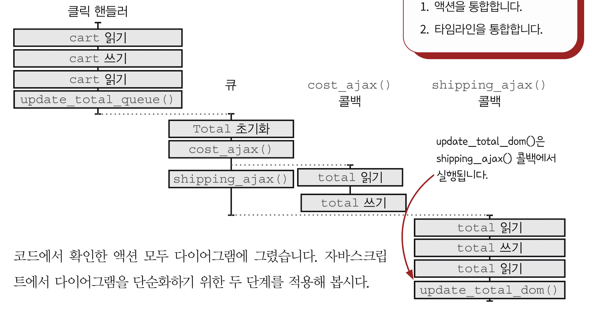
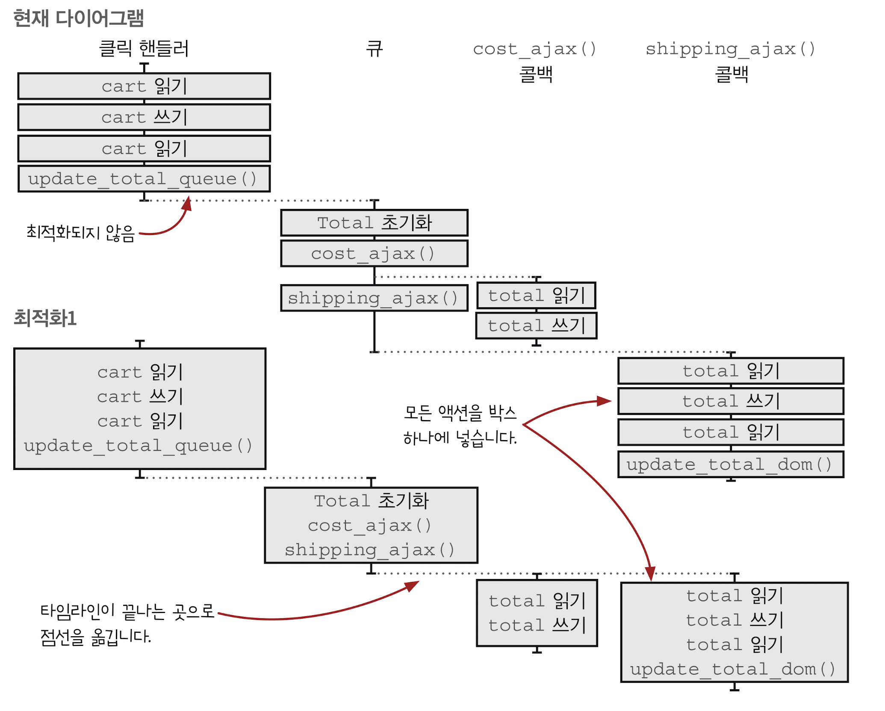
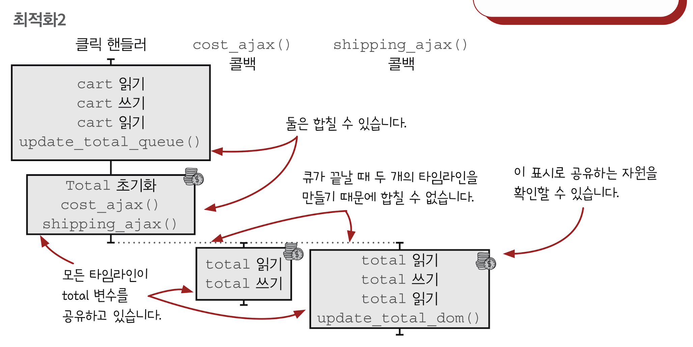
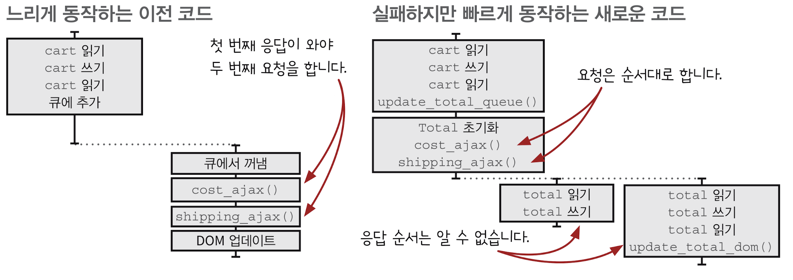
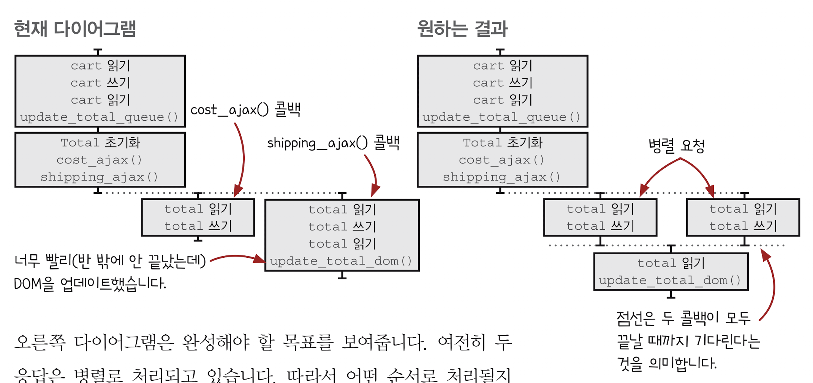
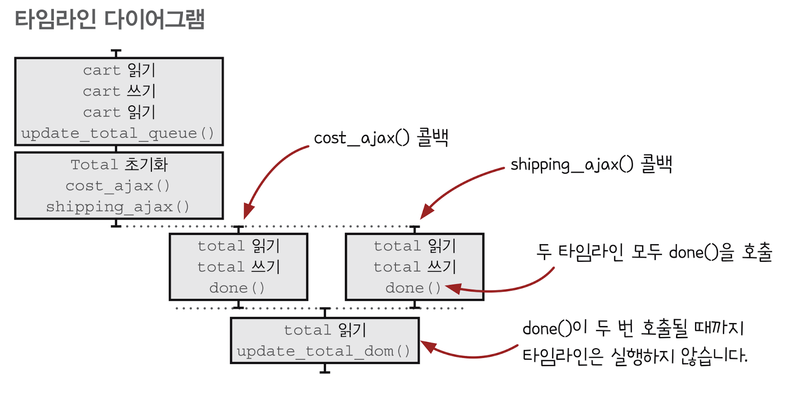
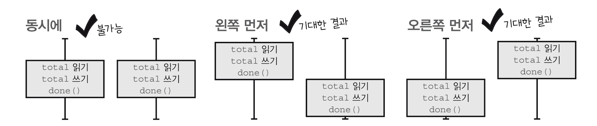
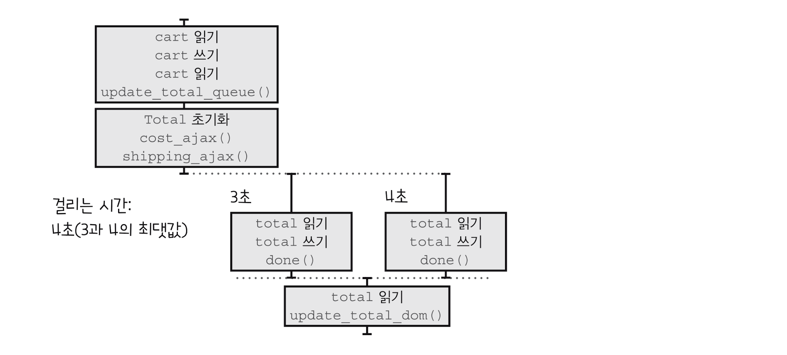
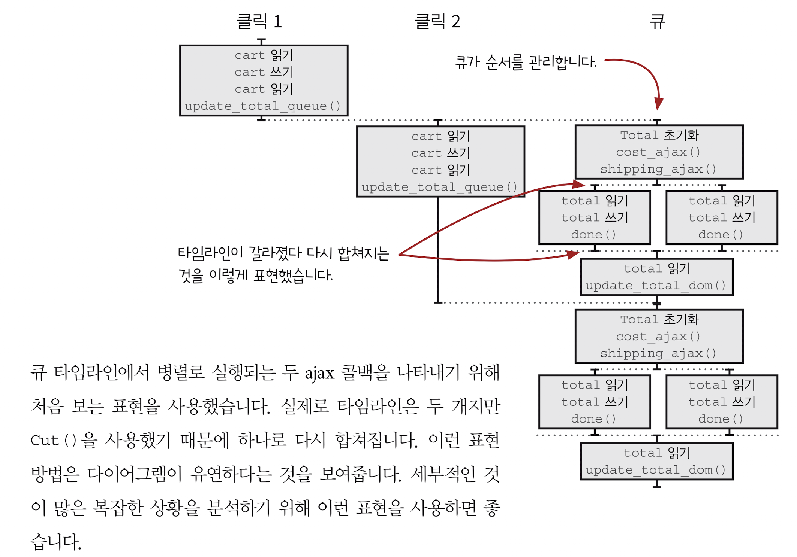

## CHAPTER 17 타임라인 조율하기
- 타임라인을  조율하기 위한 동시성 기본형`concurrency primitive` 만들어 봅니다.
- 시간에 관한 중요한 관점인 순서와 반복을 함수형 개발자들이 어떻게 다루는지 배웁니다. 
### 좋은 타임라인의 원칙

지난 두 장에서 1번부터 4번까지 알아봤습니다. 이 장에서는 다섯 번째 원칙을 살펴보겠습니다.
#### 1. 타임라인은 적을수록 이해하기 쉽습니다.
타임라인 수를 줄이면 시스템을 이해하기 더 쉽습니다.
#### 2. 타임라인은 짧을스록 이해하기 쉽습니다.
타임라인 단계를 줄이면 실행 가능한 순서를 많이 줄일 수 있습니다.
#### 3. 공유하는 자원이 적을수록 이해하기 쉽습니다.
자원을 공유하는 단계를 줄이면 가능한 순서를 줄일 수 있습니다.
#### 4. 자원을 공유한다면 서로 조율해야 합니다.
공유 자원을 안전하게 공유할 수 있어야 합니다. 올바른 순서대로 자원을 쓰고 돌려준다는 말입니다. 그리고 타임 라인을 조율한다는 것은 실행 가능한 순서를 줄인다는 것을 의미합니다. 현실에서 사용하는 방법에서 착안해 재사용 가능한 조율 방법을 만들 수 있습니다.
#### 5. ==시간을 일급으로 다룹니다.==
타임라인을 관리하는 재사용 가능한 객체를 만들면 타이밍 문제를 쉽게 처리할 수 있습니다.

모든 언어는 시간에 대한 암묵적인 모델을 가지고 있습니다. 하지만 언어에서 제공하는 시간 모델은 우리가 해결하려는 문제와 맞지 않는 모델인 경우가 있습니다. 함수형 프로그래밍으로 문제에 맞는 새로운 시간 모델을 만들 수 있습니다.

### 버그가 있습니다!
잘못 동작하는 경우: 제품을 클릭했을 때 배송비만 표시됨. 가끔 발생하기 때문에 ==타이밍 버그==로 보입니다.


### 코드가 어떻게 바뀌었나요
#### 최적화하기 전(동작)
```js
function add_item_to_cart(name, price, quantity) {
	cart = add_item(cart, item) 
	update_total_queue(cart)
}

function calc_cart_total(cart, callback) { 
	var total = 0 
	cost_ajax(cart, function(cost) { 
		total += cost 
		shipping_ajax(cart, function(shipping) { 
			total += shipping
			callback(total) 
		}) 
	})
}

function clac_cart_worker(cart, done) { 
	calc_cart_total(cart, function(total) { 
		update_total_dom(total)
		done(total)
	})
}

var update_total_queue = DroppingQueue(1, clac_cart_worker)
```

#### 최적화한 후(동작하지 않음)
```js
function add_item_to_cart(name, price, quantity) {
	cart = add_item(cart, item) 
	update_total_queue(cart)
}

function calc_cart_total(cart, callback) { 
	var total = 0 
	cost_ajax(cart, function(cost) { 
		total += cost 
	}) // <----- 닫는 괄호들이 옮겨진 것 같습니다.
	shipping_ajax(cart, function(shipping) { 
		total += shipping
		callback(total) 
	})
}

function clac_cart_worker(cart, done) { 
	calc_cart_total(cart, function(total) { 
		update_total_dom(total)
		done(total)
	})
}

var update_total_queue = DroppingQueue(1, clac_cart_worker)
```
닫는 괄호들이 옮겨진 것 같습니다. 그 결과 `shipping_ajax()`는 `cost_ajax()` 콜백 안에서 호출되는 대신 `cost_ajax()` 다음 바로 실행됩니다.
두 ajax 요청이 거의 동시에 실행되기 때문에 빠를 것이지만 버그가 있습니다.

> 다이어그램을 그리기 위한 세 단계
> 1. 액션을 확인합니다.
> 2. 각 액션을 그립니다.
> 3. 단순화합니다.
### 액션을 확인하기: 단계 1
먼저 액션을 확인합니다.

```js
function add_item_to_cart(name, price, quantity) {
	cart = add_item(cart, item) // <-- cart 읽기 쓰기 읽기 
	update_total_queue(cart) // <-- update_total_queue() 부르기
}

function calc_cart_total(cart, callback) { 
	var total = 0 // <-- total 초기화
	cost_ajax(cart, function(cost) { // <-- cost_ajax() 부르기
		total += cost // <-- total 읽기 쓰기
	}) 
	shipping_ajax(cart, function(shipping) { // shopping_ajax 부르기
		total += shipping // <-- total 읽기 쓰기
		callback(total) // <-- total 읽기
	})
}

function clac_cart_worker(cart, done) { 
	calc_cart_total(cart, function(total) { 
		update_total_dom(total) // <-- update_total_dom() 부르기
		done(total)
	})
}

var update_total_queue = DroppingQueue(1, clac_cart_worker)
```
total은 여러 타임라인에서 사용하게 되었디 때문에 안전하게 공유되는지 확신이 없습니다.

### 모든 액션을 그리기: 단계 2

```js
function add_item_to_cart(name, price, quantity) {
	cart = add_item(cart, item) // <-- cart 읽기 쓰기 읽기 
	update_total_queue(cart) // <-- update_total_queue() 부르기
}

function calc_cart_total(cart, callback) { 
	var total = 0 // <-- total 초기화
	cost_ajax(cart, function(cost) { // <-- cost_ajax() 부르기
		total += cost // <-- total 읽기 쓰기
	}) 
	shipping_ajax(cart, function(shipping) { // shopping_ajax 부르기
		total += shipping // <-- total 읽기 쓰기
		callback(total) // <-- total 읽기
	})
}

function clac_cart_worker(cart, done) { 
	calc_cart_total(cart, function(total) { 
		update_total_dom(total) // <-- update_total_dom() 부르기
		done(total)
	})
}

var update_total_queue = DroppingQueue(1, clac_cart_worker)
```

액션
1. cart 읽기
2. cart 쓰기
3. cart 읽기
4. update_total_queue() 부르기
5. total = 0 초기화
6. cost_ajax() 부르기
7. total 읽기
8. total 쓰기
9. shipping_ajax() 부르기
10. total 읽기
11. total 쓰기
12. total 읽기
13. update_total_dom() 부르기

> ✔️ 책에는 단계별로 그리는 순서에 대한 설명이 있지만 옮겨적기 복잡해서 한 번에 그리겠습니다.
> 그린 순서: 클릭핸들러 -> 큐 + cost_ajax() 콜백 -> shipping_ajax() 콜백



> 자바스크립트에서 단순화하기 위한 두 단계
> 1. 액션을 통합합니다.
> 2. 타임라인을 통합합니다.
### 다이어그램 단순화하기: 단계 3
액션을 통합합니다.




두 번째 단계는 타임라인이 끝나는 곳에 새로운 타임라인이 하나 생긴다면 두 타임라인을 합치는 단계입니다.




단순화 작업이 끝났습니다 .이제 타임라인에 있는 단계가 어떤 자원을 공유하는지 볼 수 있습니다. 공유하고 있는 자원은 ==total 변수==뿐입니다. total은 지역변수이지만 모든 타임라인에서 접근하고 있습니다.

### 실행 가능한 순서 분석하기
`cost_ajax()`콜백과 `shipping_ajax()`콜백 타임라인의 실행 가능한 순서를 알아보고 문제가 있는지 봅시다.

`shipping_ajax()`콜백 타임라인(오른쪽)이 먼저 실행되면 dom이 업데이트된 후 `cost_ajax()` 콜백 타임라인(왼쪽)이 실행되기 때문에 ==배송비만 dom에 업데이트합니다.==

### 왜 지금 타임라인이 더 빠를까요?
사용자가 기다려야하는 시간이 이전에는 두 콜백이 응답하는 시간을 합친 것이었지만 지금은 두 콜백의 응답시간 중 최대값이 걸립니다.
병렬로 기다리기 때문에 더 빨리 끝납니다. 병렬로 응답을 기다려 실행 속도를 개선할 수 있는 방법이 있을까요?





### 모든 병렬 콜백 기다리기



변경된 타임라인 다이어그램에서는 DOM 업데이트를 두 콜백의 응답을 병렬로 기다렸다가 처리합니다.
이 점선을 컷`cut`이라고 부르겠습니다. 앞에서 본 점선과 다르게 여러 타임라인의 끝에 맞춰 그립니다. 컷 위에 있는 단계는 컷 아래 단계가 실행되기 전에 모두 끝나야 합니다.

컷을 만들면 컷의 앞부분과 뒷부분을 따로 분석할 수 있습니다. 두 부분의 액션이 서로 섞이지 않습니다. 컷은 실행 가능한 순서를 줄이기 때문에 애플리케이션의 복잡성을 줄여줍니다.

### 타임라인을 나누기 위한 동시성 기본형
멀티스레드를 지원하는 언어에서는 스레드가 변경 가능한 상태를 공유하기 위해 원자적`atomic` 업데이트 같은 기능을 사용해야 합니다.
자바스크립트는 단일 스레드라는 장점을 활용할 수 있습니다. 가능한 동기적으로 접근하는 간단한 변수로 동시성 기본형을 구현할 수 있습니다.

어떤 함수를 만들고 어떤 타임라인 작업이 끝났을 때 이 함수를 부를 것입니다. 이 함수는 호출될 때마다 호출된 횟수를 증가시킵니다. 그리고 마지막 타임라인이 함수를 호출했을 때 콜백을 불러줍니다.
```js
/*
* @param num number 기다릴 타임라인의 수
* @param callback function 모든 것이 끝났을 때 실행할 콜백
  @return function 타임라인이 끝났을 때 호출할 함수
*/
function Cut(num, callback) {
	var num_finished = 0
	return function() {
		num_finished += 1
		if(num_finished === num)
			callback()
	}
}
```

#### 간단한 예제
```js
var done = Cut(3, function() { // num_finished = 0
	console.log("3 timelines are finished")
})

done() // num_finished = 1
done() // num_finished = 2
done() // num_finished = 3

console => "3 timelines are finished" // 세 번째 done()이 호추로디고나서 메시지를 출력합니다.
```

이제 장바구니 코드에 적용해 봅시다.

### 코드에 Cut() 적용하기
`Cut()` 동시성 기본형이 생겼습니다. 장바구니에 제품을 추가하는 코드에 적용해 봅시다.

1. `Cut()`을 보관할 범위
2. `Cut()`에 어떤 콜백을 넣을지

#### 1. Cut()을 보관할 범위
응답 콜백 끝에서 `done()`을 불러야 합니다. 따라서 두 응답 콜백을 만드는 `calc_cart_total()` 함수 범위에 `Cut()`을 만드는 것이 좋을 것 같습니다.

#### 2. Cut()에 어떤 콜백을 넣을지
`calc_cart_total()`에는 total 값 계산이 끝났을 때 부르는 콜백이 이미 있습니다. 실제로 `update_total_dom()`이 실행될 것이지만 `Cut()`은 어떤 것을 호출하는지는 상관이 없습니다. 따라서 `Cut()` 콜백에서 `calc_cart_total()` 콜백을 실행하면 됩니다.
##### 원래 코드
```js
function calc_cart_total(cart, callback) { 
	var total = 0 
	
	cost_ajax(cart, function(cost) { 
		total += cost 
	})
	shipping_ajax(cart, function(shipping) { 
		total += shipping
		callback(total) 
	})
}
```

##### Cut()을 적용한 코드
```js
function calc_cart_total(cart, callback) { 
	var total = 0 
	var done = Cut(2, function() {
		callback(total)
	})
	
	cost_ajax(cart, function(cost) { 
		total += cost 
		done()
	})
	shipping_ajax(cart, function(shipping) { 
		total += shipping
		done()
	})
}
```

##### 타임라인 다이어그램




### 불확실한 순서 분석하기
동시에 실행하기 때문에 빠르고 모든 실행 순서에 문제가 없어서 올바른 결과를 얻을 것으로 예상합니다.
두 장점이 잘 동작하는지 타임라인 다이어그램을 분석해 봅시다.

모든 가능한 순서로 실행했을 때 올바른 결과가 나오는지 확인 해봐야 합니다.




### 병렬 실행 분석
타임라인이 올바른 순서로 동작한다는 것을 확인했습니다. 다음으로 빠르게 동작하는지 확인해 봅시다.




성공입니다. 

한 번 클릭할 때 발생하는 문제를 해결하기 위해 작업을 했습니다. 두 병렬 타임라인이 다음 작업을 시작하기 전에 기다리도록 타임라인을 분리했습니다. 그래서 잘 동작하게 되었습니다.

### 여러 번 클릭하는 경우 분석
여러 번 클릭하면 어떻게 되는지 다이어그램을 그려봅시다.




`Cut()`을 사용하니 타임라인이 복잡해진 것 같습니다. 코드를 실행하는 상황이 복잡하다는 것을 말합니다.
모든 응답은 `Cut()`이 있어서 완료될 때까지 기다린 후 DOM을 업데이트해야 합니다. 큐가 있어서 빠르게 장바구니에 제품을 추가해도 잘 동작합니다.

`Cut()`이 있어서 다이어그램을 분석하기 조금 쉽습니다. 점선을 기준으로 위와 아래를 따로 분석할 수 있습니다.
병렬로 실행되는 부분의 가능한 실행 순서는 두 가지입니다. 나머지는 타임라인은 순서대로 완료되기 때문에 쉽습니다.

복잡성이 어디서 생기는지 생각해 봅시다.
1. 비동기 웹 요청
2. 결과를 합쳐야 하는 두 개의 API 응답
3. 예측 불가능한 사용자의 액션

1번과 3번은 아키텍처 때문에 생기는 복잡성입니다.
3번은 사용자 인터렉션을 적게 만들면 없앨 수 있습니다.
ajax 요청을 사용하지 않으면 1번을 없앨 수 있습니다. 
하지만 이런 것을 ㅁ나들고 싶지 않을 것입니다.

2번의 복잡성은 없애기 어렵습니다. 서버로 복장성을 옮기는 정도입니다.
복잡성은 필연적일까요? 아닙니다. 복잡성은 바꾸지 않으려고 하는 선택들로부터 생깁니다. 선택한 것이 항상 고려되어야 한다면 복잡성은 피할 수 없을지도 모릅니다. 그래서 ==우리에게는 복잡성을 다룰 수 있는 좋을 프로그래밍 기술이 필요합니다.==

### 딱 한 번만 호출하는 기본형
액션을 여러 번 호출해도 한 번만 실행되도록 만들 수 있는 방법을 찾고 있습니다. 이것은 동시성 기본형을 만드는 일입니다.

사이트에 처음 방문한 사용자에게 환영 메시지를 보내거나 하는 데 쓸 수 있습니다.
```js
function sendAddToCartText(number) {
	sendTextAjax(number, "Thanks for adding." + "Reply if you have any questions!")
}
```

다음은 어떤 함수를 새로운 함수로 감싸는 `JustOnce()` 동시성 기본형입니다.
```js
function JustOnce(action) { // action 전달
	var alreadyCalled = false // 함수가 실행됐는지 기억
	return function(a, b, c) {
		if(alreadyCalled) return // 실행한 적이 있다면 종료
		alreadyCalled = true // 실행됐다고 기록
		return action(a, b, c) // 인자와 함께 액션 호출
	}
}
```

이제 한 번만 실행하는 `sendAddToCartText()`버전을 쉽게 만들 수 있습니다.
```js
var sendAddToCartTextOnce = JustOnce(sendAddToCartText)

sendAddToCartTextOnce("555-555-5555-55")
sendAddToCartTextOnce("555-555-5555-55")
sendAddToCartTextOnce("555-555-5555-55")
sendAddToCartTextOnce("555-555-5555-55")
sendAddToCartTextOnce("555-555-5555-55")
```

또 다른 동시성 기본형을 만들었습니다.

중요한 것은 동시성 기본형을 만들기 어렵지 않다고 느끼는 것입니다.

### 암묵적 시간 모델 vs 명시적 시간 모델
모든 언어는 암묵적으로 시간에 대한 모델을 가지고 있습니다. 시간 모델로 실행에 관한 두 가지 관점을 알 수 있습니다. 바로 순서와 반복입니다.
자바스크립트 시간 모델은 간단합니다.
1. 순차적 구문은 순서대로 실행됩니다. (순서)
2. 두 타임라인에 있는 단계는 왼쪽 먼저 실행되거나, 오른쪽 먼저 실행될 수 있습니다. (순서)
3. 비동기 이벤트는 새로운 타임라인에서 실행됩니다. (순서)
4. 액션은 호출할 때마다 실행됩니다. (반복)

간단한 프로그램에서 암묵적 시간 모델은 좋습니다. 하지만 실행 방식을 바꾸지 못합니다.
그래서 함수형 개발자는 필요한 실행 방식에 가깝게 새로운 시간 모델을 만듭니다.

### 요약: 타임라인 사용하기

#### 타임라인 수를 줄입니다.
#### 타임라인 길이를 줄입니다.
#### 공유 자원을 없앱니다.

#### 동시성 기본형으로 자원을 공유합니다.

#### 동시성 기본형으로 조율합니다.

### 결론
웹 요청의 시간 차이 때문에 발생하는 경쟁 조건에 대해 알아봤습니다. 두 타임라인이 협력할 수 있는 동시성 기본형을 만들었습니다.
이런 방법으로 타임라인을 조율할 수 있었습니다.

### 요점 정리
- 함수형 개발자는 언어가 제공하는 암묵적 시간 모델 대신 새로운 시간 모델을 만들어 사용합니다.
- 명시적 시간 모델은 종종 일급 값으로 만듭니다. 일급 값으로 만든 시간 모델은 프로그래밍 언어를 사용해서 시간을 다룰 수 있습니다.
- 타임라인을 조율하기 위해 동시성 기본형을 만들 수 있습니다.
- 타임라인을 나누는 것도 타임라인을 조율하는 방법 중 하나입니다. 컷은 모든 타임라인의 작업이 끝날 때까지 기다렸다가 새로운 타임라인을 시작할 수 있도록 합니다.