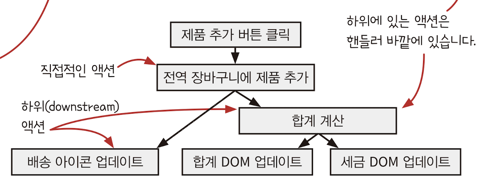

## CHAPTER 18 반응형 아키텍처와 어니언 아키텍처
- 반응형 아키텍처로 순차적 액션을 파이프라인으로 만드는 방법
- 상태 변경 기본형
- 도메인과 현실 세계의 상호작용을 위해 어니언 아키텍처를 만듭니다.
- 여러 계층에 어니언 아키텍처를 적용하는 방법
- 전통적인 계층형 아키텍처와 어니언 아키텍처 비교

### 두 아키텍처 패턴은 독립적입니다
두 패턴은 서로 다른 단계에서 사용합니다. 반응형은 ==순차적 액션 단계==에서 사용하고, 어니언 아키텍처는 ==서비스의 모든 단계==에서 사용합니다.
두 패턴은 함께 사용할 수 있지만 따로 사용할 수도 있습니다.


#### 반응형 아키텍처
반응형 아키텍처는 코드에 나타난 순차적 액션의 순서를 뒤집습니다. 효과`effect`와 그 효과에 대한 원인을 분리해서 코드에 복잡하게 꼬인 부분을 풀 수 있습니다.

#### 어니언 아키텍처
어니언 아키텍처는 웹 서비스나 온도 조절 장치 같은 현실 세계와 상호작용하기 위한 서비스 구조를 만듭니다. 함수형 사고를 적용한다면 자연스럽게 쓸 수 있는 아키텍처 입니다.

### 변경에 대한 원인과 효과가 강력하게 결합
장바구니에 관한 UI를 추가 -> 고쳐야 하는 곳이 10군데
전통적인 `n` * `m` 문제

오른쪽 액션과 왼쪽 액션이 결합된 것을 분리할 수 있습니다.

### 반응형 아키텍처는 무엇인가요?
반응형 아키텍처는 애플리케이션을 구조화하는 방법입니다. 핵심 원칙은 이벤트에 대한 반응으로 일어날 일을 지정하는 것입니다. 반응형 아키텍처는 웹 서비스와 UI에 잘 어울립니다. 웹 요청 응답에 일어날 일을 지정하고, 버튼 클릭과 같은 이벤트 응답에 일어날 일을 지정하면 됩니다. 이런 것을 일반적으로 이벤트 핸들러라고 합니다.


### 반응형 아키텍처의 절충점
반응형 아키텍처는 코드에 나타난 순차적 액션의 순서를 뒤집습니다. X가 일어나면 언제나 Y를 합니다. 이렇게 하면 코드를 읽기 쉽고 유지보수하기도 좋습니다. 하지만 꼭 그렇지는 않습니다. 언제 사용하고 어떻게 사용할지는 개발자가 판단해야 합니다. 목적을 달성하기 위해 전통적인 아키텍처를 사용할지, 반응형 아키텍처를 사용할지 비교할 수 있을 것입니다.

#### 원인과 효과가 결합한 것을 분리합니다.
어떤 경우에는 원인과 효과`effect`를 분리하면 코드가 읽기 어려워집니다. 하지만 코드가 더 유연하고 하려고 하는 것을 정확하게 표현할 수 있습니다.

#### 여러 단계를 파이프라인으로 처리합니다.
파이프라인으로 처리하면 좋은 점이 많이 있습니다. 파이프라인으로 계산을 조합하거나 액션과 계산을 조합할 수 있습니다.

#### 타임라인이 유연해집니다.
타임라인의 유연성이 기대하지 않은 실행 순서로 이어지지 않도록 익숙해지면 더 짧은 타임라인을 만들 수 있습니다.

이제 강력한 일급 상태 모델을 만들어 보려고 합니다. 상태는 중요한 부분을 차지합니다.

### 셀은 일급 상태입니다
장바구니가 변경될 때 Y를 하고 나머지는 신경 쓰지 않을 것입니다.
장바구니는 언제 바뀔지 모르는 전역변수이고 할당 연산자를 통해 값을 바꾸고 있습니다.
상태를 일급 함수로 만들어 봅시다. 전역변수를 몇 가지 동작과 함께 객체롤 만듭니다.
다음은 변경 가능한 값을 일급 함수로 만드는 코드입니다.
```js
function ValueCell(initialValue) {
	var currentValue = initialValue // 변경 불가능한 값(컬렉션이 될 수 있습니다)을 하나 담아 둡니다.
	return {
		val: function() { // 현재 값을 가져옵니다.
			return currentValue
		},
		update: function(f) { // 현재 값에 함수를 적용해 값을 바꿉니다(교체 패턴).
			var oldValue = currentValue
			var newValue = f(oldValue)
			currentValue = newValue
		}
	}
}
```

`ValueCell`에는 값 하나와 두 개의 동작이 있습니다. 그럼 장바구니에 적용해 봅시다.
##### 원래 코드
```js
var shopping_cart = {}

function add_item_to_cart(name, price) {
	var item = make_cart_item(name, price)
	shopping_cart = add_item(shopping_cart, item) // 읽고 바꾸고 쓰는(교체) 패턴
	
	var total = calc_total(shopping_cart)
	set_cart_total_dom(total)
	update_shipping_icons(shopping_cart)
	update_tax_dom(total)
}
```

##### 셀을 적용한 코드
```js
var shopping_cart = ValueCell({})

function add_item_to_cart(name, price) {
	var item = make_cart_item(name, price)
	shopping_cart.update(function(cart) { // 값을 변경하기 위해 값을 직접 사용하지 않고 메서드를 호출합니다.
		return add_item(cart, item)
	})
	
	var total = calc_total(shopping_cart.val())
	set_cart_total_dom(total)
	update_shipping_icons(shopping_cart.val())
	update_tax_dom(total)
}
```
`shopping_cart`를 읽고 쓰는 코드는 명확한 메서드 호출로 바꿨습니다. 다음 페이지에서 다음 단계를 진행해 봅시다.

### ValueCell을 반응형으로 만들 수 있습니다
상태가 바뀔 때 X를 하도록 만들어 봅시다. ValueCell 코드에 감시자`watcher` 개념을 추가해 봅시다. 감시자는 상태가 바뀔 때마다 실행되는 핸들러 함수입니다.
##### 원래 코드
```js
function ValueCell(initialValue) {
	var currentValue = initialValue // 변경 불가능한 값(컬렉션이 될 수 있습니다)을 하나 담아 둡니다.
	return {
		val: function() { // 현재 값을 가져옵니다.
			return currentValue
		},
		update: function(f) { // 현재 값에 함수를 적용해 값을 바꿉니다(교체 패턴).
			var oldValue = currentValue
			var newValue = f(oldValue)
			currentValue = newValue
		}
	}
}
```

##### 감시자를 적용한 코드
```js
function ValueCell(initialValue) {
	var currentValue = initialValue 
	var watchers = [] // 감시자 목록을 저장
	return {
		val: function() { 
			return currentValue
		},
		update: function(f) { 
			var oldValue = currentValue
			var newValue = f(oldValue)
			if(oldValue !== newValue) { // 값이 바뀔 때
				currentValue = newValue
				forEach(watchers, function(watcher) { // 모든 감시자 실행
					watcher(newValue)
				})
			}
		},
		addWatcher: function(f) { // 새로운 감시자 추가
			watchers.push(f)
		}
	}
}
```
감시자로 장바구니가 바뀔 때 할 일을 지정할 수 있습니다. 따라서 장바구니가 바뀔 때 배송 아이콘을 갱신하도록 만들 수 있습니다.
> 용어설명
> 감시자의 다른 이름들
> 감시자
> 이벤트 핸들러
> 옵저버
> 콜백
> 리스너

### 셀이 바뀔 때 배송 아이콘을 갱신할 수 있습니다
`shipping_cart` 값을 가진 `ValueCell`에 `update_shipping_icons()`를 감시자로 등록해 봅시다. 이렇게 하면 장바구니가 바뀔 때 항상 배송 아이콘이 갱신됩니다.
##### 원래 코드
```js
var shopping_cart = ValueCell({})

function add_item_to_cart(name, price) {
	var item = make_cart_item(name, price)
	shopping_cart.update(function(cart) { 
		return add_item(cart, item)
	})
	
	var total = calc_total(shopping_cart.val())
	set_cart_total_dom(total)
	update_shipping_icons(shopping_cart.val()) // 이후에 진행할 액션을 삭제해서 이벤트 핸들어가 간단해졌습니다.
	update_tax_dom(total)
}
```

##### 고친 코드
```js
var shopping_cart = ValueCell({})

function add_item_to_cart(name, price) {
	var item = make_cart_item(name, price)
	shopping_cart.update(function(cart) { 
		return add_item(cart, item)
	})
	
	var total = calc_total(shopping_cart.val())
	set_cart_total_dom(total)
	
	update_tax_dom(total)
}

shopping_cart.addWatcher(update_shipping_icons)
```

코드를 고치고 나서 두 가지 사실을 알 수 있습니다. 하나는 핸들러 함수가 더 작아졌다는 것입니다. 원래 하던 것보다 적은 일을 합니다.
그리고 아이콘 갱신을 직접하지 않습니다. 이 책임은 감시자로 넘어갔습니다.
또 다른 사실은 장바구니를 바꾸는 모든 핸들러에서 `update_shipping_icons()`를 부르지 않아도 된다는 것입니다.
이제 장바구니가 변경될 때 항상 `update_shipping_icons()`가 실행됩니다. 배송 아이콘이 갱신되는 것입니다.

`add_item_to_cart` 핸들어에서 DOM 갱신하는 부븐을 하나 없앴습니다. 이제 DOM을 갱신하는 코드는 두 군데 있습니다.
`total` 값을 사용해 DOM을 갱신하는데, `total`값은 장바구니 값에 따라 변하는 값입니다. 

### FormulaCell은 파생된 값을 계산합니다
어떤 셀은 다른 셀의 값을 최신으로 반영하기 위해 파생될 수 있습니다. `FormulaCell`로 이미 있는 셀에서 파생한 셀을 만들 수 있습니다. 다른 셀의 변화가 감지되면 값을 다시 계산합니다.
```js
function FormulaCell(updastreamCell, f) {
	var myCell = ValueCell(f(updatreamCell.val())) // ValueCell을 재사용
	upstreamCell.addWatcher(function(newUpstreamCalue) { // 셀 값을 다시 계산하기 위해서 감시자를 추가
		myCell.update(function(currentValue) {
			return f(newUpstreamValue)
		})
	})
	return {
		val: myCell.val, // val()과 addWatcher()를 myCell에 위임
		addWatcher: myCell.addWatcher // FormulaCell 값을 직접 바꿀 수 없습니다.
	}
}
```

`FormulaCell`은 값을 직접 바꿀 수 없습니다. 감시하던 상위`upstream`셀 값이 바뀌면 `FormulaCell`값이 바뀝니다. 상위 셀이 바뀌면 상위 값을 가지고 셀 값을 다시 계산합니다. `FormulaCell`에는 값을 바꾸는 기능은 없지만 `FormulaCell`을 감시할 수 있습니다.

`FormulaCell`이 `total`값이라면 `total`값이 바뀔 때 실행할 액션을 추가할 수 있습니다.

##### 원래 코드
```js
var shopping_cart = ValueCell({})

function add_item_to_cart(name, price) {
	var item = make_cart_item(name, price)
	shopping_cart.update(function(cart) { 
		return add_item(cart, item)
	})
	
	var total = calc_total(shopping_cart.val())
	set_cart_total_dom(total)
	
	update_tax_dom(total)
}

shopping_cart.addWatcher(update_shipping_icons)
```

##### 고친 코드
```js
var shopping_cart = ValueCell({})
var cart_toal = FormulaCell(shopping_cart, calc_total) // shopping_cart가 바뀔 때 cart_total도 바뀝니다.

function add_item_to_cart(name, price) {
	var item = make_cart_item(name, price)
	shopping_cart.update(function(cart) { // 클릭 핸들러는 더 간단해졌습니다.
		return add_item(cart, item)
	})
}

shopping_cart.addWatcher(update_shipping_icons)
cart_total.addWatcher(set_cart_total_dom) // cart_total이 바뀌면 DOM이 업데이트 됩니다.
cart_total.addWatcher(update_tax_dom)
```

이제 장바구니가 바뀔 때 항상 DOM 3개가 갱신됩니다. 핸들러는 간단해졌기 때문에 해야 할 일을 명확하게 하고 있습니다.

### 함수형 프로그래밍과 변경 가능한 상태
모든 소프트웨어는 변화하는 현실 세계로부터 정보를 가져와 일부는 저장해야 합니다.
`ValueCell`의 `update()`메서드를 사용하면 현재 값을 항상 올바르게 유지할 수 있습니다. `update()`를 사용할 때 계산을 넘기기 때문입니다.
`ValueCell`은 다른 타임라인에서 읽거나 쓰는 순서를 보장하지 않지만 어떤 값이 저장되어도 그 값이 항상 올바른 값이라는 것은 보장합니다.

### 반응형 아키텍처가 시스템을 어떻게 바꿨나요
코드를 어떤 것이 바뀔 때 실행되는 핸들러로 만들었습니다.
##### 일반적인 아키텍처
```js
var shopping_cart = {}

function add_item_to_cart(name, price) {
	var item = make_cart_item(name, price)
	shopping_cart = add_item(shopping_cart, item) 
	
	var total = calc_total(shopping_cart)
	set_cart_total_dom(total) // ---------------------------------------
	update_shipping_icons(shopping_cart) // 핸들러에 모든 액션 시퀀스가 있습니다.
	update_tax_dom(total) // -------------------------------------------
}
```

##### 반응형 아키텍처
```js
var shopping_cart = ValueCell({})
var cart_toal = FormulaCell(shopping_cart, calc_total) 

function add_item_to_cart(name, price) {
	var item = make_cart_item(name, price)
	shopping_cart.update(function(cart) { 
		return add_item(cart, item)
	})
}

shopping_cart.addWatcher(update_shipping_icons) //---------------------------
cart_total.addWatcher(set_cart_total_dom) // 하위에 있는 액션은 핸들러 바깥에 있습니다.
cart_total.addWatcher(update_tax_dom) // ------------------------------------
```


반응형 아키텍처가 바꾼 시스템의 결과, 코드에 3가지 중요한 영향을 줍니다.
1. 원인과 효과가 결합된 것을 분리합니다.
2. 여러 단계를 파이프라인으로 처리합니다.
3. 타임라인이 유연해집니다.
### 원인과 효과가 결합한 것을 분리합니다
언제나 바뀔 수 있는 "현자 장바구니" 상태에 따라 무료 배송 기준에 맞으면 무료 배송 아이콘을 표시해야 합니다. 따라서 일반적인 아키텍처에서는 제품 추가, 삭제, 장바구니 비우기 이벤트에 모두 무료배송 조건을 계산하고 DOM을 업데이트해야 합니다. 반응형 아키텍처를 사용하면 원인과 효과가 결합한 것을 분리하여 배송 아이콘 갱신은 한 번만 만들면 됩니다.

### 결합의 분리는 원인과 효과의 중심을 관리합니다
##### 장바구니를 바꾸는 방법
1. 제품 추가
2. 제품 삭제
3. 장바구니 비우기
4. 수량 변경
5. 할인 코드 적용
##### 장바구니가 바뀔 때 해야 할 액션
1. 배송 아이콘 업데이트
2. 세금 표시
3. 합계 표시
4. 장바구니에 제품 개수 업데이트

장바구니를 바꾸는 방법과 해야 할 액션이 다양합니다. 원인과 결과가 모두 연결되어 있기 때문에 관리해야 할 것이 20개라고 할 수 있습니다.
원인과 효과가 늘어나면 관리해야할 것도 늘어납니다.
전역 장바구니는 원인과 효과의 중심이므로 이것을 관리해야 합니다.

원인과 효과를 분리하면 곱셈에서 덧셈으로 바꿀 수 있습니다. 원인이나 효과를 추가해도 수정할 부분이 없기 때문에 관리해야 할 것은 하나만 늘어납니다.
이벤트 핸들러는 장바구니를 바꾸는 일에만 신경 쓰면 되고, DOM을 갱신하는 곳에서는 DOM 갱신만 신경 쓰면 됩니다.

### 여러 단계를 파이프라인으로 처리합니다
반응형 아키텍처에서는 간단한 액션과 계산을 조합해 파이프라인을 만듭니다. 파이프라인은 액션과 계산을 조합한 하나의 액션이라고 볼 수 있습니다.
파이프라인은 반응형 프레임워크를 사용해 구현하기도 합니다. 자바스크립트를 사용한다면 Promise로 액션과 계산을 조합해 파이프라인을 구현할 수 있습니다.
Promise는 단일값을 전달할 수 있기 때문에 파이프라인 단계 간 데이터를 전달할 수 있습니다.
단일 이벤트 대신 이벤트 스트림이 필요하다면 ReactiveX(http://reactivex.io/) 라이브러리를 사용해 보세요.
Kafka나 RabbitMQ와 같은 외부 스트림 서비스로 파이프라인을 구현할 수 있습니다.

반응형 아키텍처는 마이크로서비스 아키텍처로 인해 더 인기를 얻었습니다. The Reactive Manifesto(https://www.reactivemanifesto.org/)를 참고하세요.

### 타임라인이 유연해집니다
반응형 아키텍처를 사용하면 타임라인이 유연해집니다. 순서를 정의하는 방법을 뒤집기 때문에 자연스럽게 타임라인이 작은 부분으로 분리됩니다.

많은 타임라인은 문제일 일으키지만, 공유하는 자원이 없으면 타임라인이 많아도 문제가 없습니다.


장바구니 `ValueCell`은 감시자를 호출할 때 현재 값을 넘겨주기 때문에 감시자 함수가 직접 장바구니 값을 읽지 않아도 됩니다. 따라서 장바구니 값을 전역변수로 사용하지 않아도 됩니다.
마찬가지로 합계 `FormulaCell`도 감시자를 호출할 때 현재 합계 값을 넘겨주기 때문에 DOM을 갱신할 때 `FormulaCell`을 직접 읽지 않아도 됩니다.
DOM을 갱신하는 모든 곳에서 자신의 DOM만 갱신하면 됩니다. 타임라인은 서로 다른 자원을 사용하기 때문에 안전하다고 할 수 있습니다.

### 또 다른 아키텍처 패턴
이제 어니언 아키텍처`onion architecture`라고 부르는 아키텍처에 대해 알아보겠습니다.
어니언 아키텍처는 반응형 아키텍처보다 더 넓은 범위에 사용합니다. 서비스 전체를 구성하는 데 사용하기 때문에 바깥 세계와 상호작용을 하는 부분을 다룹니다.
반응형 아키텍처와 함께 사용할 수 있지만 서로 의존하지는 않습니다.

어니언 아키텍처는 웹 서비스나 온도 조절 장치 같은 현실 세계와 상호작용하기 위한 서비스 구조를 만듭니다. 함수형 사고를 적용한다면 자연스럽게 쓸 수 있는 아키텍처입니다.

### 어니언 아키텍처는 무엇인가요?
둥글게 겹겹이 쌓인 양파 모양을 하고 있습니다.


특정 계층이 꼭 필요하다고 강제하지 않지만 위와 같이 3가지 큰 분류로 나눌 수 있습니다.
위의 그림으로 함수형 시스템이 잘 동작할 수 있는 중요한 규칙을 알 수 있습니다.
1. 현실 세계와 상호 작용은 인터랙션 계층에서 해야 합니다.
2. 계층에서 호출하는 방향은 중심 방향입니다.
3. 계층은 외부에서 어떤 계층이 있는지 모릅니다.
어니언 아키텍처는 파트 1에서 배운 액션과 계산의 분리, 계층형`stratified` 설계 방식과 잘 맞습니다.

### 다시 보기: 액션과 계산, 데이터
#### 데이터
이벤트에 대한 사실. 수동적이고 투명함.
#### 계산
입력으로 출력을 만드는 연산.
#### 액션
바깥 세계에 영향을 주거나 받는 실행 가능한 코드.

4장에서 배운 방식으로 액션에서 계산을 빼내면 의도하지 않아도 어니언 아키텍처 구조가 됩니다.
어니언 아키텍처는 함수형 프로그래밍을 할 때 높은 차원에서 서비스를 구조화하기 좋은 방법입니다.

### 다시 보기: 계층형 설계
계층형 설계는 함수 호출 관계를 기반으로 함수를 배치하는 방법입니다. 어떤 함수가 재사용하기 좋고 변경하기 쉬운지, 테스트할 가치가 높은 코드가 무엇인지 알 수 있습니다.


계층형 설계로 액션 전파에 대한 규칙도 알 수 있습니다. 만약 어떤 박스가 액션이라면 박스 위쪽 경로에 있는 모든 박스는 액션이 됩니다.


### 전통적인 계층형 아키텍처
어니언 아키텍처 계층과 다른 전통적인 아키텍처. 웹 서버를 만들 떄 사용하는 전형적인 계층입니다.
#### 웹 인터페이스 계층
- 웹 요청을 도메인으로 바꾸고 도메인을 웹 응답으로 바꿉니다.
#### 도메인 계층
- 애플리케이션 핵심 로직으로 도메인 개념에 DB 쿼리나 명령이 들어갑니다.
#### 데이터베이스 계층
- 시간에 따라 바뀌는 정보를 저장합니다.

전통적인 계층형 아키텍처는 데이터베이스를 기반으로 합니다. 도메인 계층은 데이터베이스 동작으로 만듭니다. 그리고 웹 인터페이스는 웹 요청을 도메인 동작으로 변환합니다.
다만 이런 아키텍처는 함수형 스타일이 아닙니다.

데이터베이스 계층이 가장 아래 있다면 그 위에 있는 모든 것이 액션이 되기 때문에 함수형 스타일이 아닙니다.

### 함수형 아키텍처
전통적인 아키텍처와 함수형 아키텍처를 비교할 때 눈에 띄는 차이점은 데이터베이스 계층과 도메인 계층의 관계입니다.
함수형 아키텍처는 도메인 계층이 데이터베이스 계층에 의존하지 않는다는 점입니다. 

액션과 계산을 구분하는 선을 그리고 라이브러리나 언어 기능과 계산을 구분하는 선을 그려 함수형 아키텍처를 표현할 수 있습니다.


위 함수형 아키텍처 그림에서 각 점선 끝을 연결하면 어니언 아키텍처와 같은 모양이 됩니다.


### 변경과 재사용이 쉬워야 합니다
어니언 아키텍처는 인터랙션 계층을 바꾸기 쉽습니다. 그래서 ==도메인 계층을 재사용하기 좋습니다.==
어니언 아키텍처는 데이터베이스나 API호출과 같은 외부 서비스를 바꾸기 쉽습니다. 가장 높은 계층에서 사용하기 때문입니다.
도메인 계층은 외부 서비스에 의존하지 않아서 ==테스트하기 좋습니다.== 어니언 아키텍처는 좋은 인프라보다 ==좋은 도메인==을 강조합니다.

### 도메인 규칙은 도메인 용어를 사용합니다
도메인 규칙 또는 비즈니스 규칙을 코드에 나타나는 용어에서 찾을 수 있습니다. 도메인 용어를 사용하는 코드를 통해 도메인 규칙에 속하는지 인터랙션 계층에 속하는지 판단할 수 있습니다.

### 가독성을 따져 봐야 합니다
가독성을 결정하는 요소
- 사용하는 언어
- 레거시 코드와 코드 스타일
- 사용하는 라이브러리
- 개발자들의 습관

#### 코드의 가독성
#### 개발 속도
#### 시스템 성능

### 결론
반응형 아키텍처와 어니언 아키텍처에 대해 알아봤습니다.

### 요점 정리
- 반응형 아키텍처는 액션의 순서를 뒤집습니다.
- 반응형 아키텍처는 액션과 계산을 조합해 파이프라인을 만듭니다.
- 읽고 쓰는 동작을 제한해 변경 가능한 일급 상태를 만들 수 있습니다.
- 어니언 아키텍처는 넓은 범위에서 소프트웨어를 세 개의 계층으로 나눕니다. 인터랙션, 도메인, 언어 계층입니다.
- 인터랙션 계층은 액션으로 되어있습니다. 도메인 계층과 액션을 사용하는 것을 조율합니다.
- 도메인 계층은 도메인 로직과 비즈니스 규칙과 같은 동작으로 되어 있습니다. 대부분 계산입니다.
- 언어 계층은 언어 기능과 라이브러리도 되어 있습니다.
- 어니언 아키텍처는 프랙털`fractal`입니다. 액션의 모든 추상화 수준에서 찾을 수 있습니다.
