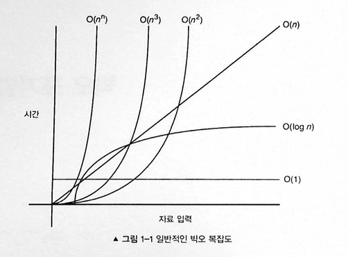

# 1. 빅오 표기법

빅오 표기법은 알고리즘의 시간 복잡도와 공간 복잡도를 표현하는 수학적 표기법입니다. 입력 크기가 증가할 때 알고리즘의 실행시간이나 메모리 사용량이 어떻게 증가하는지를 나타냅니다.

빅오 표기법은 알고리즘의 최악의 경우 복잡도를 측정한다. 빅오 표기법에서 n이 매우 클 때의 성능을 예측할 수 있어 알고리즘을 선택하고 비교하는데 중요한 지표가 됩니다.



## 🐛 일반적인 예

### 1️⃣ O(1) - 상수시간

O(1)은 입력 공간에 대해 변하지 않는다 따라서 O(1)을 상수 시간이라고 부릅니다. 배열에 있는 항목을 인덱스에 접근하는 경우가 O(1) 알고리즘의 예입니다.

```javascript
function getFirst(arr) {
  return arr[0]; // 배열 크기와 관계없이 동일한 시간
}
```

### 2️⃣ O(n²) - 제곱 시간 복잡도

O(n²)은 2차 시간입니다. => 입력 크기가 n 일 떄 대략 n²의 번의 연산이 필요하다는 뜻입니다.

```javascript
// 배열에서 중복된 요소 찾기
function findDuplicates(arr) {
  const duplicates = [];

  for (let i = 0; i < arr.length; i++) {
    // n번
    for (let j = i + 1; j < arr.length; j++) {
      // n번
      if (arr[i] === arr[j]) {
        duplicates.push(arr[i]);
        break;
      }
    }
  }
  return duplicates;
}

// 사용 예시
const numbers = [1, 2, 3, 2, 4, 5, 3];
console.log(findDuplicates(numbers)); // [2, 3]
```

### 3️⃣ O(n³) - 세제곱 시간 복잡도

O(n³)은 마찬가지로 3차 시간입니다.

```javascript
// 3D 배열의 모든 요소 합계 계산
function sum3DArray(cube) {
  let total = 0;

  for (let i = 0; i < cube.length; i++) {
    // n번 (깊이)
    for (let j = 0; j < cube[i].length; j++) {
      // n번 (행)
      for (let k = 0; k < cube[i][j].length; k++) {
        // n번 (열)
        total += cube[i][j][k];
      }
    }
  }
  return total;
}
```

## 빅오 표기법 규칙

알고리즘의 시간 복잡도를 f(n)이라고 표현하면, n은 입력의 개수를 f(n)time 은 필요한 시간을, f(n)space 는 필요한 공간(추가적인 메모리)을 나타낸다. 알고리즘 분석의 목표는 f(n)을 계산함으로써 알고리즘의 효율성을 이해하는 것입니다. 기본적인 규칙을 봅시다.

### 1️⃣ 계수 법칙 "상수를 지워라"

상수 k가 0보다 크다고 할 때(상수 k>0) f(n)이 O(g(n))이면 kf(n)은 O(g(n))입니다. 이를 계수 법칙이라고 합니다.
이는 입력 크기 n과 관련되지 않은 계수를 제거합니다.
n이 무한에 가까워지는 경우 경우 다른 계수는 무시해도 되기 때문입니다.

쉽게 말하면 입력 크기와 연관되지 않은 상수를 전부 무시하면 되는데 빅오에서 입력 크기가 클 때 계수를 무시할 수 있습니다.

이는 5f(n)과 f(n) 이 모두 동일한 O(f(n)) 이라는 빅오 표기법을 지님을 의미합니다.

예시를 봅시다.
시간 복잡도가 O(n)인 코드가 있습니다.

```javascript
function a(n) {
  var count = 0;
  for (var i = 0; i < n; i++) {
    count += 1;
  }
  return count;
}
```

위의 코드는 f(n) = n 입니다. count에 숫자를 n번 더하기 때문입니다. 그러므로 위 함수의 시간 복잡도는 O(n)입니다.

```javascript
function a(n) {
  var count = 0;
  for (var i = 0; i < n * 5; i++) {
    count += 1;
  }
  return count;
}
```

위의 코드는 5f(n) = n 입니다. 0부터 5n 까지 실행하기 때문입니다. n 이 커진다고 해서 달라질 것은 없습니다.

### 2️⃣ 합의 법칙 "빅오를 더하라"

합의 법칙은 시간 복잡도를 더할 수 있다는 이야기인데, 두 개의 다른 알고리즘을 포함하는 상위 알고리즘이 있다고 했을 때 해당 상위 알고리즘의 빅오 표기법은 단순히 해당 상위 알고리즘에 포함되는 두 개의 알고리즘의 합입니다.

```
f(n)이 O(h(n))이고 g(n)이 O(p(n)) 이면 f(n) + g(n)은 O(h(n) + p(n))입니다.
```

합의 법칙을 적용한 다음 계수 법칙을 적용해야 한다는 점에 주의해야합니다.

```javascript
function a(n) {
  var count = 0;
  for (var i = 0; i < n; i++) {
    count += 1;
  }
  for (var i = 0; i < 5 * n; i++) {
    count += 1;
  }
  return (count += 1);
}
```

첫 번째 반복문은 f(n) = n 두 번째는 5f(n) = n 이다.
이로인해 결괏값은 6n이다. 하지만 계수 법칙을 사용하면 최종 결과는 O(n) = n 이다.

### 3️⃣ 곱의 법칙 "빅오를 곱하라"

곱의 법칙은 빅오가 어떤식으로 곱해지는 지에 관한 것이다.

```
f(n)이 O(h(n))이고 g(n)이 O(p(n))이면 f(n)g(n)은 O(h(n)p(n))이다.
```

```javascript
function a(n) {
  var count = 0;
  for (var i = 0; i < n; i++) {
    count += 1;
    for (var i = 0; i < 5 * n; i++) {
      count += 1;
    }
  }
  return (count += 1);
}
```

f(n) = 5n^2 이다. 내부 루프에서 5n 외부 루프에서 n 만큼 실행되므로 따라서 결과는 5n^2 만큼 연산이 일어난다.
계수 법칙을 적용하면 결과는 O(n) = n^2가 된다.

### 4️⃣ 다항 법칙 "빅오의 k승"

다항 법칙은 다항 시간 복잡도가 동일한 다항 차수를 지닌 빅오 표기법을 지님을 나타낸다.

```
f(n)이 k차 다항식이면 f(n)은 O(n^k) 이다.
```

다음 코드에 2차 시간 복잡도를 지닌 for 루프가 있다.

```javascript
function a(n) {
  var count = 0;
  for (var i = 0; i < n * n; i++) {
    count += 1;
  }
}
```

위의 예는 f(n) = n^2 이다. 반복문이 n^2 만큼 실행되기 떄문이다.

# 자바스크립트 시간복잡도 계산 문제

각 문제의 자바스크립트 코드를 분석하고 시간복잡도를 계산해보세요.

## 문제 1: 배열 순회

다음 코드의 시간복잡도는?

```javascript
function findMaxValue(arr) {
  let max = arr[0];
  for (let i = 1; i < arr.length; i++) {
    if (arr[i] > max) {
      max = arr[i];
    }
  }
  return max;
}
```

<details>
<summary>정답 보기</summary>

**시간복잡도: O(n)**

**분석:**

- 배열의 길이를 n이라 할 때
- for 반복문이 배열의 모든 원소를 한 번씩 방문: n-1번 반복
- 각 반복에서 수행되는 비교와 할당 연산은 상수 시간: O(1)
- 따라서 전체 시간복잡도는 O(n)

</details>

---

## 문제 2: 중첩 반복문

다음 코드의 시간복잡도는?

```javascript
function bubbleSort(arr) {
  const n = arr.length;
  for (let i = 0; i < n - 1; i++) {
    for (let j = 0; j < n - i - 1; j++) {
      if (arr[j] > arr[j + 1]) {
        [arr[j], arr[j + 1]] = [arr[j + 1], arr[j]];
      }
    }
  }
  return arr;
}
```

<details>
<summary>정답 보기</summary>

**시간복잡도: O(n²)**

**분석:**

- 외부 반복문: i가 0부터 n-2까지, 총 n-1번 반복
- 내부 반복문: j가 0부터 n-i-2까지, 평균적으로 n/2번 반복
- 각 내부 반복에서 비교와 교환: 상수 시간 O(1)
- 총 연산 횟수: (n-1) × (n/2) ≈ n²/2
- 따라서 시간복잡도는 O(n²)

</details>

---

## 문제 3: 재귀 함수

다음 피보나치 수열 코드의 시간복잡도는?

```javascript
function fibonacci(n) {
  if (n <= 1) {
    return n;
  }
  return fibonacci(n - 1) + fibonacci(n - 2);
}
```

<details>
<summary>정답 보기</summary>

**시간복잡도: O(2ⁿ)**

**분석:**

- 각 함수 호출에서 두 개의 재귀 호출이 발생
- n이 증가할 때마다 호출 횟수가 기하급수적으로 증가
- 호출 트리의 높이: n
- 각 레벨에서 호출 개수가 대략 2배씩 증가
- T(n) = T(n-1) + T(n-2) + O(1)
- 이는 지수적 성장을 나타내며, 시간복잡도는 O(2ⁿ)

**참고:** 메모이제이션을 사용하면 O(n)으로 개선 가능

</details>

---

## 문제 4: 이진 탐색

다음 이진 탐색 코드의 시간복잡도는?

```javascript
function binarySearch(arr, target) {
  let left = 0;
  let right = arr.length - 1;

  while (left <= right) {
    const mid = Math.floor((left + right) / 2);

    if (arr[mid] === target) {
      return mid;
    } else if (arr[mid] < target) {
      left = mid + 1;
    } else {
      right = mid - 1;
    }
  }

  return -1;
}
```

<details>
<summary>정답 보기</summary>

**시간복잡도: O(log n)**

**분석:**

- 각 반복에서 탐색 범위가 절반으로 줄어듦
- 배열 크기가 n일 때, 최대 반복 횟수는 log₂(n)번
- 각 반복에서 수행되는 연산(비교, 할당)은 상수 시간: O(1)
- 따라서 전체 시간복잡도는 O(log n)

**핵심:** 분할 정복 알고리즘의 특징으로 로그 시간 복잡도를 가짐

</details>

---

## 문제 5: 복합적인 알고리즘

다음 코드의 시간복잡도는?

```javascript
function complexAlgorithm(arr) {
  const n = arr.length;

  // 첫 번째 부분: 정렬
  arr.sort((a, b) => a - b); // O(n log n)

  // 두 번째 부분: 중복 제거
  const unique = [];
  for (let i = 0; i < n; i++) {
    // O(n)
    if (i === 0 || arr[i] !== arr[i - 1]) {
      unique.push(arr[i]);
    }
  }

  // 세 번째 부분: 모든 쌍의 합 계산
  const sums = [];
  for (let i = 0; i < unique.length; i++) {
    // O(m²), m은 unique 배열 크기
    for (let j = i + 1; j < unique.length; j++) {
      sums.push(unique[i] + unique[j]);
    }
  }

  return sums;
}
```

<details>
<summary>정답 보기</summary>
시간복잡도: O(n²)
분석:
각 부분을 개별적으로 분석:

정렬 부분: arr.sort() → O(n log n)
중복 제거 부분: 단일 반복문 → O(n)
쌍의 합 계산: 이중 반복문 → O(m²), 여기서 m은 unique 배열의 크기

핵심 분석:

최악의 경우 m = n (모든 원소가 고유할 때)
따라서 세 번째 부분은 O(n²)
전체 시간복잡도: O(n log n) + O(n) + O(n²)
Big O 표기법에서는 가장 큰 차수만 고려하므로 O(n²)

주의: 실제로는 중복 제거로 인해 m < n일 수 있지만, 시간복잡도 분석에서는 최악의 경우를 고려

</details>
