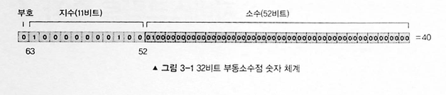
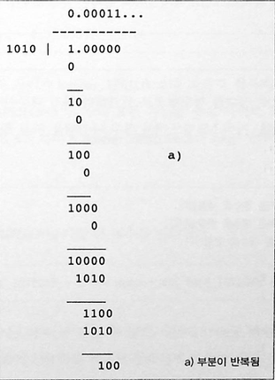

# 3. 자바스크립트 숫자

프로그래밍 언어에서 숫자 연산 덕분에 숫자 값을 계산할 수 있다. 연산에는 다음과 같은 것들이 있다.

- '+' : 덧셈
- '-' : 뺄셈
- '/' : 나눗셈
- '\*' : 곱셈
- '%' : 나머지 연산

## 숫자 체계

자바스크립트는 그림과 같이 숫자에 대해 64비트 부동소수점 표현을 사용한다. 다음 예에서 값은 40이다. 부호 비트(63번째 비트)가 1이면 해당 숫자가 음수다. 다음 여덟개의 비트(63번째부터 52번째 비트)는 지수 값 e를 나타낸다. 마지막으로 나머지 52비트가 분수 값을 나타낸다.


64비트를 사용해 같은 다음과 같은 이해하기 난해한 공식에 의해 계산된다.

```
value = (-1)^sign × 2^c-1023 × (1+ ∑(i=1 to 52) b52-i 2^-i)
```

위의 공식을 그림 3-1에 대입해보면 다음과 같다.

```
sign = 0
c = (10000000100)₂ = 1028(10진수)
1 + (∑(i=1 to 52) b52-i 2^-i) = 1 + (0.25)
```

결과는 다음과 같다.
value = 1 × 2^1028-1023 × 1.25 = 1 × 2^5 × 1.25 = 40

십진분수로 인해 자바스크립트에서 부동소수점 체계가 반올림 오류를 일으킬 수 있다.

생활코딩에도 나왔던 예시가 있다.

```
0.1 + 0.2 === 0.3 // false 다
```

0.1을 64비트 부동소수점 숫자로 제대로 표현할 수 없는 이유를 이해하기 위해서는 이진 표기법을 이해해야한다. 이진 표기법으로 십진수를 표현할 때 무한 개의 수가 필요한 경우가 많은데 이로 인해 이진수가 2^n으로 표현되는 것이다. (n은 정수) 0.1을 계산하려 할 때 긴 나눗셈이 끝나지 않을 것이다.



## 자바스크립트 숫자 객체

다행히 위와 같은 문제를 해결하는데 도움이 되는 Number 객체에 내장된 속성들이 있다.

Math.floor, round, ceil 과 같은 메서드다.

### Number.EPSILON

Number.EPSILON 은 두 개의 표현 가능한 숫자 사이의 가장 작은 간격을 반환한다. 이는 부동 소수점 근사치를 활용해 분수가 제대로 표현되지 않는 문제를 해결하는데 유용하다.

```javascript
function numberEquals(x, y) {
  return Math.abs(x - y) < Number.EPSILON;
}

numberEquals(0.1 + 0.2, 0.3); // true
```

위의 함수는 두 수의 차이가 Number.EPSILON 보다 작은지 검사해 더 작은 경우 true를 반환한다.

### 최대치 : Number.MAX_SAFE_INTEGER

```javascript
Number.MAX_SAFE_INTEGER + 1 === Number.MAX_SAFE_INTEGER + 2; // true
```

위의 코드에서 두 수는 이상 커질 수 없기 때문에 true를 반환하지만 위의 코드를 부동소수점과 같이 사용하면 제대로 동작하지 않으며 결과는 false이다.

### 최소치 : Number.MIN_SAFE_INTEGER

Number.MIN_SAFE_INTEGER는 -900719954640991 이다.

```
Number.MIN_SAFE_INTEGER - 1 === Number.MIN_SAFE_INTEGER - 2 // true
```

위 코드는 더 이상 작아질 수 없어서 true이다.

### 무한

Number.MAX_VALUE 보다 큰 것은 Infinity고 , Number.MAX_SAFE_INTEGER 보다 작은 유일한 것은 -Infinity이다.

```
Infinity > Number.MAX_SAFE_INTEGER; // true
-Infinity < -Number.MAX_SAFE_INTEGER; // true
-Infinity -32323323 == -Infinity -1; // true
```

## 숫자 알고리즘

### 소수 찾기

숫자가 소수인지 알아보는 방법은 숫자 n 을 2부터 n-1 까지의 수로 나눠 나머지가 0인지 확인하면 된다.

**여기서 소수란?**
소수는 1보다 큰 자연수 중에서 1과 자기 자신으로만 나누어떨어지는 수를 말합니다.

```javascript
function isPrime(n) {
  if (n <= 1) {
    return false;
  }

  // 2부터 n-1까지의 수로 나눈다.
  for (var i = 2; i < n; i++) {
    if (n % i == 0) {
      return false;
    }
  }

  return true;
}
```

시간복잡도는 O(n)이다.

위의 메소드가 2부터 n까지 어떤 식으로 순회하는지 생각해보면 더 빠르게 만들 수 있다. 우선 2의 배수는 무시해도된다.

우선 소수를 나열해보자.

```
2, 3, 5, 7, 11, 13, 17, 19, 23, 29, 31, 37, 41, 43, 47, 53, 59, 61, 67, 71, 73, 79, 83, 89, 97
```

2,3을 제외하고는 모든 소수는 6k +- 1의 형태를 지닌다.

```javascript
function isPrime(n) {
  if (n <= 1) return false;
  if (n <= 3) return true;

  // 입력된 수가 2 또는 3의 짝수 이면 반복문에서
  // 다시 계의 수치를 건너뛸 수 있다.
  if (n % 2 == 0 || n % 3 == 0) return false;

  for (var i = 5; i * i <= n; i += 6) {
    if (n % i == 0 || n % (i + 2) == 0) return false;
  }

  return true;
}
```

시간 복잡도: O(√n)

### 소인수분해

```javascript
function primeFactors(n) {
  // n이 2로 나누어지는 나누어 쓸 있는 수만큼 2가 출력된다.
  while (n % 2 == 0) {
    console.log(2);
    n = n / 2;
  }

  // 이 지점에서 n은 홀수이다 확실하다. 따라서 숫을 두 개씩 증가시킬 수 있다(주의: i = i +2).
  for (var i = 3; i * i <= n; i = i + 2) {
    // i가 n을 나눈 수 있는 한 계속해서 i가 출력되고 n을 i로 나눈다.
    while (n % i == 0) {
      console.log(i);
      n = n / i;
    }
  }

  // 다음 조건은 n이 2보다 큰 소수일 경우를 처리하기 위해 있다.
  if (n > 2) {
    console.log(n);
  }
}

primeFactors(10); // '5'와 '2'를 출력한다.
```

시간복잡도 : O(√n)

위의 알고리즘은 i로 나머지가 없이 나눌 수 있는 모든 수를 출력한다.
소수가 함수의 입력 값으로 전달된 경우 아무 수도 출력되지 않다가 마지막 조건문에서 n이 2보다 큰지 확인한 다음 n이 2보다 큰 경우 n이 출력될 것이다.

### 무작위 수 생성기

Math.random() => 0과 1사이의 부동소수점을 반환

# 자바스크립트 숫자 알고리즘 연습문제

## 문제 1: 완전수 판별하기

<details>
<summary><strong>문제</strong></summary>

완전수(Perfect Number)란 자기 자신을 제외한 모든 양의 약수의 합이 자기 자신과 같은 수입니다.
예: 6 = 1 + 2 + 3 (6의 약수: 1, 2, 3, 6)

주어진 수가 완전수인지 판별하는 함수를 작성하세요.

```javascript
function isPerfectNumber(n) {
  // 여기에 코드를 작성하세요
}

// 테스트
console.log(isPerfectNumber(6)); // true
console.log(isPerfectNumber(28)); // true
console.log(isPerfectNumber(12)); // false
```

**시간복잡도 목표: O(√n)**

</details>

<details>
<summary><strong>해답</strong></summary>

```javascript
function isPerfectNumber(n) {
  if (n <= 1) return false;

  let sum = 1; // 1은 모든 수의 약수

  // √n까지만 확인하여 약수 찾기
  for (let i = 2; i * i <= n; i++) {
    if (n % i === 0) {
      sum += i; // i는 약수

      // i와 n/i가 다르면 n/i도 약수
      if (i !== n / i) {
        sum += n / i;
      }
    }
  }

  return sum === n;
}
```

**핵심 아이디어**: √n까지만 확인하고, 약수 i를 찾으면 n/i도 약수임을 이용

</details>

---

## 문제 2: 최대공약수(GCD) 구하기

<details>
<summary><strong>문제</strong></summary>

유클리드 호제법을 사용하여 두 수의 최대공약수를 구하는 함수를 작성하세요.

```javascript
function gcd(a, b) {
  // 여기에 코드를 작성하세요
}

// 테스트
console.log(gcd(48, 18)); // 6
console.log(gcd(100, 25)); // 25
console.log(gcd(17, 13)); // 1
```

**힌트**: 유클리드 호제법: gcd(a, b) = gcd(b, a % b)
**시간복잡도 목표: O(log(min(a, b)))**

</details>

<details>
<summary><strong>해답</strong></summary>

```javascript
// 재귀 버전
function gcd(a, b) {
  if (b === 0) return a;
  return gcd(b, a % b);
}

// 반복문 버전
function gcdIterative(a, b) {
  while (b !== 0) {
    let temp = b;
    b = a % b;
    a = temp;
  }
  return a;
}
```

**핵심 아이디어**: 나머지가 0이 될 때까지 반복하면 최대공약수를 찾을 수 있음

</details>

---

## 문제 3: 모듈러 지수거듭제곱

<details>
<summary><strong>문제</strong></summary>

큰 수의 거듭제곱을 모듈러 연산으로 효율적으로 계산하는 함수를 작성하세요.
(x^y) % p를 계산합니다.

```javascript
function modularExponentiation(base, exponent, modulus) {
  // 여기에 코드를 작성하세요
}

// 테스트
console.log(modularExponentiation(2, 10, 1000)); // 24 (2^10 % 1000 = 1024 % 1000)
console.log(modularExponentiation(3, 5, 7)); // 5 (3^5 % 7 = 243 % 7)
console.log(modularExponentiation(10, 3, 6)); // 4 (10^3 % 6 = 1000 % 6)
```

**시간복잡도 목표: O(log y)**

</details>

<details>
<summary><strong>해답</strong></summary>

```javascript
function modularExponentiation(base, exponent, modulus) {
  if (modulus === 1) return 0;

  let result = 1;
  base = base % modulus;

  while (exponent > 0) {
    // 지수가 홀수이면 현재 base를 결과에 곱함
    if (exponent % 2 === 1) {
      result = (result * base) % modulus;
    }

    // 지수를 반으로 줄이고, base를 제곱
    exponent = Math.floor(exponent / 2);
    base = (base * base) % modulus;
  }

  return result;
}
```

**핵심 아이디어**: 지수를 이진법으로 분해하여 빠른 거듭제곱 계산

</details>

---

## 문제 4: 에라토스테네스의 체

<details>
<summary><strong>문제</strong></summary>

n 이하의 모든 소수를 찾는 에라토스테네스의 체 알고리즘을 구현하세요.

```javascript
function sieveOfEratosthenes(n) {
  // 여기에 코드를 작성하세요
}

// 테스트
console.log(sieveOfEratosthenes(30));
// [2, 3, 5, 7, 11, 13, 17, 19, 23, 29]

console.log(sieveOfEratosthenes(10));
// [2, 3, 5, 7]
```

**시간복잡도 목표: O(n log log n)**

</details>

<details>
<summary><strong>해답</strong></summary>

```javascript
function sieveOfEratosthenes(n) {
  if (n < 2) return [];

  // 모든 수를 소수로 초기화 (true)
  const isPrime = new Array(n + 1).fill(true);
  isPrime[0] = isPrime[1] = false; // 0과 1은 소수가 아님

  // 2부터 √n까지 확인
  for (let i = 2; i * i <= n; i++) {
    if (isPrime[i]) {
      // i의 배수들을 모두 합성수로 표시
      for (let j = i * i; j <= n; j += i) {
        isPrime[j] = false;
      }
    }
  }

  // 소수만 추출하여 배열로 반환
  const primes = [];
  for (let i = 2; i <= n; i++) {
    if (isPrime[i]) {
      primes.push(i);
    }
  }

  return primes;
}
```

**핵심 아이디어**: 소수의 배수들을 차례로 제거하여 소수만 남김

</details>

---

## 문제 5: 피보나치 수열 (큰 수)

<details>
<summary><strong>문제</strong></summary>

큰 피보나치 수를 효율적으로 계산하는 함수를 작성하세요.
메모이제이션 또는 동적 프로그래밍을 사용하세요.

```javascript
function fibonacci(n) {
  // 여기에 코드를 작성하세요
}

// 테스트
console.log(fibonacci(10)); // 55
console.log(fibonacci(20)); // 6765
console.log(fibonacci(50)); // 12586269025
```

**시간복잡도 목표: O(n)**
**공간복잡도 목표: O(1)**

</details>

<details>
<summary><strong>해답</strong></summary>

```javascript
// 공간복잡도 O(1) 버전
function fibonacci(n) {
  if (n <= 1) return n;

  let prev = 0;
  let curr = 1;

  for (let i = 2; i <= n; i++) {
    let next = prev + curr;
    prev = curr;
    curr = next;
  }

  return curr;
}

// 메모이제이션 버전 (더 빠른 중복 호출에 유리)
function fibonacciMemo() {
  const memo = {};

  return function fibonacci(n) {
    if (n <= 1) return n;
    if (memo[n]) return memo[n];

    memo[n] = fibonacci(n - 1) + fibonacci(n - 2);
    return memo[n];
  };
}

const fibMemo = fibonacciMemo();
```

**핵심 아이디어**: 이전 계산 결과를 저장하여 중복 계산 방지

</details>

---

## 보너스 문제: 부동소수점 정밀도 처리

<details>
<summary><strong>문제</strong></summary>

소수점 연산에서 발생하는 정밀도 문제를 해결하는 함수를 작성하세요.

```javascript
function safeAdd(a, b, precision = 10) {
  // 여기에 코드를 작성하세요
}

function safeEquals(a, b, epsilon = Number.EPSILON) {
  // 여기에 코드를 작성하세요
}

// 테스트
console.log(0.1 + 0.2 === 0.3); // false
console.log(safeAdd(0.1, 0.2) === 0.3); // true
console.log(safeEquals(0.1 + 0.2, 0.3)); // true
```

</details>

<details>
<summary><strong>해답</strong></summary>

```javascript
function safeAdd(a, b, precision = 10) {
  const factor = Math.pow(10, precision);
  return Math.round((a + b) * factor) / factor;
}

function safeEquals(a, b, epsilon = Number.EPSILON) {
  return Math.abs(a - b) < epsilon;
}

// 더 정교한 버전
function preciseCalculation(a, b, operation, precision = 10) {
  const factor = Math.pow(10, precision);
  const intA = Math.round(a * factor);
  const intB = Math.round(b * factor);

  let result;
  switch (operation) {
    case "+":
      result = (intA + intB) / factor;
      break;
    case "-":
      result = (intA - intB) / factor;
      break;
    case "*":
      result = (intA * intB) / (factor * factor);
      break;
    case "/":
      result = intA / intB;
      break;
    default:
      throw new Error("지원하지 않는 연산입니다.");
  }

  return Math.round(result * factor) / factor;
}
```

**핵심 아이디어**: 정수 연산으로 변환하여 부동소수점 오차 제거

</details>
