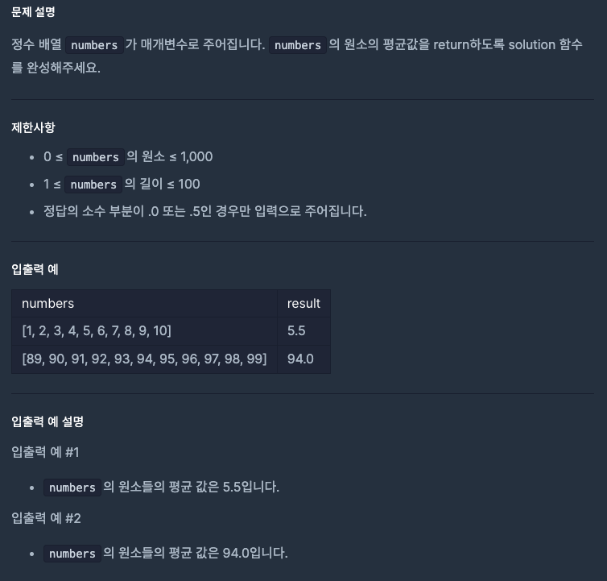
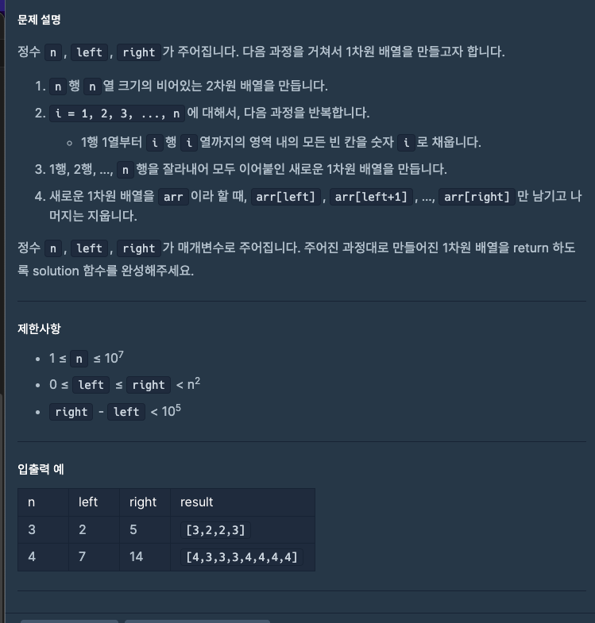
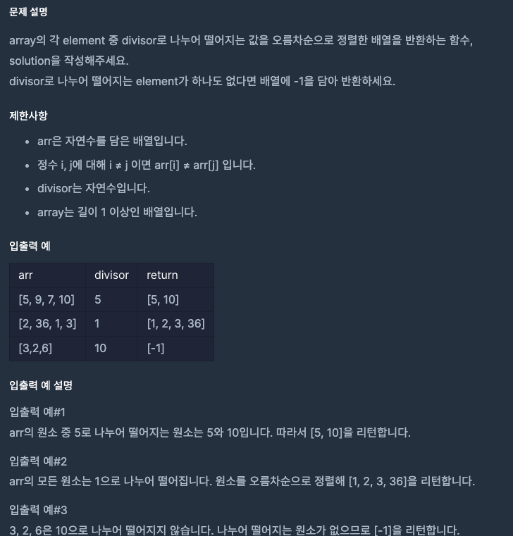

# 자바스크립트 배열

삽입, 삭제 접근 등... 스킵

### slice(begin, end)

.slice()는 기존배열 수정하지 않고 해당 배열의 일부를 반환.

```javascript
var array1 = [1, 2, 3, 4];

array1.slice(1, 2); // [2]를 반환합니다, array1 = [1, 2, 3, 4]
array1.slice(2, 4); // [3, 4]를 반환합니다, array1 = [1, 2, 3, 4]
array1.slice(1); // [2, 3, 4]를 반환합니다, array1 = [1, 2, 3, 4]
array1.slice(1, 4); // [2, 3, 4]를 반환합니다, array1 = [1, 2, 3, 4]
```

- 원본 배열(array1)은 변경되지 않습니다
- begin 인덱스는 포함됩니다
- end 인덱스는 포함되지 않습니다 (미만)

### splice(begin, size, element1, element2...);

.splice는 세 개의 매개변수는 시작 인덱스, 제거할 항목의 크기, 추가할 신규 항목이다

```javascript
var array1 = [1, 2, 3, 4];

array1.splice(); // []를 반환합니다, array1 = [1, 2, 3, 4]
array1.splice(1, 2); // [2, 3]을 반환합니다, array1 = [1, 4]
var array1 = [1, 2, 3, 4];

array1.splice(); // []를 반환합니다, array1 = [1, 2, 3, 4]
array1.splice(1, 2, 5, 6, 7); // [2, 3]을 반환합니다, array1 = [1, 5, 6, 7, 4]
```

1. begin (시작 인덱스)
   제거를 시작할 인덱스 위치
2. size (제거할 개수)
   몇 개의 요소를 제거할지 지정
3. element1, element2, ... (선택사항)
   제거한 위치에 삽입할 새로운 요소들

### concat()

신규항목을 배열의 맨 뒤에 추가한다음 해당 배열을 반환.

```javascript
var array1 = [1, 2, 3, 4];
array1.concat(); // [1,2,3,4] 반환
array1.concat([2, 3, 4]); //[1,2,3,4,2,3,4] 반환
```

# 연습문제 풀어봅시다!

[교재 연습문제 링크] https://github.com/Apress/js-data-structures-and-algorithms

[배열의 평균값]

https://school.programmers.co.kr/learn/courses/30/lessons/120817



[n^2 배열 자르기]

https://school.programmers.co.kr/learn/courses/30/lessons/87390



[나누어 떨어지는 숫자 배열]

https://school.programmers.co.kr/learn/courses/30/lessons/12910


