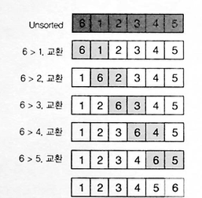
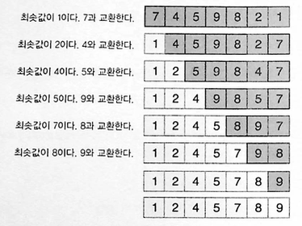
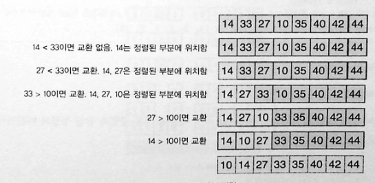
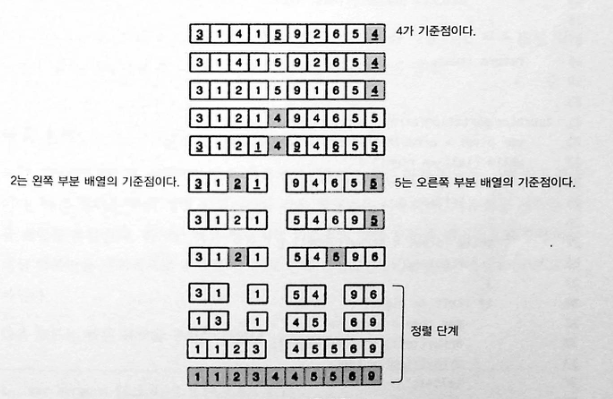
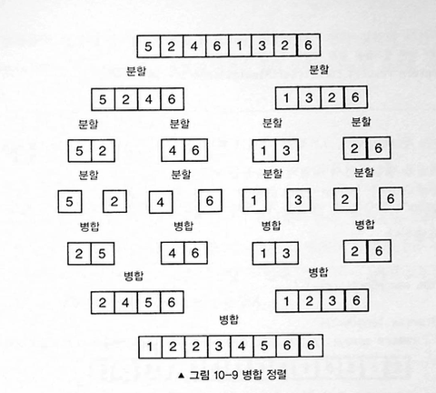
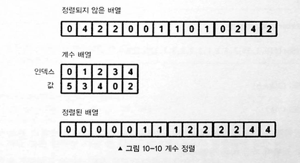
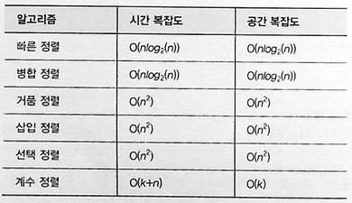

# 10장 검색과 정렬

검색은 자료 구조내에서 특정 항목을 찾는 일을 말한다! 여기에서는 선형 검색과 이진 검색에 대해서 배운다.

## 선형 검색

배열의 각 항목을 한 인덱스씩 순차적으로 접근하면서 동작한다.

```javascript
// 배열을 순회하면서 찾는다.
function linearSearch(array, n) {
  for (var i = 0; i < array.length; i++) {
    if (array[i] === n) {
      return true;
    }
  }
  return false;
}

console.log(linearSearch([1, 2, 3, 4, 5, 6, 7, 8, 9], 6)); // true
console.log(linearSearch([1, 2, 3, 4, 5, 6, 7, 8, 9], 10)); // false
```

시간복잡도는 O(n)이다. 반복은 6번 수행되는데, 최악의 경우 전체 배열을 순회해야하기 때문에 O(n)의 시간복잡도를 갖는다. 이와 같은 선형 검색 알고리즘은 배열의 정렬 여부와 상관없이 동작한다. 따라서 배열이 정렬되지 않은 경우에는 선형 검색을 사용해야한다.

## 이진 검색

이진 검색은 정렬된 자료에 사용할 수 있는 검색 알고리즘이다. 배열의 모든 항목을 확인하는 선형 검색 알고리즘과 달리 이진 검색은 중간 값을 확인해 값이 큰지 작은지 확인한다. 원하는 값이 중간 값보다 작은 경우 이진 검색 알고리즘은 중간 값도다 작은 쪽을 검색하고 큰경우 큰 값을 검색한다.

```javascript
function binarySearch(array, n) {
  var lowIndex = 0,
    highIndex = array.length - 1;

  while (lowIndex <= highIndex) {
    var midIndex = Math.floor((highIndex + lowIndex) / 2);
    if (array[midIndex] === n) {
      return midIndex; // 찾았다! 인덱스 반환
    } else if (n > array[midIndex]) {
      lowIndex = midIndex; // 찾는 값이 더 크니까 오른쪽 절반을 탐색
    } else {
      highIndex = midIndex; // 찾는 값이 더 작으니까 왼쪽 절반을 탐색
    }
  }
  return -1;
}

console.log(binarySearch([1, 2, 3, 4], 4)); // true
console.log(binarySearch([1, 2, 3, 4], 5)); // -1
```

이진 검색 예시!

```javascript
// [1, 2, 3, 4, 5, 6, 7, 8, 9]에서 7을 찾는다면?

// 1단계: midIndex = 4 (값: 5)
// 7 > 5 이므로 → 오른쪽 절반 [6, 7, 8, 9]로 범위 축소

// 2단계: midIndex = 6 (값: 7)
// 7 === 7 찾았다! → return 6
```

## 버블 정렬

전체 배열을 순회하면서 항목이 다른 항목보다 큰 경우 두 항목을 교환한다.
아래는 버블 정렬을 가장 쉽게 이해할 수 있는 그림 예시이다.



```javascript
function bubbleSort(array) {
  for (var i = 0, arrayLength = array.length; i < arrayLength; i++) {
    for (var j = 0; j <= i; j++) {
      if (array[i] < array[j]) {
        swap(array, i, j);
      }
    }
  }
  return array;
}
bubbleSort([6, 1, 2, 3, 4, 5]); // [1,2,3,4,5,6]
```

시간 복잡도 : O(n^2) / 공간 복잡도 : O(1)

버블 정렬은 최악의 종류 정렬이다. 모든 가능한 짝을 비교하기 때문이다.

## 선택 정렬

가장 작은 항목을 찾아서 해당 항목을 배열의 현 위치에 삽입하는 방식으로 동작한다.



```javascript
function selectionSort(items) {
  var len = items.length,
    min;

  for (var i = 0; i < len; i++) {
    // 최소 항목을 현재 위치로 설정한다.
    min = i;
    // 더 작은 항목이 있는지 배열의 나머지를 확인한다.
    for (j = i + 1; j < len; j++) {
      if (items[j] < items[min]) {
        min = j;
      }
    }

    // 현재 위치가 최소 항목 위치가 아니라면 항목들을 교환한다.
    if (i != min) {
      swap(items, i, min);
    }
  }

  return items;
}

selectionSort([6, 1, 23, 4, 2, 3]); // [1, 2, 3, 4, 6, 23]
```

시간 복잡도 : O(n^2) / 공간 복잡도 : O(1)
중첩루프 때문에 선택 정렬 시간 복잡도는 여전히 O(n^2)

## 삽입 정렬

배열을 순차적으로 검색하면서 정렬되지 않은 항목들을 배열의 왼쪽의 정렬된 부분으로 이동시킨다. 이러한 점에 있어 삽입 정렬은 선택 정렬과 비슷하다.


```javascript
function insertionSort(items) {
  var len = items.length, // 배열의 항목 수
    value, // 현재 비교 중인 값
    i, // 정렬되지 않은 부분의 인덱스
    j; // 정렬된 부분의 인덱스

  for (i = 0; i < len; i++) {
    // 현재 값에 아직이 이동할 수도 있기 때문에 저장한다.
    value = items[i];

    // 정렬된 부분의 값이 정렬되지 않은 부분의 값보다 큰 경우
    // 정렬된 부분의 모든 항목을 하나씩 이동시킨다.
    // 이는 값을 삽입할 공간을 만든다.

    for (j = i - 1; j > -1 && items[j] > value; j--) {
      items[j + 1] = items[j];
    }
    items[j + 1] = value;
  }

  return items;
}

insertionSort([6, 1, 23, 4, 2, 3]); // [1, 2, 3, 4, 6, 23]
```

시간 복잡도 : O(n^2) / 공간 복잡도 : O(1)

## 빠른 정렬

기준점을 획득한 다음 해당 기준점을 기준으로 배열을 나눈다.(한쪽에는 기준점보다 큰 항목들이 위치하고 다른 쪽에는 기준점보다 작은 항목들이 위치한다.) 이런 식으로 모든 항목이 정렬될 때까지 이 과정을 반복한다. 가장 이상적인 기준점은 배열의 중간 값이다. 중간 값이 배열을 균등하게 나눌 수 있기 때문이다. 하지만 정렬되지 않은 중간 값을 얻기 위해서는 계산하는데 선형시간이 걸린다. 따라서 일반적으로 분할 부분의 첫 번째 항목과 중간 항목, 마지막 항목의 중간 값을 취해 기준점을 얻는다.



```javascript
function quickSort(items) {
  return quickSortHelper(items, 0, items.length - 1);
}

function quickSortHelper(items, left, right) {
  var index;
  if (items.length > 1) {
    index = partition(items, left, right);

    if (left < index - 1) {
      quickSortHelper(items, left, index - 1);
    }

    if (index < right) {
      quickSortHelper(items, index, right);
    }
  }
  return items;
}

function partition(array, left, right) {
  var pivot = array[Math.floor((right + left) / 2)];
  while (left <= right) {
    while (pivot > array[left]) {
      left++;
    }
    while (pivot < array[right]) {
      right--;
    }
    if (left <= right) {
      var temp = array[left];
      array[left] = array[right];
      array[right] = temp;
      left++;
      right--;
    }
  }
  return left;
}

quickSort([6, 1, 23, 4, 2, 3]); // [1, 2, 3, 4, 6, 23]
```

시간 복잡도 : 평균 O(n log n) , 최악의경우 O(n^2)
공간 복잡도 : O(log(n))

## 빠른 선택

빠른 선택은 정렬되지 않은 목록에서 k번째로 작은 항목을 찾는 선택 알고리즘이다. 기준점을 선택한 다음 배열을 분할한다. 하지만 빠른 정렬처럼 기준점의 양쪽 모두를 재귀적으로 수행하는 대신 한쪽만을 재귀적으로 수행한다.

```javascript
var array = [1, 3, 3, -2, 3, 14, 7, 8, 1, 2, 2];
// 정렬된 형태: [-2, 1, 1, 2, 2, 3, 3, 3, 7, 8, 14]

function quickSelectInPlace(A, l, h, k) {
  var p = partition(A, l, h);
  if (p === k - 1) {
    return A[p];
  } else if (p > k - 1) {
    return quickSelectInPlace(A, l, p - 1, k);
  } else {
    return quickSelectInPlace(A, p + 1, h, k);
  }
}

function medianQuickselect(array) {
  return quickSelectInPlace(
    array,
    0,
    array.length - 1,
    Math.floor(array.length / 2)
  );
}

quickSelectInPlace(array, 0, array.length - 1, 5); // 2
// 2 - 5번째로 가장 작은 항목이 떠올이다.
quickSelectInPlace(array, 0, array.length - 1, 10); // 7
// 7 - 10번째로 가장 작은 항목이 떠올이다.
```

시간 복잡도 : O(n)

## 병합 정렬

각 하위 배열에 하나의 항목이 존재할 때까지 배열을 하위 배열로 나눈다. 그러고 나서 각 하위 배열을 정렬된 순서로 연결한다. merge 함수는 양쪽 배열의 모든 항목을 정렬된 순서로 더해서 '결과 배열'에 저장해야한다. 이를 위해서는 각 배열의 인덱스를 생성해 이미 비교한 항목들을 추적해야한다.



```javascript
function mergeSort(array) {
  if (array.length < 2) {
    return array; // 기저 조건: 항목이 하나뿐이라면 해당 배열은 이미 정렬된 것이다.
  }

  var midpoint = Math.floor(array.length / 2),
    leftArray = array.slice(0, midpoint),
    rightArray = array.slice(midpoint);

  return merge(mergeSort(leftArray), mergeSort(rightArray));
}

mergeSort([6, 1, 23, 4, 2, 3]); // [1, 2, 3, 4, 6, 23]
```

시간 복잡도 : O(nlog(n)) / 공간 복잡도 : O(n)

병합정렬은 이후에 병합할 n 개의 배열을 생성해야 하기 때문에 공간 복잡도가 크다.

## 계수 정렬

계수 정렬은 값들을 비교하지 않기 때문에 O(k+n) 시간 안에 수행된다. 계수 정렬은 숫자에 대해서만 동작하며 특정법위가 주어져야한다. 항목들을 교환하면서 정렬하는 대신에 배열의 각 항목 등장 횟수를 센다. 각 항목의 등장 횟수를 센 다음 해당 등장 횟수를 사용해 새로운 배열을 생성할 수 있다.





## 정렬 예시 문제

https://school.programmers.co.kr/learn/courses/30/lessons/42748

https://school.programmers.co.kr/learn/courses/30/lessons/42747
