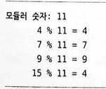
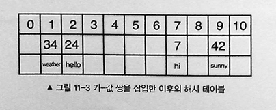
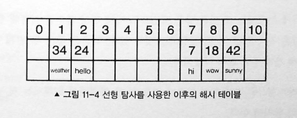
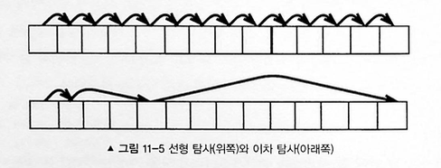

# 해시테이블

해시 테이블은 고정된 크기의 자료 구조로 처음에 크기가 정해진다. 그리고 자료를 쉽고 빠르게 저장할 수 있고 키-값 쌍을 기반으로 자료를 얻을 수 있다.


해시 테이블에는 put()과 get()이라는 두 가지 주요 함수가 있다.
put()은 자료를 해시테이블에 저장하고, get은 자료를 얻는 데 사용된다. 두 함수 시간복잡도가 O(1)이다.

간단히 말하자면 해시 테입르은 인덱스가 해싱함수에 의해 계산 되는 배열과 유사하다

## 해싱 기법

해시 테이블에서 가장 중요한 부분은 해시 함수다. 해시 함수는 특정 키를 자료로 저장하는 배열의 인덱스로 변환한다. 좋은 해시 함수가 되기 위한 세 가지 주요 요구 사항이 있다.

1. 결정성 : 동일한 키는 동일한 해시값 생성
2. 효율성 : 시간 복잡도가 O(1)이어야한다.
3. 균일한 분배 : 배열 전체를 최대한 활용해야 한다.

해싱의 첫 번째 기법은 소수를 사용하는 것이다. 소수와 모듈러 연산을 사용함으로써 인덱스의 균일한 분배를 보장할 수 있다.

### ✅ 여기서 잠깐 모듈러 연산이란?

모듈러 연산은 나눗셈의 나머지를 구하는 연산입니다. 수학 기호로는 % 또는 mod로 표현합니다.

```javscript
4 % 11 = 4   (4를 11로 나누면 몫은 0, 나머지는 4)
7 % 11 = 7   (7을 11로 나누면 몫은 0, 나머지는 7)
9 % 11 = 9   (9를 11로 나누면 몫은 0, 나머지는 9)
15 % 11 = 4  (15를 11로 나누면 몫은 1, 나머지는 4)
```

왜 사용하나요?

- 순환 패턴 만들기: 15와 4가 같은 나머지를 가지므로 순환 생성 가능
- 값 범위 제한: 어떤 큰 숫자도 항상 0~10 사이의 값으로 변환 (모듈러 11일 때)

### ✅ 소수 해싱

해싱에서 소수는 중요하다. 소수를 사용한 모듈러 나눗셈이 균일한 방식으로 배열 인덱스를 생성한다.



입력이 15, 4인 경우에 동일한 키가 생성돼 충돌이 발생한 것을 확인할 수 있다. 소수에 의한 모듈러는 고정된 크기에 균등한 분배를 보장한다는 것이다.



그래서 핵심 개념 : 큰 숫자를 작은 공간에 저장한다!

문제 상황

- 키(key) 값들: 7, 24, 42, 34
- 저장 공간: 0~10번 인덱스 (11칸)
- 어떻게 큰 숫자(42)를 11칸짜리 배열에 저장할까?

해결책: 모듈러 연산 (% 11)

```javascript
// 해시 함수: 나머지를 이용해 저장 위치 결정
function hashFunction(key, size = 11) {
  return key % size;
}

// 각 키의 저장 위치 계산
7 % 11 = 7   → 7번 인덱스에 저장
24 % 11 = 2  → 2번 인덱스에 저장
42 % 11 = 9  → 9번 인덱스에 저장
34 % 11 = 1  → 1번 인덱스에 저장
```

```javascript
### 📊 해시 테이블 시각화
인덱스:  [0] [1] [2] [3] [4] [5] [6] [7] [8] [9] [10]
키:          34  24                  7      42
값:      weather hello               hi    sunny


// 🔥 충돌(Collision) 문제
// 이미지 상단 예시처럼 같은 위치에 저장되는 경우가 발생:
// 모듈러 조치: 4
6 % 4 = 2
10 % 4 = 2  // ❌ 충돌 발생! 둘 다 2번 인덱스

// 모듈러 조치: 11 (더 큰 수)
6 % 11 = 6
10 % 11 = 10  // ✅ 다른 위치에 저장됨

//왜 충돌이 발생할까?
// 예: 배열 크기가 4일 때
0 % 4 = 0
4 % 4 = 0  // 충돌!
8 % 4 = 0  // 충돌!

// 배열 크기가 11일 때 (더 큼)
0 % 11 = 0
4 % 11 = 4   // 분산됨
8 % 11 = 8   // 분산됨

//결론: 배열 크기가 클수록 충돌 확률 감소!
```

## 탐사

충돌이 발생하는 것을 피하기 위해 탐사 해싱 기법을 사용해서 다음으로 사용가능한 인덱스를 찾을 수 있다.

### 선형탐사

한 번에 인덱스를 증가시킴으로써 사용가능한 인덱스르 찾는다.
선형 탐사의 주요 단점은 군집이 쉽게 발생한다는 것이다. 군집은 순회ㅐ야할 자료를 더 많이 생성하기 때문에 좋지 못하다.


### 이차 탐사

이차 탐사는 군집 문제를 해결하는데 좋은 기법이다.
이차 탐사는 매번 1씩 증가시키는 대신 완전 제곱을 사용한다. 인덱스에 키를 균등하게 분배하는 데 도움이 된다.


### 재해싱 / 이중 해싱

키를 균일하게 분배하는 또 다른 좋은 방법으로 이차 해싱 함수를 사용해 원래 해싱 함수로부터 나온 결과를 한 번 더 해싱하는 것이 있다. 다음은 좋은 두 번째 해싱 함수가 지녀야 할 세 가지 주요 요구 사항이다.

- 달라야 함 : 두 번째 해싱 함수가 키를 더 잛 분배하기 위해서는 첫 번째 해싱 함수와 달라야한다.
- 효율적이어야 함 : 두 번째 해싱 함수의 시간복잡도가 여전히 O(1) 이어야한다.
- 0이 아니어야 함 : 두 번째 해싱함수의 결과가 0이 돼서는 안된다. 0은 초기 해시값을 결과로 내기 떄문이다.

## 해시 테이블 구현

### 1. 선형 탐사 사용하기

```javascript
function HashTable(size) {
  this.size = size;
  this.keys = this.initArray(size);
  this.values = this.initArray(size);
  this.limit = 0;
}

HashTable.prototype.put = function (key, value) {
  if (this.limit >= this.size) throw "hash table is full";

  var hashedIndex = this.hash(key);

  // 선형 탐사
  while (this.keys[hashedIndex] != null) {
    hashedIndex++;
    hashedIndex = hashedIndex % this.size;
  }

  this.keys[hashedIndex] = key;
  this.values[hashedIndex] = value;
  this.limit++;
};

HashTable.prototype.get = function (key) {
  var hashedIndex = this.hash(key);

  while (this.keys[hashedIndex] != key) {
    hashedIndex++;
    hashedIndex = hashedIndex % this.size;
  }

  return this.values[hashedIndex];
};

HashTable.prototype.hash = function (key) {
  // 키가 정수인지 확인한다.
  if (!Number.isInteger(key)) throw "must be int";
  return key % this.size;
};

HashTable.prototype.initArray = function (size) {
  var array = [];
  for (var i = 0; i < size; i++) {
    array.push(null);
  }
  return array;
};

var exampletable = new HashTable(13);
exampletable.put(7, "hi");
exampletable.put(20, "hello");
exampletable.put(33, "sunny");
exampletable.put(46, "weather");
exampletable.put(59, "wow");
exampletable.put(72, "forty");
exampletable.put(85, "happy");
exampletable.put(98, "sad");
```

해시 연습문제

[폰켓몬] https://school.programmers.co.kr/learn/courses/30/lessons/1845 </br>
[의상] https://school.programmers.co.kr/learn/courses/30/lessons/42578
