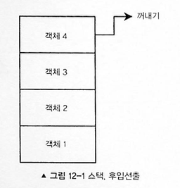
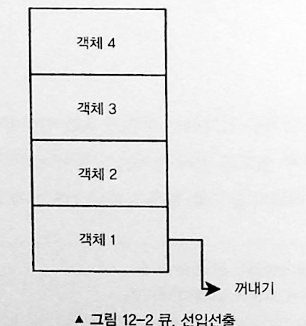
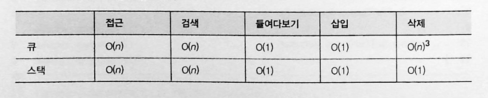

# 스택과 큐

## 스택

자료 구조의 일종으로, 마지막에 삽입된 항목만을 제거하고 접근할 수 있다.
찾기와 삽입이 상수 시간인 O(1)에 이루어진다. 마지막에 추가된 항목만을 접근해야하는 후입선출(LIFO) 형태로 자료를 처리해야 하는 경우에만 배열에 대해 사용한다.



```javascript
function Stack(array) {
  this.array = [];
  if (array) this.array = array;
}

Stack.prototype.getBuffer = function () {
  return this.array.slice();
};

Stack.prototype.isEmpty = function () {
  return this.array.length == 0;
};

// 스택 클래스의 인스턴스
var stack1 = new Stack();

console.log(stack1); // {array: []}
```

### 들여다보기 (peeking)

마지막에 추가된 항목을 스택 자료 구조에서 제거하지 않고 반환하는 것을 의미한다. 주로 마지막에 추가된 항목을 다른 변수와 비교해 마지막에 추가된 항목을 자료구조에서 제거해야 할지 결정하기 위해 주로 사용된다.

```javascript
Stack.prototype.peek = function () {
  return this.array[this.array.length - 1];
};

stack1.push(10);
console.log(stack1.peek()); // 10
stack1.push(5);
console.log(stack1.peek()); // 5
```

### 삽입

```javascript
Stack.prototype.push = function (value) {
  this.array.push(value);
};

stack1.push(1);
stack1.push(2);
stack1.push(3);
console.log(stack1); // {array: [1,2,3]}
```

### 삭제

```javascript
Stack.prototype.pop = function () {
  return this.array.pop();
};

stack1.pop(1);
stack1.pop(2);
stack1.pop(3);

console.log(stack1); // {array: []}
```

### 접근

```javascript
function stackAccessNthTopNode(stack, n) {
  var bufferArray = stack.getBuffer();
  if (n <= 0) throw "error";

  var bufferStack = new Stack(bufferArray);

  while (!bufferStack.isEmpty()) {
    {
      if (bufferStack.pop() === element) {
        return true;
      }
    }
  }
  return false;
}
```

보통 문제들 봤을 때는 클래스로 구현해서 필요한 메서드들 사용하더라고요!

## 큐

큐는 스택과 달리 첫 번째로 추가된 항목만을 제거할 수 있는 자료구조다. 이러한 원리를 선입선출(FIFO) 라고 한다. 연산이 상수 시간이라는 점이 큐의 장점이다. 큐는 스택과 비슷하게 한 번에 한 개의 항목만 접근할 수 있기 때문에 한계가 있다.



```javascript
function Queue(array) {
  this.array = [];
  if (array) this.array = array;
}

Queue.prototype.getBuffer = function () {
  return this.array.slice();
};

Queue.prototype.isEmpty = function () {
  return this.array.length == 0;
};

// 큐 클래스의 인스턴스
var queue1 = new Queue();

console.log(queue1); // { array: [] }
```

### 조회

```javascript
Queue.prototype.peek = function () {
  return this.array[0];
};
```

### 삽입

```javascript
Queue.prototype.enqueue = function (value) {
  return this.array.push(value);
};
```

### 삭제

```javascript
Queue.prototype.dequeue = function () {
  return this.array.shift();
};

var queue1 = new Queue();

queue1.enqueue(1);
queue1.enqueue(2);
queue1.enqueue(3);

console.log(queue1); // {array: [1,2,3]}

queue1.dequeue();
console.log(queue1); // {array: [2,3]}

queue1.dequeue();
console.log(queue1); // {array: [3]}
```

### 접근

```javascript
function queueAccessNthTopNode(queue, n) {
  var bufferArray = queue.getBuffer();
  if (n <= 0) throw "error";

  var bufferQueue = new Queue(bufferArray);

  while (--n != 0) {
    bufferQueue.dequeue();
  }
  return bufferQueue.dequeue();
}
```

### 검색

```javascript
// 큐에 어떤 항목이 존재하는지 확인하기 위해서는 큐를 검색해야 한다.
// 검색 역시 원래 큐에 변경이 생기지 않도록 버퍼 큐를 우선 생성해야 한다.
function queueSearch(queue, element) {
  var bufferArray = queue.getBuffer();

  var bufferQueue = new Queue(bufferArray);

  while (!bufferQueue.isEmpty()) {
    if (bufferQueue.dequeue() == element) {
      return true;
    }
  }
  return false;
}
```

### 큐와 스택 시간복잡도 요약



연습문제

[큐] https://school.programmers.co.kr/learn/courses/30/lessons/12909 </br>
[스택] https://school.programmers.co.kr/learn/courses/30/lessons/12906
