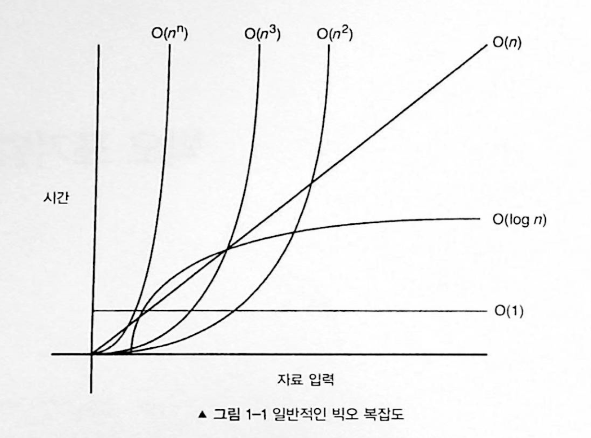

# 1장 빅오 표기법

> 알고리즘을 구현하는 법을 학습하기 전에 알고리즘이 얼마나 효과적인지 분석하는 방법을 이해해야 한다.

## 빅오 표기법 기초

일반적인 빅오 표기법


#### 일반적인 예

`O(1)`은 입력 공간에 대해 변하지 않아서 `O(1)`을 상수 시간이라고 부른다. 배열에 있는 항목을 인덱스를 사용해 접근하는 경우가 `O(1)`알고리즘의 예다.
`O(n)`은 선형 시간이고 최악의 경우에 n번의 연산을 수행해야 하는 알고리즘에 적용된다.
```js
// O(n) 알고리즘의 예
function exampleLinear(n) {
	for (var i = 0; i < n; i++ ) {
		console.log(i)
	}
}
```

O(n<sup>2</sup>) 은 2차 시간이고 O(n<sup>3</sup>) 은 3차 시간이다. 2차 시간과 3차 시간 복잡도의 예는 다음과 같다.
```js
function exampleQuadratic(n) {
	for (var i = 0; i < n; i++ ) {
		console.log(i)
		for (var j = i; j < n; j++ ) {
			console.log(j)
		}
	}
}
```

```js
function exampleCubic(n) {
	for (var i = 0; i < n; i++ ) {
		console.log(i)
		for (var j = i; j < n; j++ ) {
			console.log(j)
			for (var k = j; k < n; k++ ) {
				console.log(k)
			}
		}
	}
}
```

로그 시간 복잡도를 지닌 알고리즘의 예는 2의 2승부터 n승까지의 항목들을 출력하는 경우가 있다. 예를 들어 `exampleLogarithmic(10)`은 다음 결과를 출력한다.
```js
2, 4, 8, 16, 32, 64

// 위 결과는 exampleLogarithmic(100) 일 경우가 아닐까?
// exampleLogarithmic(10) 실제 출력은 다음과 같다.
2, 4, 8
```

로그 시간 복잡도의 효율은 백만 개의 항목과 같이 큰 입력이 있는 경우에 분명하다.
n이 백만이라고 하더라도 `exampleLogarithmic`은 log<sub>2</sub> (1,000,000) = 19.9315686 이기 때문에 단지 19개의 항목만을 출력한다.
로그 시간 복잡도를 구현한 코드는 다음과 같다.
```js
function exampleLogarithmic(n) {
	for (var i = 2; i <= n; i = i*2) {
		console.log(i)
	}
}
```

## 빅오 표기법 규칙
알고리즘의 시간 복잡도를 `f(n)`이라고 표현해보자. 
n은 입력의 개수
f(n)<sub>time</sub> 은 필요한 시간
f(n)<sub>space</sub> 은 필요한 공간

빅오 표기법은 개발자들이 f(n)에 관해 계산하는데 도움이 되는 기본적인 규칙을 제공한다.
#### 계수 법칙
상수 k가 0보다 크다고 할 때, f(n)이 O(g(n))이면 kf(n)은 O(g(n)이다.
이는 입력 크기 n과 관련되지 않은 계수를 제거한다. n이 무한에 가까워지는 경우 다른 계수는 무시해도 되기 떄문이다.
#### 합의 법칙
f(n)이 O(h(n))이고 g(n)이 O(p(n))이면 f(n) + g(n)은 O(h(n) + p(n))이다.
합의 법칙은 결괏값인 시간 복잡도가 두 개의 다른 시간 복잡도의 합이라면 결괏값인 빋오 표기법 역시 두 개의 다른 빅오 표기법의 합이라는 것을 의미한다.

#### 곱의 법칙
f(n)이 O(h(n))이고 g(n)이 O(p(n))이면 f(n)g(n)은 O(h(n)p(n))이다.
마찬가지로 곱의 법칙은 두 개의 다른 시간 복잡도를 곱할 때 빅오 표기법 역시 곱해진다는 것을 의미한다.

#### 전이 법칙
f(n)이 O(g(n))이고 g(n)이 O(h(n))이면 f(n)은 O(h(n))이다. `f(n) -> O(O(h(n)))`
교환 법칙은 동일한 시간 복잡도는 동일한 빅오 표기법을 지님을 나타내기 위한 간단한 방법이다.

#### 다항 법칙
f(n)이 k차 다항식이면 f(n)은 O(n<sup>k</sup>)이다. 직관적으로 다항 법칙은 다항 시간 복잡도가 동일한 다항 차수의 빅오 표기법을 지님을 나타낸다.

첫 번째 3가지 법칙과 다항 법칙이 가장 일반적으로 사용되기 때문에 특히 주의해야 한다.

### 계수 법칙: "상수를 제거하라"

다음은 시간 복잡도 O(n)을 지닌 코드 예다. 아래 코드는 f(n) = n이다.
```js
function a(n) {
	var count = 0
	for (var i = 0; i < n; i++) {
		count += 1
	}
	return count
}
```

다음 코드는 f(n) = 5n이다. 0 부터 5n까지 실행하기 때문이다. 하지만 위와 같이 O(n)의 빅오 표기법을 지닌다.
```js
function a(n) {
	var count = 0
	for (var i = 0; i < 5*n; i++) {
		count += 1
	}
	return count
}
```

다음 코드는 f(n) = n+1 이다. 마지막 연산(count += 3)으로 인해 +1이 추가됐다. 하지만 여전히 O(n)의 빅오 표기법이다.
> f(n) = n + 3 이 아니고?
```js
function a(n) {
	var count = 0
	for (var i = 0; i < n; i++) {
		count += 1
	}
	count += 3
	return count
}
```

### 합의 법칙: "빅오를 더하라"

다음 코드는 두 개의 메인 루프를 포함하는데 각 루프의 시간 복잡도는 개별적으로 계산된 다음 더해져야 한다.
아래 예제는 f(n) = n 과 f(n) = 5n이므로 합은 6n이다. 하지만 최종적인 결과는 O(n)=n 이 된다.
```js
function a(n) {
	var count = 0
	for(var i = 0; i < n; i++) {
		count += 1
	}
	for(var i = 0; i < 5*n; i++) {
		count += 1
	}
	return count
}
```

### 곱의 법칙: "빅오를 곱하라"

다음 코도는 두 개의 중첩 for 루프를 포함하며 해당 중첩 for 루프에 곱의 법칙이 적용된다.
아래 예에서 f(n) = 5n\*n 이다. 곱의 법칙을 적용하면 결과는 O(n) = n<sup>2</sup> 이 된다.
```js
function a(n) {
	var count = 0
	for (var i = 0; i < n; i++ ) {
		count += 1
		for (var j = i; j < 5*n; j++ ) {
			count += 1
		}
	}
	return count
}
```

### 다항 법칙: "빅오의 k승"

다음 코드에는 2차 시간 복잡도를 지닌 for루프가 하나 존재한다.
아래 예에서 f(n) = n<sup>2</sup>이다. 
```js
function a(n) {
	var count = 0
	for (var i = 0; i < n*n; i++) {
		count += 1
	}
	return count
}
```

## 요약
빅오는 알고리즘 효율을 분석하고 비교하는 데 중요하다.

가장 자주 사용되는 법칙들이다.
- 계수/상수 제거하기
- 빅오 더하기
- 빅오 곱하기
- 루프를 조사해 빅오 표기법의 다항 결정하기

