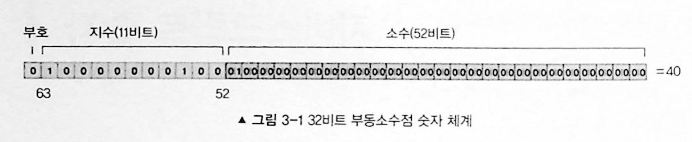

# 3장 자바스크립트 숫자

### 숫자 체계
자바스크립트는 숫자에 대해 64비트 부동소수점 표현을 사용한다.

부호비트(63번째 비트), 다음 여덟개 비트(63~52번째)는 지수 값 e, 나머지 52비트가 분수 값을 나타낸다.




64비트를 사용해 값은 다음과 같은 난해한 공식에 의해 계산된다.
```
value = (-1)^sign × 2^(e-1023) × (1 + Σ(b52-i × 2^-i))
```

여기서:

- `sign`: 부호 비트 (0=양수, 1=음수)
- `e`: 지수 부분의 실제 값
- `1023`: 지수 편향값(bias)
- `Σ(b52-i × 2^-i)`: 가수 부분의 소수값

sign = 0
e = (10000000100)<sub>2</sub> = 1028 (10진수)
$$1 + \left(\sum_{i=1}^{52} b_{52-i} \cdot 2^{-i}\right) = 1 + (0.25)$$
결과는 다음과 같다.
$$\text{value} = 1 \times 2^{1028-1023} \times 1.25 = 1 \times 2^5 \times 1.25 = 40$$

십진분수로 인해 자바스크립트에서 부동소수점 체계가 반올림 오류를 일으킬 수 있다.
예를 들어 0.1과 0.2를 정확하게 표현할 수 없다.

따라서 0.1 + 0.2 === 0.3 결과는 false 이다.

이진 표기법으로 십진수를 표현할 때 무한 개의 수가 필요한 경우가 많다. 이로 인해 이진수가 2<sup>n</sup>으로 표현되는 것이다. n은 정수다.

### 자바스크립트 숫자 객체

위와 같은 문제를 해결하는 데 도움이 되는 Number 객체의 내장된 속성들이 있다.

#### 정수 반올림
자바스크립트가 모든 숫자를 나타낼 때 부동소수점을 사용하기 때문에 정수 나눗셈은 소용이 없다.
자바스크립트에서 정수 나눗셈을 하길 원한다면 다음 중 하나를 사용하면 된다.
```js
Math.floor
Math.round
Math.ceil
```

#### Number.EPSILON
`Number.EPSILON`은 두 개의 표현 가능한 숫자 사이의 가장 작은 간격을 반환한다. 이는 부동소수점 근사치를 활용해 분수가 제대로 표현되지 않는 문제를 해결하는 데 유용하다.
```js
function numberEquals(x, y) {
	return Math.abs(x - y) < Number.EPSILON // abs 절대값 반환
}

numberEquals(0.1 + 0.2, 0.3) // true
```

#### 최대치
`Number.MAX_SAFE_INTEGER`는 가장 큰 정수를 반환한다.
```js
Number.MAX_SAFE_INTEGER + 1 === Number.MAX_SAFE_INTEGER + 2; // true
```

위의 코드에서 두 수는 더 이상 커질 수 없기 때문에 true를 반환한다. 하지만 부동소수점과 같이 사용하면 제대로 동작하지 않는다.
```js
Number.MAX_SAFE_INTEGER + 1.111 === Number.MAX_SAFE_INTEGER + 2.022; // false
```

`Numer.MAX_VALUE`는 가능한 가장 큰 부동 소수점을 반환한다. `1.7976931348623157e+308`이다.
```js
Number.MAX_VALUE + 1 === Number.MAX_VALUE + 2; // true
```

`MAX_SAFE_INTERGER`와 달리 배정밀도`double precision` 부동소수점 표현을 사용하고 부동소수점에 대해서도 잘 동작한다.
```js
Number.MAX_VALUE + 1.111 === Number.MAX_VALUE + 2.022; // true
```

#### 최소치
`Number.MIN_SAFE_INTEGER`는 가장 작은 정수를 반환한다. `-9007199254740991`
```js
Number.MIN_SAFE_INTEGER - 1 === Number.MIN_SAFE_INTEGER - 2; // true
```
최대값과 마찬가지로 부동소수점과 함께 사용하면 동작하지 않는다.

`Number.MIN_VALUE`는 가능한 가장 작은 부동 소수점을 반환한다. `5e-324`이다.
`Number.MIN_VALUE`는 가능한 가장 작은 부동 소수점수이기 때문에 음수가 아니다. 따라서 실제로 `Number.MIN_VALUE`는 `Number.MIN_SAFE_INTEGER`보다 크다.

또한 `Number.MIN_VALUE`는 0에 가장 가까운 부동소수점이기 때문에 다음과 같은 코드가 가능하다.
```js
Number.MIN_VALUE - 1 === -1; // true
```
위의 코드가 true인 이유는 위의 코드가 `0 -1 == -1` 과 비슷하기 때문이다.

#### 무한

`Number.MAX_VALUE`보다 큰 유일한 것은 `Infinity`이고 `-Number.MAX_SAFE_INTEGER`보다 작은 유일한 것은 `-Infinity`이다.
> `-Number.MAX_SAFE_INTEGER == Number.MIN_SAFE_INTEGER // true`
```js
Infinity > Number.MAX_SAFE_INTEGER // true
-Infinity > -Number.MAX_SAFE_INTEGER // true
-Infinity -32323323 == -Infinity - 1; // true
```
위의 코드가 true로 평가되는 이유는 -Infinity 보다 작아질 수 있는 것은 없기 때문이다.

#### 크기 순서
```js
-Infinity < Number.MIN_SAFE_INTEGER < Number.MIN_VALUE < 0 < Number.MAX_SAFE_INTEGER < Number.MAX_VALUE < Infinity
```

#### 숫자 알고리즘
숫자가 소수인지 판단하는 알고리즘은 숫자와 관련된 가장 많이 논의된 알고리즘 중 하나다.

##### 소수 테스트
숫자가 소수인지 알아보는 방법은 숫자 n을 2부터 n-1까지 수로 나눠 나머지가 0인지 확인하면 된다.
```js
function isPrime(n) {
	if(n <= 1) {
		return false
	}
	
	for (var i = 2; i < n; i++) {
		if(n % i == 0) {
			return false
		}
	}
	
	return true
}

// 시간 복잡도: O(n)
```
위의 알고리즘 수행 방식에 패턴을 찾아 알고리즘을 더 빠르게 만들 수 있을까? 우선 ==2의 배수는 무시==해도 된다. 
이뿐만 아니라 최적화 가능한 부분이 더 있다.
소수를 나열 해 보면 ==2와 3을 제외==하고는 모든 ==소수는 6k +- 1 의 형태==를 지닌다. k는 정수다.
또한 n이 소수인지 안아보기 위해 반복문을 ==n의 제곱근까지만 확인==해보면 된다. n의 제곱근이 소수가 아니면 n은 수학 정의에 의해 소수가 아니기 때문이다.
```js
function isPrime(n) {
	if(n <= 1) return false
	if(n <= 3) return true
	
	// 입력된 수가 2 또는 3인 경우 아래 반복문에서 다섯 개의 숫자를 건너뛸 수 있다.
	if(n%2 == 0 || n&3 == 0) return false
	
	for (var i = 5; i*i < n; i=i+6) {
		if(n % i == 0 || n % (i+2) == 0) {
			return false
		}
	}
	
	return true
}

// 시간 복잡도: O(sqrt(n))
```
위의 개선된 알고리즘은 시간 복잡도를 상당히 줄인다.

**O(√n)의 의미**
- **입력 크기:** n
- **실행 시간 증가:** n이 커져도 실행 시간은 그보다 훨씬 작게 증가
- 예:
    - n=100n = 100n=100 → √n = 10   
    - n=10,000n = 10,000n=10,000 → √n = 100
    - n=1,000,000n = 1,000,000n=1,000,000 → √n = 1,000

즉, n이 **100배 증가**해도 실행 시간은 **10배 정도만 증가**합니다.

#### 소인수분해

소수는 암호화와 해싱의 기반이 되고 소인수분해는 주어진 숫자를 만들기 위해 어떤 소수들이 곱해져야 하는지 구하는 과정이다.
입력으로 10이 주어지는 경우 아래 함수는 5와 2를 출력할 것이다.
```js
function primeFactors(n) {
    // n이 2로 나눠진다면 나눠질 수 있는 수만큼 2가 출력된다.
    while (n % 2 == 0) {
        console.log(2);
        n = n / 2;
    }

    // 이 지점에서 n은 홀수임이 확실하다. 따라서 수를 두 개씩 증가시킬 수 있다(주목: i = i + 2).
    for (var i = 3; i * i <= n; i = i + 2) {
        // i가 n을 나눌 수 있는 한 계속해서 i가 출력되고 n을 i로 나눈다.
        while (n % i == 0) {
            console.log(i);
            n = n / i;
        }
    }

    // 다음 조건문은 n이 2보다 큰 소수인 경우를 처리하기 위한 것이다.
    if (n > 2) {
        console.log(n);
    }
}

primeFactors(10); // '5'와 '2'를 출력한다.

// 시간 복잡도: O(sqrt(n))
```
위 알고리즘은 i로 나머지가 없이 나눌 수 있는 모든 수를 출력한다. 소수가 함수의 입력 값으로 전달된 경우 아무 수도 출력되지 않다가 마지막 조건문에서 n이 2보다 큰지 확인한 다음 n이 2보다 큰 경우 n이 출력될 것이다.

### 무작위 수 생성기
숫자를 생성하기 위한 내장 함수 `Math.random()`이 있다.

1보다 큰 부동소수점을 얻기 위해 Math.random()에 범위를 곱하기만 하면 된다.
그 후 곱한 값에 어떤 수를 더하거나 빼서 기준 범위를 만들면 된다.
```js


Math.random() * 100;       // 0부터 100까지의 부동소수점
Math.random() * 25 + 5;     // 5부터 30까지의 부동소수점
Math.random() * 10 - 100;   // -100부터 -90까지의 부동소수점

```

무작위 정수를 얻기 위해서는 Math.floor(), Math.round(), Math.ceil()을 사용해
부동소수점을 정수로 만들면 된다.
```js
Math.floor(Math.random() * 100);        // 0부터 99까지의 정수
Math.round(Math.random() * 25) + 5;     // 5부터 30까지의 정수
Math.ceil(Math.random() * 10) - 100;    // -100부터 -90까지의 정수
```

## 요약
자바스크립트의 모든 숫자는 64비트 부동소수점 형태임을 기억하자. 가능한 가장 작은 부동소수점 증가를 얻기 위해서는 `Number.EPSILON`을 사용해야 한다.
소수 검증과 소인수분해는 암호화와 같은 다양한 컴퓨터 과학 적용 분야에서 사용되는 개념이다.
무작위 수를 생성하기 위해 `Math.random()`을 사용한다.

