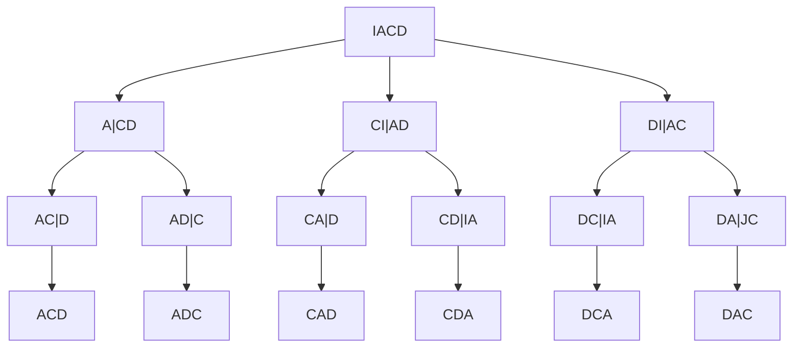
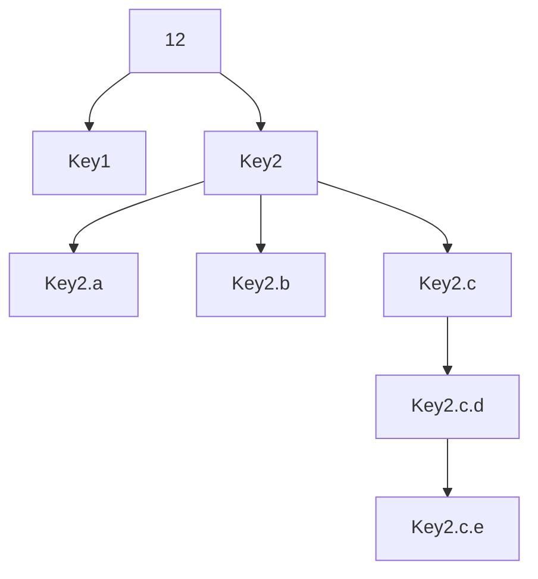

# 8장 재귀

## 재귀의 규칙

### 기저 조건
- 종료 조건이라고 한다.

### 분할 정복 방식
- 분할 정복에 의해 문제가 점점 작아지면서 기저 경우에 도달해야 한다.
#### 대표적인 예: 피보나치 수열
피보나치 수열은 무한한 숫자들의 목록이다. 이때 각 수는 이전 두 수의 합니다(1부터 시작).
> 1, 1, 2, 3, 5, 8, 13, 21 ...

##### 반복 루프를 활용한 해결책: 피보나치 수열

```js
function getNthFibo(n) {
    if (n <= 1) return n;
    var sum = 0,
        last = 1,
        lastlast = 0;

    for (var i = 1; i < n; i++) {
        sum = lastlast + last;
        lastlast = last;
        last = sum;
    }

    return sum;
}
// lastlast는 (n-2)번째 수,
// last는 (n-1)번째 수를 의미하며,
// sum은 두 수의 합으로 n번째 피보나치 수를 구합니다.
```

##### 재귀 해결법: 피보나치
> 프로그래머스 피보나치 수 (https://school.programmers.co.kr/learn/courses/30/lessons/12945)

```js
function getNthFibo(n) {
    if (n <= 1) {
        return n;
    } else {
        return getNthFibo(n - 1) + getNthFibo(n - 2);
    }
}
```
- 기저 경우: 피보나치 수열의 기저 경우는 첫 번째 항목이 1일 때다.
- 분할 정복: n번째 피보나치 수는 (n-1)번째와 (n-2)번째의 합니다. 하지만 이러한 구현의 시간 복잡도는 O(2<sup>n</sup>)이다. 꼬리 재귀를 사용한 피보나치 수열의 좀 더 효과적인 재귀 알고리즘을 알아보자.

##### 피보나치 수열: 꼬리 재귀
반복 루프를 활용한 해결책을 다시 한번 보자.
```js
function getNthFibo(n) {
    if (n <= 1) return n;
    var sum = 0,
        last = 1,
        lastlast = 0;

    for (var i = 1; i < n; i++) {
        sum = lastlast + last;
        lastlast = last;
        last = sum;
    }

    return sum;
}
// lastlast는 (n-2)번째 수,
// last는 (n-1)번째 수를 의미하며,
// sum은 두 수의 합으로 n번째 피보나치 수를 구합니다.
```

매번 루프가 반복될 때마다 다음 갱신이 일어난다.
```js
(lastlast, last) = (last, lastlast + last)
```
이러한 점을 염두해 다음과 같이 재귀함수를 구현할 수 있다.

```js
function getNthFiboBetter(n, lastlast, last) {
    if (n == 0) {
        return lastlast;
    }
    if (n == 1) {
        return last;
    }
    return getNthFiboBetter(n - 1, last, lastlast + last);
}
```
시간 복잡도: O(n)  
기껏해야 함수는 n번 실행된다.
재귀 호출이 일어날 때마다 n - 1씩 감소하기 때문이다.

공간 복잡도: O(n)  
위의 함수에 사용된 스택 콜(Stack call) 때문에 공간 복잡도도 역시 O(n)이다.
이에 관해서는 8장의 ‘재귀 콜 스택 메모리’ 절에서 자세히 다룰 것이다.

재귀 규칙에 관해 마무리하기 위해 좀 더 복잡한 또 다른 예를 살펴보자.

#### 파스칼의 삼각형
```
        1
       1 1
      1 2 1
     1 3 3 1
    1 4 6 4 1
  1 5 10 10 5 1
```

- 기저 경우: 최상위 항목(행=1, 열=1)이다. 나머지 모든 수는 해당 항목으로부터 파생된 것이다. 따라서 열이 1이면 1을 반환하고 행이 0이면 0을 반환한다.
- 분할 정복: 파스칼의 삼각형의 수는 해당 수의 위쪽 수들의 합니다.
```js
pascalTriangle(row - 1, col) + pascalTriangle(row - 1, col - 1)
```
|1|2|3|4|5|6|7|8|9|
|---|---|---|---|---|---|---|---|---|
|1|
|1|1|
|1|2|1|
|1|3|3|1|
|1|4|6|4|1|
|1|5|10|10|5|1|

```js
function pascalTriangle(row, col) {
    if (col === 0) {
        return 1
    } else if(row === 0) {
        return 0
    } else {
        return pascalTriangle(row - 1, col) + pascalTriangle(row - 1, col - 1)
    }
}
```

## 재귀의 빅오 분석

재귀 알고리즘에 대한 빅오 분석을 수행하기 위해서는 알고리즘이 어떤식으로 반복되는지 점화식`recurrence relations`을 분석해야 한다.

### 점화식
점화식은 기저 경우에 대한 빅오와 재귀 경우에 대한 빅오 두 부분에 대한 분석으로 구성된다.

피보나치 수열 예를 다시 살펴보자.
> 1, 1, 2, 3, 5, 8, 13, 21 ...
```js
function getNthFibo(n) {
    if(n <= 1) {
        return n
    } else {
        return getNthFibo(n - 1) + getNthFibo(n - 2)
    }
}
getNthFibo(3)
```

기저 경우  
시간 복잡도: O(1)  
`T(n) = O(1)`

재귀 경우  
자기 자신을 두 번 호출  
`T(n) = T(n-1) + T(n-2) + O(1)`

|n|T(n)|T(n-1)|T(n-2)
|-|-|-|-|
|0|1|
|1|1|
|2|2|1|1|
|3|3|2|1|
|4|5|3|2|
|5|8|5|3|

위의 점화식 `T(n) = T(n-1) + T(n-2) + O(1)`에서 n을 n-1로 대체하면 `T(n-1) = T(n-2) + T(n-3) + O(1)` 이다.

따라서 함수를 호출할 때마다 각 함수 호출에 대해 두 개의 함수 호출이 더 일어나는 것을 확인 할 수 있다. 즉, 이 함수의 시간 복잡도는 O(2<sup>n</sup>)이다.

```
F(6) * <-- 단 한 번
F(5) *
F(4) **
F(3) ****
F(2) ********
F(1) **************** <-- 16
F(0) ******************************** <-- 32
```

### 마스터 정리

a >= 1  
b >= 1  
T(n) = aT(n/b) + O(n<sup>c</sup>)  
위와 같은 형태를 지닌 점화식이 있을 때 세 가지 경우가 존재한다.

a는 재귀 호출에 곱해지는 계수
b는 "로그" 항. b는 재귀 호출 시에 n을 나누는 항.
c는 등식의 비재귀 구성 요소에 대한 다항식의 항.

#### 첫 번째 경우는 비재귀 구성요소인 O(n<sup>c</sup>)의 항인 c가 log<sub>b</sub>(a)보다 작은 경우이다.

경우 1: c < log_b(a)이면 O(n^(log_b(a)))이다.
예를 들어 T(n) = 8T(n/2) + 1000n²이라고 해보자.

a, b, c 식별: a = 8, b = 2, c = 2
평가: log₂(8) = 3, c < 3을 만족한다.
결과: T(n) = O(n³)

#### 두 번째 경우는 c가 log_b(a)와 같은 경우다.

경우 2: c = log_b(a)이면 T(n) = O(n^c log(n))이다.
예를 들어 T(n) = 2T(n/2) + 10n이라고 해보자.

a, b, c 식별: a = 2, b = 2, c = 1
평가: log₂(2) = 1, c = 1을 만족한다.
결과: T(n) = O(n^1 log(n)) = T(n) = O(n log(n))

#### 세 번째이자 마지막 경우는 c가 log_b(a)보다 큰 경우다.

경우 3: c > log_b(a)이면 T(n) = O(f(n))이다.
세 번째이자 마지막 경우는 c가 log<sub>b</sub>(a)보다 큰 경우다.

c > log<sub>b</sub>(a)이면 T(n) = O(f(n)) 이다.
예를 들어, T(n) = 2T(n/2) + n² 라고 해보자.

a, b, c 식별: a = 2, b = 2, c = 2
평가: log₂(2) = 1 → c > 1 을 만족한다.
결과: T(n) = f(n) = O(n²)

이번 절은 재귀 알고리즘의 시간 복잡도를 분석과 관련해 많은 부분을 알아봤다.
공간 복잡도 역시 시간 복잡도만큼 중요하다.
공간 복잡도 분석을 위해 재귀함수 호출에 사용되는 메모리 역시 주의 깊게 보고 분석해야 한다.

## 재귀 호출 스택 메모리
재귀 함수가 자기 자신을 호출하는 경우 메모리를 차지한다. 따라서 이는 빅오 공간 복잡도 분석에 매우 중요하다.

n부터 1까지 재귀적으로 출력하는 간단한 함수의 공간 복잡도는 O(n)이다.
```js
function printNRecursive(n) {
    console.log(n)
    if(n>1) {
        printNRecursive(n - 1)
    }
}
printNRecursive(10)
```

재귀 호출은 메모리 스택에 저장되는데, 스택은 기저 경우가 해결될 대까지 축적된다.
잘못되면 스택 오버플로우 오류를 발생시킬 수 있다.

## 요약
재귀는 복잡한 알고리즘을 구현하기 위한 강력한 도구다.
재귀함수는 기저 경우와 분할 정복 방식이라는 두 가지 부분으로 구서된다.

재귀 알고리즘의 빅오 분석은 경험적으로 수행되거나 마스터 정리를 통해 수행된다.
마스터 정리는 T(n) = aT(n/b) + O(n<sup>c<sup>)와 같은 형태의 점화식을 필요로 한다는 점을 기억하자. 마스터정리의 세가지 경우에서 a와 b, c를 식별해야한다.

## 연습 문제

### 십진수를 이진수로 변환하기

십진수를 이진수로 변환하기 위해서는 숫자를 계속해서 2로 나누고 매번 나머지와 나눗셈을 계산해야 한다.

기저 경우:
이 문제의 기저 경우는 n이 2보다 작을 때다.
n이 2보다 작다는 것은 n이 0 또는 1이라는 의미다.
```js
function base10ToString(n) {
    var binaryString = "";

    function base10ToStringHelper(n) {
        if (n < 2) {
            binaryString += n;
            return;
        } else {
            base10ToStringHelper(Math.floor(n / 2));
            base10ToStringHelper(n % 2);
        }
    }
    base10ToStringHelper(n);

    return binaryString;
}

console.log(base10ToString(232)); // 11101000
```

시간복잡도: O(log2​(n))

위의 코드에서 재귀 호출이 n을 2로 나눠서 알고리즘을 빠르게 만들기 때문에
시간 복잡도는 로그 시간이다.

공간복잡도: O(log2​(n))

### 배열의 모든 순열 출력하기

이는 대표적인 재귀 문제이고 해결하기에 꽤나 어렵다.
이 문제의 전제는 배열의 항목들을 모든 가능한 위치의 항목들과 교환해보는 것이다.

배열의 순열에 대한 재귀 트리를 그려보자



기저 경우: beginIndex가 endIndex와 동일하다.

시작 인덱스가 종료 인덱스와 동일한 경우 다음 함수는 현재 순열을 출력한다.

순열: 항목들을 교환하기 위한 함수가 필요하다.

```js
function swap(strArr, index1, index2) {
    var temp = strArr[index1];
    strArr[index1] = strArr[index2];
    strArr[index2] = temp;
}

function permute(strArr, begin, end) {
    if (begin == end) {
        console.log(strArr);
    } else {
        for (var i = begin; i < end + 1; i++) {
            swap(strArr, begin, i);
            permute(strArr, begin + 1, end);
            swap(strArr, begin, i);
        }
    }
}

function permuteArray(strArr) {
    permute(strArr, 0, strArr.length - 1);
}

permuteArray(["A", "C", "D"]);


// ['A', 'C', 'D']
// ['A', 'D', 'C']
// ['C', 'A', 'D']
// ['C', 'D', 'A']
// ['D', 'C', 'A']
// ['D', 'A', 'C']
```

시간 복잡도: O(n!)
공간 복잡도: O(n!)

n!개의 순열이 있다. 따라서 n!개의 호출 스택이 생성된다.

### 객체 펼치기
다음과 같은 객체가 있다고 하자
```js
var dictionary = {
    'Key1': '1',
    'Key2': {
        'a' : '2',
        'b' : '3',
        'c' : {
            'd' : '3',
            'e' : '1'
        }
    }
}
```
위 배열을 `{'Key1': '1', 'Key2.a': '2', 'Key2.b': '3','Key2.c.d': '3', 'Key2.c.e': '1'}` 로 펼쳐보자.

이를 위해 모든 속성에 반복적으로 접근하면서 해당 속성에 자식 속성이 있는지 재귀적으로 확인한다. 이때 연결된 문자열 이름이 매개변수로 전달된다.

기저 경우: 이 문제의 기져 경우는 입력이 객체가 아닐 때다.
```js

function flattenDictionary(dictionary) {
    var flattenedDictionary = {};

    function flattenDitionaryHelper(dictionary, propName) {
        if (typeof dictionary != 'object') {
            flattenedDictionary[propName] = dictionary;
            return;
        }
        for (var prop in dictionary) {
            if (propName == ''){
                flattenDitionaryHelper(dictionary[prop], propName+prop);
            } else {
                flattenDitionaryHelper(dictionary[prop], propName+'.'+prop);
            }
        }
    }

    flattenDitionaryHelper(dictionary, '');
    return flattenedDictionary;
}
flattenDictionary(dictionary);
```

시간 복잡도: O(n)
공간 복잡도: O(n)

### 문자열이 거꾸로 읽어도 동일한지 여부를 재귀적으로 결정하는 프로그램 작성하기

deified, racecar, testset, aibohpobia와 같은 단어는 거꾸로 읽어도 동일한 철자를 지니는 단어다.

```js
function isPalindromeRecursive(word) {
    return isPalindromeHelper(word, 0, word.length - 1);
}

function isPalindromeHelper(word, beginPos, endPos) {
    if (beginPos >= endPos) {
        return true;
    }
    if (word.charAt(beginPos) != word.charAt(endPos)) {
        return false;
    } else {
        return isPalindromeHelper(word, beginPos + 1, endPos - 1);
    }
}

isPalindromeRecursive('hi'); // false
isPalindromeRecursive('iii'); // true
isPalindromeRecursive('ii'); // true
isPalindromeRecursive('aibohphobia'); // true
isPalindromeRecursive('racecar'); // true

```

위의 구현은 두 개의 인덱스(앞 뒤 인덱스)를 활용해 앞과 뒤가 만날 때까지 매 단계에 문자가 같은지 확인하는 방식이다. 

시간 복잡도: O(n)

공간 복잡도: O(n)

여기서 공간 복잡도는 재귀 호출 스택 때문에 여전히 O(n)이다. 변수를 선언하지 않거나 자료 구조 내에 무언가를 저장되지 않더라도 호출 스택이 메모리의 일부로 남는다는 점을 기억하자.
