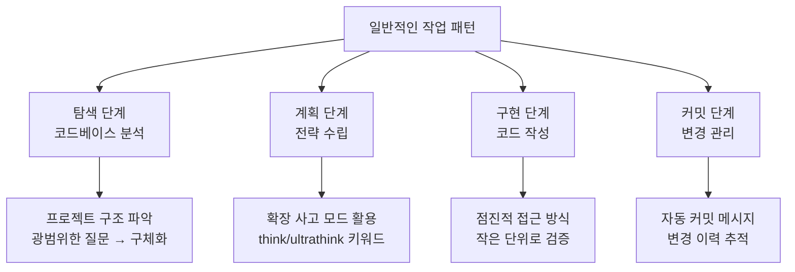
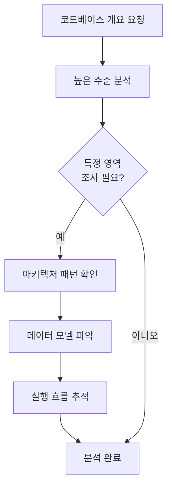
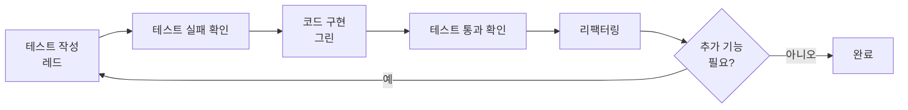
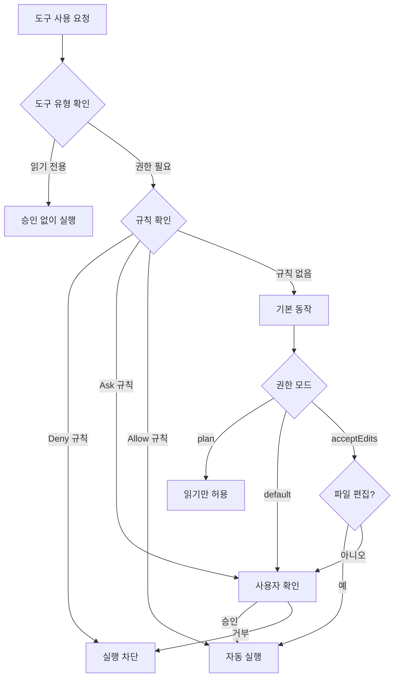
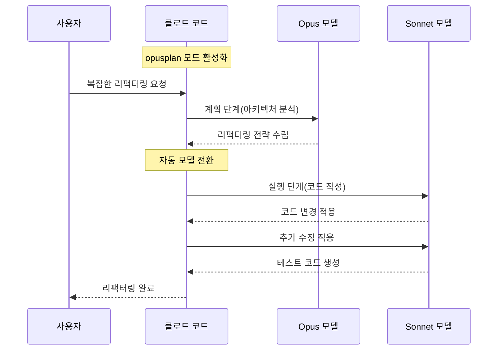

# CHAPTER 02 워크플로와 설정

## 2-1 기본 작업 방식

### 탐색-계획-구현-커밋 워크플로

- 사용자가 높은 수준의 목표를 제시하면 클로드 코드가 **코드베이스 탐색 → 계획 수립 → 코드 구현 → 깃 커밋**까지 수행하는 과정을 체계화한 것. 각 단계는 독립적으로 수행되거나 순환적으로 반복된다.



- **탐색 단계(전략적 분석)**: 프로젝트 루트에서 전체 아키텍처를 분석하고 구성 요소 간 상호작용을 파악. 광범위한 질문으로 시작해 특정 영역으로 좁히는 접근이 효과적.
  - 예: "이 프로젝트의 전체 개요를 알려줘." → "사용된 주요 아키텍처 패턴을 설명해 줘."
- **계획 단계(심화 계획과 확장 사고)**: 구현 전략 수립. 핵심 도구는 **플랜 모드**(`Shift + Tab`으로 전환 → 읽기 전용 상태, Edit/Write/Bash 비활성화). 복잡한 결정·다단계 구현에는 **확장 사고(extended thinking)**를 활용(`/config`에서 활성화, `MAX_THINKING_TOKENS` 환경 변수로 토큰 예산 조절). "이 계획대로 구현을 시작하겠나?"에 응답하면 자동 실행 모드로 전환.
  - 판단 기준: 변경 대상 파일이 3개를 넘거나 구현 방향이 불확실할 때 플랜 모드 사용.
- **구현 단계(점진적 구현과 검증)**: 계획에 따라 코드 작성. 점진적 접근이 중요 — 대규모 수정을 한 번에 하지 않고 작은 단위로 나눠 검증하며 진행해 오류를 최소화.
- **커밋 단계(안전한 변경 관리)**: 작업 단위가 완료될 때마다 커밋하면 문제 발생 시 되돌릴 수 있고 이력 추적 가능. "설명 메시지와 함께 커밋을 생성해 줘"로 적절한 커밋 메시지 자동 생성.

### 탐색과 분석

- 특정 기능 관련 코드를 찾을 때는 3단계로 접근: **관련 파일 찾기 → 파일 간 상호작용 파악 → 실행 흐름 추적**.
  - 예: "사용자 인증을 처리하는 파일을 찾아 줘" → "이 인증 파일이 어떻게 함께 동작해?" → "프런트엔드에서 데이터베이스까지 로그인 프로세스를 추적해 줘"
- 효과 이유: 단계적으로 좁히면 식별된 파일만 Read로 읽어 토큰 소비를 줄인다. "인증 시스템 전체를 설명해 줘"처럼 한 번에 요청하면 관련 없는 파일까지 탐색해 컨텍스트를 낭비한다.
- 구조를 이미 파악했다면 `@` 참조로 범위를 좁힌다. (예: `@src/utils/auth.js`, `@src/components`)



### 파일 및 디렉터리 탐색 기법

- "인증 관련 파일을 찾아 줘"처럼 요청하면 클로드 코드가 Glob, Grep, LS, Read를 조합해 탐색. 범위가 넓을 때는 단계적으로 좁히면 컨텍스트를 절약한다.
- 특정 파일 내용이 길어 컨텍스트를 많이 소비하면 `@src/auth/login.ts의 handleSubmit 함수만 설명해 줘`처럼 함수 단위로 범위를 한정하면 Read가 해당 부분만 읽는다.
- **시각적 맥락**: 이미지를 대화에 추가 가능. ① 드래그 앤 드롭, ② 복사 후 `Ctrl + V`(또는 `Cmd + V`)로 붙여넣기, ③ `이 이미지를 분석해 줘: /path/to/image.png`로 경로 지정. 이후 "이 스크린샷의 UI 요소를 설명해 줘"처럼 질문.

### 플랜 모드를 사용한 안전한 코드 분석

- 코드를 직접 수정하지 않고 안전하게 분석하려면 읽기 전용인 플랜 모드가 필수. 적합한 상황 3가지:
  1. 다단계 기능 구현 시: 여러 파일에 걸친 기능 전체 구조 설계.
  2. 코드 조사 단계: 변경 전 코드베이스를 철저히 탐색.
  3. 대화형 협의: 반복 피드백으로 방향 조정.
- 활성화 방법:
  - **세션 중 변환**: `Shift + Tab`으로 Normal/Auto-Accept/Plan 모드 순환.
  - **새 세션 시작**: `claude --permission-mode plan`
  - **비대화형 모드**: `claude --permission-mode plan -p "인증 시스템을 분석하고 개선 방안을 제안해 줘"`

### 점진적 개발 전략

복잡한 기능을 작은 단위로 분해해 순차적으로 구현하는 접근. 작업 범위 정의·피드백 루프·컨텍스트 관리 세 축으로 구성된다.

- **작업 범위의 명확한 정의**: 전체 작업을 독립적으로 테스트 가능한 단위로 분해(예: 사용자 인증 → 데이터 모델 정의 → API 엔드포인트 구현 → 프런트엔드 통합 → 테스트 작성). 분해 기준은 "이 단위만으로 테스트를 실행해 성공/실패를 판정할 수 있는가".
- **피드백 루프 활용**: 테스트 결과·린터 출력·빌드 로그처럼 구조화된 피드백을 받을 때 오류를 정확히 교정한다("검증을 견고하게 만드는 데 투자하세요"). UI 작업에는 시각적 피드백이 유용. 피드백 루프가 없으면 사용자가 유일한 검증 수단이 되므로(반복 비용↑), 자동화된 검증 수단을 먼저 확보하는 편이 효율적.
- **컨텍스트 관리**: 세션이 길어지면 응답 품질이 저하된다. ① `/compact`로 대화 요약, ② `/clear`로 완전 재설정, ③ `/mcp`로 사용하지 않는 서버 비활성화. **자동 압축(auto-compact)**은 한계치 도달 시 자동 요약(20만 토큰 기준 약 3만 3천 토큰이 압축 버퍼용으로 예약). `/context`로 현재 토큰 사용 현황·버퍼 크기 확인 가능.

### TDD 기본 패턴

- **레드-그린-리팩터 사이클(Red-Green-Refactor Cycle)**: 실패하는 테스트 작성 → 통과하는 최소 코드 구현 → 코드 구조 개선. 각 단계의 명확한 성공/실패 신호가 다음 행동의 근거. "이 테스트를 통과시켜라"는 명확한 목표가 더 정확한 결과를 낳는다.
  - **레드**: 구현 기능의 예상 동작을 정의하는 테스트 작성(아직 구현 없으므로 실패).
  - **그린**: 통과를 위한 최소 코드 작성.
  - **리팩터**: 기능 유지하며 구조 개선·중복 제거.
- 테스트 누락 파악도 중요: "@NotificationsService.swift에서 테스트로 검증되지 않은 함수들을 찾아 줘" → "알림 서비스에 대한 테스트를 추가해 줘"(테스트 스캐폴딩 생성) → "경계 조건에 대한 테스트 케이스를 추가해 줘".



### 깃 통합 워크플로

- 클로드 코드는 Bash 도구로 깃 명령을 직접 실행한다(커밋 메시지 작성, PR 생성, 이슈 분류, 충돌 해결).
- **PR 생성**은 단계적으로: "변경 내역을 요약해 줘" → "PR을 생성해 줘" → "보안 개선 맥락을 추가해 PR 설명을 보강해 줘". `gh` CLI 설치 시 깃허브에 PR을 직접 생성.
- **깃 작업 트리(Git worktree)**: `git worktree add ../project-feature-a -b feature-a`로 새 작업 트리 생성. 각 작업 트리에서 별도 세션을 실행하면 독립 공간에서 병렬 개발. 한 인스턴스가 작성하는 동안 다른 인스턴스가 리뷰하는 방식의 협업도 가능(리뷰 인스턴스는 새 컨텍스트에서 시작하므로 작성자의 맹점을 보완).

### 비대화형 모드에서의 세션 재개

- 세션 재개 기능(`--continue`, `--resume`)은 비대화형 모드에서도 활용 가능. `claude --continue -p "내 작업을 계속 진행해 줘"`처럼 `-p`와 함께 쓰면 스크립트·자동화에서도 이전 컨텍스트 유지. CI/CD나 배치 처리에 유용.

### 파이프와 클로드

- 파이프·표준 입출력으로 다른 도구와 연동. `cat build-error.txt | claude -p "이 빌드 오류의 근본 원인을 간결하게 설명해 줘" > output.txt`처럼 파일을 전달하고 결과를 저장.
- `--output-format` 플래그로 출력 형식 제어: `text`(일반 텍스트), `json`(메타데이터 포함 JSON 배열), `stream-json`(실시간 JSON 스트리밍).

### npm 스크립트로 AI 코드 검토 자동화

- 기존 ESLint·Prettier처럼 클로드 코드를 npm 스크립트로 등록해 AI 코드 검토를 자동화. `npm run lint:claude` 한 줄로 실행.

```json
// package.json
{
  "scripts": {
    "lint": "eslint src/",
    "lint:claude": "claude -p '너는 코드 리뷰어야. main 브랜치 대비 변경된 코드를 검토하고 오타, 네이밍 오류, 잠재적 버그를 찾아 줘.'"
  }
}
```

- ESLint가 못 잡는 맥락적 오류(함수명과 실제 동작 불일치, 주석과 코드 불일치 등)를 검토할 수 있다. CI/CD 파이프라인에 추가해 코드 품질을 높인다.

---

## 2-2 설정 관리

### settings.json 설정과 우선순위

- `settings.json`은 권한 규칙·환경 변수·도구 설정을 JSON으로 정의하는 설정 파일. 배치 위치에 따라 적용 범위가 다르며 여러 위치 파일을 계층적으로 병합해 최종 설정을 결정. `/config`로 현재 설정 확인·수정.
- **5단계 범위**(우선순위 높음 → 낮음, 높은 설정이 낮은 설정을 덮어씀):
  1. **관리자 설정(Managed)**: `managed-settings.json`을 시스템 디렉터리에 배포하거나 웹(claude.ai)에서 원격 배포. 사용자 재정의 불가, 조직 전체 보안 정책 강제.
  2. **엔터프라이즈 정책(Enterprise policy)**: 인프라 팀이 시스템 디렉터리에 배포. 재정의 불가.
  3. **프로젝트 설정**: `.claude/settings.json`. 깃 저장소에 커밋해 팀과 공유.
  4. **프로젝트 로컬 설정**: `.claude/settings.local.json`. 개인별 조정용, 저장소에 커밋되지 않음(`.gitignore`에 추가 권장).
  5. **사용자 설정**: `~/.claude/settings.json`. 모든 프로젝트에 적용.
- 권한 규칙(allow, deny, ask) 배열은 모든 범위 값이 합산되지만, 같은 키에 다른 값이 존재하면 우선순위 높은 쪽 적용. **`deny`는 항상 다른 규칙보다 우선**.

```json
// .claude/settings.json
{
  "hooks": {
    "SessionStart": [
      { "hooks": [{ "type": "command", "command": "echo '세션 시작!'" }] }
    ]
  },
  "permissions": {
    "allow": ["Bash(npm run *)", "Bash(git status:*)", "Bash(git diff:*)", "Read", "Edit", "Write", "Agent"],
    "ask": ["Bash(git commit:*)", "Bash(git push:*)", "Bash(rm:*)"],
    "deny": ["Read(./.env)", "Read(./secrets/**)", "Bash(rm -rf:*)", "Bash(git push --force:*)"]
  },
  "env": { "MOAI_USER_NAME": "홍길동", "MOAI_CONVERSATION_LANG": "ko" },
  "outputStyle": "Explanatory",
  "cleanupPeriodDays": 30
}
```

### 기본 설정 옵션

- **apiKeyHelper**: 인증값 생성 커스텀 스크립트 경로. 반환값이 `X-Api-Key`·`Authorization` 헤더로 전송.
- **cleanupPeriodDays**: 로컬 채팅 기록 유지 기간(기본 30일, `0`이면 즉시 삭제).
- **env**: 모든 세션에 적용할 환경 변수 정의(예: `{"FOO": "bar"}`).
- **includeCoAuthoredBy**: 깃 커밋에 co-authored-by Claude 표시 포함 여부(기본 `true`).
- **model**: 기본 모델 재정의(`claude --model sonnet`처럼 CLI로도 가능).
- **outputStyle**: 시스템 프롬프트 조정으로 출력 형식·스타일 변경(예: `"Explanatory"`).
- **hooks**: 도구 실행 전후 커스텀 명령 정의(예: `{"PreToolUse": {"Bash": "echo 'Running...'"}}`).

**표 2-1 설정 옵션**

| 키 | 설명 |
|---|---|
| permissions | 권한 구조(표 2-2 참조) |
| disableAllHooks | 모든 훅 비활성화(true/false) |
| statusLine | 커스텀 상태 표시줄(예: `{"type":"command","command":"~/.claude/statusline.sh"}`) |
| outputStyle | 출력 스타일 구성(예: `"Explanatory"`) |
| forceLoginMethod | 로그인 방식 제한(`claudeai` 또는 `console`) |
| enableAllProjectMcpServers | 프로젝트 `.mcp.json`의 모든 MCP 서버 자동 승인 |
| enabledMcpjsonServers | 승인할 특정 MCP 서버 목록(예: `["memory","github"]`) |
| disabledMcpjsonServers | 거부할 특정 MCP 서버 목록(예: `["filesystem"]`) |

**표 2-2 권한 설정 옵션**

| 키 | 설명 |
|---|---|
| allow | 도구 사용 허용 규칙 배열. Bash는 접두사 일치(예: `["Bash(git diff:*)"]`) |
| ask | 도구 사용 시 확인 요청(예: `["Bash(git push:*)"]`) |
| deny | 도구 사용 거부. 민감 파일 제외에 활용(예: `["WebFetch","Read(./.env)"]`) |
| additionalDirectories | 접근 가능한 추가 작업 디렉터리(예: `["../docs/"]`) |
| defaultMode | 시작 시 기본 모드(예: `"acceptEdits"`) |
| disableBypassPermissionsMode | `"disable"`로 설정해 bypassPermissions 모드 비활성화 |

### 프로젝트별 설정 전략

- 권한 규칙은 `permissions` 아래 allow/deny/ask 세 배열. 평가 순서 **deny → ask → allow**(deny 해당 시 무조건 차단).
- **프런트엔드**: 빌드·테스트 명령을 미리 allow해 승인 절차 단축.

```json
// 프런트엔드 .claude/settings.json
{ "permissions": { "allow": ["Bash(npm run build)", "Bash(npm run test:*)", "Bash(npm run lint)"] } }
```

- **백엔드**: DB 마이그레이션·서버 재시작처럼 부작용 큰 명령은 ask, 환경 변수·시크릿 파일은 deny.

```json
// 백엔드 .claude/settings.json
{
  "permissions": {
    "ask": ["Bash(npm run migrate:*)", "Bash(pm2 restart)"],
    "deny": ["Read(./.env)", "Read(./.env.*)", "Read(./secrets/**)"]
  }
}
```

- **마이크로서비스**: 서비스별 `.claude/settings.json` 독립 구성, 공통 규칙(린터·테스트 프레임워크)은 사용자 설정(`~/.claude/settings.json`)에 정의.

### 환경 변수 관리

- 두 가지 방법: 셸에서 `export` 또는 `settings.json`의 `env` 필드. 셸 환경 변수가 이미 존재하면 `settings.json` 값보다 우선.
- `env` 필드는 세션 시작 시 자동 적용되어 매번 export 불필요.
- 용도별 자주 쓰는 변수:
  - **인증·모델**: `ANTHROPIC_API_KEY`, `ANTHROPIC_MODEL`(기본 모델, `/model`이나 설정 model 키로 변경). 클라우드 플랫폼: `CLAUDE_CODE_USE_BEDROCK`, `CLAUDE_CODE_USE_VERTEX`, `CLAUDE_CODE_USE_FOUNDRY`(각 `1`로 설정).
  - **추론 제어**: `MAX_THINKING_TOKENS`(확장 사고 토큰 예산 상한, 기본 31,999). `CLAUDE_CODE_EFFORT_LEVEL`(Opus 4.6 적응형 추론 수준 Low/Medium/High).
  - **운영 제어**: `DISABLE_AUTOUPDATER`(자동 업데이트 비활성화), `DISABLE_TELEMETRY`(원격 분석 비활성화). 한꺼번에: `CLAUDE_CODE_DISABLE_NONESSENTIAL_TRAFFIC=1`.
  - **Bash 도구 동작**: `CLAUDE_CODE_BASH_MAINTAIN_PROJECT_WORKING_DIR=1`이면 Bash 실행 후 작업 디렉터리가 프로젝트 루트로 초기화. Bash 명령의 `export MY_VAR=value`는 다음 명령에서 유지되지 않으므로, 지속 환경 변수는 `env` 필드 또는 `CLAUDE_ENV_FILE` 사용.

### 팀 표준 설정 구축

- 권한 규칙='무엇을 허용/차단할지', CLAUDE.md='어떤 맥락·규칙을 따를지', 스킬='어떤 워크플로를 반복 실행할지'를 정의.

#### CLAUDE.md

- 세션 시작 시 컨텍스트로 로드되는 메모리 파일. 빌드 명령·코드 스타일·테스트 절차·아키텍처 결정 등을 기록. 배치 위치에 따라 적용 범위가 다름:
  - **CLAUDE.md(프로젝트 루트)**: 팀 공유 지침, 저장소에 커밋.
  - **CLAUDE.local.md(프로젝트 루트)**: 개인용, 깃 무시 대상으로 자동 설정.
  - **~/.claude/CLAUDE.md**: 사용자 전역 지침, 모든 프로젝트 적용.
- 상위 부모 디렉터리·하위 디렉터리의 CLAUDE.md도 자동/필요 시 로드되며 하나의 지침 세트로 결합. 지침 충돌 시 더 구체적인 지침 우선.
- 공식 문서는 CLAUDE.md를 **약 200줄 이내**로 유지하고 참조용 자료는 스킬로 분리할 것을 권장.

#### 스킬(슬래시 명령)

- 반복 워크플로 표준화용. `SKILL.md` 파일에 YAML 프론트매터(frontmatter) + 마크다운 지침으로 작성. 보조 파일(템플릿·스크립트)을 함께 두고 상황에 따라 자동 로드 가능.
- 공유 범위:
  - **.claude/skills/**: 프로젝트 스킬, 저장소 커밋해 팀 공유.
  - **~/.claude/skills/**: 사용자 스킬, 개인용 전체 프로젝트.
- 예: 코드 리뷰 스킬을 `.claude/skills/review/SKILL.md`에 정의하면 모든 팀원이 `/review`로 동일한 절차 실행.

#### 민감한 파일 보호

- `permissions.deny`에 차단 규칙 설정(환경 변수 파일·시크릿 디렉터리·자격 증명 파일).
- `deny`는 평가 순서상 항상 먼저 확인되므로 allow/ask와 같은 대상이어도 차단 유지. Read/Edit 규칙은 gitignore 명세와 동일 패턴(`*`=단일 디렉터리 내, `**`=재귀적 하위까지).

> **Tip** Read deny 규칙만으로는 Bash 우회를 완벽히 막지 못한다. Bash 실행이 허용되면 `cat .env` 같은 셸 명령으로 Read 규칙 감시망을 벗어날 수 있다.

#### 도구별 설정

- **승인 없이 사용 가능**: Read, Glob, Grep, Agent — 읽기 전용, 시스템 미변경.
- **승인 필요**: Bash, Edit, Write, WebFetch, WebSearch — 시스템 변경·외부 접근.

**표 2-3 승인 여부와 도구 유형**

| 승인 여부 | 도구 유형 | 예시 | "Yes, don't ask again" 동작 |
|---|---|---|---|
| 필요 없음 | 읽기 전용 | 파일 읽기, LS, Grep | N/A |
| 필요함 | Bash 명령 | 셸 실행 | 프로젝트 디렉터리 및 명령 당 영구적 |
| 필요함 | 파일 수정 | 파일 편집/쓰기 | 세션 종료까지 |

### 클로드 코드의 다섯 가지 확장 도구 비교

- 클로드 코드는 스킬·서브에이전트·MCP 서버·훅·플러그인이라는 독립적 확장 방식 제공.
  - **스킬**: 가장 가볍고 선언적. SKILL.md + 보조 파일. `name`·`description` 프론트매터 기반으로 사용자 요청과 의미적 유사성을 평가해 컨텍스트에 로드.
  - **서브에이전트**: 스킬보다 한 단계 높은 수준. 독립 컨텍스트 윈도우·커스텀 시스템 프롬프트·`tools` 필드로 명시한 도구 세트. 자동 위임(description 기반) 또는 명시적 호출(`Use the debugger subagent`). `agentId`로 재개 가능.
  - **MCP 서버**: 외부 도구·DB·API 연결 통로. HTTP·stdio 전송(SSE는 레거시). 로컬/프로젝트/사용자 세 수준. `claude mcp add`로 추가, OAuth 2.0 보안 연결, `managed-mcp.json`으로 중앙 제어.
  - **훅(Hooks)**: LLM 판단을 우회해 결정론적으로 실행되는 셸 명령. 생애 주기 이벤트에 바인딩되며 매처(matcher) 패턴으로 특정 도구/상황에만 반응. 주요 이벤트: PreToolUse, PostToolUse, UserPromptSubmit, Notification, Stop, SubagentStart/SubagentStop, PreCompact, SessionStart/SessionEnd. PreToolUse는 도구 호출 차단/허용 결정·파라미터 수정 가능(민감 파일 편집 차단, 코드 포매팅 자동 적용, 컴플라이언스 로깅).
  - **플러그인(Plugins)**: 위 네 가지를 하나의 배포 단위로 묶는 컨테이너. `.claude-plugin/plugin.json` 매니페스트. 마켓플레이스로 배포·설치(공식: claude-plugins-official).

> **Tip** LSP 서버는 `.lsp.json` 형태로 별도 파일을 통해 플러그인에 추가할 수 있다.

**표 2-4 다섯 도구의 항목 비교**

| 항목 | 스킬 | 서브에이전트 | MCP 서버 | 훅 | 플러그인 |
|---|---|---|---|---|---|
| 핵심 목적 | 지식/지침 확장 | 작업 위임·격리 | 외부 도구/데이터 연결 | 생애 주기 자동화 | 확장 패키징/배포 |
| 실행 주체 | 클로드(AI 추론) | 독립 AI 인스턴스 | 외부 서버 프로세스 | 셸 명령(결정론적) | 포함된 구성 요소에 의존 |
| 활성화 방식 | 자율적(설명 매칭) | 자동 위임 또는 명시적 호출 | 도구 호출 시 자동 | 이벤트 트리거(매치) | 설치 시 자동 |
| 컨텍스트 | 메인 대화 공유 | 독립 컨텍스트 윈도우 | 메인 대화에서 호출 | 대화 외부(셸) | 해당 없음 |
| 도구 접근 | allowed-tools로 제한 가능 | tools 필드로 명시적 | 서버별 도구 노출 | 도구 실행 전후 개입 | 포함된 구성 요소 상속 |
| 지속성 | 파일 기반(영구) | 세션 내(resumable) | 구성 기반(영구) | 구성 기반(영구) | 설치 기반(영구) |
| 공유 범위 | 개인/프로젝트 | 프로젝트/사용자 | 로컬/프로젝트/사용자 | 설정 파일 수준 | 마켓플레이스 |
| 대표 사용 사례 | 커밋 메시지 규칙, 코딩 가이드 | 코드 리뷰, 디버깅, 보안 분석 | 깃허브 연동, DB 쿼리, 센트리 | 자동 포매팅, 파일 보호, 로깅 | 팀 도구 세트 배포 |

- 가장 중요한 항목은 '실행 주체'와 '컨텍스트'. 스킬은 메인 추론에 지식을 주입(메인 토큰 소비), 서브에이전트는 독립 컨텍스트(메인 토큰 미소비), MCP 서버는 외부 프로세스가 능력 확장, 훅은 결정론적 정책 적용, 플러그인은 묶어서 배포.
- 다섯 방식 결합 시 통합 개발 환경 구축. 해결하려는 문제가 지식(스킬)·작업 격리(서브에이전트)·외부 연결(MCP)·정책 적용(훅)·배포(플러그인) 중 어디에 속하는지 판단하는 것이 출발점.

---

## 2-3 IAM 권한 관리

### IAM 개념

- **IAM(Identity and Access Management)**: '누가 무엇을 할 수 있는가'를 정의하는 보안 프레임워크. 클로드 코드 IAM은 **인증(Authentication)** + **권한(Authorization)**.
- **인증 옵션**:
  - **클로드 API 인증**: 콘솔로 앤트로픽 API 직접 접근. Settings → Members → Invite로 사용자 초대, SSO 통합 가능. 역할 2가지 — '클로드 코드'(클로드 코드용 API 키만 생성, 제한된 권한), 'Developer'(모든 API 키 생성, 넓은 권한). 최소 권한 원칙 권장.
  - **아마존 베드락 인증**: `CLAUDE_CODE_USE_BEDROCK` 설정 후 AWS 자격 증명으로 접근, 기존 AWS IAM 정책 통합.
  - **구글 버텍스 AI 인증**: `CLAUDE_CODE_USE_VERTEX` 설정 후 GCP 자격 증명으로 접근.
  - macOS에서 모든 자격 증명(claude.ai/클로드 API 키/베드락/버텍스)은 키체인에 암호화 저장.

### 파일 및 명령 권한 설정

- 읽기 전용 도구(파일 읽기, LS, Grep)는 승인 불필요. Bash는 승인 필요(승인된 명령은 프로젝트·명령 당 영구 저장). Edit/Write는 승인 필요(승인 기록은 세션 종료 시 초기화).
- `/permissions`로 현재 규칙 확인·관리.
  - **Allow**: 수동 승인 없이 허용.
  - **Ask**: 사용 시마다 확인 요청.
  - **Deny**: 완전 차단, 항상 우선.
  - **Workspace(Additional directories)**: 초기 작업 디렉터리 외 접근 가능 디렉터리 추가.



### 도구별 권한 체계

- **Bash 규칙** 두 가지 패턴: 정확한 명령 일치(`Bash(npm run build)`), 접두사 패턴(`Bash(npm run test:*)` — 와일드카드 `*`는 해당 위치 이후 모든 문자열 일치).
  - > **Tip** `*` 앞 공백 중요. `Bash(ls *)`는 `ls -la`는 매칭하지만 `lsof`는 안 됨. `Bash(ls*)`는 둘 다 매칭.
- **Read/Edit 규칙** 4가지 경로 패턴:

**표 2-5 Read와 Edit 규칙이 지원하는 경로 패턴**

| 패턴 | 의미 | 예시 | 일치 경로 |
|---|---|---|---|
| `//path` | 파일 시스템 루트 절대 경로 | `Read(//Users/alice/secrets/**)` | `/Users/alice/secrets/**` |
| `~/path` | 홈 디렉터리 경로 | `Read(~/Documents/*.pdf)` | `/Users/alice/Documents/*.pdf` |
| `/path` | 설정 파일 상대 경로 | `Edit(/src/**/*.ts)` | `{설정 파일 위치}/src/**/*.ts` |
| `path` 또는 `./path` | 현재 디렉터리 상대 경로 | `Read(*.env)` | `{현재 디렉터리}/*.env` |

- **WebFetch 규칙**: 도메인 단위 제어(`WebFetch(domain:example.com)` → example.com만 허용).
- **MCP 도구 권한**: 서버 수준(`mcp__puppeteer`=서버 전체) / 도구 수준(`mcp__puppeteer__puppeteer_navigate`=특정 도구).

### 안전한 실행 환경 구축

**표 2-6 클로드 코드의 권한 모드**

| 모드 | 설명 |
|---|---|
| default | 표준 동작(각 도구 첫 사용 시 권한 요청). 새 프로젝트/익숙하지 않은 코드베이스에 적합 |
| acceptEdits | 세션에 대해 파일 편집 권한 자동 수락. 빈번한 리팩터링에 적합 |
| plan | 파일 분석만 가능, 수정/명령 실행 불가. 탐색·구현 계획 단계에 유용 |
| bypassPermissions | 모든 권한 프롬프트를 건너뜀. 격리된 환경에서 사용 |

- **샌드박스 설정**: `settings.json`의 `sandbox` 필드에서 자동 Bash 허용 여부·제외 명령어·네트워크 접근 설정 구성(예: `docker` 명령 제외, 유닉스 소켓·로컬 바인딩 접근 제어).
- **작업 디렉터리 확장**: 기본은 실행 디렉터리만 접근. ① 시작 시 `claude --add-dir`, ② 세션 중 `/add-dir`, ③ 설정 파일 `additionalDirectories`에 영구 추가.

### 권한 문제 해결

- **권한 거부 오류**: `/permissions`로 규칙 확인. 예상치 못한 거부는 `deny` 규칙이 의도치 않게 적용됐을 가능성(deny는 항상 우선). 규칙이 소싱되는 `settings.json`을 확인해 어느 파일에서 정의했는지 파악.
- **설정 파일 간 충돌**: 우선순위는 엔터프라이즈 정책 > 명령줄 인수 > 로컬 프로젝트 > 공유 프로젝트 > 사용자 설정. 엔터프라이즈 정책 제한은 시스템 관리자와 협의.
- **managed-settings.json OS별 경로**:
  - macOS: `/Library/Application Support/ClaudeCode/managed-settings.json`
  - 리눅스/WSL: `/etc/claude-code/managed-settings.json`
  - 윈도우: `C:\Program Files\ClaudeCode\managed-settings.json`

### 보안 유의 사항

- **권한 설정**: 최소 권한 원칙. 안전한 명령만 allow, 시스템 영향 명령은 ask/deny.
- **자격 증명 관리**: 플랫폼별 방식(macOS 키체인 암호화). 특별한 API 키 관리 시스템은 `apiKeyHelper`로 커스텀 스크립트 실행.
- **민감한 데이터 보호**: `permissions.deny`에 `Read(./.env)`, `Read(./.env.*)`, `Read(./secrets/**)` 추가로 원천 차단. 위험 명령(`curl`/`wget` 다운로드, `rm -rf` 대량 삭제, `git push --force`)도 Deny로 차단.

### 권한 설정 실무 예시

- **Node.js**: npm 스크립트는 허용하되 직접 `curl`/`wget`은 차단. 테스트는 와일드카드 허용. 환경 변수 파일·node_modules 내부 민감 파일 보호.
- **파이썬**: 가상 환경 활성화·`pip` 허용, 시스템 수준 패키지 설치는 ask. `pytest`/`black`은 allow. `requirements.txt`/`setup.py`는 읽기 허용, `.pypirc` 인증 파일은 차단.
- **도커**: 컨테이너 빌드·실행 허용, `docker system prune`·이미지 삭제는 ask. `docker-compose` 허용. 도커 소켓 직접 접근은 주의(샌드박스 유닉스 소켓 허용 목록에 `/var/run/docker.sock` 명시 필요할 수 있음).
- 공유는 `.claude/settings.json`, 개인 재정의는 `.claude/settings.local.json`.

### 데이터 사용 정책

- 사용자 유형별로 다르게 적용. 정책은 자주 변경되므로 공식 〈데이터 사용 정책〉 확인.
- **일반 사용자(Free/Pro/Max)**: 데이터로 모델 훈련 가능 옵트인 가능(새 세션에만 적용, 기존 데이터 소급 안 됨). 개인정보 설정에서 변경.
- **비즈니스 사용자(Team/Enterprise/API)**: 개발 파트너 프로그램 명시 참여 없으면 코드·프롬프트를 모델 훈련에 미사용(기업 지식재산권·기밀 보호).

#### 데이터 보존 기간

- **일반 사용자**: 모델 개선 동의 시 5년, 미동의 시 30일 후 삭제.
- **비즈니스 사용자**: 표준 30일, API 키 설정으로 보존 없음 구성 가능(로컬 캐싱은 세션 재개 위해 최대 30일).
- `/bug` 피드백은 5년 보존. 세션 품질 설문은 숫자 등급(1~3 또는 해제)만 수집(대화 데이터 미수집).

#### 원격 분석과 비활성화 옵션

- 운영 메트릭은 Statsig, 오류 로깅은 Sentry. 전송 중 TLS, 저장 시 256비트 AES.

```bash
$ export DISABLE_TELEMETRY=1                          # 원격 분석 비활성화
$ export DISABLE_ERROR_REPORTING=1                    # 오류 보고 비활성화
$ export CLAUDE_CODE_DISABLE_NONESSENTIAL_TRAFFIC=1   # 모든 비필수 트래픽 비활성화
```

- 베드락·버텍스 사용 시 비필수 트래픽은 기본 비활성화(명시 활성화 전까지 데이터 미전송).

---

## 2-4 모델 구성과 API 최적화

### 모델 별칭 시스템 이해하기

- 전체 모델 이름 대신 별칭 지원. 별칭은 앤트로픽이 새 모델 출시 시 자동으로 최신 버전을 가리킴.
  - **default**: 계정 유형별 권장 모델 자동 선택. 특정 Max 사용자는 Opus 사용량 임곗값 도달 시 Sonnet으로 폴백.
  - **sonnet**: 최신 Sonnet. 속도·품질 균형, 대부분 개발 작업(코드 작성·리팩터링·디버깅·문서화)에 적합.
  - **opus**: 최신 Opus. 가장 강력한 추론(아키텍처 설계, 복잡한 알고리즘, 까다로운 버그 분석). 응답 느리고 토큰 비용 높아 선택적 활용 권장.
  - **haiku**: 최신 Haiku. 가장 빠르고 저렴, 추론 능력은 제한적(간단한 코드 수정·형식 변환·짧은 텍스트 생성).
  - **opusplan**: 하이브리드 — 계획 단계는 Opus, 구현 단계는 Sonnet 자동 전환. 비용 효율성과 품질 동시 달성.



### 모델 설정 방법의 우선순위

- 4단계(높음 → 낮음):
  1. **세션 중**: `/model <별칭|이름>`
  2. **시작 시**: `claude --model <별칭|이름>`
  3. **환경 변수**: `ANTHROPIC_MODEL=<별칭|이름>`
  4. **설정 파일**: `settings.json`의 `model` 필드

```bash
# 세션 중 변경
> /model opus       # Opus로 전환
> /model sonnet     # Sonnet으로 복귀
> /model opusplan   # 하이브리드 모드 활성화

# 시작 시 지정
$ claude --model opus
$ claude -m opusplan

# 환경 변수
$ export ANTHROPIC_MODEL=opus
$ echo 'export ANTHROPIC_MODEL=opus' >> ~/.zshrc
```

```json
// 설정 파일(영구, 우선순위 최하)
{ "model": "opus", "permissions": { "allow": ["Bash(npm run *)"] } }
```

- 상태 표시줄로 현재 모델 확인 가능. 없을 때는 `/status`로 모델·계정 정보 확인.

### 환경 변수를 통한 모델 별칭 커스터마이징

- 별칭이 가리키는 실제 모델을 환경 변수로 재정의(특정 버전 고정·조직 모델 정책 구현).
  - `ANTHROPIC_DEFAULT_OPUS_MODEL`: opus 별칭·opusplan 플랜 모드 모델.
  - `ANTHROPIC_DEFAULT_SONNET_MODEL`: sonnet 별칭·opusplan 실행 모드 모델.
  - `ANTHROPIC_DEFAULT_HAIKU_MODEL`: haiku 별칭·백그라운드 기능 모델.
  - `CLAUDE_CODE_SUBAGENT_MODEL`: 서브에이전트 모델.

```bash
$ export ANTHROPIC_DEFAULT_OPUS_MODEL="claude-opus-4-5-20251101"
$ export ANTHROPIC_DEFAULT_SONNET_MODEL="claude-sonnet-4-5-20250929"
$ export ANTHROPIC_DEFAULT_HAIKU_MODEL="claude-haiku-4-5-20251001"
$ export CLAUDE_CODE_SUBAGENT_MODEL="opus"
```

### 프롬프트 캐싱 이해와 최적화

- 이전 요청 프롬프트 일부를 캐시에 저장, 동일 프롬프트 재전송 시 재사용 → API 호출 시간 단축·토큰 비용 절감.
- 전역 또는 모델별 비활성화 가능(디버깅·제공자별 호환성 문제 시).

```bash
$ export DISABLE_PROMPT_CACHING=1          # 전역(모든 모델, 최우선 적용)
$ export DISABLE_PROMPT_CACHING_HAIKU=1    # Haiku만
$ export DISABLE_PROMPT_CACHING_SONNET=1   # Sonnet만
$ export DISABLE_PROMPT_CACHING_OPUS=1     # Opus만
```

### 모델 선택 전략

- 단순 수정·형식 변환 → Haiku, 일상 코딩 → Sonnet, 복잡한 아키텍처·알고리즘 → Opus, 설계+구현 종합 → opusplan.
- 프로젝트 성격별 기본 모델 차등: 신규 개발 초기(아키텍처 결정 多)는 Opus/opusplan, 유지보수 단계는 Sonnet.

### 마무리

- 2장: 탐색-계획-구현-커밋 워크플로 → 점진적 개발(TDD)·플랜 모드 → settings.json 계층적 설정·IAM 세밀한 권한 제어(allow/ask/deny) → 모델 별칭·프롬프트 캐싱으로 API 비용 최적화.
- 3장: 클로드의 기능을 모듈화해 확장하는 에이전트 스킬 시스템을 다룬다.
