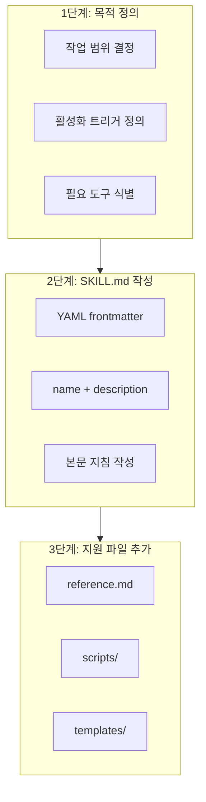
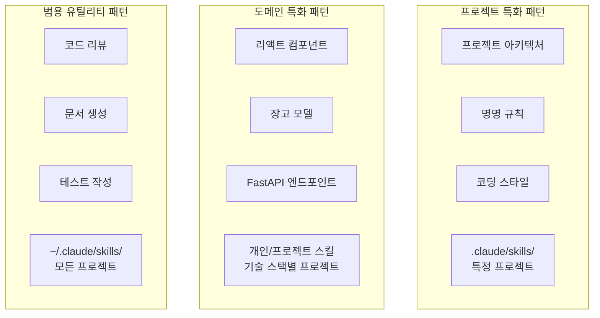

# CHAPTER 03 에이전트 스킬

> 2장은 워크플로와 설정을 다뤘지만, 실제 작업은 API 설계·프런트엔드 컴포넌트·DB 스키마 관리 등 도메인별 전문 지식이 달라 훨씬 복잡하다. 이 장에서는 도메인 특화 지식을 체계적으로 관리하고 필요할 때마다 동적으로 활성화하는 모듈식 지식 시스템 **클로드 스킬**을 다룬다.

## 3-1 클로드 스킬의 개념과 구조

- 스킬 = 클로드의 기능을 확장하는 지식 모듈. 스킬별 SKILL.md 지침 파일 + 선택적 지원 파일(스크립트·템플릿 등)로 구성.
- **슬래시 명령 vs 스킬**: 슬래시 명령은 `/명령` 형태로 직접 선택, 스킬은 프롬프트에 원하는 내용을 입력하면 클로드가 자동으로 해당 스킬을 찾아 사용. v2.1(2026년 2월 기준)부터 `.claude/commands/` 슬래시 명령도 스킬로 통합.

### 컨텍스트 윈도우는 공용 자산이다

- 설계 철학: **"컨텍스트 윈도우는 공용 자산이다(The context window is a public good)"** — 유용한 지식·패턴을 공유 가능한 형태로 캡슐화해 팀·커뮤니티가 함께 활용. 오픈소스 정신과 맥을 같이 한다.
- 스킬 저장소를 깃 커밋하면 팀원이 풀 받는 즉시 지식에 접근. 도메인 전문가가 팀을 떠나도 지식은 스킬로 보존되고, 신규 입사자 온보딩을 가속한다.

### 스킬의 유형


- **개인 스킬**: `~/.claude/skills/`. 모든 프로젝트에서 사용. 개인 워크플로·실험적 기능에 적합.
- **프로젝트 스킬**: `.claude/skills/`. 저장소에 포함돼 팀 공유·자동 배포. 팀 표준 워크플로·프로젝트 특화 기능.
- **플러그인 스킬**: 플러그인과 함께 번들로 배포. 마켓플레이스로 설치 후 바로 사용. 커뮤니티 공유 범용 스킬.

### 스킬 디렉터리 구조

```
my-skill/
├── SKILL.md                # 필수
├── reference.md
├── scripts/
│   └── helper.py
└── templates/
    └── template.txt
```

- SKILL.md만 필수, 나머지는 복잡도에 따라 선택. SKILL.md에서 상대 링크로 다른 파일을 참조하면 필요 시 점진적 로드.

### SKILL.md 파일 구조

- `.claude/skills/skill-name/`에 위치. YAML 프론트매터(frontmatter) + 마크다운 본문.

**표 3-1 프론트매터 필드**

| 필드 | 필수 여부 | 설명 |
|---|---|---|
| name | 선택 | 소문자·영숫자·하이픈만. 생략 시 디렉터리 이름 사용. 최대 65자 |
| description | 필수 | 기능과 사용 트리거 설명. 최대 1,024자 |
| allowed-tools | 선택 | 활성화 시 사용 가능한 도구 목록(예: Read, Grep, Glob) |
| model | 선택 | 스킬 실행 시 사용할 모델 지정 |
| context | 선택 | 추가 컨텍스트 설정 |
| agent | 선택 | 서브에이전트 관련 설정 |

- **name**: 동사 형태 권장(`commit-helper` ✗ → `generating-commit-messages` ✓). `analyzing-code-patterns`, `implementing-api-endpoints`, `testing-react-components`.
- **description**: 기능 + 사용 트리거 모두 포함. 구체적으로 작성("PDF 파일에서 텍스트와 표 추출, 양식 작성, 문서 병합, PDF 파일 작업 시 사용").

```yaml
# 커밋 메시지 생성 스킬 예시
---
name: generating-commit-messages
description: git diff에서 명확한 커밋 메시지 생성. 커밋 메시지 작성 또는 스테이징된 변경 사항 검토 시 사용
---

# 커밋 메시지 생성

## 지침
1. `git diff --staged` 실행
2. 50자 미만의 요약, 상세 설명, 영향받는 구성 요소로 메시지 제안

## 유의 사항
- 현재형 사용
- 무엇을 왜 설명, 어떻게가 아님
```

- SKILL.md는 200줄 이내 유지(초과 시 분할 또는 reference.md로 분리). **단일 책임 원칙(single responsibility principle)** 유도.

### 세 단계 점진적 작동 방식

- 세 가지 유형의 콘텐츠를 단계적으로 로드해 불필요한 콘텐츠의 컨텍스트 선점 방지(= 점진적 공개).
  - **1단계 메타데이터**: 시작 시 자동 로드. 필수 필드 name·description.
  - **2단계 지침**: 요청이 특정 스킬 description과 매칭되면 Bash로 SKILL.md를 컨텍스트에 추가.
  - **3단계 리소스/코드**: SKILL.md 외부 지원 파일(추가 마크다운 FORMS.md/REFERENCE.md, 실행 스크립트 fill_form.py/validate.py, 참조 자료). 접근 전까지 컨텍스트 미소비 → 방대한 자료를 포함해도 사용 안 하면 비용 0.

**표 3-2 스킬 작동 방식**

| 단계 | 레벨 | 로딩 시점 | 토큰 비용 | 콘텐츠 |
|---|---|---|---|---|
| 1단계 | 메타데이터 | 시작 시 자동(시스템 프롬프트) | 스킬당 약 100 토큰 | 프론트매터의 name과 description |
| 2단계 | 지침 | 스킬 트리거 시(Bash로 읽기) | 2,000 토큰(200줄) 이하 권장 | SKILL.md 본문의 지침과 가이드 |
| 3단계 | 리소스/코드 | 필요 시 개별 접근 | 사실상 무제한 | 지원 파일(문서, 스크립트, 템플릿) |

> **세 단계 작동 방식과 토큰 절감 효과**: 스킬 20개를 한 번에 로딩하면 20만 윈도우 초과. 하지만 세 단계로 동작하므로 시작 시 1단계 2,000 토큰만 소비하고 요청에 따라 일부만 2단계 활성화. 일반 작업 총 7,000~20,000 토큰(윈도우의 3.5~10%).

### 스킬 컨텍스트 비용

- 20만 토큰 중 시스템 프롬프트·인프라 약 1만~2만 + 대화 히스토리·파일 누적 → 스킬 실질 예산 3만~5만 토큰.
- **1단계**: 스킬당 ~100 토큰 고정(name 15~20, description 60~80). 20개=2,000 토큰(전체 1%). allowed-tools·model 등은 시스템 프롬프트 직접 노출 안 됨.
- **2단계**: 활성화 시에만 변동. SKILL.md 영문 200줄 미만/한국어 150줄 이내 권장. 코드 예시는 최소화하고 상세 예시는 3단계로 분리.
- **3단계**: 가장 예측 어려운 변동. 문서 파일은 읽기 시점 로드, 실행 파일은 결과만 반영(토큰 0). 예: 데이터 스키마 검증 규칙을 reference.md 200줄로 쓰면 ~2,000 토큰, validate_schema.py로 구현하면 실행 결과(PASS/FAIL·오류)의 100~200 토큰만.
- **최적화 전략 5가지**:
  1. **description 토큰 밀도 극대화**: 100 토큰 예산 내 발견 가능성 확보.
  2. **클로드가 아는 지식 제거**: 범용 지식(파이썬 컴프리헨션, 리액트 useState 등)은 빼고 프로젝트 고유 정보(컨벤션·팀 패턴·내부 API 명세)만 → 50~70% 절감.
  3. **지원 파일 도메인별 분리**: 1단계 깊이만 유지(지원 파일이 다른 지원 파일을 부르지 않게). 중첩 참조는 부분 읽기 위험.
  4. **입출력 예시 최적화**: 대표 1~2개만 SKILL.md, 나머지는 EXAMPLES.md로 분리(예시 세트는 평균 200~500 토큰).
  5. **스크립트 우선 전략**: 검증 규칙·변환 로직·반복 처리는 scripts/로 구현, SKILL.md엔 사용법(입출력 형식·오류 처리)만 간결히.
- **토큰 비용 계산식**(전체 윈도우 15% 이내 유지 목표):
  - 1단계 비용 = 스킬 수 × 100 토큰
  - 2단계 비용 = 동시 활성화 스킬 수(보통 1~3개) × 평균 SKILL.md 토큰 수
  - 3단계 비용 = 로드된 지원 파일 총 줄 수 × 10(근사값)

### 도구 접근 권한 제한

- `allowed-tools` 필드로 스킬 활성화 시 사용 도구 제한.

```yaml
---
name: safe-file-reader
description: 변경 없이 파일 읽기. 읽기 전용 파일 액세스에 사용
allowed-tools: Read, Grep, Glob
---
```

- 위 스킬은 Read/Grep/Glob만 사용 가능 → 파일 수정·명령 실행 원천 차단. 코드 리뷰·보안 감사·문서 분석에 유용.
- IAM과 함께 다층 보안 구성: IAM=전역 권한 정책, 스킬 allowed-tools=특정 작업 컨텍스트 내 세부 권한.

---

## 3-2 스킬 사용과 개발

### 스킬 목록과 스킬 조합

- 사용 가능 스킬 확인: "사용 가능한 스킬이 뭐야?", "모든 사용 가능한 스킬을 나열해 줘". 또는 파일 시스템으로 직접:

```bash
$ ls ~/.claude/skills/
$ ls .claude/skills/
$ cat ~/.claude/skills/my-skill/SKILL.md
```

- 간혹 예상대로 활성화 안 되면 description을 더 구체화하거나 사용 시나리오 명확화.
- **스킬 조합**: 복잡한 작업은 여러 스킬 조합(예: API 개발 시 `analyzing-api-requirements` → `implementing-rest-endpoints` → `testing-api-endpoints`, 순차/병렬 활성화).
- 유사 스킬 동시 활성화 방지: 고유 트리거 용어를 description에 지정('데이터 처리' ✗ → 'Excel 스프레드시트 분석'/'CSV 파일 변환' ✓).

### 커스텀 스킬 개발



- 4단계 순서:
  1. 목적·범위 명확히 정의(어떤 작업 지원, 언제 활성화, 어떤 도구 필요).
  2. `mkdir -p ~/.claude/skills/<스킬명>`으로 디렉터리 생성(위치는 스킬 유형 참고).
  3. SKILL.md 작성(name·description + 본문 구체적 지침).
  4. 지원 파일 추가(reference.md 상세 레퍼런스, scripts/ 헬퍼 스크립트, templates/ 코드 템플릿). 상대 링크 참조 시 점진적 로드.

```yaml
# 리액트 컴포넌트 생성 커스텀 스킬 예시
---
name: creating-react-components
description: React 함수형 컴포넌트 생성, props 타입 정의, 훅 구현. React 컴포넌트 작성 또는 리팩터링 시 사용
allowed-tools: Read, Write, Edit, Grep
---

# React 컴포넌트 생성

## 핵심 원칙
컴포넌트는 함수형으로 작성하며, 타입스크립트로 props 타입을 명시적으로 정의한다.
상태 관리에는 useState와 useReducer를, 부수 효과에는 useEffect를 활용한다.

## 네이밍 규칙
- 컴포넌트: PascalCase(예: UserProfile)
- 파일: 컴포넌트와 동일(예: UserProfile.tsx)
- 훅: camelCase, use 접두사(예: useUserData)
- 이벤트 핸들러: handle 접두사(예: handleSubmit)

## 유의 사항
- 컴포넌트당 하나의 책임
- props는 구조 분해 할당 사용
- 조건부 렌더링은 early return 패턴 활용
- 메모이제이션은 실제 성능 문제 발생 시에만 적용

상세 패턴은 [reference.md](./reference.md) 참조
템플릿은 [templates/component.tsx](./templates/component.tsx) 참조
```

- 입출력 예시는 2개 이상(입력의 다양성=간단/복잡/엣지 케이스, 출력의 일관성=동일 형식·품질 기준).

### 스킬에서 환각 방지 지침 작성

- 환각은 존재하지 않는 API 호출, 잘못된 라이브러리 버전, 부정확한 설정값 등으로 나타남. SKILL.md에 환각 방지 지침 포함.
- **1. 불확실성 표현 허용 지침**: 클로드가 불확실성을 인정하고 '모르겠다'라고 답하도록 명시 허용.

```yaml
---
name: api-documentation-generator
description: API 엔드포인트 문서 자동 생성. OpenAPI 스펙 작성, 요청/응답 예시 ...
---
# 모든 기술 정보에는 출처를 명시한다.
# - API 사용법: 공식 문서 URL 또는 "프로젝트 내 사용 예시 참조"
# - 설정 옵션: 해당 파일 경로(예: src/config/database.ts:15)
# - 버전 정보: package.json 또는 공식 릴리스 페이지
# 응답 형식: 라이브러리 이름(버전: package.json 기준 또는 "확인 필요")
```

- **2. 지식 범위 제한 지침**: 참조 가능 정보 범위를 명확히 제한(프로젝트 내 코드만 기반으로 문서 생성).

```yaml
---
name: codebase-analyzer
description: 프로젝트 코드베이스 분석 및 구조 문서화. 아키텍처 파악, 의존성 분석 시 사용
---
# 코드베이스 분석
## 정보 출처 제한 (오직 다음 출처만 사용)
# - 프로젝트 내 소스 코드 파일
# - package.json, requirements.txt 등 의존성 파일
# - 프로젝트 내 README 및 문서 파일
```

### 코드 실행 통합

- 스킬은 scripts/ 디렉터리로 실행 코드와 통합. 클로드가 토큰 소비 없이 결정론적으로 처리해야 하는 작업에 적합. 오류 상황은 클로드에게 넘기지 않고 스크립트 안에서 직접 처리.
- 스크립트 실행 문제 시 확인 3가지: 종속성 미설치 / 실행 권한 부족 / 경로 형식 오류 → 스크립트를 독립 실행해 진단.

### 테스트와 검증 방법

- 설명과 일치하는 질문으로 활성화 확인. 활성화 안 되면:
  1. description이 구체적인지 확인.
  2. 경로 확인(개인: `~/.claude/skills/skill-name/SKILL.md`, 프로젝트: `.claude/skills/skill-name/SKILL.md`).
  3. YAML 유효성 검사(시작/종료 `---`, 탭 사용 금지, 올바른 들여쓰기).
  4. `claude --debug`로 스킬 로딩 문제 확인(3-3절 디버깅 기법 참조).

---

## 3-3 스킬 고급 사용과 최적화

> 복잡한 시스템 개발은 API 설계·프런트엔드·DB·테스트 자동화가 유기적으로 연결된다. 토큰 효율 최적화와 팀 협업 고급 패턴을 다룬다.

### 동적 스킬 로딩 패턴

- 세 단계 점진적 작동 방식 = 동적 로딩 패턴.

```
database-operations/
├── SKILL.md                    # 1단계: 핵심 원칙(100줄 이내)
├── reference/
│   ├── queries.md              # 2단계: 쿼리 작성 상세 가이드
│   ├── migrations.md           # 2단계: 마이그레이션 패턴
│   └── optimization.md         # 2단계: 성능 최적화 기법
├── templates/
│   ├── model.py.template       # 3단계: 모델 템플릿
│   └── migration.py.template   # 3단계: 마이그레이션 템플릿
└── scripts/
    └── generate_model.py       # 3단계: 모델 생성 스크립트
```

- SKILL.md에서 각 레퍼런스 링크와 함께 "언제 참조해야 하는지" 명시 → 클로드가 필요한 정보만 선택 로드.

```markdown
# 데이터베이스 작업

## 핵심 원칙(항상 적용)
- ORM 우선 사용, 필요 시 raw SQL
- 인덱스 설계 먼저, 쿼리 작성 나중
- 트랜잭션 범위 최소화

## 빠른 참조(자주 사용)
- 기본 CRUD: Model.create(), Model.get(), Model.update(), Model.delete()
- 필터링: Model.filter(field=value)
- 정렬: Model.order_by('field')

## 상세 가이드(필요 시 로드)
- 복잡한 조인 쿼리: [queries.md](./reference/queries.md)
- 마이그레이션 전략: [migrations.md](./reference/migrations.md)
- 쿼리 최적화: [optimization.md](./reference/optimization.md)
```

### 스킬 성능 최적화

1. **정보 밀도 향상**: 동일 내용을 더 적은 토큰으로. 불필요한 설명 제거, 핵심만 간결히.
2. **조건부 로딩**: '복잡한 쿼리 작성 시에는 queries.md 참조'처럼 조건 명시해 상황별 판단.
3. **캐싱 고려**: 자주 쓰는 정보는 SKILL.md에 직접, 드물게 쓰는 정보는 별도 파일로 분리.

### 스킬 버전 관리

- 변경 이력 추적·롤백 위해 SKILL.md 내에 Version History 섹션 포함.

```markdown
## Version History

### v2.1.0(2025-12-01)
- 새로운 마이그레이션 패턴 추가
- 성능 최적화 가이드 업데이트

### v2.0.0(2025-11-15)
- ORM 전환에 따른 전면 개편
- raw SQL 예시를 ORM 예시로 대체

### v1.0.0(2025-10-01)
- 초기 버전 릴리스
```

- 호환성 고려: 주요 변경 시 메인 버전 올리고 공지. 깃 필수(프로젝트 스킬은 저장소에 포함되어 깃 히스토리로 추적, 중요 변경엔 명확한 커밋 메시지·태그).

### 팀 스킬 개발

- `.claude/skills/`에 저장하고 깃 관리. `git pull` 즉시 반영. 마켓플레이스 배포 목적이면 플러그인 권장.
- 원칙:
  1. **표준화된 구조**: 동일 디렉터리 구조·파일 명명 규칙.
  2. **리뷰 프로세스**: 코드 리뷰처럼 스킬 변경도 리뷰(description 명확성, 예시 품질, 도구 권한 적절성).
  3. **피드백 수집·반영**: 실사용 문제 수집.

### 디버깅 기법

- `claude --debug`로 스킬 로딩 문제 확인. 디버그 로그는 `~/.claude/debug/`에 세션별 저장.

```
# 디버그 로그 예시(~/.claude/debug/session-id.txt)
[DEBUG] Loading skills from directories:
  managed=/Library/Application Support/ClaudeCode/.claude/skills,
  user=/Users/username/.claude/skills,
  project=/Users/username/project/.claude/skills
[DEBUG] Loaded 28 unique skills
  (managed: 0, user: 0, project: 28, duplicates removed: 0)
[DEBUG] getSkills returning: 28 skill dir commands, 0 plugin skills
```

- 확인 핵심 3가지:
  1. 스킬 검색 경로가 올바른가?(managed/user/project 세 경로·개수)
  2. 동일 이름 스킬이 여러 위치에?(duplicates removed, 우선순위 project > user > managed)
  3. 플러그인 스킬이 정상 로드?(plugin skills 개수, 설치했는데 0이면 활성화 점검)
- 일반 문제와 해결:
  1. **활성화 안 됨**: description 매칭 실패/모호 → 구체적 트리거 용어 추가.
  2. **여러 스킬 충돌**: 유사 description 동시 활성화 → 고유 용어로 구분.
  3. **스크립트 실행 오류**: 종속성/권한/경로 → 독립 실행 진단.
  4. **YAML 파싱 오류**: 구문 오류로 전체 로드 실패 → `---`, 탭 금지, 들여쓰기 확인.

### 재사용 가능한 스킬 패턴



- **프로젝트 특화 패턴**: 프로젝트 고유 아키텍처·명명 규칙·코딩 스타일. 프로젝트 스킬로 공유.
- **도메인 특화 패턴**: 특정 기술 스택/프레임워크(리액트 컴포넌트, 장고 모델, FastAPI 엔드포인트).
- **범용 유틸리티 패턴**: 가장 재사용성 높음(코드 리뷰·문서 생성·테스트 작성·리팩터링). 개인 스킬/마켓플레이스 공유.

```yaml
# 재사용 패턴: 범용 코드 리뷰 스킬
---
name: reviewing-code-changes
description: 코드 변경 사항 검토, 잠재적 버그 식별, 개선 제안. 풀 리퀘스트 또는 코드 리뷰 시 사용
allowed-tools: Read, Grep, Glob
---

# 코드 리뷰
## 검토 체크리스트
### 정확성
- [ ] 비즈니스 로직이 요구 사항을 충족하는가?
- [ ] 엣지 케이스가 처리되는가?
- [ ] 오류 처리가 적절한가?
### 유지보수성
- [ ] 코드가 읽기 쉬운가?
- [ ] 함수/클래스가 단일 책임을 가지는가?
- [ ] 중복이 최소화되었는가?
### 성능
- [ ] 불필요한 연산이 있는가?
- [ ] N+1 쿼리 문제가 있는가?
- [ ] 메모리 누수 가능성이 있는가?
### 보안
- [ ] 입력 검증이 적절한가?
- [ ] 민감 정보가 노출되지 않는가?
- [ ] SQL 인젝션, XSS 등 취약점이 없는가?

## 리뷰 결과 형식
1. 요약: 전체 코드 품질 평가(1-2문장)
2. 필수 수정: 병합 전 반드시 수정해야 할 항목
3. 권장 수정: 개선하면 좋지만 선택적인 항목
4. 긍정적 피드백: 잘 작성된 부분에 대한 인정
```

### 스킬 문서화 유의 사항

- 스킬 인덱스 문서를 유지하면 발견·활용 용이. 포함 요소: 목적·적용 범위 / 실제 사용 예시 / 다른 스킬과의 관계(조합 패턴) / 알려진 제한·주의 사항.
- SKILL.md 자체 품질도 중요(모호하면 결과 불일치). 명확·구체적 언어, 예시로 기대 결과 제시.

### 스킬의 격리 실행: context: fork 메커니즘

- 기본 동작은 부모 대화 컨텍스트 안에서 스킬 활성화. 대규모 코드베이스 분석처럼 많은 토큰을 소비하거나 중간 결과물이 이후 품질을 저하시키면 격리 실행 필요. `context: fork`로 해결.
- 설정 시 부모 대화에서 완전 분리된 서브에이전트 컨텍스트에서 실행. 스킬 본문이 서브에이전트 구동 프롬프트가 되며 부모 히스토리에 접근 불가. 완료 시 결과만 반환.

```yaml
# context: fork 스킬 예시
---
name: code-analysis
description: Analyze code quality and generate detailed reports. Use for comprehensive code review
context: fork
agent: Explore
allowed-tools:
  - Read
  - Grep
  - Glob
---
```

- **agent 필드**(context: fork 설정 시에만 의미, 서브에이전트 동작 모드 결정):
  - **Explore**: 코드베이스 탐색 최적화 읽기 전용 모드.
  - **Plan**: 컨텍스트 수집·실행 계획 수립 특화.
  - **general-purpose**: 기본값, 범용 서브에이전트(제약 없이 작업).
- **context: fork 적합 상황**:
  1. 대규모 코드베이스 분석(수백 파일 탐색이 수만 토큰 소비 → 포크 시 최종 결과 1,000~2,000 토큰 요약만 전달).
  2. 세션 격리 필요 워크플로(SPEC 문서 생성, TDD/DDD 사이클, 테스트 전략 — 단계 간 간섭 방지).
  3. 도구 전문화 기반 분석(ast-grep 같은 구조적 검색, 포크된 Explore에서 실행해 중간 데이터 격리).

> **Tip** MoAI-ADK 워크플로 스킬(moai-workflow-spec/ddd/tdd/testing)은 모두 context: fork 사용. plan 단계의 방대한 탐색 컨텍스트가 run 단계 구현에 간섭하는 것을 원천 차단.

> **context: fork를 통한 토큰 관리 효과**: 코드 분석 스킬이 포크 없이 실행되면 탐색 과정에서 30,000~50,000 토큰을 소비해 부모 대화 잔여 컨텍스트가 크게 줄어든다. 포크하면 부모는 요약 1,000~2,000 토큰만 추가 부담(약 95% 절감). 단, 부모 대화 컨텍스트(이전 내용·사용자 선호)를 참조해야 하는 스킬, 소규모 작업(서브에이전트 오버헤드가 비효율)은 포크 부적합.

- `context: fork` + `allowed-tools` 조합으로 격리·보안 동시 달성(예: agent: Explore + allowed-tools: [Read, Grep, Glob] → 읽고 검색만, 수정 불가 → 보안 감사·아키텍처 분석·코드 품질 평가에 이상적).
- 결론: `context: fork`는 스킬을 단순 지식 모듈에서 독립 실행 가능한 에이전트 단위로 격상시키는 메커니즘. 토큰 효율·세션 격리·보안 제한 세 축으로 스킬 활용 범위를 확장.

### 마무리

- 3장: 도메인 지식 캡슐화 스킬 시스템 개념 → 메타데이터·지침·리소스 3단계 점진적 작동(토큰 비용 최소화) → 환각 방지 지침·스크립트 통합 커스텀 스킬 개발 → `context: fork`로 격리 실행해 메인 대화 오염 방지하는 고급 최적화까지.
