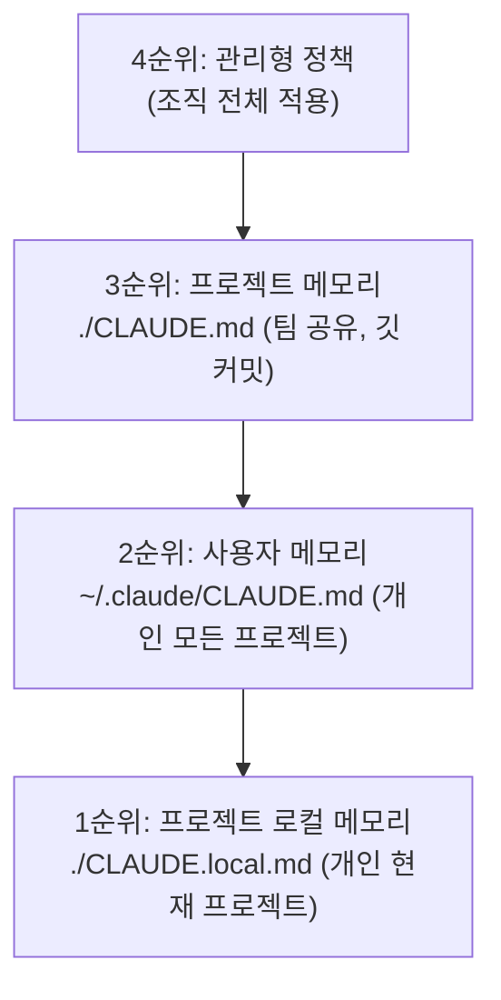
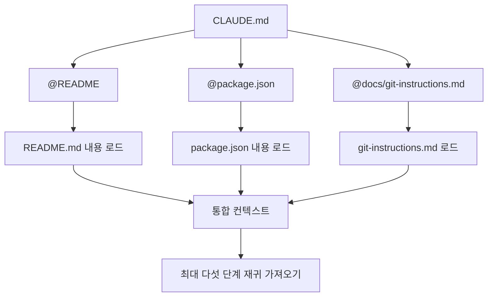
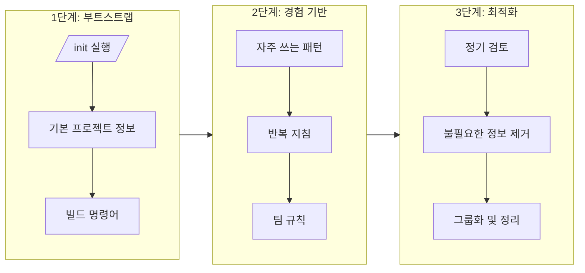
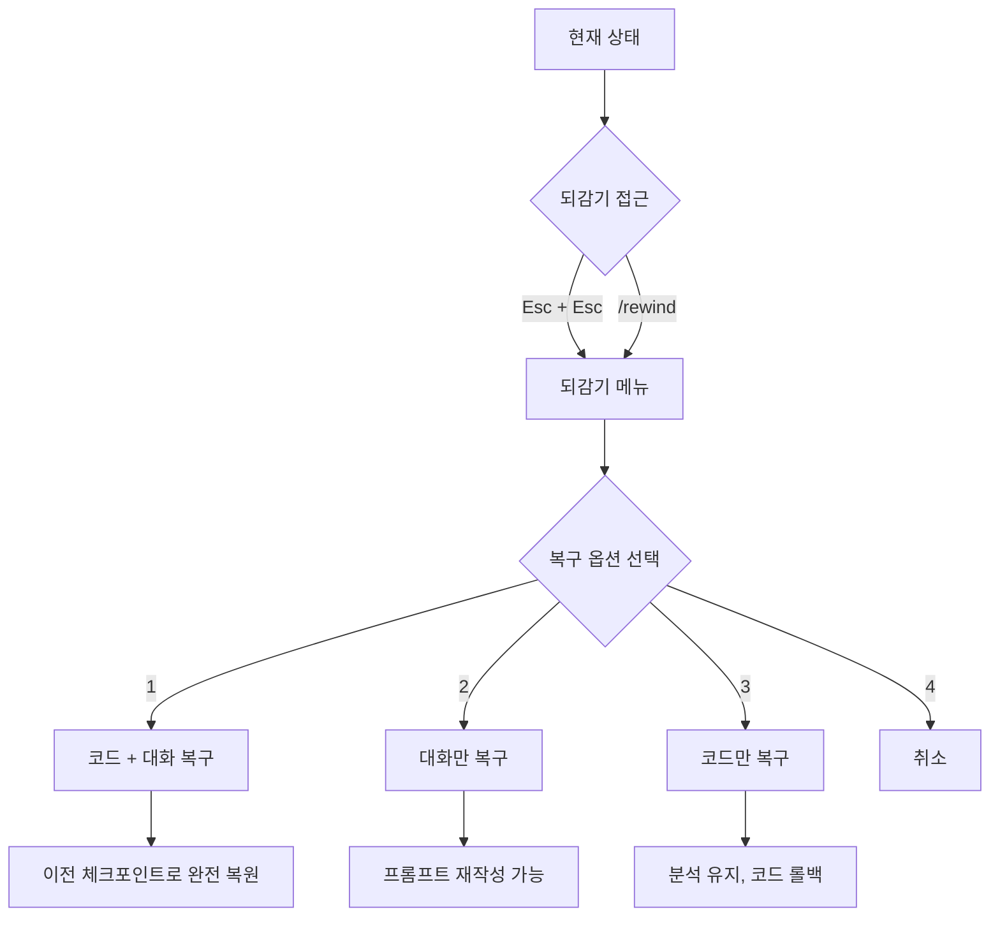
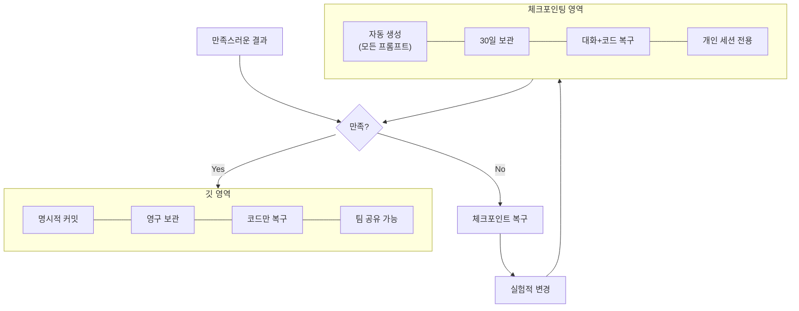
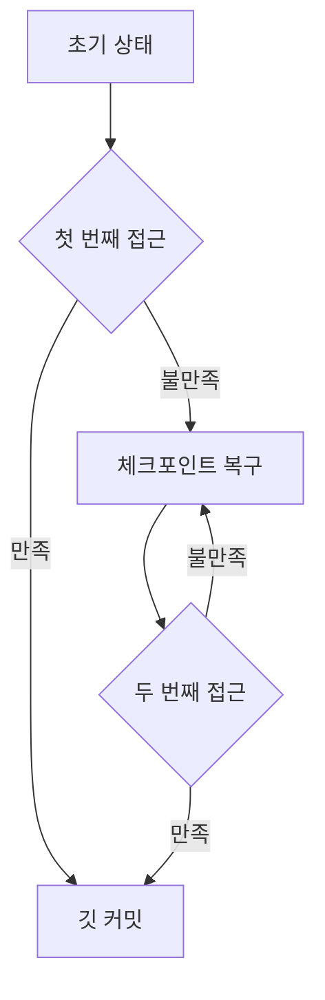
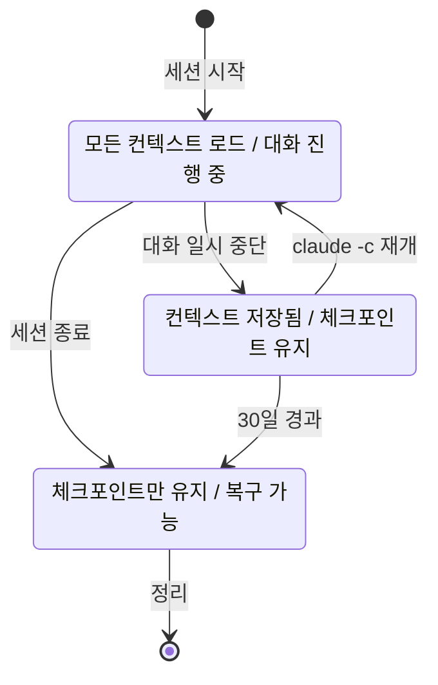
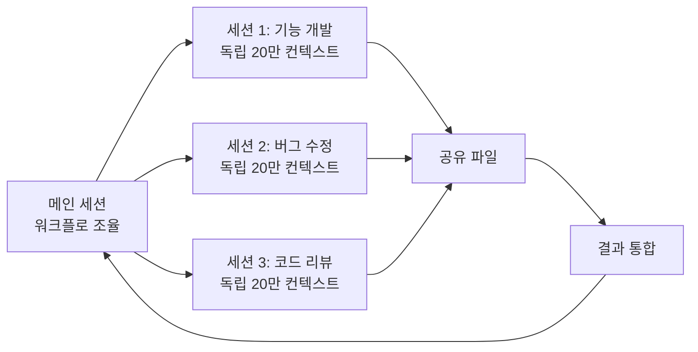

# CHAPTER 06 메모리와 대화 세션 관리

에이전틱 코딩은 컨텍스트를 지속해서 유지하는 일이 중요하다. 이 장에서는 컨텍스트를 유지하도록 돕는 클로드 코드의 **메모리 시스템**과 **상태 관리 메커니즘**을 다룬다.

- **메모리**: 세션 간에 기억하는 선호 설정과 지침
- **메모리 파일**: 이 메모리를 저장하는 `CLAUDE.md` 또는 `CLAUDE.local.md`

---

## 6-1 메모리 시스템 이해하기

클로드 코드는 세션 간에 기본 설정을 기억하는 **계층적 메모리 시스템**을 제공한다. 핵심은 `CLAUDE.md` 파일이며, 여기 작성된 지침은 세션 시작 시 자동으로 로드되어 컨텍스트에 포함된다. 덕분에 한 번 설정한 규칙을 매번 반복하지 않고 이후 모든 세션에 자동 적용할 수 있다.

### 네 가지 계층적 메모리

클로드 코드는 서로 다른 범위와 목적을 가진 네 가지 계층의 메모리를 제공한다. 더 구체적인(좁은 범위) 설정이 더 높은 우선순위를 가진다.

| 우선순위 | 계층                                       | 경로                                                       | 범위               | 깃 커밋 |
| -------- | ------------------------------------------ | ---------------------------------------------------------- | ------------------ | ------- |
| 4순위    | 관리형 정책(Managed Policy)                | macOS: `/Library/Application Support/ClaudeCode/CLAUDE.md` | 조직 전체          | -       |
| 3순위    | 프로젝트 메모리(Project Memory)            | `./CLAUDE.md`                                              | 팀 공유            | O       |
| 2순위    | 사용자 메모리(User Memory)                 | `~/.claude/CLAUDE.md`                                      | 개인 모든 프로젝트 | X       |
| 1순위    | 프로젝트 로컬 메모리(Project Local Memory) | `./CLAUDE.local.md`                                        | 개인 현재 프로젝트 | X       |

- **관리형 정책**: IT/데브옵스 팀에서 관리하는 전사 규칙. `settings.json`의 `claudeMdExcludes`로 하위 디렉터리 로딩을 제외할 수 있으나, 관리형 정책만은 항상 적용되어 제외 불가.
- **프로젝트 메모리**: 코딩 스타일, 아키텍처 결정, 빌드 명령어 등을 문서화. 깃에 커밋되어 팀이 동일 환경 공유. 하위 디렉터리의 `CLAUDE.md`는 세션 시작이 아니라 해당 디렉터리 파일을 읽을 때 온디맨드(on-demand)로 로딩.
- **사용자 메모리**: 개인의 모든 프로젝트에 적용되는 에디터 스타일, 단축키 패턴 등.
- **프로젝트 로컬 메모리**: 현재 프로젝트에 대한 개인 설정. 샌드박스 URL, 로컬 개발 환경 설정 등. 깃에 커밋 안 됨.



> 우선순위: 프로젝트 로컬 > 프로젝트 > 사용자 > 관리형 정책

### 자동 메모리

`settings.json`에서 `autoMemoryEnabled: true`일 때 활성화된다. 클로드가 세션 중 학습한 내용(빌드 방식, 선호 코딩 패턴, 테스트 명령어 등)을 자동으로 저장한다.

- 저장 위치: `~/.claude/projects/<project-hash>/MEMORY.md`
- 이 파일의 **처음 200줄**이 세션 시작 시 자동 로드되어 이전 세션의 맥락이 이어짐
- 직접 편집 가능하며, "이것을 기억해 줘"라고 요청하면 자동 추가

#### CLAUDE.md vs MEMORY.md

둘 다 세션 간 컨텍스트를 유지하는 메모리 파일이지만 역할이 다르다. `CLAUDE.md`는 사람이 미리 주는 지침(입력)이고, `MEMORY.md`는 클로드가 세션을 거치며 스스로 쌓는 작업 기억(누적 결과)이다.

| 구분      | CLAUDE.md                                       | MEMORY.md                                          |
| --------- | ----------------------------------------------- | -------------------------------------------------- |
| 작성 주체 | 사람이 직접 작성 (수동)                         | 클로드가 자동 저장 (자동 메모리)                   |
| 성격      | 지침·규칙 (클로드에게 시키는 것)                | 학습 기록 (클로드가 스스로 알아낸 것)              |
| 내용      | 코딩 스타일, 아키텍처 결정, 빌드 명령어         | 세션 중 학습한 빌드 방식, 선호 패턴, 테스트 명령어 |
| 위치      | `./CLAUDE.md`, `~/.claude/CLAUDE.md` 등 (4계층) | `~/.claude/projects/<project-hash>/MEMORY.md`      |
| 로딩      | 세션 시작 시 자동 로드                          | 처음 **200줄**만 세션 시작 시 자동 로드            |
| 깃 커밋   | 프로젝트 메모리는 커밋 (팀 공유)                | 커밋 안 함 (개인·프로젝트 로컬)                    |
| 활성화    | 항상                                            | `autoMemoryEnabled: true`일 때만                   |

> 한 줄 요약: **CLAUDE.md** = "이렇게 일해"(내가 정해 주는 지침서) / **MEMORY.md** = "이건 지난번에 알아낸 거야"(클로드가 쌓는 작업 기억)

클로드 코드는 지침 파일을 **재귀적으로** 읽는다. 현재 작업 디렉터리에서 루트까지 거슬러 올라가며 발견한 모든 `CLAUDE.md`/`CLAUDE.local.md`를 로드해, 하위 디렉터리 설정이 상위 설정을 보완·재정의한다.

### CLAUDE.md 가져오기와 조건부 로딩

`@path/to/import` 구문은 외부 파일 내용을 `CLAUDE.md` 컨텍스트로 가져오는 핵심 기능이다. `@` 뒤에 파일 경로를 쓰면 세션 시작 시 해당 파일 내용을 읽어 병합한다. 상대 경로(CLAUDE.md 기준)와 절대 경로 모두 지원하며, 홈 디렉터리는 `~`로 참조한다.

```
프로젝트 개요는 @README.md를, npm 명령어는 @package.json을 참조하세요.

# 개인 선호 설정
- @~/.claude/my-project-instructions.md
```



**CLAUDE.md 작성 3원칙**

1. **구체적으로**: "코드를 올바르게 포맷하세요"보다 "2칸 들여쓰기 사용"이 명확.
2. **구조 사용**: 글머리 기호로 포맷하고 마크다운 제목으로 그룹화.
3. **주기적 검토**: 프로젝트 발전에 따라 최신 정보로 유지.

**재귀적 가져오기와 깊이 제한**: 가져온 파일 내부에서도 `@`로 추가 가져오기 가능. 순환 참조 방지와 로드 시간 관리를 위해 **최대 다섯 단계**까지만 허용된다.

**코드 블록 내 가져오기 무시 규칙**: 마크다운 코드 스팬(인라인)과 코드 블록 안의 `@`는 가져오기로 해석되지 않고 일반 텍스트로 처리된다. 덕분에 코드 예시나 패키지명(`@anthropic-ai/claude-code`)을 안전하게 포함할 수 있다.

**`/memory` 명령**: 현재 로드된 모든 메모리 파일과 가져오기 체인을 확인. 승인된 가져오기 정보는 `.claude/settings.json`에 저장됨.

### 모듈화 전략

가져오기 원칙은 '필요한 정보를 필요한 시점에 로드'. `CLAUDE.md` 크기를 최소화하면서 풍부한 지침을 관리한다.

1. **핵심-참조 분리**: `CLAUDE.md`엔 핵심 아이덴티티와 최소 규칙만, 상세 지침은 별도 파일 `@`로 참조.
2. **설정 파일 직접 참조**: 마크다운뿐 아니라 YAML/JSON도 가져오기 가능. `@package.json` 참조 시 의존성·스크립트를 항상 최신으로 파악.
3. **도메인별 분리**: 프런트엔드 지침, 백엔드 API 설계, DB 스키마 규칙 등을 독립 파일로 관리해 담당자가 독립적으로 업데이트.

> **주의**: 과도한 가져오기(특히 재귀)는 컨텍스트 윈도우를 빠르게 소모한다. 대용량 파일은 핵심만 발췌한 요약 파일을 만들어 참조하고, `/memory`로 로드된 파일 목록을 확인하는 습관을 들여 가져오기 체인을 얕고 명확하게 유지하자.

### 토큰 효율성 분석과 ROI 계산

메모리에 저장할 정보는 **토큰 효율성(ROI)**을 고려해 선택한다. "해당 정보를 세션당 평균 몇 번 참조하는가"를 기준으로 판단한다.

- **저장이 효율적**: 코딩 스타일 가이드 100 토큰 × 세션당 5회 참조 → 메모리 저장이 유리 (100 토큰 1회 vs 100 토큰 × 5회).
- **프롬프트 전달이 효율적**: 특정 함수 구현 세부사항 1,000 토큰 × 세션당 0.2회 참조 → 필요할 때만 프롬프트로 전달.

**메모리가 비효율적일 때의 문제**

- **컨텍스트 윈도우 낭비**: 20만 토큰은 무한하지 않다. 메모리가 크면 실제 작업 토큰이 줄어듦.
- **응답 지연**: 복잡·비구조화된 메모리는 파싱 시간 증가.
- **일관성 손실**: 오래된 메모리(예: TS 마이그레이션했는데 JS 기준 메모리)는 잘못된 제안 유발.

### 메모리 시스템을 자유자재로

**`/memory` 명령으로 직접 편집**: 세션 중 `/memory`로 시스템 편집기에서 메모리 파일을 연다. 광범위한 추가나 기존 메모리 정리에 유용하다.

**`/init` 명령으로 프로젝트 메모리 부트스트랩**: 새 프로젝트에서 코드베이스를 분석해 `CLAUDE.md`를 자동 생성. 프로젝트 구조, 언어/프레임워크, 빌드 명령어가 포함된다. 이후 자주 쓰는 명령어(빌드/테스트/린트), 코드 스타일, 명명 규칙, 아키텍처 패턴을 추가해 완성한다.

---

## 메모리 최적화와 장기 작업 관리

장기 작업에서는 불필요한 정보 축적이 성능 저하로 이어지므로 메모리 관리가 특히 중요하다.

### 대규모 프로젝트를 위한 모듈화 전략

단일 `CLAUDE.md`에 모든 정보를 담으면 유지보수와 컨텍스트 관리가 비효율적이다. 계층적 메모리 구조를 활용한다.

```
project/
├── CLAUDE.md          (전체 프로젝트 규칙)
├── frontend/
│   └── CLAUDE.md      (프런트엔드 전용 규칙)
├── backend/
│   └── CLAUDE.md      (백엔드 전용 규칙)
└── shared/
    └── CLAUDE.md      (공통 라이브러리 규칙)
```

전체 루트 `CLAUDE.md`는 일반 규칙, 각 모듈 디렉터리 `CLAUDE.md`는 모듈별 특수 규칙을 담는다.

**가져오기 기반 모듈화**가 더 유연하다. 핵심 메모리와 선택적 참조 파일을 분리하고 필요할 때만 가져온다. 주석 처리된 가져오기(`# @docs/...`)는 기본 로드되지 않지만 주석을 제거하면 활성화되어, 대규모 참조 문서를 선택적으로 로드할 수 있다.

### 동적 메모리 로딩 패턴

작업 컨텍스트에 따라 메모리를 동적으로 조정한다. 특정 작업 시작 시 관련 메모리를 활성화하도록 요청할 수 있다.

```
> 프런트엔드 작업을 시작할게. @docs/frontend-guidelines.md를 참조해서 React 컴포넌트를 리팩터링해 줘.
```

작업별 필요한 정보만 로드해 토큰을 절약하고, 작업이 끝나면 자동으로 컨텍스트에서 제거된다. 조건부 가져오기 패턴도 특정 조건에서만 적용될 규칙을 명시하는 데 유용하다.

### 메모리 파일 성숙도 모델

메모리 파일은 프로젝트와 함께 단계적으로 발전시킨다.

1. **부트스트랩 메모리**: `/init`으로 자동 생성된 기본 프로젝트 정보(구조, 언어, 빌드 명령어). 프로젝트 초기 기본 컨텍스트.
2. **경험 기반 메모리**: 개발 진행하며 자주 쓰는 패턴, 반복 지침, 팀 규칙 추가. 실제 경험 반영으로 실용적·구체적.
3. **최적화된 메모리**: 정기 검토·정리. 미사용 정보 제거, 자주 참조되는 정보는 상위로 이동, 관련 정보 그룹화. 유지보수 용이.



> 공식 문서는 각 `CLAUDE.md`를 **200줄 이하**로 유지하고, 초과 시 외부 파일 참조(`@`)로 분리할 것을 권장한다.

### 모듈형 룰 시스템

클로드 코드는 `.claude/rules/` 디렉터리 기반의 **모듈형 룰 시스템**을 제공한다. 핵심은 '관심사의 분리'로, 지침을 주제·도메인별 독립 마크다운 파일로 나누고 각 파일의 적용 조건을 프론트매터로 명시한다. 현재 작업 컨텍스트에 맞는 룰만 선택적으로 로드한다.

> `CLAUDE.md`가 '무엇을 기억할 것인가'를 정의한다면, 모듈형 룰은 '언제 어떤 지침을 적용할 것인가'를 정의한다.

```
.claude/rules/
├── core/
│   ├── constitution.md       # 핵심 원칙(항상 로드)
│   └── security-policy.md     # 보안 정책(항상 로드)
├── development/
│   ├── coding-standards.md    # 코딩 표준(항상 로드)
│   └── skill-authoring.md     # 스킬 작성 가이드(항상 로드)
├── languages/
│   ├── python.md              # Python 규칙(*.py 작업 시에만 로드)
│   ├── typescript.md          # TypeScript 규칙(*.ts 작업 시에만 로드)
│   └── go.md                  # Go 규칙(*.go 작업 시에만 로드)
└── workflow/
    ├── spec-workflow.md       # SPEC 워크플로(항상 로드)
    └── file-reading.md        # 파일 읽기 최적화(항상 로드)
```

`core/`와 `workflow/`는 프론트매터 없이 항상 로드되는 전역 규칙이고, `languages/`는 `paths` 필드로 특정 파일 타입에만 조건부 로드된다.

**paths 필드를 이용한 조건부 로딩**: 룰 파일 상단에 프론트매터로 glob 패턴을 지정하면, 현재 작업 중인 파일이 패턴과 일치할 때만 그 룰을 로드한다.

```
---
paths:
  - "**/*.py"
  - "**/pyproject.toml"
  - "**/requirements*.txt"
---

# Python Rules
Version: Python 3.13+

## Tooling
- Linting: ruff(not flake8)
- Formatting: black, isort(or ruff format)
```

- glob은 표준 와일드카드: `**`는 재귀적 디렉터리, `*`는 파일명 매칭.
- `paths` 없는 룰 파일은 **항상 로드**(보안 정책, 코딩 표준 등 전역 규칙에 적합).
- `**/*`처럼 모든 파일에 매칭되는 패턴은 조건부 로딩 의미를 상실시키므로 지양.

**CLAUDE.md와의 관계**: 상호 보완적. `CLAUDE.md`는 핵심 아이덴티티·고수준 지침의 진입점, `.claude/rules/`는 세부 실행 규칙의 모듈화 확장.

| 구분                                    | 배치 위치                                             |
| --------------------------------------- | ----------------------------------------------------- |
| 모든 작업에 항상 적용되는 핵심 규칙     | `CLAUDE.md`에 직접 작성                               |
| 특정 언어/프레임워크/작업 유형에만 적용 | `.claude/rules/`에 개별 파일 + `paths` 지정           |
| 전역이지만 분량 많은 상세 규칙          | `.claude/rules/`에 배치하되 프론트매터 없이 항상 로드 |

**사용자 수준 룰과 고급 기능**

- `~/.claude/rules/`에 사용자 수준 룰 파일 배치 가능(모든 프로젝트 적용). 심링크(symlink) 지원으로 여러 프로젝트에서 공통 룰 공유.
- `InstructionsLoaded` 훅으로 어떤 파일이 언제 로딩되는지 디버깅 가능.
- **룰 vs 스킬**: 룰은 매 세션 시작 시 자동 로드되는 상시 지침, 스킬은 필요할 때 온디맨드로 호출되는 작업 단위(배포 자동화, 코드 리뷰 등).

---

## 6-2 체크포인팅과 복구 시스템

체크포인팅은 세션 수준의 빠른 실험·복구에 최적화된다. 이 절에서는 `/rewind` 화면, 토큰 복구 효과, Bash 한계 보완, 깃 통합 전략을 다룬다.

### /rewind 화면과 되감기 사용법

체크포인트로 되돌아가는 방법은 두 가지: `/rewind` 명령, 또는 `Esc` 두 번 연속. `Esc + Esc`가 되감기 메뉴에 가장 빠르게 접근하는 방법이다.



되감기 메뉴는 현재 프롬프트 이전 체크포인트 목록을 표시하며, 각 항목은 해당 시점의 주요 변경 사항을 요약한다. 체크포인트 선택 시 복구 범위 확인 화면이 나타난다.

**복구 옵션 3종**

- **대화만(Restore conversation)**: 코드 변경은 유지, 사용자 메시지로 되감기. 클로드 응답이 마음에 안 들어 다른 방향으로 재시도하되 코드는 유지하고 싶을 때.
- **코드만(Restore code)**: 대화 맥락은 보존, 파일 변경만 되돌리기. 코드가 잘못된 방향일 때.
- **코드 + 대화 모두(Restore code and conversation)**: 이전 지점으로 둘 다 복구. 처음부터 다시 시작.

> 되감으면 사용했던 토큰이 다시 복구된다. 원하는 결과가 안 나오면 수정 요청 대신 되감기로 이전 상태에서 재시도하는 편이 효율적이며, 오염된 컨텍스트를 정리하는 데도 유용하다. (저자가 가장 자주 쓰는 기능)

세션 저장 기간은 기본 **30일**이며 `settings.json`의 `cleanupPeriodDays`로 조정.

### 체크포인팅의 제한 사항과 대응 전략

`rm`, `mv`, `cp` 같은 bash 명령을 통한 파일 수정은 추적되지 않는다. 또한 클로드 코드 외부에서 수동 수정하거나 다른 세션에서 동시 편집한 내용도 기록되지 않으므로, 여러 세션 동시 작업이나 IDE 병행 사용 시 주의.

**대응**: `post-bash` 훅을 설정해 bash 명령 실행 후 자동으로 깃 커밋을 생성하면 깃 히스토리로 복구할 수 있다.

```bash
# .claude/hooks/post-bash
#!/bin/bash
git add -A
git commit -m "Auto-commit after bash command" --allow-empty
```

### 체크포인팅과 깃

체크포인팅과 깃은 서로 다른 목적을 가진 도구다.

| 측면       | 체크포인팅             | 깃               |
| ---------- | ---------------------- | ---------------- |
| 생성 시점  | 모든 프롬프트마다 자동 | 명시적 커밋 필요 |
| 지속 기간  | 30일(조정 가능)        | 영구적           |
| 복구 범위  | 대화/코드 선택적 복구  | 코드만 복구      |
| 협업       | 개인 세션 전용         | 팀 공유 가능     |
| 추적 범위  | Read/Write/Edit만      | 모든 파일 변경   |
| 복구 속도  | 즉시(`Esc + Esc`)      | 상대적으로 느림  |
| 메타데이터 | 프롬프트 텍스트        | 커밋 메시지      |

- **체크포인팅**: '일단 해 보고 마음에 안 들면 되돌리기'에 최적화. 실험적 변경, 프롬프트 재작성 시.
- **깃**: '작동하는 상태를 기록하고 협업하기'에 최적화. 영구 보존, 팀 공유, 브랜치 개발 시.

**하이브리드 전략**이 가장 효과적: 실험 단계에서 체크포인팅으로 빠르게 시도·되돌리고, 만족스러운 결과를 얻으면 깃으로 커밋해 영구 보존.



### 다중 체크포인트와 스마트 복구

체크포인팅 시스템은 여러 체크포인트를 생성·관리할 수 있다. 긴 세션에서 여러 단계를 거쳐 수정했을 때, 중간 체크포인트로 어느 시점부터 문제가 생겼는지 **이진 탐색** 방식으로 격리한다.

선택적 복구 전략은 코드와 대화를 독립적으로 관리한다(코드는 되돌리고 대화는 유지 등). 깃의 stash/reset과 유사하나 대화 컨텍스트도 함께 관리하는 점이 다르다.

**클로드 코드 훅 + 체크포인팅 복구 옵션 3종**

1. **체크포인트 즉시 복구**: 클로드 코드 내장 체크포인트로 빠르게 복구.
2. **깃 커밋 롤백**: `post-bash` 훅이 생성한 커밋으로 복구.
3. **혼합 복구**: 체크포인트로 대화 복구 후 깃으로 파일 상태 복구.

### 실험 주도 개발을 위한 체크포인팅 워크플로

체크포인팅은 **실험 주도 개발(Experimental-Driven Development)**을 가능하게 한다. '일단 시도하고 배우기' 접근에서 두 가지 패턴이 나온다.

- **탐색적 리팩터링(Exploratory Refactoring)**: 정확한 접근을 모를 때 여러 방식을 시도, 평가 후 마음에 안 들면 체크포인트로 되돌리며 만족할 때까지 반복.
- **즉시 복구(Fail-Fast Recovery)**: 빠르게 실패하고 빠르게 복구. 기능 추가로 코드가 깨지면 즉시 복구 후 다른 방법 시도. TDD와 유사하나 테스트 작성 전 구현 시도가 가능해 더 유연.



**활용 시나리오**

- 시나리오 1(버그 도입 후 빠른 복구): 최적화가 버그를 유발 → `Esc + Esc`로 즉시 복구 후 "테스트 먼저 추가한 후 최적화" 재요청.
- 시나리오 2(프롬프트 개선 반복): 결과가 기대와 다름 → `Restore conversation`으로 코드 유지하며 더 구체적으로 재요청.
- 시나리오 3(대규모 리팩터링 중 중간 지점 복구): 파일별 단계 진행 중 6번째 파일에서 문제 → 5번째 파일 수정 후 체크포인트로 되돌려 다른 접근 시도.

---

## 6-3 세션 관리 전략

클로드 코드 세션은 대화 시작 시 생성되고, 명시적 종료 또는 시스템 자동 정리까지 유지된다. 세션 생애 주기를 이해하면 컨텍스트를 효과적으로 관리할 수 있다.

### 세션의 세 가지 상태

- **활성(Active)**: 현재 대화 중인 세션. 모든 컨텍스트가 메모리에 로드됨.
- **유휴(Idle)**: 대화 일시 중단. 컨텍스트는 저장되어 있으나 활성화 안 됨.
- **보관(Archived)**: 세션 종료. 체크포인트만 유지.

세션은 **30일 후 자동 정리**되며(설정으로 조정 가능), 이 기간 체크포인트가 유지되므로 이전 상태로 복귀 가능. 중요 세션은 수동 보관해 영구 보존한다.



### 컨텍스트 윈도우 최적화와 세션 복구

**컨텍스트 윈도우 최적화 4가지 방법**

1. `/clear`로 정기적으로 컨텍스트 정리(체크포인트는 유지 안 되므로 중요 정보는 `/export`로 별도 저장).
2. 분석 결과·계획은 파일로 저장 후 필요할 때만 `@` 참조로 로드.
3. 독립적인 작업은 서브에이전트에 위임.
4. 반복 참조 정보는 메모리 파일(`CLAUDE.md`)에 저장.

**세션 복구 3가지 방법**

1. 새 터미널에서 `claude -c` → 가장 최근 대화 자동 복원. 터미널을 닫았다 열거나 네트워크 문제로 끊겼을 때.
2. `claude -r` → 특정 세션 복구. 여러 프로젝트/작업 병렬 진행 시.
3. `/rewind` 또는 `Esc + Esc` → 체크포인트로 복구. 대화·코드 선택적 복구.

### 다중 세션 관리

복잡한 프로젝트에서는 여러 세션을 동시 관리한다(기능 개발, 버그 수정, 코드 리뷰). 서로 다른 작업을 각 세션에서 진행해 컨텍스트 오염을 방지한다.



핵심은 **세션 분리와 컨텍스트 공유의 균형**이다.

- **세션 분리**: 서로 다른 기능을 동시 개발할 때 컨텍스트 혼선 방지. 실험적 변경은 별도 세션에서. 코드 리뷰는 작성자 세션과 분리해 객관성 유지.
- **세션 간 컨텍스트 공유**: 분석 결과를 파일로 저장하고 작업 세션에서 참조. 여러 서브에이전트 결과를 메인 세션에서 수집·종합.

### 서브에이전트와 독립 컨텍스트 전략

각 서브에이전트는 독립적인 **20만 토큰 컨텍스트**를 가지므로 메인 세션 제약 없이 작업할 수 있다. 작업 재개 기능으로 서브에이전트가 중단되거나 추가 지시가 필요할 때 `agentId`로 상태를 재개한다.

**컨텍스트 격리 패턴**: 독립 작업을 서브에이전트에 위임하면 메인 세션 컨텍스트를 절약한다. 대규모 코드베이스 분석 시 메인 세션은 깨끗한 상태를 유지하면서 결과만 받는다.

```
# 메인 세션
> 이 프로젝트의 모든 API 엔드포인트를 @agent-analysis가 분석하고 보고해 줘.

# 서브에이전트가 독립 20만 컨텍스트에서 분석 수행
# 메인 세션은 결과만 수신
분석 결과:
- 총 47개 엔드포인트
- 12개는 인증 필요
- 5개는 deprecated 상태
```

### 세션 데이터 보관

중요한 세션 데이터는 대화 기록을 마크다운으로 내보내는 것이 가장 간단하다.

```
> 지금까지의 대화를 conversation-log.md로 저장해 줘.
```

단순 대화 기록보다 **핵심만 추출한 요약 문서**가 더 유용하다. "이 세션에서 내린 주요 결정을 decisions.md로 정리해 줘"처럼 요청한다. 이후 세션에서 `@conversation-log.md`로 다시 활용할 수 있다.

### 협업에서의 세션 관리

- **프로젝트 메모리(`CLAUDE.md`)**: 팀 전체 공유. 깃으로 버전 관리되어 변경 이력 추적.
- **개인 설정**: `~/.claude/CLAUDE.md` 또는 `CLAUDE.local.md`에 저장. 개인 스타일·단축 명령어는 팀 설정과 분리.
- **코드 리뷰 워크플로**: 리뷰어는 작성자와 다른 세션에서 분석해 객관성 유지. 결과는 이슈 트래커에 기록·공유.
- **페어 프로그래밍**: 화면 공유로 한 세션을 여러 명이 함께 보며 실시간 피드백.

### 장기 프로젝트에서의 세션 전략

- 프로젝트 단계별(설계/구현/테스트/배포) 세션 그룹을 유지해 컨텍스트를 명확히 분리.
- 주기적으로 축적된 결정·패턴·규칙을 `CLAUDE.md`에 반영. 초기 불확실했던 내용도 진행하며 명확해지면 지속 업데이트.
- **마일스톤마다 세션 데이터 아카이빙**: 주요 세션을 정리하고 핵심 내용을 문서화해 유사 프로젝트에서 참조.

### Remote Control: claude.ai 웹 원격 제어

클로드 코드는 로컬 터미널 CLI 도구지만, claude.ai 웹 인터페이스로 원격 제어가 가능하다. 동일 앤트로픽 계정으로 claude.ai에 접속하면 로컬 실행 중인 세션에 연결해 웹 브라우저에서 명령을 실행할 수 있다.
