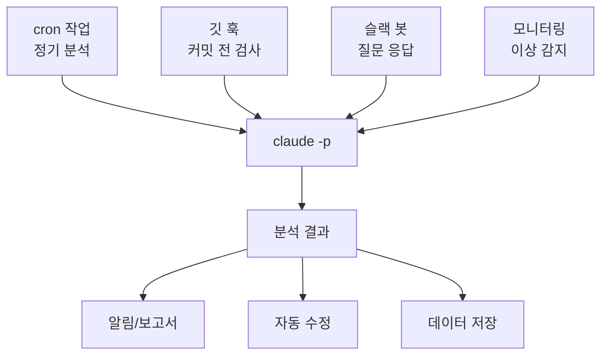
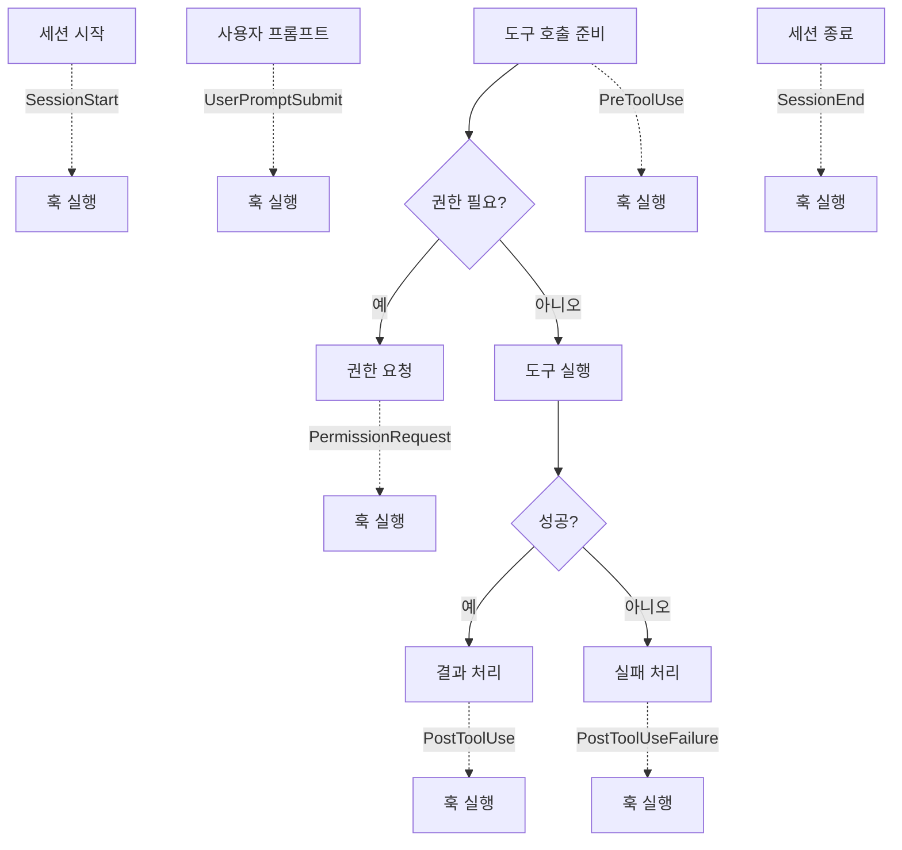
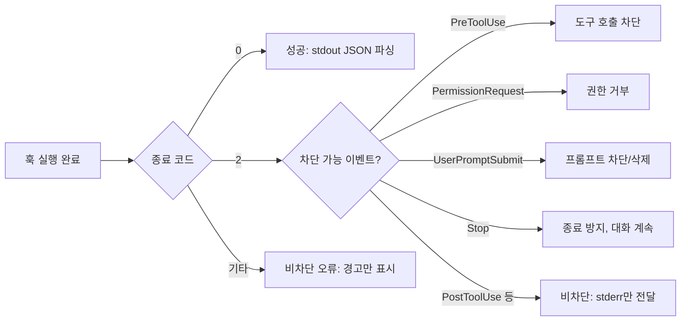
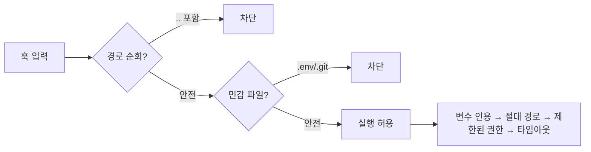
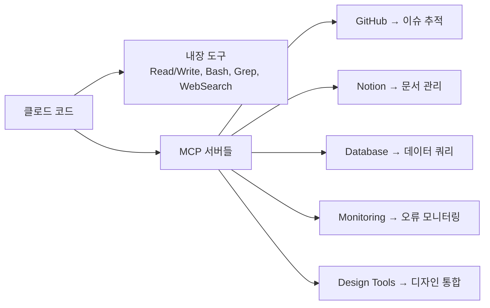
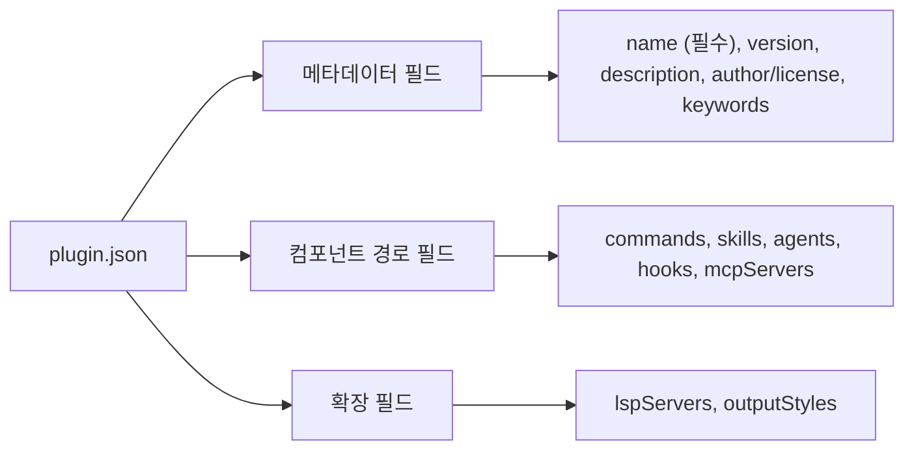
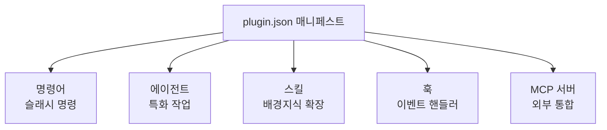

# CHAPTER 07 자동화

6장이 클로드 코드의 **상태 관리**를 다뤘다면, 이 장은 클로드 코드를 **외부 시스템과 연결하고 반복 작업을 자동화**하는 방법을 다룬다.

- **비대화형 모드**: 대화 UI 없이 프로그래밍 방식으로 호출 (스크립트, CI/CD, cron)
- **훅**: 생애 주기의 특정 시점에 자동 실행되는 결정론적 로직
- **MCP**: 외부 서비스를 클로드의 도구로 연결하는 표준 프로토콜
- **플러그인**: 위 구성 요소를 하나로 패키징해 팀 전체에 배포

---

## 7-1 비대화형 모드와 스크립트 자동화

일반적으로 클로드 코드는 터미널에서 대화형으로 실행되지만, 자동화 파이프라인에서는 대화형 상호작용이 불가능하다. **비대화형 모드**는 대화 UI 없이 명령줄에서 프롬프트를 전달하고 결과를 표준 출력으로 받아, 셸 스크립트·cron·CI/CD 등에서 클로드를 활용할 수 있게 해준다.



### 주요 플래그

가장 기본은 `--print`(줄여서 `-p`)로, 대화 세션 없이 프롬프트를 처리하고 결과를 표준 출력으로 반환한다.

```bash
claude -p "이 코드베이스의 구조를 설명해 줘."
```

**도구·권한 제어** — 자동화 시 클로드가 쓸 수 있는 도구를 명시하는 것이 중요하다.

| 플래그 | 역할 |
|---|---|
| `--allowedTools` | 허용할 도구 지정 (예: `"Read,Grep,Glob"`) |
| `--disallowedTools` | 차단할 도구 지정 |
| `--permission-mode` | 권한 확인 동작 제어 |
| `--mcp-config` | 복잡한 MCP 설정을 JSON 파일로 로드 |

- 도구 이름은 공백/쉼표로 구분. 내장 도구(`Bash`, `Read`, `Write`, `Edit`, `Grep` 등)와 MCP 도구(`mcp__<server>` 형식) 모두 지정 가능.
- `--permission-mode` 값: `acceptEdits`(파일 편집 확인 생략), `bypassPermissions`(모든 권한 확인 생략, 신뢰 환경에서만), `dontAsk`(모든 권한 자동 거부 → 최소 권한 동작).

```bash
# 읽기 전용 보안 분석
claude -p "보안 취약점 분석" --allowedTools "Read,Grep,Glob"
```

### 입출력 형식

**출력 형식** (`--output-format`)

| 형식 | 설명 |
|---|---|
| `text` (기본) | 사람이 읽기 쉬운 일반 텍스트 |
| `json` | 메타데이터 포함 구조화 데이터 (`type`, `total_cost_usd`, `is_error`, `duration_ms`, `num_turns`, `result`, `session_id` 등) |
| `stream-json` | 메시지별 개별 JSON 객체로 실시간 스트리밍 (JSONL) |

프로그래밍 방식으로 결과를 파싱해야 할 때는 반드시 `--output-format json`을 써야 한다. 텍스트 출력은 구조화되지 않아 안정적 파싱이 어렵다.

**입력 방법** — 명령줄 인수, stdin 파이프, 또는 `stream-json` 입력.

```bash
claude -p "이 코드를 설명해 줘."          # 직접 인수
echo "설명해 줘." | claude -p             # stdin
cat error.log | claude -p "이 로그 분석해 줘."  # 파일 내용과 함께
```

### 다중 턴 대화

비대화형 모드에서도 대화 컨텍스트를 유지할 수 있다.

| 플래그 | 동작 |
|---|---|
| `--continue` (`-c`) | 마지막 세션을 자동 로딩해 계속 |
| `--resume <id>` (`-r`) | 특정 세션 ID를 지정해 재개 |

- 세션 ID는 JSON 출력의 `session_id` 필드에서 추출한다.
- 스크립트에서 세션을 재개할 때는 `--no-interactive` 플래그를 함께 사용한다.

```bash
# 세션 ID 저장 후 이후 재개
session_id=$(claude -p "프로젝트 분석 시작" --output-format json | jq -r '.session_id')
claude -r "$session_id" "추가 분석 수행" --no-interactive
```

### 추가 플래그

| 플래그 | 용도 |
|---|---|
| `--append-system-prompt` | 기존 시스템 프롬프트에 지침 덧붙임 (역할/행동 조정) |
| `--system-prompt` | 기본 시스템 프롬프트를 완전 대체 (안전 가드레일 제거되므로 대개 `append`가 안전) |
| `--max-turns` | 에이전트 턴 수 제한 (간단한 리뷰 3~5, 구현 10~20, 복잡한 리팩터링 30+) |
| `--verbose` | 상세 로깅 활성화 (디버깅·모니터링용) |

### 프로그래밍 활용

플래그를 조합하면 CI/CD, 모니터링, 챗봇 등에 클로드를 통합할 수 있다. 대표 패턴 3가지:

- **SRE 인시던트 대응 봇**: 인시던트 설명·심각도를 받아 SRE 전문가 역할을 부여하고, 모니터링 MCP(Datadog)에 접근시켜 JSON으로 분석 결과를 반환.
- **자동 보안 리뷰**: `gh pr diff`로 PR diff를 가져와 `--append-system-prompt`로 보안 엔지니어 역할 부여, `Read,Grep,WebSearch`만 허용해 읽기 전용 검토 후 JSON 저장.
- **다중 턴 법률 어시스턴트**: 첫 호출에서 `session_id` 추출 후 `--resume`으로 동일 세션을 재개하며 여러 단계의 검토를 이어서 수행.

### CI/CD 파이프라인

CI/CD 통합은 비대화형 모드의 가장 실용적인 활용 사례다. 통합 시 핵심 고려 요소 5가지:

1. **인증 관리**: API 키를 환경 변수로 주입, 로그에 노출되지 않게 시크릿 관리.
2. **타임아웃 설정**: `timeout` 명령으로 실행 시간 제한.
3. **오류 처리**: `--output-format json`으로 받아 `is_error` 필드 확인, 실패 시 적절한 종료 코드 반환.
4. **비용 관리**: `--max-turns`로 턴 제한, `total_cost_usd` 모니터링.
5. **속도 제한**: 여러 요청 사이에 `sleep`을 넣어 API 속도 제한 회피.

앤트로픽은 공식 깃허브 액션(`anthropics/claude-code-action@v1`)을 제공한다.

```yaml
- name: Claude Code Review
  uses: anthropics/claude-code-action@v1
  with:
    prompt: "이 PR의 변경 사항을 리뷰하고 보안 취약점을 확인해 줘."
    output_format: json
    max_turns: 10
```

### 구조화 출력: `--json-schema`

`--json-schema` 플래그는 응답을 지정된 JSON 스키마에 맞춰 강제한다. `--output-format json`과 함께 쓰면 `structured_output` 필드에 스키마 준수 데이터가 추가되어, 파이프라인에서 후속 도구로 전달할 때 파싱 오류를 방지한다.

### 에이전트 SDK

공식 문서는 비대화형 모드를 포함한 상위 체계를 **에이전트 SDK**라고 부른다. CLI의 `-p` 플래그, 파이썬 SDK, 타입스크립트 SDK를 통합하는 프로그래밍 인터페이스로, SDK는 각 언어의 타입 시스템과 자연스럽게 통합되는 구조화 응답 객체를 제공한다. 복잡한 자동화 시스템은 CLI보다 SDK가 유리할 수 있다.

> **비용 고려사항**: 프롬프트를 간결하게, 필요한 파일만 분석 대상으로 제한, `--max-turns`로 턴 제한, 결과 캐싱으로 중복 호출 방지.

---

## 7-2 훅 시스템

**훅**은 클로드 코드의 생애 주기 중 특정 시점에서 자동으로 실행되는 커스텀 셸 명령어, LLM 프롬프트 또는 에이전트 작업이다. LLM의 판단에 의존하지 않고 특정 작업이 **반드시 실행되도록 보장**한다는 점에서, 예측 가능하고 결정론적인 자동화의 핵심 메커니즘이다.

> 훅의 가치는 **일관성**에 있다. AI에게 "포매팅해 줘"라고 요청하는 것은 생략될 수 있지만, `PostToolUse` 훅에 포매터를 등록하면 파일 편집 시 **반드시** 실행된다.

### 훅 핸들러 3가지 타입

1. **command**: bash 셸에서 명령을 직접 실행. 포매터·린터 등 결정론적 작업에 적합.
2. **prompt**: LLM에 프롬프트를 전달해 단일 턴 평가. 규칙으로 처리 못 하는 복잡한 검증·판단에 활용.
3. **agent**: 서브에이전트를 생성해 Read/Grep/Glob 같은 도구로 다중 턴 검증. 실제 파일이나 테스트 출력 검사가 필요할 때 적합.

### 훅 이벤트

훅은 생애 주기의 특정 시점에 발생한다. 모든 이벤트는 stdin으로 JSON 입력 데이터를 제공한다.



**주요 이벤트별 발생 시점**

| 이벤트 | 발생 시점 |
|---|---|
| `SessionStart` | 세션이 시작·재개될 때 |
| `UserPromptSubmit` | 프롬프트 제출 시, 클로드가 처리하기 전 |
| `PreToolUse` | 도구 호출 실행 전 (실행 차단 가능) |
| `PermissionRequest` | 권한 요청 다이얼로그가 나타날 때 |
| `PostToolUse` | 도구 호출이 성공 완료된 후 |
| `PostToolUseFailure` | 도구 호출이 실패한 후 |
| `Notification` | 클로드가 알림을 전송할 때 |
| `SubagentStart` / `SubagentStop` | 서브에이전트 생성·종료 시 |
| `Stop` | 클로드가 응답을 완료할 때 (사용자 중단 시 미발생) |
| `TeammateIdle` | 팀원 에이전트가 유휴 전환하려 할 때 |
| `TaskCompleted` | 태스크가 완료 표시될 때 |
| `InstructionsLoaded` | `CLAUDE.md` 등이 컨텍스트에 로드될 때 |
| `ConfigChange` | 세션 도중 설정 파일이 변경될 때 |
| `WorktreeCreate` / `WorktreeRemove` | 작업 트리 생성·제거 시 |
| `PreCompact` | 컨텍스트 압축 실행 전 |
| `SessionEnd` | 세션이 종료될 때 |

**공통 입력 필드** — 모든 이벤트에 `session_id`, `transcript_path`, `cwd`, `permission_mode`, `hook_event_name`이 제공되며, 이벤트별 고유 필드가 추가된다.

**이벤트별 특징 요약**

- `SessionStart`: 매처 `startup`/`resume`/`clear`/`compact`. stdout이 컨텍스트에 추가되고, `CLAUDE_ENV_FILE`로 세션 전체 환경 변수를 영속화 가능(nvm/pyenv 로딩 등에 활용).
- `UserPromptSubmit`: 고유 필드 `prompt`. stdout 텍스트가 컨텍스트에 추가되며, `decision: "block"`으로 프롬프트 차단, `additionalContext`로 추가 컨텍스트 주입.
- `PreToolUse`: 도구 이름에 대해 매칭. `hookSpecificOutput.permissionDecision`으로 `allow`/`deny`/`ask` 결정, `updatedInput`으로 입력값을 실행 전 수정.
- `PermissionRequest`: `hookSpecificOutput.decision.behavior`로 `allow`/`deny`. `allow` 시 `updatedInput`/`updatedPermissions`, `deny` 시 `message`·`interrupt`.
- `PostToolUse`: 고유 필드 `tool_response`. `decision: "block"`으로 피드백 전달, MCP는 `updatedMCPToolOutput`으로 출력 대체.
- `Stop`: `stop_hook_active` 필드로 무한 루프 방지. `decision: "block"` + `reason`(필수)으로 종료 방지·대화 계속.
- `TeammateIdle`/`TaskCompleted`: 종료 코드만 사용(JSON 결정 제어 미지원). 종료 코드 2로 유휴 전환·완료 표시를 막고 stderr가 피드백으로 전달.

### 종료 코드와 결정 제어 체계

훅 실행 결과는 종료 코드 또는 JSON 출력으로 전달된다. 두 방식은 상호 배타적이다.



| 종료 코드 | 의미 |
|---|---|
| `0` | 성공. stdout에서 JSON 출력 파싱 |
| `2` | 차단 오류. stdout/JSON 무시, stderr를 오류 메시지로 전달 (이벤트별 차단 효과 상이) |
| 기타(1,3) | 비차단 오류. stderr가 상세 모드에서만 표시되고 실행 계속 |

**공통 JSON 필드**: `continue`(false면 완전 중단), `stopReason`, `suppressOutput`, `systemMessage`.

### 훅 구성 파일과 우선순위

훅 설정은 여러 수준에 존재한다.

| 수준 | 위치 |
|---|---|
| 사용자 | `~/.claude/settings.json` |
| 프로젝트 | `.claude/settings.json` |
| 로컬 프로젝트 | `.claude/settings.local.json` |
| 엔터프라이즈 | 관리 정책 설정 |
| 플러그인 | `hooks/hooks.json` |
| 스킬/에이전트 | 프론트매터에 직접 정의 |

설정은 **3단계 중첩** 구조다: ① 훅 이벤트 선택 → ② 매처 그룹으로 실행 조건 필터링 → ③ 하나 이상의 핸들러 정의.

```json
{
  "hooks": {
    "PreToolUse": [{
      "matcher": "Bash",
      "hooks": [{ "type": "command", "command": ".claude/hooks/block-rm.sh" }]
    }]
  }
}
```

**핸들러 공통 필드**: `type`, `timeout`(command 600초 / prompt 30초 / agent 60초), `statusMessage`, `once`(true면 세션당 1회). command 타입은 `command`·`async`, prompt/agent 타입은 `prompt`(`$ARGUMENTS`로 입력 삽입)·`model` 필드 지원.

> 훅 설정을 직접 편집해도 **즉시 적용되지 않는다**. 클로드는 시작 시 훅 스냅샷을 캡처해 세션 전체에 사용한다. 이는 세션 중 악의적/실수 수정이 검토 없이 적용되는 것을 방지한다. (`/hooks` 명령으로 안전하게 편집)

### 매처 패턴

**매처**는 훅이 어떤 조건에서 실행될지 결정하는 정규식 문자열이다. 이벤트마다 매칭 대상이 다르다.

- **도구 이름 매칭** (`PreToolUse`, `PostToolUse`, `PostToolUseFailure`, `PermissionRequest`): `Write`, `Edit|Write`, `Notebook.*` 같은 패턴. MCP는 `mcp__<server>__<tool>`, `mcp__memory__.*`, `mcp__.*__write.*` 등.
- **세션 방식 매칭**: `SessionStart`(startup/resume/clear/compact), `SessionEnd`(clear/logout/prompt_input_exit/…).
- **매처 미지원** (`UserPromptSubmit`, `Stop`, `TeammateIdle`, `TaskCompleted`): 모든 발생 시 실행.
- 매처를 빈 문자열/`*`로 두거나 생략하면 해당 이벤트의 모든 발생에 일치.

### 고급 훅 타입

**프롬프트 기반 훅** (`type: "prompt"`): 훅 입력과 개발자 프롬프트를 빠른 모델에 전송해 단일 턴 평가. 모델은 `{"ok": true}` 또는 `{"ok": false, "reason": "..."}` 형식으로 응답하며 클로드가 자동 처리. `$ARGUMENTS`로 훅 JSON 입력을 프롬프트에 삽입.

**에이전트 기반 훅** (`type: "agent"`): 프롬프트 훅과 유사하나 Read/Grep/Glob 도구를 쓰는 서브에이전트를 생성해 다중 턴 검증(최대 50턴). 실제 파일·테스트 출력 검사가 필요할 때 적합.

```json
{
  "hooks": {
    "Stop": [{
      "hooks": [{
        "type": "agent",
        "prompt": "모든 단위 테스트가 통과하는지 검증하라. $ARGUMENTS",
        "timeout": 120
      }]
    }]
  }
}
```

**비동기 훅** (`async: true`): 보통 훅은 완료까지 차단하지만, 배포·테스트 스위트·외부 API 호출 같은 장시간 작업은 백그라운드로 실행. `command` 타입에서만 지원되며 차단·결정 제어 불가. 완료 시 `systemMessage`/`additionalContext`가 다음 턴에 전달.

**프론트매터 훅**: 스킬·에이전트의 YAML 프론트매터에 직접 정의. 컴포넌트 생애 주기에 한정되어 동작하고 종료 시 자동 정리. 에이전트의 경우 `Stop` 훅은 자동으로 `SubagentStop`으로 변환. `once: true`로 세션당 1회 실행 가능.

### 보안 유의 사항

훅은 현재 시스템 사용자 권한으로 에이전트 루프 중 자동 실행되므로, 악의적 훅 코드는 사용자 계정이 접근 가능한 모든 파일을 조작할 수 있다. 등록 전 반드시 검토:

1. 입력 데이터를 맹목적으로 신뢰하지 말고 검증·살균(sanitization).
2. 셸 변수는 항상 따옴표로 감싼다 (`"$VAR"`).
3. 파일 경로에서 `..`를 확인해 경로 순회 공격 차단.
4. 스크립트 참조 시 절대 경로 또는 `$CLAUDE_PROJECT_DIR` 활용.
5. `.env`, `.git/`, 키 파일 등 민감 파일은 건너뛴다.



### 실행 특성과 디버깅

- 동일 이벤트에 여러 훅이 등록되면 **병렬 실행**. 완전히 동일한 핸들러는 자동 중복 제거.
- 현재 작업 디렉터리에서 클로드 환경으로 실행. 원격 웹 환경은 `CLAUDE_CODE_REMOTE=true`.
- `claude --debug`로 매칭된 훅·종료 코드·출력을 로그로 확인. `Ctrl+O`로 상세 모드 토글.
- **문제 해결 순서**: `/hooks`로 등록 확인 → JSON 구문 검증 → 훅 명령을 터미널에서 직접 실행 → 실행 권한(`chmod +x`) 확인 → 셸 프로파일이 JSON 파싱을 방해하는지 확인.

### 실용 예제

- **위험한 셸 명령 차단**: `PreToolUse` 훅에서 stdin JSON을 읽어 `rm -rf` 포함 시 `permissionDecision: "deny"` 반환.
- **코드 포매팅 자동화**: `PostToolUse` 매처 `Write|Edit`에서 Prettier 자동 실행 (`async: true`, `$CLAUDE_PROJECT_DIR` 활용).
- **체크포인팅 보완 (스마트 하이브리드)**: 클로드 체크포인팅은 Read/Write/Edit만 추적하고 Bash의 `rm`/`mv`/`cp`는 복구 못 한다. `pre-bash`+`post-bash` 훅을 결합해, 위험 명령만 필터링해 `git stash`로 사전 백업하고 `git diff --quiet`로 실제 변경이 있을 때만 커밋. → 최적 성능·안정성 균형, 스마트 감지, 향상된 추적성.

### HTTP 훅

command 타입 외에 `type: "http"` 훅을 지원한다. 지정된 URL로 이벤트 데이터를 JSON 본문에 담아 POST 요청을 전송해 원격 서비스와 연동한다. 팀 공유 감사 서비스, 중앙 로깅, 알림 서비스 등 외부 통합에 적합하며, 로컬 셸 실행이 불가능한 제한 환경에서 command 타입을 보완한다.

```json
{
  "hooks": {
    "PostToolUse": [{
      "type": "http",
      "url": "https://audit.example.com/claude-events",
      "matcher": "Write"
    }]
  }
}
```

---

## 7-3 MCP 통합으로 외부 세계 연결

**MCP**(Model Context Protocol)는 AI 에이전트가 외부 시스템과 상호작용하기 위한 표준화된 프로토콜이다. 전통적 API 통합은 서비스마다 고유 방식·인증을 요구하지만, MCP는 단일 인터페이스로 다양한 서비스에 접근하게 해준다. 내장 도구가 로컬 파일·터미널을 처리한다면, MCP 서버는 클라우드 서비스·DB·모니터링·협업 도구 등 외부 리소스를 클로드의 도구로 변환한다.



### MCP 전송 방식

세 가지 전송 방식으로 통신한다.

| 방식 | 특징 | 설치 명령 |
|---|---|---|
| **stdio** | 로컬 서버와 표준 입출력 통신. 네트워크 없이 가장 빠르고 안정적 (npx 기반, 로컬 DB) | `claude mcp add --transport stdio <name> <command>` |
| **HTTP** | 원격 서버와 REST 통신. 인증 헤더 지원 (Notion, GitHub, Stripe 등) | `claude mcp add --transport http <name> <url>` |
| **SSE** | *deprecated.* HTTP로 마이그레이션 안 된 레거시 서버만 | — |

```bash
# stdio (환경 변수 사용)
claude mcp add --transport stdio airtable --env AIRTABLE_API_KEY=YOUR_KEY -- npx -y airtable-mcp-server

# HTTP (Bearer 토큰 인증)
claude mcp add --transport http secure-api https://api.example.com/mcp \
  --header "Authorization: Bearer your-token"
```

**CLI 관리**: `claude mcp list`(목록), `claude mcp get <name>`(상세), `claude mcp remove <name>`(제거). 세션 내에서는 `/mcp`로 상태 확인·OAuth 인증 관리.

### 주요 활용 사례

- **GitHub**: 리포지토리 코드 분석, PR 검토, 이슈 자동 해결.
- **데이터베이스 직접 쿼리**: PostgreSQL 등에 직접 연결해 조회·분석 (로그 분석, 사용자 행동 패턴, BI).
- **모니터링 연동**: Sentry, Statsig 등과 연결해 운영 상태 분석·문제 진단.
- **디자인 도구 통합**: 피그마, 스케치 → 디자인 시스템을 코드로 변환.

### 서버 설정 범위

| 범위 | 저장 위치 | 용도 |
|---|---|---|
| `--scope local` | `.claude/settings.local.json` | 현재 프로젝트, 개인용 (민감 데이터/개인 API 키) |
| `--scope project` | 프로젝트 루트 `.mcp.json` | 프로젝트 팀원 전체 공유 (공통 서비스) |
| `--scope user` | `~/.claude/mcp.json` | 모든 프로젝트에서 접근 (개인 자주 쓰는 서비스) |

> **엔터프라이즈 관리**: `managed-mcp.json`(macOS: `/Library/Application Support/ClaudeCode/`, Windows: `C:\ProgramData\ClaudeCode\`, Linux: `/etc/claude-code/`)에서 `allowedMcpServers`/`deniedMcpServers`로 조직 전체 MCP 사용 정책을 강제.

### .mcp.json과 환경 변수 확장

`.mcp.json`은 프로젝트 루트에 위치하며 프로젝트 범위 서버를 정의한다. 버전 관리에 체크인하면 팀이 동일 구성을 공유한다. **환경 변수 확장**으로 API 키 같은 민감 정보를 코드에 직접 노출하지 않는다.

```json
{
  "mcpServers": {
    "api-server": {
      "type": "http",
      "url": "${API_BASE_URL:-https://api.example.com}/mcp",
      "headers": { "Authorization": "Bearer ${API_KEY}" }
    }
  }
}
```

- `${VAR}`: 환경 변수 참조
- `${VAR:-default}`: 미설정 시 기본값 사용 → 민감 값은 환경 변수에만 두고 `.mcp.json`은 안전하게 커밋 가능.

**인증** 2가지: ① **OAuth 2.0** — 서버 추가 후 `/mcp` 실행 시 브라우저 로그인, 토큰 자동 저장. ② **헤더 기반** — API 키/Bearer 토큰을 `--header`나 `headers` 필드로 지정.

> **유의**: 각 MCP 서버에 최소 권한만 부여, API 키는 환경 변수로 분리, 미사용 서버는 정기 제거. 외부 서비스에 의존하므로 네트워크 장애·서비스 중단 대응책 마련.

---

## 7-4 플러그인 시스템

**플러그인**은 클로드 코드의 핵심 기능을 손대지 않고 새 기능을 추가하는 모듈화된 확장 단위다. 개별 프로젝트에 흩어져 있던 `.claude/commands/`·`.claude/agents/` 파일을 체계적으로 관리·배포하는 표준화된 방법을 제공한다. **핵심 가치는 재사용성** — 한 번 만든 플러그인을 여러 프로젝트·팀에서 쓰고 마켓플레이스로 커뮤니티와 공유.

### 플러그인 구조

모든 플러그인은 `.claude-plugin/plugin.json` 매니페스트를 포함해야 한다.

```
my-plugin/
├── .claude-plugin/
│   └── plugin.json     # 메타데이터 (필수)
├── commands/           # 커스텀 슬래시 명령 (선택)
├── agents/             # 커스텀 에이전트 (선택)
├── skills/my-skill/
│   └── SKILL.md        # 에이전트 스킬 (선택)
├── hooks/hooks.json    # 이벤트 핸들러 (선택)
├── .mcp.json           # MCP 서버 구성 (선택)
└── README.md
```

`plugin.json`에서 **유일한 필수 필드는 `name`**(kebab-case). 나머지는 선택이지만 완성도를 위해 최대한 채우는 것이 좋다.



- **메타데이터**: `version`(semantic versioning), `description`(마켓플레이스 표시), `author`(name/email/url), `keywords`(검색 태그).
- **컴포넌트 경로**: 기본적으로 `commands/`·`agents/`·`skills/`·`hooks/`를 자동 인식하지만, 비표준 위치의 파일을 포함할 때 지정. `commands`/`agents`는 string/배열, `hooks`/`mcpServers`는 string/object.
- 내부 리소스 참조 시 **`${CLAUDE_PLUGIN_ROOT}`** 환경 변수를 반드시 활용(절대 경로 하드코딩 금지).
- **확장**: `lspServers`(코드 인텔리전스), `outputStyles`(출력 스타일).

### 컴포넌트 5종



| 컴포넌트 | 설명 |
|---|---|
| **명령어** | `commands/`에 마크다운 배치. `/plugin-name:command-name` 형식으로 호출(네임스페이싱으로 충돌 방지). |
| **에이전트** | `agents/`에 정의 파일 배치. 프론트매터에 `description`·`capabilities`로 전문 영역 명시. |
| **스킬** | `skills/` 하위에 스킬별 디렉터리 + `SKILL.md`. 설치 시 자동 사용 가능. |
| **훅** | `hooks/hooks.json`이나 `plugin.json`에 인라인 정의. |
| **MCP 서버** | `.mcp.json`이나 `plugin.json`의 `mcpServers`에 정의. |

### 설치 범위

| 범위 | 저장 위치 | 특징 |
|---|---|---|
| **user** (기본) | `~/.claude/settings.json` | 사용자의 모든 프로젝트 적용 |
| **project** | `.claude/settings.json` | 저장소에 커밋, 팀 공유 |
| **local** | `.claude/settings.local.json` | `.gitignore` 제외, 개인 설정 |
| **managed** | `managed-settings.json` | 기업 IT 중앙 관리, 읽기 전용 |

> 프로젝트 `.claude/`의 명령어·에이전트·스킬은 **해당 프로젝트에서만** 유효하지만, 플러그인으로 설치하면 **모든 프로젝트**에서 사용 가능. 여러 프로젝트 공통 기능은 플러그인으로 패키징하는 것이 효율적.

### LSP 서버 지원

플러그인에 LSP(Language Server Protocol) 서버를 포함해 코드 완성·정의 이동·참조 찾기·리팩터링 같은 인텔리전스 기능을 제공할 수 있다. `.lsp.json`을 만들고 `plugin.json`의 `lspServers`에서 참조.

```json
{
  "servers": [{
    "name": "typescript-lsp",
    "command": "${CLAUDE_PLUGIN_ROOT}/node_modules/.bin/typescript-language-server",
    "args": ["--stdio"],
    "languages": ["typescript", "javascript"]
  }]
}
```

디버깅 시 `${CLAUDE_PLUGIN_LSP_LOG_FILE}`이 가리키는 로그 파일(`~/.claude/debug/`) 확인.

### 마켓플레이스

**마켓플레이스**는 사용 가능한 플러그인의 카탈로그다. 단일 저장소이거나 여러 저장소의 집합일 수 있다. 앤트로픽은 공식 마켓플레이스(`claude-plugins-official`)를 운영하며 설치 시 자동 등록된다. 카테고리: Code Intelligence(LSP), External Integrations(github/slack/figma), Development Workflows, Output Styles.

**추가 방법 3가지**:

```bash
/plugin marketplace add owner/repo                          # 깃허브 저장소
/plugin marketplace add https://gitlab.com/company/plugins.git  # 다른 Git 호스팅
/plugin marketplace add ./my-marketplace                    # 로컬 (개발/테스트)
```

마켓플레이스는 `.claude-plugin/marketplace.json`으로 정의된다. 필수 필드는 `name`(kebab-case), `owner`, `plugins`(배열). `official`/`anthropic`/`claude` 등 공식 사칭 이름은 사용 불가.

```json
{
  "name": "company-tools",
  "owner": { "name": "DevTools Team", "email": "devtools@company.com" },
  "plugins": [{
    "name": "code-formatter",
    "source": "./plugins/formatter",
    "description": "저장 시 자동 코드 포매팅",
    "version": "2.1.0"
  }]
}
```

### 플러그인 캐싱과 개발

클로드 코드는 설치 시 원본을 캐시 디렉터리로 복사한다.

- 원본 소스를 수정해도 설치된 버전에 즉시 반영 안 됨 → 제거 후 재설치 필요 (실행 중 세션 예기치 않은 변경 방지).
- 개발 환경에서 **심볼릭 링크**로 원본·설치본 동기화 가능.
- `../shared-utils` 같은 상위 디렉터리 참조는 보안상 차단(경로 순회) — 자체 디렉터리 내부만 접근.

**점진적 개발**: 명령어 하나짜리 최소 플러그인 → 테스트 통과 → 에이전트 추가 → 테스트 → 스킬 추가 순.

`claude --debug`로 로드되는 플러그인 목록, 매니페스트 오류, 컴포넌트 등록 과정, MCP 초기화 상황을 확인.

### 배포 체크리스트

배포 전 확인:

1. `plugin.json` 메타데이터 완전성 (`name`/`version`/`description`/`author` 필수).
2. 모든 컴포넌트를 실제 사용 시나리오로 테스트.
3. README에 설치 방법·사용 예시·설정 옵션 문서화.
4. 라이선스 명시 (오픈 소스는 MIT/Apache 2.0 등).
5. CHANGELOG로 버전별 변경 사항 기록.

게시 후에도 사용자 피드백 반영, 클로드 코드 업데이트 대응, 보안 취약점 신속 수정 등 유지보수 필요.

### 개발 유의 사항

- **단일 책임 원칙**: "코드 포매팅"·"테스트 자동화"·"보안 검사"는 각각 별도 플러그인으로.
- **플러그인 간 의존성 회피**: 공통 기능은 스킬로 분리해 여러 플러그인에서 참조.
- **항상 상대 경로 사용**, MCP 서버 경로는 `${CLAUDE_PLUGIN_ROOT}`.
- **훅 스크립트에 실행 권한**(`chmod +x`) 부여 — 권한 누락이 훅 실패의 가장 흔한 원인.
- **명확한 에러 처리** — 실패 시 무엇이 잘못됐고 어떻게 해결하는지 안내.
